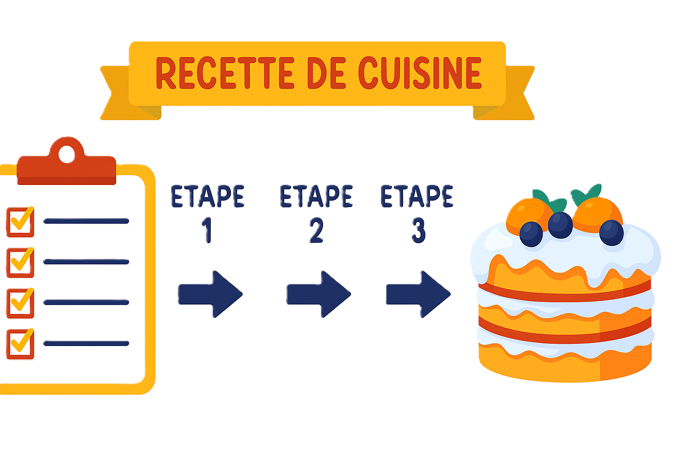
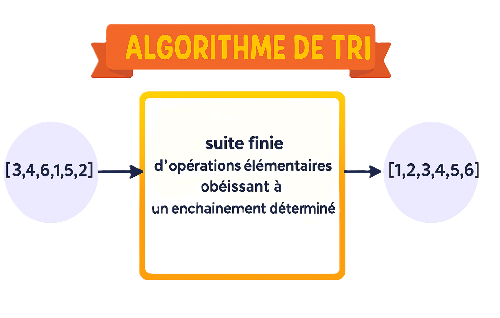
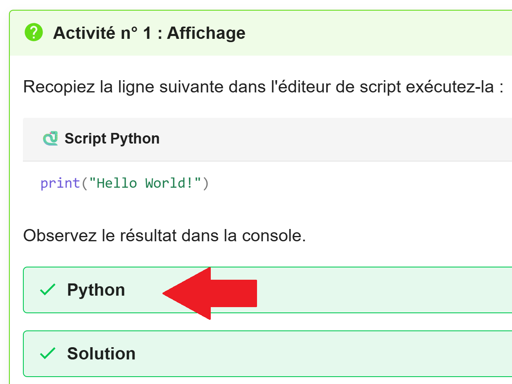
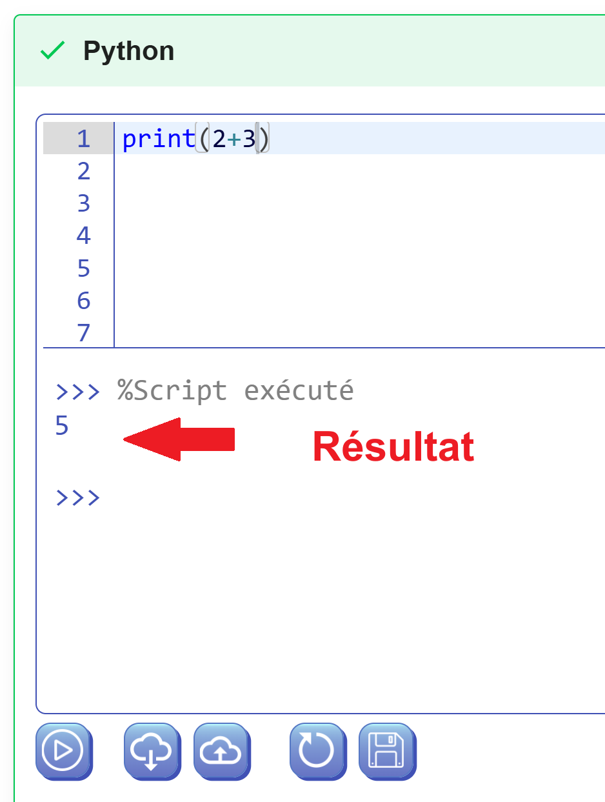
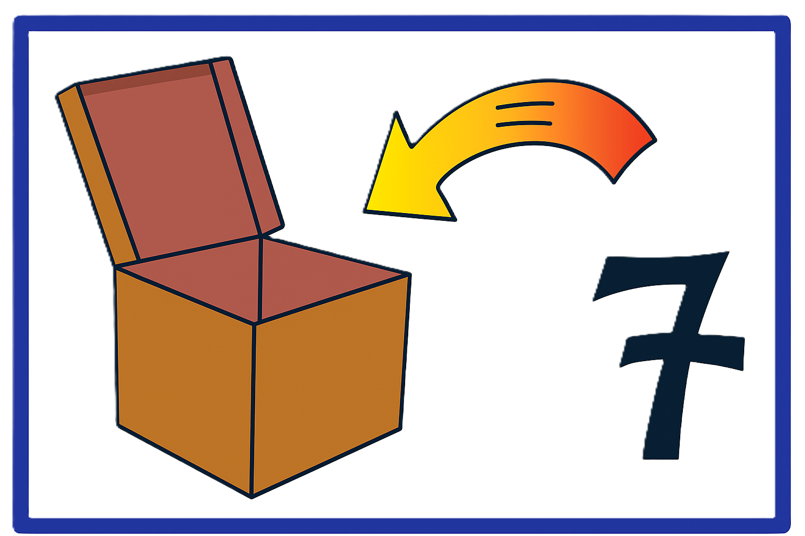
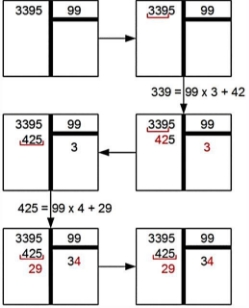
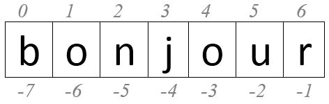

---
author: ELP
title: 01a Révision Les bases
---


## <span style="color:blue;">Programmer un ordinateur c'est quoi ?</span>

**Programmer**, c'est **créer des programmes** (suite d'ordres donnés à l'ordinateur). Un ordinateur sans programme ne sait rien faire.

## <span style="color:blue;">Un algorithme c'est quoi ?</span>

Pour faire exécuter une tâche par ordinateur, il faut tout d’abord, **détailler** suffisamment les étapes de résolution du problème, pour qu’elle soit exécutable par l’homme. Ensuite, transférer la résolution en une suite d’étapes si élémentaire et simple à exécuter, pouvant être codée en un programme dans un langage compréhensible par ordinateur. 

**Toute suite d’étapes si élémentaire et simple à exécuter s’appelle un ALGORITHME**. 

{width=50%}

{width=50%}


## <span style="color:blue;">Débuter avec Basthon </span>
Dans un nouvel onglet du navigateur internet, aller sur [basthon.fr](https://basthon.fr) et choisir "Console".


1. Aller sur le site [Basthon](https://basthon.fr).
2. Choisir l'option "Console" pour exécuter du code Python.
3. Vous pouvez également utiliser l'éditeur de scripts pour écrire des programmes plus complexes.

👉 Cependant, dans ce cours, nous utiliserons principalement **l’éditeur intégré** à la page du cours, qui est un notebook interactif et permet d’écrire et d’exécuter directement du code Python. Pour cela il faut ouvrir la partie Python

{width=50%}

{width=50%}

{width=50%}

Dans un second temps, nous utiliserons également **Capytale**, un environnement collaboratif adapté à l’enseignement.

## <span style="color:blue;">Affichage</span>

???+ question "Activité n° 1 : Affichage"

    Recopiez la ligne suivante dans l'éditeur de script exécutez-la :
    ```python
    print("Hello World!")
    ```
    Observez le résultat dans la console.

    ??? success "Python"
        {{ IDE() }}

    ??? success "Solution"

        Lorsque vous exécutez ce script, le message "Hello World!" doit apparaître dans la console. Vous venez d'écrire votre premier programme en Python !
        
        Remarque : Vous pouvez utiliser des guillemets simples ou doubles pour délimiter les chaînes de caractères en Python.


???+ question "Activité n° 2 : Affichage"

    Essayez d'écrire un programme qui affichera votre prénom à l'écran. Testez-le.

    ??? success "Python"
        {{ IDE() }}

    ??? success "Solution"

        Exemple de solution si votre prénom est Alice :
        ```python
        print("Alice")
        ```

## <span style="color:blue;">Les variables et les affectations</span>

Pour fonctionner, un algorithme a besoin de mémoriser des données (saisies par l’utilisateur, résultats à afficher, résultats intermédiaires lors d’un traitement…) afin de pouvoir les réutiliser. Pour cela il utilise ce qu’on appelle une variable. 

Une **variable** est l'association d'un espace de la mémoire de l'ordinateur, accessible par son **nom**, et d'une **valeur** que l'on y **stocke**. 

 
Le rangement d’une donnée dans une variable (un contenant) s’appelle **l’affectation**.  
On peut se représenter une variable comme une boîte portant une étiquette ("le nom de la variable") à l'intérieur de laquelle on peut placer un contenu (la valeur de la variable).   


{width=50%}


**En Python, l'affectation se réalise avec l'opérateur `=`.**

```python
a = 5
```

Cela met en mémoire l'entier 5 dans la variable `a`.

```python
a = "easy"
```

Cela met en mémoire la chaîne de caractères "easy" dans la variable `a`.

???+ question "Activité n°3 : Affectation"

    Avec l'éditeur de script, **testez le code suivant :**

    ```python
    tartempion = 15
    print(tartempion)
    ```

    ??? success "Python"
        {{ IDE() }}

    ??? success "Solution"

        **Résultat :**
        ```
        15
        ```

        L'instruction `print` permet **d'afficher la valeur contenue** dans la variable `tartempion`.

    **Modifier le code comme ceci :**

    ```python
    tartempion = 15
    print("tartempion")
    ```
    ??? success "Python"
        {{ IDE() }}

    ??? success "Solution"

        **Résultat :**
        ```
        tartempion
        ```

        **Alors, que se passe-t-il ?**
        En plaçant `tartempion` entre guillemets, Python affiche la chaîne de caractères "tartempion" au lieu de la valeur de la variable.

???+ question "Activité n°4 : Affectation"

    Écrire un programme dans lequel on attribue la valeur 12 à la variable `moyenne`. La valeur de `moyenne` doit ensuite s'afficher à l'écran.

    ??? success "Python"
        {{ IDE() }}

    ??? success "Solution"

        ```python
        moyenne = 12
        print(moyenne)
        ```

        **Résultat :**
        ```
        12
        ```

## <span style="color:blue;">Faire des calculs</span>

???+ question "Activité n°5 : Calcul"

    Que vaut `a` à la fin de ce script :

    ```python
    a = 1
    b = -1
    a = a * b
    a = a + b
    ```
    ??? success "Python"
        {{ IDE() }}

    ??? success "Solution"

        **Résultat :**
        Il faut rajouter print(a) à la fin du script et on obtient :
        ```
        -2
        ```

        **Explication :**
        1. `a = 1`
        2. `b = -1`
        3. `a = 1 * -1` donc `a = -1`
        4. `a = -1 + (-1)` donc `a = -2`

        La valeur finale de `a` est -2.

???+ question "Activité n° 6 : ❤️ Echange de valeurs entre 2 variables ❤️"

    Proposer un programme qui permet d'échanger les valeurs stockées dans les variables `a` et `b`.

    ??? success "Python"
        {{ IDE() }}

    ??? success "Solution"

        Utilisation d'une variable temporaire :
        ```python
        a = 8
        b = -3
        temp = a
        a = b
        b = temp
        print(a, b)
        ```
        Ce programme échangera les valeurs : `a` devient -3 et `b` devient 8.

        **Ou en Python plus simple :**

        ```python
        a, b = b, a
        print(a, b)
        ```


???+ question "Activité n°7 : Division"

    Compléter le programme suivant pour que la variable `total` contienne le résultat de la **division** de `dividende` par `diviseur`.

    ```python
    dividende = 13
    diviseur = 4
    total = dividende / diviseur
    print(total)
    ```
    ??? success "Python"
        {{ IDE() }}

    ??? success "Solution"

        **Résultat :**
        ```
        3.25
        ```

???+ question "Activité n°8 : Division euclidienne"

    La division précédente n'est pas entière. Pour faire calculer la division euclidienne, il faut utiliser `//`. Testez maintenant ce code :

    ```python
    a = 13
    b = 4
    resultat = a // b
    print(resultat)
    ```
    ??? success "Python"
        {{ IDE() }}

    ??? success "Solution"

        **Résultat :**
        ```
        3
        ```
        `//` effectue une division entière.


???+ question "Activité n°9 : Reste de la division euclidienne"

    Pour faire calculer le reste de la division euclidienne, il faut utiliser `%`. Testez maintenant ce code :

    ```python
    a = 13
    b = 4
    resultat = a % b
    print(resultat)
    ```
    ??? success "Python"
        {{ IDE() }}

    ??? success "Solution"

        **Résultat :**
        ```
        1
        ```
        Ce programme affiche `1` car 13 divisé par 4 donne un reste de 1.

    **Explication :**

    - `//` représente la **division entière** (quotient sans décimale).
    
    - `%` permet d’obtenir le **reste de la division**.

La division entière permet de déterminer la valeur tronquée de la division et le modulo permet de déterminer la valeur du reste. 

On souhaite effectuer la division de 3395  par 99.  



On s’est arrêté car 29 est plus petit que 99 et qu’on ne souhaitait pas aller plus loin et se retrouver avec un nombre à virgule. On a effectué une division dite division entière. On en déduit donc que 3395 = 99 \* 34 + 29

???+ question "Activité n°10 : Puissance (exponentiation)"

    **Tester :**

    ```python
    3 ** 2
    2 ** 3
    ```
    ??? success "Python"
        {{ IDE() }}

    ??? success "Solution"

        **Résultat :**
        ```
        9
        8
        ```

???+ question "Activité n°11 : Incrémentation d'une variable"

    **Que fait ce programme ?**

    ```python
    a = 11
    print(a)
    a = a + 1  # incrémentation de la variable a
    print(a)
    ```
    ??? success "Python"
        {{ IDE() }}

    ??? success "Solution"

        **Résultat :**
        ```
        11
        12
        ```

        La variable `a` est incrémentée de 1, c'est-à-dire que sa valeur passe de 11 à 12.

## <span style="color:blue;">Affichage en Python</span>

???+ question "Activité n°12 : Variable"

    **Tester :**

    ```python
    print("Vivement les vacances !")
    prenom = "Bob"
    print("Mon prénom est :", prenom)
    ```
    ??? success "Python"
        {{ IDE() }}

    ??? success "Solution"

        **Résultat :**
        ```
        Vivement les vacances !
        Mon prénom est : Bob
        ```

???+ question "Activité n°13 : Variable"

    Réalisez un script qui contient trois variables : `prenom`, `nom` et `age` et qui doit afficher :

    ```
    Bonjour je m'appelle Alphonse Dansletas, j'ai 358 ans.
    ```

    ??? success "Python"
        {{ IDE() }}

    ??? success "Solution"

        ```python
        prenom = "Alphonse"
        nom = "Dansletas"
        age = 358
        print("Bonjour je m'appelle ",prenom, nom, "j'ai" ,age, "ans.")
        ```

        **Résultat :**
        ```
        Bonjour je m'appelle Alphonse Dansletas, j'ai 358 ans.
        ```

## <span style="color:blue;">Dialoguer avec l'utilisateur</span>


La **fonction** `input` permet d'ouvrir une boîte de dialogue et de **récupérer une information saisie par l'utilisateur**. 

L'information récupérée grâce à un `input` est une **chaîne de caractères**.

???+ question "Activité n°14 : Dialogue"

    **Tester :**

    ```python
    prenom = input("Quel est ton prénom ?")
    print(prenom)
    ```
    ??? success "Python"
        {{ IDE() }}

    ??? success "Solution"

        **Résultat (si vous entrez `Alice`) :**
        ```
        Alice
        ```

???+ question "Activité n°15 : Dialogue"

    Écrire un script en Python qui demande à l'utilisateur son prénom, son nom et son âge, puis qui doit afficher :

    ```
    Bonjour je m'appelle Alain Térieur, j'ai 217 ans.
    ```


    (Dans le cas où vous vous appelleriez Alain Térieur et que vous seriez âgé de 217 ans.)

    ??? success "Python"
        {{ IDE() }}

    ??? success "Solution"

        ```python
        prenom = input("Quel est votre prénom ? ")
        nom = input("Quel est votre nom ? ")
        age = input("Quel est votre âge ? ")

        print("Bonjour je m'appelle, prenom, nom", j'ai", age, "ans.")
        ```

        **Résultat (si vous entrez Alain, Térieur et 217) :**
        ```
        Bonjour je m'appelle Alain Térieur, j'ai 217 ans.
        ```

???+ question "Activité n°16 : Dialogue avec un entier"

    Un boulanger désire un programme qui demande à l'utilisateur le nombre de baguettes qu'il désire, qui calcule le prix total (sachant qu'une baguette coûte 1.10 €) et qui affiche le prix que l'utilisateur doit payer.

    1. **Tester le script suivant avec 2 :**

    ```python
    nombre = input("Combien de baguettes désirez-vous ?")
    prix = nombre * 1.1
    print("Vous avez à payer", prix, "euros.")
    ```

    ??? success "Python"
        {{ IDE() }}

    ??? success "Solution"

        **Résultat attendu :** 
        Vous obtenez une erreur ou un résultat incorrect car `input` retourne une chaîne de caractères. La multiplication d'une chaîne par un nombre ne donne pas le résultat escompté.

        **Erreur possible :**
        ```
        TypeError: can't multiply sequence by non-int of type 'float'
        ```

    2. **Testez le script suivant avec 2 :**

    ```python
    nombre = int(input("Combien de baguettes désirez-vous ?"))
    prix = nombre * 1.1
    print("Vous avez à payer", prix, "euros.")
    ```

    ??? success "Python"
        {{ IDE() }}

    ??? success "Solution"

        **Résultat :**
        ```
        Vous avez à payer 2.2 euros.
        ```

        **Différence :** Ici, nous convertissons la chaîne de caractères en un nombre entier avec `int()`, ce qui permet de faire correctement la multiplication.

## <span style="color:blue;">Fonction `int` et fonction `float`</span>

L'instruction `int` permet de convertir certaines chaînes de caractères en un **nombre entier**.

L'instruction `float` permet de convertir certaines chaînes de caractères en un **flottant**, c'est-à-dire un "nombre à virgule".

???+ question "Activité n°17 : Dialogue avec un entier"

    Vous êtes chargé(e) de mettre en place une borne automatique pour régler les droits d’entrée à un parc d’attractions.

    Chaque adulte doit payer 21 € pour rentrer et chaque enfant doit payer 13 €.

    **Écrire un programme** en Python qui demande à l'utilisateur le nombre d'adultes et d'enfants, puis affiche le prix total à payer.

    ??? success "Python"
        {{ IDE() }}

    ??? success "Solution"

        ```python
        A = int(input("Combien d'adultes dans le groupe ? "))
        E = int(input("Combien d'enfants dans le groupe ? "))

        P = (A * 21) + (E * 13)

        print("Le prix total à payer est de",P, "euros.")
        ```

        **Exemple de résultat (si vous entrez 2 adultes et 3 enfants) :**
        ```
        Le prix total à payer est de 81 euros.
        ```


## <span style="color:blue;">Les chaines de caractères</span>

???+ question "Activité n°18 : Délimiter les chaines de caractères"
    
    Affichez des chaînes de caractères délimitées par des apostrophes et des guillemets.

    ```python
    a = 'une chaine délimitée par des apostrophes'
    print(a)                    

    b = "une chaine délimitée par des guillemets"
    print(b)
    ```
    ??? success "Python"
        {{ IDE() }}

    ??? success "Solution"

        ```python
        une chaine délimitée par des apostrophes
        une chaine délimitée par des guillemets
        ```

???+ question "Activité n°19 : Délimiter les chaines de caractères"

    Faire afficher exactement :

    - C'est bientôt Noël
    
    - Bonjour se dit "Hello"

    ??? success "Python"
        {{ IDE() }}

    ??? success "Solution"

        ```python
        print("C'est bientôt Noël")
        print('Bonjour se dit "Hello"')
        ```

        **Résultat :**
        ```
        C'est bientôt Noël
        Bonjour se dit "Hello"
        ```


???+ question "Activité n°20 : Test d'appartenance"

    Testez l'appartenance d'un caractère dans une chaîne avec l'opérateur `in`.

    ```python
    chaine = 'Bonjour'

    print('b' in chaine)  
    print('B' in chaine)  
    ```
    ??? success "Python"
        {{ IDE() }}

    ??? success "Solution"

        **Résultat :**
        ```
        False
        True
        ```

        **Pourquoi ?**
        La recherche est sensible à la casse. 'b' minuscule n'est pas dans "Bonjour", tandis que 'B' majuscule l'est.

???+ question "Activité n°21 : Concaténation"

    Concaténez deux chaînes de caractères avec l'opérateur `+`.

    ```python
    chaine1 = 'Bonjour'
    chaine2 = ' à tous.'

    print(chaine1 + chaine2)
    ```
    ??? success "Python"
        {{ IDE() }}

    ??? success "Solution"

        **Résultat :**
        ```
        Bonjour à tous.
        ```

???+ question "Activité n°22 : Concaténation"

    À partir de deux chaînes de caractères :

    - Aujourd'hui

    - se dit "Today"

    Faites afficher la phrase complète par concaténation.

    ??? success "Python"
        {{ IDE() }}

    ??? success "Solution"

        ```python
        chaine1 = "Aujourd'hui"
        chaine2 = ' se dit "Today"'

        print(chaine1 + chaine2)
        ```

        **Résultat :**
        ```
        Aujourd'hui se dit "Today"
        ```

???+ question "Activité n°23 : Fonction len()"

    Utilisez la fonction `len` pour obtenir le nombre de caractères dans une chaîne.

    ```python
    chaine = 'Bonjour à tous.'

    print(len(chaine))  
    ```
    ??? success "Python"
        {{ IDE() }}

    ??? success "Solution"

        **Résultat :**
        ```
        15
        ```

        Les espaces et la ponctuation comptent également comme des caractères.

???+ question "Activité n°24 : Lecture de Caractères dans une Chaîne avec des Indices"

    Lisez un caractère dans une chaîne avec `chaine[index]`.

    

    ```python
    chaine = 'bonjour'

    print(chaine[0])   
    print(chaine[1])   
    print(chaine[-1])  
    print(chaine[-2])  
    ```
    ??? success "Python"
        {{ IDE() }}

    ??? success "Solution"

        **Résultat :**
        ```
        b
        o
        r
        u
        ```

???+ question "Activité n°25 : Lecture de Caractères dans une Chaîne avec des Indices"

    À partir de :
    ```python
    chaine = 'Bonjour'
    ```
    Faire afficher **Bnu**.

    ??? success "Python"
        {{ IDE() }}

    ??? success "Solution"

        ```python
        print(chaine[0] + chaine[2] + chaine[5])
        ```

        **Résultat :**
        ```
        Bnu
        ```

Un **slice** permet le découpage de structures de données séquentielles (comme les chaînes de caractères ou les listes). La syntaxe utilisée est : **[début:fin:pas].** 

NB : si pas < 0, la liste est parcourue dans le sens inverse. 

???+ question "Activité n°26 : Extraction de Sous-chaînes avec le Slicing"

    Utilisez le **slicing** pour lire une sous-chaîne avec `chaine[debut:fin:pas]`.

    ```python
    chaine = 'Bonjour'

    print(chaine[0:2])    # Bo
    print(chaine[2:5])    # njo
    print(chaine[:])      # Bonjour
    print(chaine[1:])     # onjour
    print(chaine[::2])    # Bnor
    print(chaine[::-1])   # ruojnoB
    ```
    ??? success "Python"
        {{ IDE() }}

    ??? success "Solution"

        **Résultat :**
        ```
        Bo
        njo 
        Bonjour
        onjour
        Bnor
        ruojnoB
        ```

???+ question "Activité n°27 : Extraction de Sous-chaînes avec le Slicing"

    À partir de :
    ```python
    a = "C'est bientôt Noël"
    ```

    Faire afficher :

    - bientôt

    - Csbnto

    - tôtneib

    - Noël

    - lëoN

    ??? success "Python"
        {{ IDE() }}

    ??? success "Solution"

        ```python
        print(a[6:13])        # bientôt
        print(a[0::3])         # Csbnto
        print(a[12:5:-1])    # tôtneib
        print(a[-4:])        # Noël
        print(a[-1:-5:-1])   # lëoN
        ```

        **Résultat :**
        ```
        bientôt
        Csbnto
        tôtneib
        Noël
        lëoN
        ```


???+ question "Activité n°28 : Attention aux apostrophes"

    **Tester :**

    ```python
    chaine = 'Aujourd\'hui'   # Séquence d'échappement \'
    print(chaine) 

    chaine = "Aujourd'hui"    # Utilisation des guillemets
    print(chaine)
    ```
    ??? success "Python"
        {{ IDE() }}


???+ question "Activité n°29 : Les sauts de ligne"

    **Tester :**

    ```python
    chaine = 'Premiere ligne\nDeuxieme ligne' 
    print(chaine)
    ```
    ??? success "Python"
        {{ IDE() }}

---

???+ question "Activité n°30 : Problème d'addition entre chaînes et nombres"

    **Tester :**

    ```python
    chaine = 'a' 
    # chaine = chaine + 2  # Provoque une erreur
    chaine2 = chaine + str(2)  # Solution correcte
    print(chaine2)  # Résultat : 'a2'
    ```
    ??? success "Python"
        {{ IDE() }}

    **Remarque :**  
    - Python **ne peut pas additionner directement** une chaîne (str) et un entier (int).  
    - La conversion explicite avec **str()** permet de résoudre ce problème.


???+ question "Activité n°31 : Conversion en minuscules"

    **Tester :**

    ```python
    chaine = "BONJOUR"
    chaine2 = chaine.lower()   # Convertit en minuscules
    print(chaine2) 
    print(chaine) 
    ```
    ??? success "Python"
        {{ IDE() }}


???+ question "Activité n°32 : Séparer une phrase en mots"

    **Tester :**

    ```python
    texte = "Il est important de construire"
    print(texte)

    mots = texte.split(' ')  # Découpe la phrase en mots
    print(mots)
    ```
    ??? success "Python"
        {{ IDE() }}


???+ question "Activité n°33 : Fusionner une liste en chaîne"

    **Tester :**

    ```python
    texte = "Il est important de construire"
    
    liste1 = ' '.join(texte)  # Séparé par un espace
    print(liste1) 

    liste2 = ','.join(texte)  # Séparé par une virgule
    print(liste2)
    ```
    ??? success "Python"
        {{ IDE() }}


