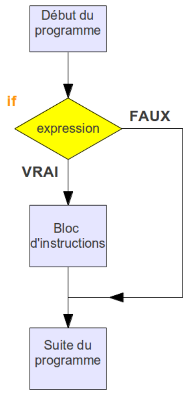
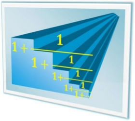
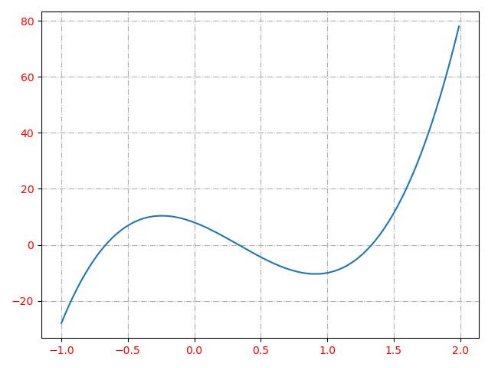

---
author: ELP
title: 02a Les bases de Python
---


**Table des matières** 

1. [**Définir une fonction**](#_page0_x40.00_y467.92)
2. [**Les conditions**](#_page1_x40.00_y240.92)
3. [**Les boucles**](#_page7_x40.00_y36.92)
4. [**Portée de variables : variables globales et locales**](#_page13_x40.00_y36.92)
5. [**La fonction lambda**](#_page13_x40.00_y581.92)
6. [**Fonctions avec des valeurs par défaut**](#_page14_x40.00_y36.92)
7. [**Prototype de fonction**](#7-prototype-de-fonction)
8. [**Exercices**](#_page15_x40.00_y36.92)
9. [**Problèmes**](#_page15_x40.00_y36.91)


## **<H2 STYLE="COLOR:BLUE;">1. Définir<a name="_page0_x40.00_y467.92"></a> une fonction</h2>** 

En Python, une fonction est définie avec l’instruction `def`. Une fonction peut renvoyer une valeur grâce à l’instruction `return`.


???+ question "Activité n°1 : Définir une première fonction"

    **Tester :**

    ```python
    def mapremierefonction():  # Cette fonction n'a pas de paramètre 
        """  
        Cette fonction renvoie 'Bonjour'  
        """ 
        return "Bonjour"  
    ```

    **Appeler la fonction :**
    
    ```python
    print(mapremierefonction())  # Ne pas oublier les parenthèses ()
    ```

    ??? success "Python"
        {{ IDE() }}

    ??? success "Solution"

        **Résultat :**
        ```
        Bonjour
        ```

???+ question "Activité n°2 : Vérifier la parité d'un nombre"

    **Tester :**

    ```python
    def parite(nombre): 
        """ Affiche la parité d'un nombre entier """ 
        if nombre % 2 != 0:  # L'opérateur % donne le reste d'une division 
            return str(nombre) + " est impair" 
        else: 
            return str(nombre) + " est pair"
    ```

    **Exécuter :**
    
    ```python
    print(parite(13))
    print(parite(24))
    ```

    ??? success "Python"
        {{ IDE() }}

    ??? success "Solution"

        **Résultat :**
        ```
        13 est impair
        24 est pair
        ```


## **<H2 STYLE="COLOR:BLUE;">2. Les<a name="_page1_x40.00_y240.92"></a> conditions  </h2>**

Une condition permet d’exécuter des instructions **uniquement si une certaine condition est satisfaite**.


### **<H3 STYLE="COLOR:GREEN;">2.1. Les<a name="_page1_x40.00_y262.92"></a> structures conditionnelles</h3>**  
#### **<H4 STYLE="COLOR:MAGENTA;">2.1.1. L’instruction<a name="_page1_x40.00_y281.92"></a> simple if</h4>**
{ width=25%; : .center }

???+ question "Activité n°3 : Vérifier si on a la moyenne"

    **Tester :**

    ```python
    def moyenne(note): 
        """ 
        Cette fonction permet de savoir si on a la moyenne
        """ 
        if note >= 10: 
            return "J'ai la moyenne" 
    ```

    **Exécuter :**
    
    ```python
    print(moyenne(16))
    print(moyenne(5))
    ```

    ??? success "Python"
        {{ IDE() }}

    ??? success "Solution"

        **Résultat :**
        ```
        J'ai la moyenne
        None
        ```

    **Remarque :** 

    - La fonction ne retourne rien si la note est inférieure à 10.  
    
    - On peut améliorer cela en ajoutant une instruction `else`.


#### **<H4 STYLE="COLOR:MAGENTA;">2.1.2. L’instruction<a name="_page2_x40.00_y36.92"></a> else</h4>**

???+ question "Activité n°4 : Ajouter une condition else"

    **Tester :**

    ```python
    def moyenne(note): 
        """ 
        Cette fonction permet de savoir si on a la moyenne 
        """ 
        if note >= 10: 
            return "J'ai la moyenne" 
        else: 
            return "C'est en dessous de la moyenne" 
    ```

    **Exécuter :**
    
    ```python
    print(moyenne(15))
    print(moyenne(8.5))
    print(moyenne(56))
    ```

    ??? success "Python"
        {{ IDE() }}

    ??? success "Solution"

        **Résultat :**
        ```
        J'ai la moyenne
        C'est en dessous de la moyenne
        J'ai la moyenne
        ```


 On peut mettre qu’**UNE** instruction else par condition if et l’instruction else **n’est pas obligatoire** 


#### **<H4 STYLE="COLOR:MAGENTA;">2.1.3. L’instruction<a name="_page3_x40.00_y321.92"></a> elif</h4>**

???+ question "Activité n°5 : Vérification de validité d'une note"

    **Tester :**

    ```python
    def moyenne(note): 
        """ 
        Cette fonction permet de savoir si la note est valide et donne une appréciation 
        """ 
        if note > 20 or note < 0: 
            return "Note invalide !" 
        elif note >= 10: 
            return "J'ai la moyenne" 
        else: 
            return "C'est en dessous de la moyenne"
    ```

    **Exécuter :**
    
    ```python
    print(moyenne(56)) 
    print(moyenne(14.6))
    print(moyenne(-3))
    ```

    ??? success "Python"
        {{ IDE() }}

    ??? success "Solution"

        **Résultat :**
        ```
        Note invalide !
        J'ai la moyenne
        Note invalide !
        ```
???+ question "Activité n°6 : Ajouter des appréciations"

    **Tester :**

    ```python
    def moyenne(note): 
        """ 
        Cette fonction permet de savoir si on a la moyenne et d'ajouter une appréciation 
        """ 
        if note > 20 or note < 0: 
            return "Note invalide !" 
        elif note == 20:
            return "C'est excellent !" 
        elif note == 0:
            return "... lamentable !" 
        elif note >= 10:
            return "J'ai la moyenne" 
        else:
            return "C'est en dessous de la moyenne"
    ```

    **Exécuter :**
    
    ```python
    print(moyenne(20))
    print(moyenne(3))
    print(moyenne(10))
    ```

    ??? success "Python"
        {{ IDE() }}

    ??? success "Solution"

        **Résultat :**
        ```
        C'est excellent !
        C'est en dessous de la moyenne
        J'ai la moyenne
        ```


### **<H3 STYLE="COLOR:GREEN;">2.2. Les<a name="_page4_x40.00_y36.92"></a> booléens et opérateurs logiques</h3>** 


#### **<H4 STYLE="COLOR:MAGENTA;">2.2.1. Les<a name="_page4_x40.00_y87.92"></a> booléens True et False :</h4>**

Python permet d’utiliser des expressions **booléennes**, qui ne peuvent être que `True` (vrai) ou `False` (faux).

???+ question "Activité n°7 : Vérifier une expression logique"

    **Tester :**

    ```python
    a = 5
    print(a > 3)  # True
    print(a == 10)  # False
    print(a != 5)  # False
    print(0 <= a <= 10)  # True
    ```

    ??? success "Python"
        {{ IDE() }}


#### **<H4 STYLE="COLOR:MAGENTA;">2.2.2. Les<a name="_page4_x40.00_y255.92"></a> booléens And, Or et Not :</h4>**


???+ question "Activité n°8 : Vérifier un intervalle avec `and`"

    **Tester :**

    ```python
    def bool_and(a): 
        """ 
        Vérifie si a est dans l'intervalle [2,8] 
        """ 
        if a >= 2 and a <= 8: 
            return "a est dans l'intervalle." 
        else: 
            return "a n'est pas dans l'intervalle." 
    ```

    **Exécuter :**
    
    ```python
    print(bool_and(5)) 
    print(bool_and(10)) 
    ```

    ??? success "Python"
        {{ IDE() }}

---

???+ question "Activité n°9 : Vérifier une condition avec `or`"

    **Tester :**

    ```python
    def bool_or(a): 
        """ 
        Vérifie si a est hors de l'intervalle [2,8] 
        """ 
        if a < 2 or a > 8: 
            return "a n'est pas dans l'intervalle." 
        else: 
            return "a est dans l'intervalle." 
    ```

    **Exécuter :**
    
    ```python
    print(bool_or(5)) 
    print(bool_or(10))
    ```

    ??? success "Python"
        {{ IDE() }}

---

???+ question "Activité n°10 : Utilisation de `not`"

    **Tester :**

    ```python
    def bool_not(a): 
        """ 
        Vérifie si a est différent de 5 
        """ 
        if not a == 5 : 
            return "a n'est pas égal à 5." 
        else: 
            return "a est égal à 5." 
    ```

    **Exécuter :**
    
    ```python
    print(bool_not(5)) 
    print(bool_not(10))
    ```

    ??? success "Python"
        {{ IDE() }}


### **<H3 STYLE="COLOR:GREEN;">2.3. Exercices<a name="_page5_x40.00_y36.92"></a></h3>** 

=> **CAPYTALE Le code vous sera donné par votre enseignant**


!!! abstract "Exercice 1 ★"  
    
    Écrire une fonction maximum(x,y) qui renvoie le maximum de deux nombres x et y. Attention : vous n'avez pas le droit d'utiliser la fonction built-in max().  


!!! abstract "Exercice 2 ★" 

    Ecrire et tester une fonction compare(a,b) qui retourne :  

        - -1 si a < b,  

        - 0 si a = b,  

        - 1 si a > b.  

!!! abstract "Exercice 3 ★" 

    Écrire une fonction resout(a,b) avec les deux variables réelles a, b qui résout l’équation ax + b = 0.


!!! abstract "Exercice 4 ★"  

    Ecrire une fonction mention(note) qui affichera la mention correspondante à la note obtenue.  Les mentions sont obtenues 

    - Une mention "assez bien" si sa moyenne est égale ou supérieure à 12/20 et inférieure à 14/20. 

    - Une mention "bien" si sa moyenne est au moins égale à 14/20 et inférieure à 16/20. 

    - Une mention "très bien" s'il obtient une moyenne égale ou supérieure à 16/20. 

    Si la note est supérieure ou égale à 10/20 et inférieure 12/20 le candidat obtient passable 

    SI la note est inférieure à 10/20 le candidat n’a pas obtenu le bac 

    Par exemple :
    ```
    >>> mention(17)
    'Très bien'
    >>> mention(8)
    'recalé'
    ```

!!! abstract "Exercice 5 ★" 

    Ecrire une fonction IMC(poids, taille) qui calcule l’indice de masse corporelle (IMC) d’un adulte et qui en donne l’interprétation (corpulence normale, surpoids…). 

    Il se calcule simplement en divisant le poids (en kg) par le carré de la taille (m). Indice de masse corporelle (IMC) Interprétation (d'après l'OMS) 

    - moins de 18,5 Insuffisance pondérale (maigreur) 

    - 18,5 à 24,9  Corpulence normale 

    - 25 à 29,9  Surpoids 

    - 30 à 39,9  Obésité  

    - plus de 40  Obésité morbide ou massive 

    Exemple d'utilisation: 
    ```
    >>> IMC(68.5, 1.70)
    'IMC = 23.7: Interprétation : Corpulence normale'
    ```

!!! abstract "Exercice 6 ★★"  

    Ecrire une fonction annee\_bissextile(annee) qui indique qu’il s’agit d’une année bissextile. On rappelle qu’une année est bissextile si elle est multiple de 4 mais pas multiple de 100, ou si elle est multiple de 400. 

    Exemple : 
    ```
    >>> annee_bissextile(1900)
    "L'année 1900 n'est pas bissextile"
    >>> annee_bissextile(2000)
    "L'année 2000 est bissextile"
    ```

!!! abstract "Exercice 7 ★★" 

    - Niveau première en mathématiques 
    
    - Ecrire un script qui résout l'équation du second degré : ax² + bx + c = 0  

    Pour revoir les formules à appliquer :[ https://www.maths-et-tiques.fr/telech/Secondegre2.pdf ](https://www.maths-et-tiques.fr/telech/Secondegre2.pdf)

    🟥 Définition — Équation du second degré

    > **Définition :**
    > Une équation du second degré est une équation de la forme :
    > *ax² + bx + c = 0*
    > où *a*, *b* et *c* sont des réels, avec *a ≠ 0*.

    > Une **solution** de cette équation s'appelle une **racine** du trinôme *ax² + bx + c*.

    🟥 Définition — Discriminant

    > **Définition :**
    > On appelle **discriminant** du trinôme *ax² + bx + c* le nombre réel, noté **Δ**, défini par la formule :
    > **Δ = b² - 4ac**

    🟥 Propriété — Nombre de solutions selon Δ

    > **Propriété :**
    > Soit **Δ** le discriminant du trinôme *ax² + bx + c*.

    * Si **Δ < 0** : l'équation *ax² + bx + c = 0* n'a **pas de solution réelle**.
    * Si **Δ = 0** : l'équation *ax² + bx + c = 0* a **une unique solution** :
    *x₀ = -b / 2a*
    * Si **Δ > 0** : l'équation *ax² + bx + c = 0* a **deux solutions distinctes** :

    $$
    x_1 = \frac{-b - \sqrt{\Delta}}{2a} \quad \text{et} \quad x_2 = \frac{-b + \sqrt{\Delta}}{2a}
    $$


    🧮 Exemple — Résolution d'une équation du second degré

    > **Calculons le discriminant de l'équation** :
    > *2x² - x - 6 = 0*

    * a = 2, b = -1, c = -6
    * Δ = b² - 4ac = (-1)² - 4 × 2 × (-6) = 1 + 48 = **49**

    > Comme **Δ > 0**, l'équation possède **deux solutions distinctes** :

    $$
    x_1 = \frac{-(-1) - \sqrt{49}}{2 \times 2} = \frac{1 - 7}{4} = \frac{-6}{4} = \frac{-3}{2}
    $$

    $$
    x_2 = \frac{-(-1) + \sqrt{49}}{2 \times 2} = \frac{1 + 7}{4} = \frac{8}{4} = 2
    $$


    Aide : Il faut importer la fonction racine 

    ```python
    from math import sqrt
    ```

    Exemple :

    ```python
    print(racine(1, -3, 2))
    ```

    ```
    'Le discriminant vaut :  1'
    'Il y a deux solutions : 1.0 et 2.0'
    ```

    ```python
    print(racine(2, 1.5, 4))
    ```

    ```
    'Le discriminant vaut :  -29.75'
    "Il n'y a pas de solution"
    ```

    ```python
    print(racine(1, -6, 9))
    ```

    ```
    'Le discriminant vaut :  0'
    'Il y a une solution : 3.0'
    ```


## **<H2 STYLE="COLOR:BLUE;">3. Les<a name="_page7_x40.00_y36.92"></a> boucles</h2>** 
### **<H3 STYLE="COLOR:GREEN;">3.1. L’instruction<a name="_page7_x40.00_y58.92"></a> for…in</h3>**

L'instruction `for` permet de parcourir une **séquence** (liste, chaîne de caractères, etc.).

```python
for elmt in séquence :     
    ... 
```


???+ question "Activité n°11 : Épeler un mot"

    **Tester :**

    ```python
    def epeler(chaine): 
        """ 
        Affiche chaque lettre de la chaîne de caractères
        """ 
        for elmt in chaine: 
            print(elmt) 
        return 'Voilà !!' 
    ```

    **Exécuter :**
    
    ```python
    print(epeler("Bonjour"))
    ```

    ??? success "Python"
        {{ IDE() }}

    ??? success "Solution"

        **Résultat :**
        ```
        B
        o
        n
        j
        o
        u
        r
        Voilà !!
        ```


???+ question "Activité n°12 : Tester l'épellation sur Python Tutor"

    🖥️ **Visualiser l'exécution du script en détail :**
    
    <iframe width="800" height="500" frameborder="0" src="https://pythontutor.com/iframe-embed.html#code=def%20epeler%28chaine%29%3A%20%0A%20%20%20%20%22%22%22%20%0A%20%20%20%20affiche%20chaque%20lettre%20de%20la%20chaine%20de%20caract%C3%A8re%20appel%C3%A9e%20chaine%20%0A%20%20%20%20%22%22%22%20%0A%20%20%20%20for%20elmt%20in%20chaine%3A%20%0A%20%20%20%20%20%20%20%20print%28elmt%29%20%0A%20%20%20%20return%20'voil%C3%A0!!'%20%0A%0Aepeler%28'Bonjour'%29&codeDivHeight=400&codeDivWidth=350&cumulative=false&curInstr=0&heapPrimitives=nevernest&origin=opt-frontend.js&py=3&rawInputLstJSON=%5B%5D&textReferences=false"> </iframe>
 


???+ question "Activité n°13 : Parcourir une liste"

    **Tester :**
    
    ```python
    def epeler(liste):
        """
        Affiche chaque élément d'une liste
        """
        for elmt in liste:
            print(elmt)
        return 'Voilà !!'
    ```

    **Exécuter :**
    
    ```python
    print(epeler(['Pierre', 67.5, 18]))
    ```

    ??? success "Python"
        {{ IDE() }}

    ??? success "Solution"

        **Résultat :**
        ```
        Pierre
        67.5
        18
        Voilà !!
        ```


### **<H3 STYLE="COLOR:GREEN;">3.2. L’instruction<a name="_page7_x40.00_y637.92"></a> for avec la fonction range()</h3>**

La fonction `range()` permet de **générer une séquence de nombres**.

???+ question "Activité n°14 : Compter jusqu’à un nombre donné"

    **Tester :**

    ```python
    def compter(nombre): 
        """ 
        Affiche les nombres de 1 jusqu'à celui demandé
        """ 
        for i in range(1, nombre + 1): 
            print(i) 
        return 'Voilà !!'
    ```

    **Exécuter :**
    
    ```python
    print(compter(5))
    ```

    ??? success "Python"
        {{ IDE() }}

    ??? success "Solution"

        **Résultat :**
        ```
        1
        2
        3
        4
        5
        Voilà !!
        ```


???+ question "Activité n°15 : Table de multiplication"

    **Tester :**

    ```python
    def table_de_multiplication(nombre): 
        """ 
        Affiche la table de multiplication du nombre donné
        """ 
        for i in range(0, 11): 
            print(i, 'x', nombre, '=', i * nombre) 
        return 'Voilà !!'
    ```

    **Exécuter :**
    
    ```python
    print(table_de_multiplication(9))
    ```

    ??? success "Python"
        {{ IDE() }}

    ??? success "Solution"

        **Résultat :**
        ```
        0 x 9 = 0
        1 x 9 = 9
        2 x 9 = 18
        ...
        10 x 9 = 90
        Voilà !!
        ```


### **<H3 STYLE="COLOR:GREEN;">3.3. L’instruction<a name="_page8_x40.00_y448.92"></a> while</h3>**

Une boucle `while` répète une instruction **tant qu'une condition est vraie**.


???+ question "Activité n°16 : Compteur avec `while`"

    **Tester :**

    ```python
    def compteur():
        """
        Affiche un compteur de 1 à 4
        """
        compt = 1
        while compt < 5:
            print(compt)
            compt += 1  # Incrémentation
        return "Le compteur vaut", compt, "à la fin de la boucle."
    ```

    **Exécuter :**
    
    ```python
    print(compteur())
    ```

    ??? success "Python"
        {{ IDE() }}

    ??? success "Solution"

        **Résultat :**
        ```
        1
        2
        3
        4
        Le compteur vaut 5 à la fin de la boucle.
        ```


???+ question "Activité n°17 : Tester sur Python Tutor"

    🖥️ **Visualiser l'exécution du script en détail :**
    
    <iframe width="800" height="500" frameborder="0" src="https://pythontutor.com/iframe-embed.html#code=def%20compteur%28%29%3A%0A%20%20%20%20%22%22%22%0A%20%20%20%20affiche%20un%20compteur%0A%20%20%20%20%22%22%22%0A%20%20%20%20compt%20%3D%201%0A%20%20%20%20while%20compt%20%3C%205%3A%0A%20%20%20%20%20%20%20%20%23%20ce%20bloc%20est%20ex%C3%A9cut%C3%A9%20tant%20que%20la%20condition%20%28compteur%20%3C%205%29%20est%20vraie%0A%20%20%20%20%20%20%20%20print%28compt%29%0A%20%20%20%20%20%20%20%20compt%20%2B%3D%201%20%23%20incr%C3%A9mentation%20du%20compteur,%20compteur%20%3D%20compteur%20%2B%201%0A%20%20%20%20return%20%22le%20compteur%20vaut%20%C3%A0%20la%20fin%20de%20la%20boucle%20vaut%20%3A%20%22%2Bstr%28compt%29%0A%0Acompteur%28%29&codeDivHeight=400&codeDivWidth=350&cumulative=false&curInstr=0&heapPrimitives=nevernest&origin=opt-frontend.js&py=3&rawInputLstJSON=%5B%5D&textReferences=false"> </iframe>


Attention aux programmes qui cyclent (bouclent) : selon la condition de continuation on peut se retrouver sur une **boucle infinie.** Par exemple avec l’application précédente, avec une condition du type compteur > 0, condition qui sera toujours vrai, le programme exécute la boucle sans jamais s’arrêter.  

**Attention : Boucle non bornée = danger !**


### **<H3 STYLE="COLOR:GREEN;">3.4. L’instruction<a name="_page9_x40.00_y446.92"></a> break</h3>**

???+ question "Activité n°18 : Affichage de l'heure en boucle"

    **Tester :**

    ```python
    import time  # Importation du module time

    while True:
        print('Heure courante', time.strftime('%H:%M:%S'))
        time.sleep(1)  # Pause d'une seconde
        quitter = input('Voulez-vous quitter le programme (o/n) ? ')
        if quitter == 'o':
            break  # Interrompt la boucle
    print("À bientôt")
    ```

    ??? success "Python"
        {{ IDE() }}

    ??? success "Solution"

        **Résultat :**
        ```
        Heure courante 14:30:01
        Voulez-vous quitter le programme (o/n) ? n
        Heure courante 14:30:02
        Voulez-vous quitter le programme (o/n) ? o
        À bientôt
        ```

### **<H3 STYLE="COLOR:GREEN;">3.5. Astuce : Quand utiliser `for` ou `while` ?<a name="_page9_x40.00_y739.92"></a></h3>** 

✅ **Utiliser `for`** lorsque vous connaissez **le nombre exact de répétitions**. 

✅ **Utiliser `while`** lorsque vous **ne savez pas combien de fois la boucle doit s’exécuter** (ex: attendre une entrée utilisateur).  

### **<H3 STYLE="COLOR:GREEN;">3.6. Exercices<a name="_page10_x40.00_y36.92"></a></h3>** 

=> **CAPYTALE Le code vous sera donné par votre enseignant**


!!! abstract "Exercice 8 ★★"  

    1  Avec une boucle for, écrire une fonction nombre_de_z(chaine) qui compte le nombre de lettres z dans une chaîne de caractères. Par exemple : 
    ```
    nombre_de_z('Zinedine Zidane') 
    2
    ```

    2  Ecrire une fonction nombre_de_z2(chaine) qui fait la même chose, directement avec la 
    méthode count() de la classe str. Pour obtenir de l’aide sur cette méthode : 
    ```
    help(str.count)
    ```

!!! abstract "Exercice 9 ★★" 

    1  Ecrire la fonction devinette(proposition) du jeu de devinette suivant : 

    ```
    >>> 
    Le jeu consiste à deviner un nombre entre 1 et 100 :
    choisir un nombre>? 50
    trop petit !
    choisir un nombre>? 20
    trop petit !
    choisir un nombre>? 70
    trop grand
    choisir un nombre>? 66
    Gagné 
    en 3 coups !
    ```

    2  Quelle est la stratégie la plus efficace ? 

    3  Question bonus : Montrer que l’on peut deviner un nombre en 7 coups maximum. 

    Bibliographie :[ La dichotomie ](http://fr.wikipedia.org/wiki/Dichotomie)

    Remarques :  

    -  l’algorithme de Dichotomie est au programme de première NSI. 

    -  pour créer un nombre entier aléatoire entre 1 et 100 : 

    ```python
    import random
    nombre = random.randint(1,100)
    ... # créer un compteur

    def devinette(proposition):
        if ... :
            return "trop petit"
        elif ... :
            return "trop grand"
        elif ... :
            return "gagné"

    while True:
        proposition = int(input("choisir un nombre "))
        resultat = devinette(proposition)
        ... # afficher le résultat
        ... # ajouter 1 au compteur
        if resultat == "gagné":
            ... # afficher le compteur
            break
    ``` 

!!! abstract "Exercice 10 ★★ : Code César" 

    En cryptographie, le code César est une technique de chiffrement élémentaire qui consiste à décaler une lettre de 3 rangs vers la droite : 

    A → D 

    B → E 

    ... 

    Z → C 

    1 Ecrire une fonction message_a_coder(message) qui permet de coder un message passé en argument.Par exemple : 

    ```
    >>> message_a_coder('abcdefghijklmnopqrstuvwxyz')
    'defghijklmnopqrstuvwxyzabc'
    >>> message_a_coder('Lycee Jean Cassaigne classe de NSI')
    'obfhh mhdq fdvvdljqh fodvvh gh qvl'
    ```

    On pourra utiliser la chaîne 'abcdefghijklmnopqrstuvwxyz',  la méthode find() de la classe str et la méthode lower() qui permet de tout mettre en minuscule. Pour obtenir de l’aide sur cette méthode : 

    ```
    >>> help(str.find)
    >>> help(str.lower)
    ```


    2 Ecrire la fonction message_a_decoder(message) qui permet le décodage. Par exemple : 

    ```
    >> message_a_decoder('obfhh mhdq fdvvdljqh fodvvh gh qvl')
    'lycee jean cassaigne classe de nsi'
    ```


!!! abstract "Exercice 11 ★ : Geralt de Riv kiffe ses cheveux."  

    Pour ne pas être dérangé dans ses aventures il décide de les couper chaque fois qu’ils font plus de 40 cm. Ce matin Geralt a coupé ses cheveux et ils mesurent 17 cm. Chaque jour la longueur de ses cheveux augmente d’un pour cent (leur longueur est multipliée par 1.01). 

    Écrire un script qui affiche dans combien de jours Geralt devra couper ses cheveux. 

**Les exercices suivants nécessitent quelques (peu quand même) aptitudes en mathématiques…** 

!!! abstract "Exercice 12 ★★"  
    Ecrire une méthode heron(U, n) qui donne la valeur de la suite pour un rang n (méthode de Héron) : La méthode de Héron permet d’approcher la valeur de la racine carrée d’un nombre. Nous allons l’appliquer pour déterminer la valeur approchée de la racine de 2. Elle est définie par la suite : 


    $U_0=k$, k étant une valeur initiale
    Et $\forall n\in\mathbb{N}$, $U_{n+1}=\frac{1}{2}\left(U_n+\frac{2}{U_n}\right)$
    Donc cela signifie :
    $U_1=\frac{1}{2}\left(U_0+\frac{2}{U_0}\right)$, 	 $U_2=\frac{1}{2}\left(U_1+\frac{2}{U_1}\right)$, 	$U_3=\frac{1}{2}\left(U_2+\frac{2}{U_2}\right)$,	$U_4=\frac{1}{2}\left(U_3+\frac{2}{U_3}\right)$, etc

    n étant le rang que l’on veut calculer la suite 

    Par exemple : 
    ```
    >>> heron(20,0)
    20
    >>> heron(20,1)
    10.05
    >>> heron(20,15)
    1.414213562373095
    ```


    Aide :  

    - Utiliser seulement  n et U comme variable, 


!!! abstract "Exercice 13 ★★ : Fraction continue infinie"   
    
    

    Le nombre d’or est un célèbre nombre irrationnel :[ Wikipédia.](https://fr.wikipedia.org/wiki/Nombre_d%27or)  
    Il a été étudié par de nombreux mathématiciens au cours du temps.  
    Il vaut $\phi$ =$\frac{1+√5}{2}$  et vaut approximativement 1,61803. On peut  estimer la valeur numérique de la fraction continue suivante :  

    $\varphi=1+\frac{1}{1+\frac{1}{1+\frac{1}{1+\frac{1}{1+\frac{1}{\ldots}}}}}$
    Cela signifie que pour le rang 3, on aura :
    $\varphi=1$,		$\varphi=1+\frac{1}{1}$		$\varphi=1+\frac{1}{1+\frac{1}{1}}$,		$\varphi=1+\frac{1}{1+\frac{1}{1+\frac{1}{1}}}$, 	$\varphi=1+\frac{1}{1+\frac{1}{1+\frac{1}{1+\frac{1}{1}}}}$, 


    Ecrire une fonction nombre_dor(n) qui détermine la valeur approchée du nombre d’or (seulement la valeur 
    Par exemple : 

    ```
    la valeur de (1+math.sqrt(5))/2 est : 1.618033988749895
    >>> nombre_dor(0)
    1
    >>> nombre_dor(5)
    1.625
    >>> nombre_dor(10)
    1.6179775280898876
    >>> nombre_dor(15)
    1.618034447821682
    ```

!!! abstract "Exercice 14 ★★"  

    Ecrire une fonction premier(nombre) qui détermine si un nombre entier est premier ou pas. 

    **Rappel :** un nombre **premier** est un entier naturel qui n’a que deux diviseurs : 1 et lui-même. Ex : 3 est premier mais 6 ne l’est pas car 2\*3=6. Par exemple : 

    ```
    >>> premier(17)
    '17 est un nombre premier'
    >>> premier(18)
    "18 n'est pas un nombre premier"

    ```

    **Aide** : Le but est de regarder le reste de la division entre le nombre donné et nombre diviseur

    1) avec une boucle for

    2) avec une boucle while

[QCM sur les boucles ](http://fabrice.sincere.free.fr/qcm/qcm.php?nom=qcm_python_loop)

Source :[ Fabrice Sincère ](http://fsincere.free.fr/isn/python/cours_python_ch3.php)-[ Contenu sous licence CC BY-NC-SA 3.0 ](http://creativecommons.org/licenses/by-nc-sa/3.0/fr/)

## **<H2 STYLE="COLOR:BLUE;">4. Portée<a name="_page13_x40.00_y36.92"></a> de variables : variables globales et locales</h2>** 

La **portée d’une variable** détermine où elle peut être utilisée dans le programme.
 

### **<H3 STYLE="COLOR:GREEN;">4.1. Variables<a name="_page13_x40.00_y76.92"></a> locales</h3>** 


Une variable définie **dans une fonction** n’existe que **dans cette fonction**. Elle est **détruite** à la fin de l’exécution de la fonction.


???+ question "Activité n°19 : Variables locales"

    **Tester :**

    ```python
    a = 10  # variable globale au programme 

    def mafonction(): 
        a = 20  # variable locale à la fonction
        return a
    ```

    **Exécuter :**
    
    ```python
    print(a)  # Nous sommes dans l'espace global du programme
    print(mafonction())  # Nous sommes dans l'espace local de la fonction
    print(a)  # De retour dans l'espace global
    ```

    ??? success "Python"
        {{ IDE() }}

    ??? success "Solution"

        **Résultat :**
        ```
        10
        20
        10
        ```

    **Explication :**

    - La variable `a` dans la fonction est **locale** et différente de `a` du programme principal.

    - Elle est **détruite** à la fin de l’exécution de la fonction.


### **<H3 STYLE="COLOR:GREEN;">4.2. Variables<a name="_page13_x40.00_y329.92"></a> globales</h3>** 


Une variable **globale** est accessible **partout** dans le programme.

???+ question "Activité n°20 : Variables globales"

    **Tester :**

    ```python
    a = 10  # variable globale 

    def mafonction(): 
        global a   # On rend 'a' globale
        a = 20  
        return a
    ```

    **Exécuter :**
    
    ```python
    print(a)  # Avant modification
    print(mafonction())  # Modification dans la fonction
    print(a)  # Après modification
    ```

    ??? success "Python"
        {{ IDE() }}

    ??? success "Solution"

        **Résultat :**
        ```
        10
        20
        20
        ```

    **Remarque :**  

    - L’utilisation de `global` permet de **modifier la variable globale** à l’intérieur de la fonction.  

    - ⚠️ **À éviter !** Cela peut provoquer des erreurs difficiles à détecter.


## **<H2 STYLE="COLOR:BLUE;">5. La<a name="_page13_x40.00_y581.92"></a> fonction lambda</h2>** 

Les **fonctions lambda** permettent de **définir rapidement une petite fonction anonyme**.


???+ question "Activité n°21 : Fonction lambda"

    **Tester :**

    ```python
    g = lambda x: 2*x
    ```

    **Exécuter :**
    
    ```python
    print(g(3))  # Double 3
    print(g(4))  # Double 4
    ```

    ??? success "Python"
        {{ IDE() }}

    ??? success "Solution"

        **Résultat :**
        ```
        6
        8
        ```

    **Explication :**

    - `lambda x: 2*x` est **une version simplifiée** d’une fonction classique.

    - **Utile** pour des fonctions **très courtes**.


## **<H2 STYLE="COLOR:BLUE;">6. Fonctions<a name="_page14_x40.00_y36.92"></a> avec des valeurs par défaut</H2>** 

Il est parfois utile de donner **une valeur par défaut** aux paramètres.


???+ question "Activité n°22 : Valeurs par défaut"

    **Tester :**

    ```python
    def vetement(couleur_pull='rouge', couleur_pantalon='bleu'): 
        return "Le pull est", couleur_pull, "et le pantalon est",couleur_pantalon
    ```

    **Exécuter :**
    
    ```python
    print(vetement('bleu', 'bleu'))  # Modification des 2 valeurs
    print(vetement(couleur_pantalon='noir'))  # Seul le pantalon change
    ```

    ??? success "Python"
        {{ IDE() }}

    ??? success "Solution"

        **Résultat :**
        ```
        Le pull est bleu et le pantalon est bleu
        Le pull est rouge et le pantalon est noir
        ```

    **Explication :**

    - Si **aucune valeur** n’est précisée, **la valeur par défaut** est utilisée.

    - Permet d’avoir **des paramètres facultatifs**.

## **<H2 STYLE="COLOR:BLUE;">7. Prototype de fonction**</h2>

En Python, on peut **prototyper** une fonction en indiquant le type de ses **paramètres** et de sa **valeur retournée**.

📌 **Exemple : une fonction qui calcule le carré d’un nombre entier** :

???+ question "Activité n°23 : Valeurs par défaut"
    ```python
    def carre(nombre: int) -> int:
        return nombre ** 2
    ```

    **Tester :**

    ```python
    print(carre(5))  # Affiche 25
    ```

    ??? success "Python"
        {{ IDE() }}


## **<H2 STYLE="COLOR:BLUE;">8. Exercices<a name="_page15_x40.00_y36.92"></a></h2>**
=> **CAPYTALE Le code vous sera donné par votre enseignant**


!!! abstract "Exercice 15 ☆"   

    1.Ecrire une fonction carre() qui retourne le carré d’un nombre : 

    ```
    >>> carre(11.11111)
    123.4567654321
    ```

    2.Avec une boucle while et la fonction carre(), écrire un script qui affiche le carré des nombres entiers de 1 à 100 : 

    ```
    >>> 
    1 ^2 = 1
    2 ^2 = 4
    3 ^2 = 9
    4 ^2 = 16
    5 ^2 = 25
    6 ^2 = 36
    …
    98 ^2 = 9604
    99 ^2 = 9801
    100 ^2 = 10000
    ```

!!! abstract "Exercice 16 ☆"

    Ecrire une fonction qui retourne l’aire de la surface d’un disque de rayon R. Exemple : 

    ```
    >>> airedisque(2.5)
    19.634954084936208
    ```

!!! abstract "Exercice 17 ★" 

    1.Ecrire une fonction qui retourne la factorielle d’un nombre entier N. On rappelle que : factorielle de N est noté N! 

    N!=1×2×…×(N−1)×N 

    Par exemple : 3!=1×2×3=6 

    1!=1 

    Par convention, 0!=1 

    Exemple : 
    ```
    >>> factorielle(10)
    3628800
    >>> factorielle(0)
    1
    ```
    
    2.Comparez avec le résultat de la fonction[ factorial() ](http://docs.python.org/3/library/math.html)du module math. 

!!! abstract "Exercice 18 ★" 

    1.A l’aide de la fonction randint() du module random, écrire une fonction qui retourne un mot de passe de longueur N (chiffres, lettres minuscules ou majuscules).  

    [https://www.w3schools.com/python/ref_random_randint.asp ](https://www.w3schools.com/python/ref_random_randint.asp) 

    On donne : chaine = '0123456789ABCDEFGHIJKLMNOPQRSTUVWXYZabcdefghijklmnopqrstuvwxyz'

    ```
    >>> password(10)
    'WpMdQLccbt'
    >>> password(5)
    '1zCNr'
    ```

    2.Reprendre la question 1) avec la fonction choice() du module random. Pour obtenir de l’aide sur cette fonction : 

    ```python
    import random 
    help(random.choice) 
    ```

    3.Quel est le nombre de combinaisons possibles ? 

    4.Quelle durée faut-il pour casser le mot de passe de longueur 10 avec un logiciel capable de générer 1 million de combinaisons par seconde ? Convertir la valeur trouvée dans une unité mieux adaptée. 

    Lien utile :[ https://www.motdepasse.xyz/ ](https://www.motdepasse.xyz/)


!!! abstract "Exercice 19 ★★" 

    Ecrire une fonction qui retourne une grille de numéros du jeu  Euro Millions. On utilisera la fonction sample() du module random.  
    

    ```
    >>> euromillions()  
    '43 31 35 41 39 22 14 ' 
    ```

!!! abstract "Exercice 20"  

    1.★ Ecrire une fonction qui retourne la valeur de la fonction  mathématique f(x)= $27x^3 - 27x^2 - 18x + 8$ :  

    ```
    >>> f(0), f(1), f(0.5), f(0.25), f(0.375)  
    (8, -10, -4.375, 2.234375, -1.123046875)  
    ```


    2.★★ On se propose de chercher les zéros de cette fonction par la (Wikipédia)[ méthode de dichotomie.](https://fr.wikipedia.org/wiki/M%C3%A9thode_de_dichotomie) 

    Ecrire le script correspondant. On recherche d’un zéro dans l’intervalle [a, b] avec une précision de 
    $10^{-12}$ (noté sur Python : 1e-12)

    ```
    >>> fonction(0,1)
    (0.33333333333303017, 0.33333333333393966)
    ```

    3.Chercher tous les zéros de cette fonction. 

    

    Annexe  :  représentation graphique  de  la  fonction f(x)= $27x^3 - 27x^2 - 18x  + 8$ (graphique  réalisé  avec  la  librairie[ matplotlib ](http://matplotlib.org/examples/pylab_examples/axes_props.html)de  Python)  


## **<H2 STYLE="COLOR:BLUE;">9. Problème<a name="_page15_x40.00_y36.91"></a></h2>** 
Le chifoumi sur **CAPYTALE**

