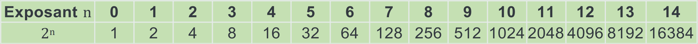
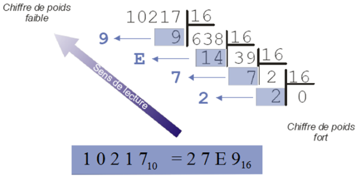
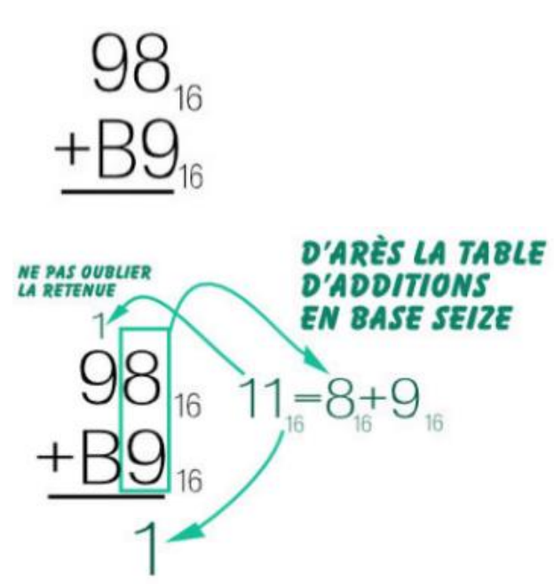
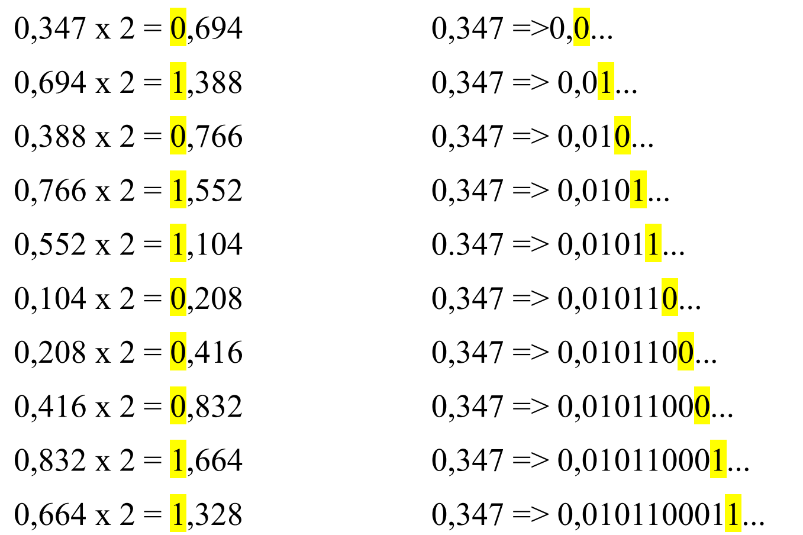
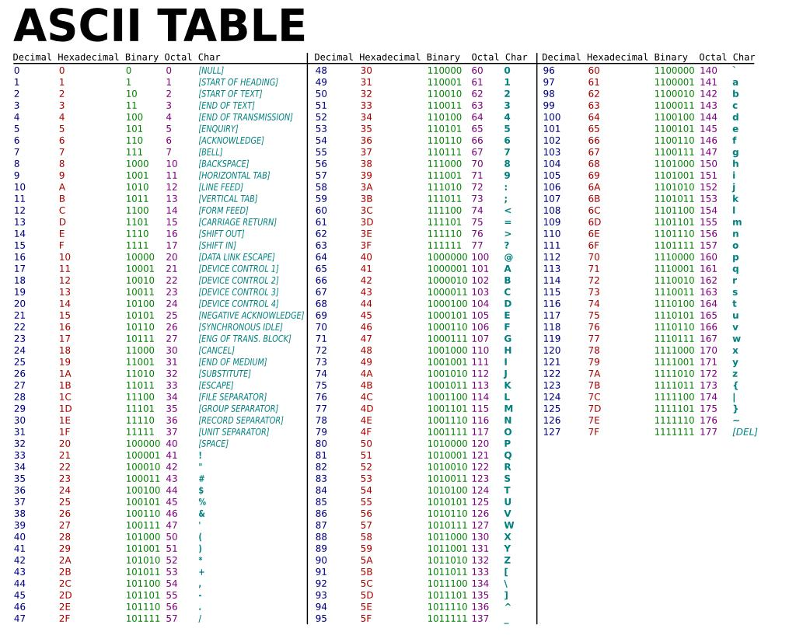
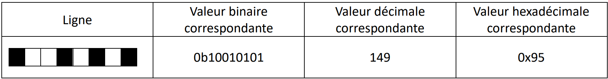

---
author: ELP
title: 04 Codage de l'information
---


**Table des matières** 

1. [Vocabulaire ](#_page0_x40.00_y610.92)
2. [Les bases courantes](#_page1_x40.00_y467.92)
3. [Le codage des nombres entiers signés en binaire](#_page5_x40.00_y574.92)
4. [Exercices](#_page9_x40.00_y36.92)
5. [Représentation des nombres réels](#_page12_x40.00_y36.92)
6. [Exercices](#_page15_x40.00_y36.92)
7. [Codage des caractères](#_page16_x40.00_y36.92)
8. [Représentation des images](#_page17_x40.00_y448.92)
9. [Exercices](#_page18_x40.00_y36.92)


## **<H2 STYLE="COLOR:BLUE;">1. Vocabulaire<a name="_page0_x40.00_y610.92"></a></h2>** 

La mémoire des ordinateurs est composée de **circuits électroniques** pouvant être dans **deux états** :

- `0` (pas de courant) 

- `1` (du courant)

Cette **représentation binaire** est utilisée pour **stocker et traiter** toutes les informations dans un ordinateur.

✅ **Définitions essentielles :**

- Un **bit** (*binary digit*) est la plus petite unité d'information.

- Un **octet** (*byte*, noté `B`) = **8 bits**.

- Un **mot** (*word*) = 16 bits.

- Un **double mot** (*double word*, `dword`) = 32 bits.

✅ **Unités de mesure informatique :**

| Unité | Notation | Équivalent en octets |
|--------|---------|----------------------|
| **Kilooctet** | `ko` | 10³ octets |
| **Mégaoctet** | `Mo` | 10⁶ octets |
| **Gigaoctet** | `Go` | 10⁹ octets |
| **Téraoctet** | `To` | 10¹² octets |
| **Pétaoctet** | `Po` | 10¹⁵ octets |
| **Exaoctet** | `Eo` | 10¹⁸ octets |
| **Zettaoctet** | `Zo` | 10²¹ octets |
| **Yottaoctet** | `Yo` | 10²⁴ octets |

🚨 **Attention :** En informatique, 1 Mo = **1024 × 1024** octets (1 048 576 octets), et non 1 000 000.

## **<H2 STYLE="COLOR:BLUE;">2. Les<a name="_page1_x40.00_y467.92"></a> bases courantes</h2>** 

L’écriture des nombres dépend du **système de numération** utilisé. On utilise principalement trois bases :

### **<H3 STYLE="COLOR:GREEN;">2.1. La<a name="_page1_x40.00_y489.92"></a> base 10 ou base décimale</h3>** 

📌 **La base 10 utilise 10 chiffres** : `0, 1, 2, 3, 4, 5, 6, 7, 8, 9`.  

Chaque position d’un chiffre représente une **puissance de 10**.


Exemple :  
185<sub>10</sub> = **1 × 10² + 8 × 10¹ + 5 × 10⁰**

### **<H3 STYLE="COLOR:GREEN;">2.2. La<a name="_page1_x40.00_y677.92"></a> base 2 ou base binaire</h3>** 
#### **<H4 STYLE="COLOR:MAGENTA;">2.2.1. Le<a name="_page1_x40.00_y697.92"></a> binaire</h4>**

**Remarque** : Il faut toujours indiquer la base dans laquelle un nombre est exprimé (sauf, par usage et commodité, en base 10) : 1010<sub>2</sub> ou %1010. La base par défaut du code Python est la base 10. 

📌 **La base 2 utilise uniquement deux chiffres** : `0` et `1`. 

Chaque position représente une **puissance de 2**.

| Décimal | Binaire |
|---------|--------|
| 0 | 0000 |
| 1 | 0001 |
| 2 | 0010 |
| 3 | 0011 |
| 4 | 0100 |
| 5 | 0101 |
| 6 | 0110 |
| 7 | 0111 |
| 8 | 1000 |
| 9 | 1001 |
| 10 | 1010 |

#### **<H4 STYLE="COLOR:MAGENTA;">2.2.2. Le<a name="_page2_x40.00_y74.92"></a> binaire en Python</h4>**

✅ **Afficher un nombre en binaire avec Python :**

???+ question "Activité n°1 :"

    ```python
    print(bin(47))  # Affiche 0b101111
    print(bin(5))   # Affiche 0b101
    ```

    ??? success "Python"
        {{ IDE() }}

En Python on peut écrire les nombres entiers directement en binaire. Il suffit pour cela de faire précéder cette écriture par **0b**.  

#### **<H4 STYLE="COLOR:MAGENTA;">2.2.3. <a name="_page2_x40.00_y235.92"></a>Conversion décimal → binaire</h4>**

📌 **Méthode des divisions successives :**  

Exemple : Conversion de 145 en binaire  

- 145 ÷ 2 = **72**, reste **1**

- 72 ÷ 2 = **36**, reste **0**

- 36 ÷ 2 = **18**, reste **0**

- 18 ÷ 2 = **9**, reste **0**

- 9 ÷ 2 = **4**, reste **1**

- 4 ÷ 2 = **2**, reste **0**

- 2 ÷ 2 = **1**, reste **0**

- 1 ÷ 2 = **0**, reste **1**

🔹 **Lecture de bas en haut →** **145<sub>10</sub> = 10010001<sub>2</sub>**

Autre exemple :


- On divise par 2 jusqu'à ce que le quotient soit 0  

- On lit les bits en montant de droite à gauche : 

167 = 0b10100111

**Méthode des puissances de 2** : 



Écrire 57 en base 2 (=donner sa représentation binaire). 

✅ **Tableau : Représentation binaire de 57**

| **Puissances de 2**       | 128 | 64 | 32 | 16 | 8 | 4 | 2 | 1 |
| ------------------------- | --- | -- | -- | -- | - | - | - | - |
| **Bits (valeur binaire)** | 0   | 0  | 1  | 1  | 1 | 0 | 0 | 1 |


✍️ **Explication **

* 57 ≥ **32** → ✅ **1** → reste : 57 - 32 = **25**
* 25 ≥ **16** → ✅ **1** → reste : 25 - 16 = **9**
* 9 ≥ **8** → ✅ **1** → reste : 9 - 8 = **1**
* 1 ≥ **1** → ✅ **1** → reste : 1 - 1 = **0**
* Tous les autres bits = **0**

**57 en base 2 => `00111001`**


???+ question "Activité n°2 :"

    convertir 23 écrit en décimal (base 10) en binaire

    ??? success "Solution"

	    10111

	    { width=30%; : .center }

???+ question "Activité n°3 :"

    234 est écrit en base 10. L'écrire en binaire

    ??? success "Solution"

	    Le nombre 234 écrit en base dix, s'écrit 11101010 en base deux .

???+ question "Activité n°4 :"

    On peut aussi convertir un nombre décimal en binaire en utilisant un tableau.

    [Utiliser un tableau](https://wims.univ-cotedazur.fr/wims/wims.cgi?session=I6E9356CF1.3&lang=fr&cmd=new&module=H3%2Fcoding%2Foefbin.fr&exo=binary3&qnum=1&scoredelay=&seedrepeat=0&qcmlevel=1&special_parm2=&special_parm4=){ .md-button target="_blank" rel="noopener" }


#### **<H4 STYLE="COLOR:MAGENTA;">2.2.4. <a name="_page2_x40.00_y722.92"></a>Conversion binaire → décimal</h4>**

📌 **Méthode des puissances de 2 :**  
Exemple : Convertir `1011`<sub>2</sub> en décimal :

1 × 2³ + 0 × 2² + 1 × 2¹ + 1 × 2⁰ = **8 + 0 + 2 + 1 = 11<sub>10</sub>**


✅ **Convertir avec Python :**

???+ question "Activité n°5 :"

    ```python
    print(int("1011", 2))  # Affiche 11
    ```

    ??? success "Python"
        {{ terminal() }}

???+ question "Activité n°6 :"

    1110010 est écrit en base 2. L'écrire en base 10.

    ??? success "Solution"

	    $(1110010)_2 = 0 \times 2^0 + 1 \times 2^1 + 0 \times 2^2 + 0 \times 2^3 + 1\times 2^4 + 1 \times 2^5 + 1 \times 2^6 = 2 + 16 + 32 + 64  =  (114)_{10}$

	    1110010 en binaire s'écrit 114 en décimal.


#### **<H4 STYLE="COLOR:MAGENTA;">2.2.5. Addition<a name="_page3_x40.00_y258.92"></a> de deux nombres binaires</h4>** 

L'**addition binaire** suit les mêmes règles que l'addition en base 10, avec quelques spécificités :

| Addition en décimal | Addition en binaire |
|---------------------|---------------------|
| 0 + 0 = 0          | 0 + 0 = 0           |
| 0 + 1 = 1          | 0 + 1 = 1           |
| 1 + 0 = 1          | 1 + 0 = 1           |
| 1 + 1 = 2          | 1 + 1 = **10** (on retient 1) |
| 1 + 1 + 1 = 3      | 1 + 1 + 1 = **11** (on retient 1) | 

📌 **Exemple d'addition binaire** :

```
   1101   (13 en décimal)
+  0111   (7 en décimal)
------------
  10100   (20 en décimal)
```

✅ **Tester avec Python** :

???+ question "Activité n°7 :"

    ```python
    # Addition binaire en Python
    a = 0b1101  # 13 en binaire
    b = 0b0111  # 7 en binaire
    somme = a + b

    print(bin(somme))  # Affiche 0b10100 (20 en décimal)
    ```

    ??? success "Python"
        {{ IDE() }}

#### **<H4 STYLE="COLOR:MAGENTA;">2.2.6. Multiplication<a name="_page3_x40.00_y462.92"></a> de deux nombres binaires</h4>**  

La **multiplication binaire** suit le même principe que la multiplication en base 10 :

- On effectue des **multiplications partielles** (0 ou 1).

- On **décale vers la gauche** à chaque nouvelle ligne.

📌 **Exemple de multiplication binaire** :

```
   101  (5 en décimal)
×  11   (3 en décimal)
------------
   101   (5 × 1)
+ 1010   (5 × 1, décalé d'un rang à gauche)
------------
  1111   (15 en décimal)
```

✅ **Tester avec Python** :

???+ question "Activité n°8 :"

    ```python
    # Multiplication binaire en Python
    a = 0b101  # 5 en binaire
    b = 0b11   # 3 en binaire
    produit = a * b

    print(bin(produit))  # Affiche 0b1111 (15 en décimal)
    ```

    ??? success "Python"
        {{ IDE() }}

### **<H3 STYLE="COLOR:GREEN;">2.3. La<a name="_page3_x40.00_y727.92"></a> base 16 ou base hexadécimal</h3>** 
#### **<H4 STYLE="COLOR:MAGENTA;">2.3.1. L’hexadécimal<a name="_page3_x40.00_y747.92"></a></h4>** 

📌 **La base 16 utilise 16 symboles :**  

`0, 1, 2, 3, 4, 5, 6, 7, 8, 9, A, B, C, D, E, F`  

- `A = 10`

- `B = 11`

- `C = 12`

- `D = 13`

- `E = 14`

- `F = 15`

| Décimal | Hexadécimal |
|---------|------------|
| 0 | 0 |
| 9 | 9 |
| 10 | A |
| 15 | F |
| 16 | 10 |
| 31 | 1F |
| 255 | FF |

**Remarque** : Il faut toujours indiquer la base dans laquelle un nombre est exprimé (sauf, par usage et commodité, en base 10) : A9<sub>16</sub> ou $A9 ou #A9. La base par défaut du code Python est la base 10. 

???+ question "Activité n°9 :"

    Vous avez compris le principe. Ecrivez les 20 entiers écrits en hexadécimal qui suivent 21 qui est écrit en hexadécimal.

    ??? success "Solution"

        22 - 23 - 24 - 25 - 26 - 27 - 28 - 29 - 2A - 2B - 2C - 2D - 2E - 2F - 30 - 31 - 32 - 33 - 34 - 35


???+ question "Activité n°10 :"

    Quel est l'entier écrit en hexadécimal **qui suit** le nombre FF (c'est à dire FF + 1) écrit en hexadécimal ?

    ??? success "Solution"

        $100_{16}$


???+ question "Activité n°11 :"

    Quel est l'entier écrit en hexadécimal qui suit le nombre FFF (c'est à dire FFF + 1) écrit en hexadécimal ?

    ??? success "Solution"

        $1000_{16}$


???+ question "Activité n°12 :"

    Quel est l'entier écrit en hexadécimal qui suit le nombre 2FFF écrit en hexadécimal ?

    ??? success "Solution"

        $3000_{16}$

✅ **Afficher un nombre en hexadécimal avec Python :**

???+ question "Activité n°13 :"

    ```python
    print(hex(185))  # Affiche 0xb9
    print(hex(127))  # Affiche 0x7f
    ```

    ??? success "Python"
        {{ IDE() }}

#### **<H4 STYLE="COLOR:MAGENTA;">2.3.2. <a name="_page4_x40.00_y103.92"></a>Conversion binaire → hexadécimal</h4>**

📌 **Méthode : regrouper les bits par paquet de 4**

- `10111010`<sub>2</sub> → `1011 1010`

- `1011 = B`, `1010 = A`

- Résultat : `BA`<sub>16</sub>

Remarque : 
Si le nombre binaire de départ n'a pas un nombre de bits multiple de 4, **il faut ajouter des zéros en tête** (ce qui ne change pas sa valeur) afin de pouvoir les regrouper 4 par 4. 

✅ **Vérifier avec Python :**

???+ question "Activité n°14 :"

    ```python
    print(hex(int("10111010", 2)))  # Affiche 0xba
    ```

    ??? success "Python"
        {{ terminal() }}

???+ question "Activité n°15 :"

    $(AB5)_{16} = (?)_2$

    ??? success "Solution"

        $(A)_{16} =(10)_{10}=(1010)_2$

        $(B)_{16} =(11)_{10}=(1011)_2$

        $(5)_{16} =(5)_{10}=(0101)_2$

        Donc $(AB5)_{16} = (1010\ 1011\ 0101)_2$

???+ question "Activité n°16 :"

    $(1111\ 0100\ 1010)_{2} = (?)_{16}$

    ??? success "Solution"

        $(1111)_2 = (15)_{10} = (F)_{16}$

        $(0100)_2 = =(4)_{10} = (4)_{16}$

        $(1010)_2 = (10)_{10} = (A)_{16}$

        $(1111\ 0100\ 1010)_{2} = (F4A)_{16}$

#### **<H4 STYLE="COLOR:MAGENTA;">2.3.3. <a name="_page4_x40.00_y309.92"></a>Conversion décimal → hexadécimal</h4>**

📌 **Méthode des divisions successives par 16 :**

Exemple : Source : [Académie de Limoges](http://pedagogie.ac-limoges.fr/sti_si/accueil/FichesConnaissances/Sequence2SSi/co/ConvDecimalHexadecimal.html){:target="_blank" }

{ width=60% }


✅ En lisant les restes de **bas en haut**, on obtient : **2 7 E 9**

👉 Donc : **10217<sub>10</sub> = 27E9<sub>16</sub>**

✅ **Vérifier avec Python :**

???+ question "Activité n°17 :"

    ```python
    print(hex(10217))  # Affiche 0x27E9
    ```

    ??? success "Python"
        {{ terminal() }}

???+ question "Activité n°18 :"

    $(1256)_{10}  = (?)_{16 }$ 

    ??? success "Solution"

	    4E8


#### **<H4 STYLE="COLOR:MAGENTA;">2.3.4. Passage<a name="_page4_x40.00_y569.92"></a> du système hexadécimal au décimal</h4>** 


📌 **Principe de conversion**
Pour convertir un nombre hexadécimal en **base 10**, on utilise la **notation polynomiale**, comme en binaire.

⚡ **Exemple** : Conversion de **12B7<sub>16</sub>** en décimal :

$12B7_{16} = 1 \times 16^3 + 2 \times 16^2 + 11 \times 16^1 + 7 \times 16^0$

$= 1 \times 4096 + 2 \times 256 + 11 \times 16 + 7$

$= 4096 + 512 + 176 + 7 = 4791$

🖥 **Tester en Python**
Python permet de **convertir directement** un nombre hexadécimal en décimal avec la fonction `int()`. 

✅ **Tester la conversion de 12B7<sub>16</sub> en décimal** :

???+ question "Activité n°19 :"

    ```python
    # Conversion hexadécimal -> décimal en Python
    nombre_hex = '12B7'
    nombre_dec = int(nombre_hex, 16)  # Convertit de base 16 vers base 10

    print(nombre_dec)  # Affiche : 4791
    ```

    ??? success "Python"
        {{ IDE() }}

???+ question "Activité n°20 :"

    Convertir en décimal : $(E26A)_{16}$

    ??? success "Solution"

        $(14 \times 16^3 + 2 \times 16^2 + 6 \times 16^1 + 10 \times 16^0 )_{10} = (57962)_{10}$

#### **<H4 STYLE="COLOR:MAGENTA;">2.3.5. Addition<a name="_page5_x40.00_y90.92"></a> de deux nombres en base 16</H4>** 

🔢 **Principe de l'addition hexadécimale**

L’addition en **base 16** suit le même principe que l’addition en base 10 :

- Lorsqu'une somme dépasse 15 (_F<sub>16</sub>_), on effectue une **retenue** sur la colonne de gauche.

- Chaque somme est exprimée en notation hexadécimale (A=10, B=11, ..., F=15).

⚡ **Exemple :** Additionner **89<sub>16</sub> + C8<sub>16</sub>**.

| Étape | 8<sub>16</sub> | 9<sub>16</sub> |  +  | C<sub>16</sub> | 8<sub>16</sub> |
|------|------|------|------|------|------|
| Valeur en décimal | 8  | 9  | +  | 12 (C) | 8  |
| Addition | 8 + 12 | 9 + 8 |
| Résultat | 14 (E) | 17 (1 retenue, reste 1) |
| Valeur finale | 151<sub>16</sub> |

{ width=30% }

{ width=20% }

💡 **Interprétation** : 

- 8<sub>16</sub> + C<sub>16</sub> = **E<sub>16</sub>**

- 9<sub>16</sub> + 8<sub>16</sub> = **11<sub>16</sub>** → On pose **1** et on **retient 1**.

- La somme finale est **151<sub>16</sub>**.

✅ **Conversion en base 10** :

$1 \times 16^2 + 5 \times 16^1 + 1 \times 16^0 = 256 + 80 + 1 = 337$

💡 **Vérification avec Python** :

???+ question "Activité n°21 :"

    ```python
    # Addition en hexadécimal
    somme = hex(0x89 + 0xC8)  # 0x signifie base 16
    print(somme)  # Résultat : 0x151
    ```

    ??? success "Python"
        {{ IDE() }}


### **<H3 STYLE="COLOR:GREEN;">2.4. Une<a name="_page5_x40.00_y421.92"></a> base quelconque</h3>** 

Le principe de conversion en **base quelconque** est le même qu’en binaire ou en hexadécimal :

- On décompose un nombre en **puissances de la base choisie**.

- Chaque coefficient indique combien de fois une puissance apparaît.

📌 **Exemple : Représentation de 58 en base 5**  

$58 = 2 \times 5^2 + 1 \times 5^1 + 3 \times 5^0$

➡ **58 en base 5 s'écrit donc 213<sub>5</sub>.**

🔢 **Méthode des divisions successives**

Une autre méthode consiste à :

1. **Diviser** le nombre par la base.

2. **Récupérer** le reste.

3. **Continuer** jusqu'à obtenir un quotient de 0.

4. **Lire les restes à l’envers**.

{ width=70% }
 

## **<H2 STYLE="COLOR:BLUE;">3. Le<a name="_page5_x40.00_y574.92"></a> codage des nombres entiers signés en binaire</h2>** 

📌 **Les nombres en informatique peuvent être :**  

- **Entiers naturels** (uniquement positifs ou nuls) : `0, 1, 2, ...`

- **Entiers relatifs** (positifs et négatifs) : `..., -2, -1, 0, 1, 2, ...`

⚠️ **Problème** : Les nombres négatifs n'existent pas en binaire traditionnel. On doit donc trouver un moyen de **coder les entiers relatifs**.

✅ **Solution : le complément à 2**  

L'ordinateur utilise **le complément à 2** pour représenter les entiers négatifs.


### **<H3 STYLE="COLOR:GREEN;">3.1. <a name="_page7_x40.00_y36.92"></a>Conversion décimal → binaire (nombre positif)</h3>**

**Méthode :**

1. Convertir le nombre en **binaire**.

2. Compléter avec des **zéros** à gauche pour obtenir **8 bits** (ou plus selon la taille du stockage).

📌 **Exemple : 27 en binaire (sur un octet)**

- 27 = **0b11011**

- Complétons sur **8 bits** : **0b 0001 1011**

✅ **Tester avec Python :**

???+ question "Activité n°22 :"

    ```python
    print(bin(27))  # Affiche 0b11011
    print(format(27, '08b'))  # Affiche 00011011
    ```

    ??? success "Python"
        {{ IDE() }}


### **<H3 STYLE="COLOR:GREEN;">3..2. <a name="_page7_x40.00_y158.92"></a>Conversion décimal → binaire (nombre négatif)</H3>** 

**Méthode du complément à 2 :**

1. Convertir la **valeur absolue** en binaire.

2. Compléter avec des **zéros** pour obtenir **8 bits**.

3. **Inverser** tous les bits (0 ↔ 1).

4. **Ajouter 1**.

📌 **Exemple : -9 en complément à 2**

1. 9 en binaire = **0b 0000 1001** (8 bits)

2. Inverser les bits → **0b 1111 0110**

3. Ajouter 1 → **0b 1111 0111**

✅ **Tester avec Python :**

???+ question "Activité n°23:"

    ```python
    def complement_a_2(n):
        return format(n & 0xFF, '08b')  # Affiche sur 8 bits

    print(complement_a_2(-9))  # Affiche 11110111
    ```

    ??? success "Python"
        {{ IDE() }}

???+ question "Activité n°24:"

    Utiliser la méthode du complément à 2 pour coder sur 8 bits : - 36

    ??? success "Solution"

        * 36 sur 8 bits : 0010 0100
        * Inversion des bits : 1101 1011
        * Ajout de 1 : 1101 1100

        👉 La réponse est donc : 1101 1100


???+ question "Activité n°25:"

    Utiliser la méthode du complément à 2 pour coder sur 8 bits : - 75

    ??? success "Solution"

        * 75 sur 8 bits : 0100 1011
        * Inversion des bits : 1011 0100
        * Ajout de 1 : 1011 0101
        
        👉 La réponse est 1011 0101

### **<H3 STYLE="COLOR:GREEN;">3.3. <a name="_page7_x40.00_y335.92"></a>Addition en binaire avec des nombres signés</h3>** 

📌 **Vérifions que** `27 + (-9) = 18` en binaire.

| Nombre | Binaire (8 bits) |
|--------|-----------------|
| 27 | `0001 1011` |
| -9 (Complément à 2) | `1111 0111` |
| **Addition** | `10010` (le bit de poids fort disparaît) |
| **Résultat** | `0001 0010` (= 18 en décimal) |


**Remarque** la dernière retenue (tout à gauche) disparait. 

✅ **Tester avec Python :**

???+ question "Activité n°26 :"

    ```python
    print(complement_a_2(27))   # 00011011
    print(complement_a_2(-9))   # 11110111
    print(complement_a_2(27 + (-9)))  # 00010010 (18 en décimal)
    ```

    ??? success "Python"
        {{ IDE() }}

### **<H3 STYLE="COLOR:GREEN;">3.4. <a name="_page7_x40.00_y496.92"></a>Conversion binaire → décimal (nombre négatif)</h3>** 

Si un nombre binaire commence par **1**, il est **négatif** en complément à 2.

📌 **Méthode pour retrouver un nombre négatif à partir de son binaire :**

1. Si le **premier bit** est `1`, c'est un **nombre négatif**.

2. **Inverser tous les bits** (0 ↔ 1).

3. **Ajouter 1**.

4. Convertir en **décimal** et ajouter le **signe -**.

📌 **Exemple : `1111 0111`**

1. Inverser les bits : `0000 1000`

2. Ajouter 1 : `0000 1001`

3. Convertir en décimal : `9`

4. Ajouter le signe `-9`

✅ **Tester avec Python :**

???+ question "Activité n°27 :"

    ```python
    def binaire_vers_decimal(binaire):
        if binaire[0] == '1':  # Si le premier bit est 1
            return -((~int(binaire, 2) + 1) & 0xFF)  # Convertir en négatif
        return int(binaire, 2)

    print(binaire_vers_decimal("11110111"))  # Affiche -9
    ```

    ??? success "Python"
        {{ IDE() }}

## **<H2 STYLE="COLOR:BLUE;">4. Exercices<a name="_page9_x40.00_y36.92"></a></h2>** 
=> **CAPYTALE Le code vous sera donné par votre enseignant**

!!! abstract "Exercice 1"  

    On suppose toujours nos entiers encodés sur un octet. 

    - Donner la représentation binaire 12, 100 et 88 

    - Réaliser l’addition binaire bit à bit de ces 3 nombres. 

!!! abstract "Exercice 2" 

    On suppose toujours nos entiers encodés sur un octet. Donner les compléments à 2 de -12, -100 et -88. 

!!! abstract "Exercice 3 ★" 

    - Réaliser l’addition binaire des compléments à 2 des nombres 12 et -100. 

    - Vérifier qu’on retrouve bien le résultat précédent pour -88. 

!!! abstract "Exercice 4 ★"  

    Donner les notations décimales des binaires signés sur un octet suivant : 

    - 0b1111 1111 

    - 0b1000 0000 

    - 0b0111 1111 

    - 0b1010 0011 

!!! abstract "Exercice 5  ★ : Conversion décimal – binaire"

    1 ★ Écrire un programme qui convertisse un nombre décimal en binaire. Utiliser une fonction dec2bin. On donne l’algorithme suivant : 

    ```
    Algorithme dec2bin
        fonction(nombre : entier) renvoie un string
            binaire := nombre modulo 2	# binaire étant un string 
            tantque nombre ≥ 2 faire
                nombre := nombre / 2
                binaire := ajout(nombre modulo 2) devant 
            tantque longueur(binaire)<7
                binaire : = ajout(0) devant
            renvoyer(binaire)
    ```


    Tout au début du programme, ne pas oublier cette ligne : # coding: utf-8

    2 Vérifier les conversions suivantes:

    - dec2bin(1843) == '11100110011' 

    - dec2bin(43) == '0101011'

    3 Convertir -2 et conclure. 

    4 ★★ Modifier le programme pour coder un nombre négatif : pour cela, on rajoutera une deuxième fonction dec2bin_negatif(nombre : int)-> str qui convertit un nombre négatif en binaire

    **Aide :** 

    - 	Les nombres entiers positifs sont codés sur 1 octet donc on peut les coder entre 0 et et 255. Les nombres entiers signés sont également codés sur 1 octet entre -128 à 127. 

    -  Les nombres positifs commence par 0

    -  Les nombres négatifs commence par 1.

    -  Le complément à 2 peut être calculer par une autre méthode : 

    Sur 8 bits, -88 en complément à 2 correspond au nombre binaire suivant :

    * 2<sup>7</sup> – 88 = 40 

    * 40 en binaire => 010 1000 

    Le bit de signe donne donc **1**010 1000 


    5	Vérifier les conversions suivantes

    - dec2bin_negatif(-2) == '11111110'

    - dec2bin_negatif(-1) == '11111111'


    6 Faire une troisième fonction **conversion(nombre : int)-> str** qui teste si le nombre entré est positif ou négatif et qui fait appel aux deux autres fonctions codées et qui renverra la conversion du nombre positif ou négatif en binaire.

    7 Vérifier les conversions suivantes :

    - conversion(88) == '01011000'

    - conversion(-88) == '10101000'

    8	Convertir -1.1 et conclure.
 

    Pour éviter que le programme « crash » sur une erreur de valeur d’entrée (ValueError), une façon de gérer cette erreur est d’intercepter le message d’erreur et de le traiter correctement à l’aide des instructions try et except. 

    La syntaxe est la suivante : 

    ```
    try:
        # bloc d’instructions à exécuter
    except ValueError:
        # afficher « erreur de valeur »
    ```
    Ou 
    ```
    assert isinstance(nombre, int), « phrase à écrire »
    ```
    Ou 
    ```
    assert type(nombre)== int, « phrase à écrire »
    ```

    9 ★★ Modifier le programme précédent en conséquence. 


Convertisseur en ligne :[ https://www.exploringbinary.com/twos-complement-converter/ ](https://www.exploringbinary.com/twos-complement-converter/)

QCM :[ http://www.scientillula.net/MPI/fex6_conversions/fex6_conversions.html ](http://www.scientillula.net/MPI/fex6_conversions/fex6_conversions.html)

QCM 2 :[ http://fabrice.sincere.free.fr/qcm/qcm.php?nom=qcm_numerique](http://fabrice.sincere.free.fr/qcm/qcm.php?nom=qcm_numerique)

## **<H2 STYLE="COLOR:BLUE;">5.  Représentation des nombres réels<a name="_page12_x40.00_y36.92"></a></h2>** 

En informatique, les nombres réels (avec une partie décimale) sont représentés différemment des nombres entiers.  

En **base 10**, l’écriture d’un nombre réel suit le principe des puissances de 10 :  

$652,375 = 6 \times 10^2 + 5 \times 10^1 + 2 \times 10^0 + 3 \times 10^{-1} + 7 \times 10^{-2} + 5 \times 10^{-3}$

De la même manière, en **base 2**, un nombre réel est écrit avec les puissances de 2 :

$110,101_2 = 1 \times 2^2 + 1 \times 2^1 + 0 \times 2^0 + 1 \times 2^{-1} + 0 \times 2^{-2} + 1 \times 2^{-3}$

$= 4 + 2 + 0,5 + 0,125 = 6,625_{10}$


### **<H3 STYLE="COLOR:GREEN;">5.1. Conversion<a name="_page12_x40.00_y115.92"></a> de binaire en décimal</h3>** 

Pour convertir un nombre en **base 2** vers la **base 10**, on applique la même logique que pour les nombres entiers :

1. Multiplier chaque chiffre binaire par la puissance de **2** correspondante.

2. Additionner les résultats.

💡 **Exemple :** Convertir **110,101<sub>2</sub>** en base 10.

| Bit | 1 | 1 | 0 | , | 1 | 0 | 1 |
|----|----|----|----|----|----|----|----|
| Puissance de 2 | $2^2$ | $2^1$ | $2^0$ | , | $2^{-1}$ | $2^{-2}$ | $2^{-3}$ |
| Valeur | 4 | 2 | 0 | , | 0.5 | 0 | 0.125 |

$110,101_2 = 4 + 2 + 0 + 0.5 + 0 + 0.125 = 6.625_{10}$


### **<H3 STYLE="COLOR:GREEN;">5.2. Conversion<a name="_page12_x40.00_y167.92"></a> de décimal en binaire</h3>** 

Le passage de base 10 en base 2 est plus subtil. Par exemple : convertissons 1234,347 en base 2. 

1. La partie entière se transforme comme précédemment : 1234<sub>10</sub> = 10011010010<sub>2</sub>

2. On transforme la partie décimale selon le schéma suivant :



On continue ainsi jusqu'à la précision désirée..

Convertir un **nombre entier** en binaire est simple (divisions successives). Mais pour la **partie décimale**, on applique une autre méthode :  

1. **Multiplier** la partie décimale par 2.

2. **Récupérer** la partie entière du résultat.

3. **Conserver** la partie décimale et recommencer.

4. **Arrêter** lorsque la partie décimale devient nulle ou atteint la précision souhaitée.

🔢 **Exemple : Convertir 1234,347 en binaire**

1. **Partie entière** :  

   $1234_{10} = 10011010010_{2}$ 

2. **Partie décimale** :  

   $0.347 \times 2$ = $0.694 \quad$ $\textbf{0}$

   $0.694 \times 2$ = $1.388 \quad$ $\textbf{1}$

   $0.388 \times 2$ = $0.776 \quad$ $\textbf{0}$

   $0.776 \times 2$ = $1.552 \quad$ $\textbf{1}$

   $0.552 \times 2$ = $1.104 \quad$ $\textbf{1}$

✅ **Résultat** :  
$1234,347_{10} = 10011010010,01011_{2}$

⚠ **Problème** : Un nombre décimal fini **en base 10** peut avoir une **représentation infinie en base 2**.  

### **<H3 STYLE="COLOR:GREEN;">5.3. Représentation<a name="_page13_x40.00_y36.92"></a> des flottants dans un ordinateur</h3>** 

Les ordinateurs utilisent la **norme IEEE 754** pour stocker les nombres réels en **précision simple (32 bits)** ou **double (64 bits)**.

🔢 **Problème des nombres flottants**

- L’ordinateur représente les nombres en binaire avec une **précision limitée**.

- Certains nombres ne peuvent pas être stockés avec une précision exacte.

💡 **Exemple :** Tester en Python

???+ question "Activité n°28 :"

    ```python
    print(0.1 + 0.2)  # Résultat inattendu : 0.30000000000000004
    ```

    ??? success "Python"
        {{ terminal() }}

🖥 **Format IEEE 754**
Les nombres sont stockés sous la forme :
$\text{Signe} \quad Exposant \quad Mantisse$


| **Champ**  | **Taille (bits)** | **Description** |
|------------|------------------|----------------|
| **Signe**  | 1 bit  | 0 = positif, 1 = négatif |
| **Exposant**  | 8 bits (simple) / 11 bits (double)  | Code décalé |
| **Mantisse**  | 23 bits (simple) / 52 bits (double)  | Partie fractionnaire |

✅ **Exemple :** **Représentation de -10,125 en IEEE 754 (32 bits)**

1. **Conversion en binaire** :
   $10,125_{10} = 1010,001_{2}$
2. **Normalisation** :
   $1,010001 \times 2^3$
3. **Codage** :
   - **Signe** = `1` (négatif)
   - **Exposant** = $3 + 127 = 130 = 10000010_2$
   - **Mantisse** = `01000100000000000000000`

✅ **Résultat binaire** :

$1 \quad 10000010 \quad 01000100000000000000000$


✅ **Résultat hexadécimal** : `C1202000`


✅ **Vérifier avec un convertisseur en ligne** :  
[IEEE 754 Float Converter](https://www.h-schmidt.net/FloatConverter/IEEE754.html)


## **<H2 STYLE="COLOR:BLUE;">6.  Exercices<a name="_page15_x40.00_y36.92"></a></h2>** 

=> **CAPYTALE Le code vous sera donné par votre enseignant**

!!! abstract "Exercice 6 "  

    Convertir en base 10  

    1. 0,0101010101<sub>2</sub>  
    2. 11100,10001<sub>2</sub> 

!!! abstract "Exercice 7 ★" 

    Convertir en binaire puis en norme IEEE-754 

    1. 5,1875
    2. 4,3125
    3. 0,3125 

!!! abstract "Exercice 8 ★ : conversion des flottants" 

    On souhaite transformer un nombre binaire décimal en base 10. Pour simplifier, on va déjà écrire un programme qui transforme **la partie décimale en binaire**, **puis** dans un deuxième temps on transformera **la partie entière**. 


    1	★ Écrire un programme **decimal(nombre : str) -> float** qui convertisse la partie décimale d’un nombre binaire en flottant.

    **Aide** : on pourra utiliser la méthode split() de l’objet str pour récupérer la partie décimale. 
    On utilisera le séparateur ','. Attention ce n’est pas une méthode en place donc il faut la réaffecter : [https://www.w3schools.com/python/ref_string_split.asp](https://www.w3schools.com/python/ref_string_split.asp)

    On pourra s’aider de ce bout de script :

    ```
    nombre = str(nombre) # on convertit le nombre en string
    x = nombre.split(',') # on le sépare en 2 selon la place de la virgule
    decimal = x[1] # partie décimale qui sera un str
    entier = x[0] # partie entière qui sera un str
    ```
    on n’utilisera pas la variable « entier » dans cette fonction

    2	Vérifier les conversions suivantes :

    - decimal('0,0101010101') == 0.3330078125

    - decimal('11100,10001') == 0.53125

    3	★ Ajouter une fonction qui convertisse en base 10 la partie entière du binaire. 
    Le prototype est le suivant : **entiere(nombre : str) -> int**
    Aide : Penser à utiliser la méthode split comme précédemment

    4	Vérifier que **entiere('11100,10001') == 28**

    5	★ Enchaîner les appels successifs des 2 autres fonctions pour transformer un nombre binaire décimal en base 10. On utilisera une fonction avec le prototype suivant :
    **bin2float(nombre : str) -> float**

    6	Vérifier que **bin2float('11100,10001') == 28.53125**


## **<H2 STYLE="COLOR:BLUE;">7.  Codage des caractères : De l'ASCII à l'Unicode !** 🖥️
<a name="_page16_x40.00_y36.92"></a></h2> 

### **<H3 STYLE="COLOR:GREEN;">7.1. Le<a name="_page16_x40.00_y58.92"></a> code ASCII[^3] La base du texte numérique !** 🔤 </h3>

Le **code ASCII** (*American Standard Code for Information Interchange*, prononcé "aski") est la première norme informatique permettant de **représenter des caractères sous forme de nombres**.




📌 **Comment ça marche ?**  
Chaque caractère est associé à un nombre unique, codé en **binaire** sur **7 bits** :

| Caractère | Code ASCII | Représentation binaire |
|-----------|------------|----------------------|
| A         | 65         | 1000001              |
| B         | 66         | 1000010              |
| a         | 97         | 1100001              |
| z         | 122        | 1111010              |

📌 **Pourquoi c’est utile ?**  
Grâce à ASCII, les ordinateurs peuvent **échanger du texte** sans ambiguïté.


???+ question "Activité n°29 : Tester les fonctions `chr()` et `ord()`"

    Utiliser les fonctions `chr()` et `ord()` en Python pour afficher le caractère correspondant à un code ASCII et inversement.

    **Tester :**
    
    ```python
    print(chr(65))  # Doit afficher 'A'
    print(ord('A')) # Doit afficher 65
    ```

    ??? success "Python"
        {{ IDE() }}

    ??? success "Solution"

        ```python
        print(chr(65))  # Affiche 'A'
        print(ord('A')) # Affiche 65
        ```

        **Résultat :**
        ```
        A
        65
        ```


### **<H3 STYLE="COLOR:GREEN;">7.2. Les<a name="_page16_x40.00_y611.92"></a> limites d’ASCII et l’arrivée des encodages ISO-latin** 🌍</h3>*

Avec **seulement 128 caractères**, ASCII n'était pas suffisant pour représenter les **lettres accentuées** et les caractères d’autres alphabets (é, ñ, ç, ß, …).

💡 **Solution temporaire :** Les encodages **ISO-8859** (appelés aussi **ISO-latin**) ont été développés dans les années 1990 pour différentes langues :

- **ISO-8859-1** → Français, Allemand, Espagnol...

- **ISO-8859-5** → Alphabet cyrillique (russe)...

- **ISO-8859-7** → Alphabet grec...

⚠️ **Problème :** Chaque langue avait son propre encodage, rendant **l’échange international compliqué** ! ✈️


### **<H3 STYLE="COLOR:GREEN;">7.3. Unicode<a name="_page17_x40.00_y54.92"></a> et UTF-8 : La solution universelle !** 🌍🚀</h3>

🎯 **L’objectif d’Unicode** est simple : **Créer un standard unique** pour représenter **toutes les écritures du monde** !  

➡️ **Unicode** permet d’encoder plus de **140 000 caractères**, incluant les alphabets, les symboles, et même les **emojis !** 😃🔥

📌 **Les formats Unicode :**

- **UTF-8** : Codage flexible (1 à 4 octets par caractère). 📜 *Compatible ASCII !*

- **UTF-16** : Utilisé pour les langues asiatiques. 🏯

- **UTF-32** : Fixe (chaque caractère = 4 octets). 🔳

🚀 **Pourquoi UTF-8 est le plus utilisé ?**  

✅ Compatible avec ASCII  

✅ Économie de mémoire pour les textes latins  

✅ Lisible par la plupart des logiciels  

💡 **Attention aux erreurs d’encodage !**  

Si un texte en **UTF-8** est interprété en **ISO-8859-1**, vous verrez des caractères bizarres comme :
> **"écrit en UTF-8"** au lieu de **"écrit en UTF-8"**


*(Exemple d'erreur d'encodage : "é" mal affiché en ISO-8859-1)*

## **<H2 STYLE="COLOR:BLUE;">8. Représentation<a name="_page17_x40.00_y448.92"></a> des images : Pixels et couleurs !** 📸</h2>**

Une **image numérique** est une **grille de petits carrés appelés pixels**. 🟩🟥🟦


*(Zoom sur une image pixelisée : chaque carré représente un pixel.)*

Chaque pixel est défini par une combinaison de trois couleurs :

- **Rouge (Red)**

- **Vert (Green)**

- **Bleu (Blue)**

➡️ Chacune de ces trois couleurs est codée sur **8 bits (0 à 255)**.  

➡️ **Exemple :** Un pixel ayant **Rouge=50, Vert=214, Bleu=145** apparaîtra **vert-bleuté**.


**Pourquoi toutes les images n'ont pas la même taille ?**

1. **La résolution** *(nombre de pixels dans l'image)*

2. **Le mode de compression** *(JPEG, PNG, BMP, GIF...)*

| **Format**  | **Taille d’un pixel**  | **Compression ?** | **Utilisation** |
|------------|-----------------|----------------|---------------|
| **BMP**   | 24 bits (3 octets) | Aucune | Images brutes |
| **JPEG**  | 24 bits           | Oui (perte) | Photos compressées |
| **PNG**   | 24 bits (RVB) + 8 bits (transparence) | Oui (sans perte) | Images avec transparence |
| **GIF**   | 8 bits (256 couleurs max) | Oui | Animations légères |

🎯 **Pourquoi utiliser JPEG et pas BMP ?**  

📌 **JPEG** réduit la taille en enlevant des détails **invisibles** à l'œil humain. 
 
📌 **BMP** conserve chaque pixel sans compression, donc **fichiers très lourds !**  

<iframe width="560" height="316" src="https://www.youtube.com/embed/HsS7kaFDrXg" title="Magie en base deux (Christian Mercat)" frameborder="0" allow="accelerometer; autoplay; clipboard-write; encrypted-media; gyroscope; picture-in-picture; web-share" referrerpolicy="strict-origin-when-cross-origin" allowfullscreen></iframe>

## **<H2 STYLE="COLOR:BLUE;">9. Exercices<a name="_page18_x40.00_y36.92"></a></h2>** 

=> **CAPYTALE Le code vous sera donné par votre enseignant**

!!! abstract "Exercice 9 : Image matricielle"

    L’objectif de cet exercice est de dessiner une image matricielle dans le quadrillage 8x8 en page 1, ci-dessous, grâce à vos réponses aux différentes questions de conversions entre les bases numériques. 

    Chaque case de l’image correspond à un bit. Une ligne de l’image fait 8 cases, soit 8 bits, soit 1 octet. Pour remplir les cases de l’image, vous devrez donc passer par la valeur binaire de la conversion afin de pouvoir appliquer cette règle de coloriage, même si la réponse n’aboutit pas à du binaire. Lorsque le bit est à 1 alors la case est noire, lorsque le bit est à 0 alors la case est blanche. 

    Exemple : 

    


    Quadrillage pour l’image matricielle de 8x8 : 

    


    **Traduire** la première ligne de l’image en valeur en binaire. 

    1. **Convertir** la valeur binaire de la première ligne en décimal : 
    2. **Convertir** la valeur hexadécimale 0x66 en binaire : 
    3. **Convertir** la valeur hexadécimale 0x3C en décimal : 
    4. **Convertir** la valeur binaire de la ligne N°4 en hexadécimal : 
    5. **Convertir** la valeur décimale 24 en binaire : 
    6. **Convertir** la valeur décimale 60 en hexadécimal : 
    7. **Colorier** la ligne N°7 de l’image avec la valeur binaire suivante :  **0b01100110**
    8. **Convertir** la valeur binaire 0b11111111 en hexadécimal : 

    RAPPELS :   Un nombre binaire s’écrit ainsi : **1011<sub>(2)</sub>** ou **0b1011** ou **%1011** ou **1011b**

    Un nombre hexadécimal s’écrit ainsi : **9A<sub>(16)</sub>** ou **0x9A** ou **$9A** ou **9Ah**


!!! abstract "Exercice 10 : L’heure en binaire ????" 

    

    Cette montre affiche l’heure en binaire :  

    - une ligne affiche les minutes,  
    - une autre ligne affiche les heures.  
    1. Quelle est la valeur maximale en décimal que peut afficher la ligne  du haut ? en binaire ? en hexadécimal ?  
    2. Quelle est la valeur maximale en décimal que peut afficher la ligne  du bas ? en binaire ? en hexadécimal ?  
    3. En déduire quelle ligne indique les minutes et quelle ligne indique  les heures ?  
    4. Dans quel format les heures sont-elles données au 12H (am/pm) ou  24H ?  
    5. Quelle valeur maximale en décimal sera réellement affichée sur la  ligne des heures ? en binaire ? en hexadécimal ?  
    6. Quelle valeur maximale en décimal sera réellement affichée sur la  ligne des minutes ? en binaire ? en hexadécimal ?  
    7. Quelle est l’heure donnée par les montre ci-dessous ?  


    


    8. Complétez les cadrans suivants dans le cas où la montre indique : 

    


    9. Quelle modification faudrait-il faire pour que les heures soient affichées sur un format 24h ? 
    10. Quelle modification faudrait-il faire pour afficher également les secondes ? 


[^1]: [1https://physics.nist.gov/cuu/Units/binary.html ](https://physics.nist.gov/cuu/Units/binary.html)
[^2]: IEEE, que l'on peut prononcer « i3e » : Institute of Electrical and Electronics Engineers 
[^3]: American Standard Code for Information Interchange 
[^4]: inventé par Robert William Bemer en 1960 