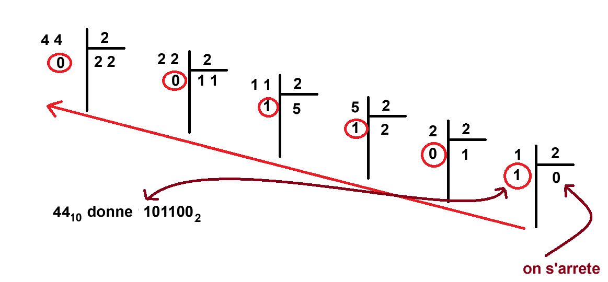
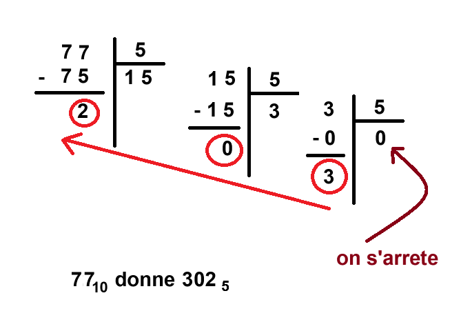
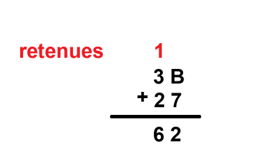

---
author: ELP
title: 04 Fiche Méthode Conversion entre les bases
---


### **<H3 STYLE="COLOR:red;">1. Conversion de la base 10 vers une base \( b \)</h3>**

#### **Étapes :**
##### 1 **Choisir la base de destination (\( b \)) :**

Exemples : 

- \( b = 2 \) (binaire),

- \( b = 16 \) (hexadécimal),

- \( b = 5 \) 

- \( b = 7 \) 

- etc.

##### 2 **Diviser le nombre en base 10 par \( b \) :**

**<span STYLE="COLOR:red;"> Divisez le nombre entier par \( b \) </span>** et notez le **<span STYLE="COLOR:red;">reste</span>** (c'est le chiffre dans la base \( b \)).

Exemple : Si on veut convertir 127 en base 5 cela donne

{  : .center }

##### 3 **Répéter la division :**

- Prenez le **<span STYLE="COLOR:red;">quotient</span>** obtenu et **<span STYLE="COLOR:red;">divisez-le à nouveau par \( b \)</span>**.

- Continuez jusqu’à ce que le quotient soit **<span STYLE="COLOR:red;">égal à 0</span>**.

##### 4 **Lire le résultat :**

Les restes, lus de **<span STYLE="COLOR:red;">bas en haut</span>**, donnent le nombre dans la base \( b \).

---

#### **Exemples :**

**Conversion de \( 44_{10} \) en base \( 2 \) (binaire) :**

{  : .center }

   - \( 44 \div 2 = 22 \), reste \( 0 \)

   - \( 22 \div 2 = 11 \), reste \( 0 \)

   - \( 11 \div 2 = 5 \), reste \( 1 \)

   - \( 5 \div 2 = 2 \), reste \( 1 \)

   - \( 2 \div 2 = 1 \), reste \( 0 \)

   - \( 1 \div 2 = 0 \), reste \( 1 \)

   **Résultat :** \( 44_{10} = 101100_2 \)

**Conversion de \( 254_{10} \) en base \( 16 \) (hexadécimal) :**

{  : .center } 

   - \( 254 \div 16 = 15 \), reste \( 14 \) (\( E \) en hexadécimal)

   - \( 15 \div 16 = 0 \), reste \( 15 \) (\( F \) en hexadécimal)

   **Résultat :** \( 254_{10} = FE_{16} \)

**Conversion de \( 77_{10} \) en base \( 5 \) :**

{  : .center } 

   - \( 77 \div 5 = 15 \), reste \( 2 \)

   - \( 15 \div 5 = 3 \), reste \( 0 \)

   - \( 3 \div 5 = 0 \), reste \( 3 \)

   **Résultat :** \( 77_{10} = 302_5 \)

---

### **<H3 STYLE="COLOR:red;">2. Conversion d’une base \( b \) vers la base 10</h3>**

#### **Méthode avec tableau :**
##### 1 **Dessiner un tableau avec les puissances de la base \( b \) :**

   - Chaque colonne correspond à une **<span STYLE="COLOR:red;">puissance de la base \( b \)</span>**, en commençant par \( b^0 \) (de droite à gauche).

##### 2 **Écrire les chiffres du nombre dans le tableau :**

   - Placez **<span STYLE="COLOR:red;">chaque chiffre (en base \( b \)) dans une colonne</span>**.

#### 3 **Calculer les contributions de chaque chiffre :**

   - **<span STYLE="COLOR:red;">Multipliez</span>** chaque chiffre par la puissance correspondante de \( b \).

##### 4 **Additionner les résultats :**

   - La **<span STYLE="COLOR:red;">somme des contributions</span>** donne le nombre en base 10.

---

#### **Exemples :**

- **Conversion de \( 101101_2 \) en base \( 10 \) :**

| Puissances de \( 2 \) | \( 2^5 \) | \( 2^4 \) | \( 2^3 \) | \( 2^2 \) | \( 2^1 \) | \( 2^0 \) |
|-----------------------|-----------|-----------|-----------|-----------|-----------|-----------|
| Chiffres             | \( 1 \)   | \( 0 \)   | \( 1 \)   | \( 1 \)   | \( 0 \)   | \( 1 \)   |
| Contributions        | \( 32 \)  | \( 0 \)   | \( 8 \)   | \( 4 \)   | \( 0 \)   | \( 1 \)   |

**Résultat :** \( 32 + 0 + 8 + 4 + 0 + 1 = 45_{10} \)

- **Conversion de \( FE_{16} \) en base \( 10 \) :**

| Puissances de \( 16 \) | \( 16^1 \) | \( 16^0 \) |
|------------------------|------------|------------|
| Chiffres              | \( F (15) \) | \( E (14) \) |
| Contributions         | \( 15 * 16 = 240 \) | \( 14 * 1 = 14 \) |

**Résultat :** \( 240 + 14 = 254_{10} \)

- **Conversion de \( 303_5 \) en base \( 10 \) :**

| Puissances de \( 5 \) | \( 5^2 \) | \( 5^1 \) | \( 5^0 \) |
|-----------------------|-----------|-----------|-----------|
| Chiffres             | \( 3 \)   | \( 0 \)   | \( 3 \)   |
| Contributions        | \( 3 * 25 = 75 \) | \( 0 * 5 = 0 \) | \( 3 * 1 = 3 \) |

**Résultat :** \( 75 + 0 + 3 = 78_{10} \)

---

### **<H3 STYLE="COLOR:red;">3. Conversion binaire <=> hexadécimal</h3>**

#### **Règle pratique :**

- **Groupes de 4 bits** : Chaque chiffre hexadécimal correspond à **<span STYLE="COLOR:red;">4 bits</span>** en binaire.

- **<span STYLE="COLOR:red;">Conversion directe</span>** entre les deux bases sans passer par la base 10.

---

#### **Exemples :**

**Conversion de \( 101101_2 \) en hexadécimal :**

   - Groupes de **<span STYLE="COLOR:red;">4 bits</span>** (ajouter des zéros à gauche si nécessaire) : \( 101101 \rightarrow 0010\ 1101 \).

   - Convertir **<span STYLE="COLOR:red;">chaque groupe</span>** : 
      - \( 0010 = 2 \), 
      - \( 1101 = D \).

   **Résultat :** \( 101101_2 = 2D_{16} \)

**Conversion de \( 3E_{16} \) en binaire :**

   - Convertir chaque chiffre hexadécimal **<span STYLE="COLOR:red;">en 4 bits</span>** :

      - \( 3 = 0011 \), 
      - \( E = 1110 \).

   **Résultat :** \( 3E_{16} = 0011\ 1110_2 \)

---


### **<H3 STYLE="COLOR:red;">4. Addition en binaire</h3>**

#### **Règles :**

##### 1 **Addition chiffre par chiffre de droite à gauche :**

   - \( 0 + 0 = 0 \)

   - \( 0 + 1 = 1 \)

   - \( 1 + 0 = 1 \)

   - \( 1 + 1 = 10 \) (soit \( 0 \) et une retenue de \( 1 \))
   
   - \( 1 + 1 + 1 = 11 \) (soit \( 1 \) et une retenue de \( 1 \))

##### 2 **Appliquer les retenues :**

   - Ajouter la retenue au chiffre suivant.

---

#### **Exemple 1 : \( 1011_2 + 1101_2 \)**
##### 1 Écrire les nombres alignés sur la droite :

   ```
         1011
      +  1101
   ```

##### 2 Additionner colonne par colonne, en appliquant les règles :

{  : .center }

- \( 1 + 1 = 10 \), on écrit \( 0 \) et on retient **<span STYLE="COLOR:red;">\( 1 \)</span>**.

- \( 1 + 0 + 1 (\text{retenue}) = 10 \), on écrit \( 0 \) et on retient **<span STYLE="COLOR:red;">\( 1 \)</span>**.

- \( 0 + 1 + 1 (\text{retenue}) = 10 \), on écrit \( 0 \) et on retient **<span STYLE="COLOR:red;">\( 1 \)</span>**.

- \( 1 + 1 + 1 (\text{retenue}) = 11 \), on écrit \( 1 \) et on retient **<span STYLE="COLOR:red;">\( 1 \)</span>**.

On place la retenue restante **<span STYLE="COLOR:red;">\( 1 \)</span>** à gauche.

   **Résultat :** \( 1011_2 + 1101_2 = 11000_2 \)

---

#### **Exemple 2 : \( 11101_2 + 1011_2 \)**
##### 1 Écrire les nombres alignés sur la droite :

   ```
          11101
      +   01011
   ```

##### 2 Effectuer l’addition (avec retenues) :

{  : .center }

- \( 1 + 1 = 10 \), on écrit \( 0 \) et on retient **<span STYLE="COLOR:red;">\( 1 \)</span>**.

- \( 0 + 1 + 1 (\text{retenue}) = 10 \), on écrit \( 0 \) et on retient **<span STYLE="COLOR:red;">\( 1 \)</span>**.

- \( 1 + 0 + 1 (\text{retenue}) = 10 \), on écrit \( 0 \) et on retient **<span STYLE="COLOR:red;">\( 1 \)</span>**.

- \( 1 + 1 + 1 (\text{retenue}) = 11 \), on écrit \( 1 \) et on retient **<span STYLE="COLOR:red;">\( 1 \)</span>**.

- \( 1 + 0 + 1 (\text{retenue}) = 10 \), on écrit \( 0 \) et on retient **<span STYLE="COLOR:red;">\( 1 \)</span>**.

   **Résultat :** \( 11101_2 + 1011_2 = 10\ 1000_2 \)

---

### **<H3 STYLE="COLOR:red;">5. Addition en hexadécimal</h3>**

#### **Règles :**

##### 1 Additionner chiffre par chiffre de droite à gauche :

   - Si la somme est inférieure à \( 16 \), écrivez **<span STYLE="COLOR:red;">directement</span>** le résultat.

   - Si la somme est \( \geq 16 \), convertissez-la en hexadécimal et placez une **<span STYLE="COLOR:red;">retenue</span>**.

##### 2 Utiliser les correspondances hexadécimales pour les chiffres \( A = 10 \), \( B = 11 \), etc.

##### 3 Ajouter les retenues comme en base 10.

---

#### **Exemple 1 : \( 1F_{16} + E_{16} \)**

##### 1 Écrire les nombres alignés :

   ```
         1F
      +   E
   ```

##### 2 Additionner les chiffres de droite à gauche :

{  : .center }

- \( F (15) + E (14) = 29 \), soit \( 1D \) (retenue \( 1 \), écrire \( D \)).

- \( 1 + 1 (\text{retenue}) = 2 \).

   **Résultat :** \( 1F_{16} + E_{16} = 2D_{16} \)

---

#### **Exemple 2 : \( 3B_{16} + 27_{16} \)**

##### 1 Écrire les nombres alignés :

   ```
          3B
      +   27
   ```

##### 2 Additionner les chiffres de droite à gauche :

{  : .center } 

- \( B (11) + 7 = 18 \), soit \( 12 \) en hexadécimal (retenue \( 1 \), écrire \( 2 \)).

- \( 3 + 2 + 1 (\text{retenue}) = 6 \).

   **Résultat :** \( 3B_{16} + 27_{16} = 62_{16} \)

---


### **<H3 STYLE="COLOR:red;">6. Représentation des nombres binaires signés</h3>**


- **Bit de poids fort (MSB)** :

   - \( 0 \) → Nombre **positif**.

   - \( 1 \) → Nombre **négatif** (en complément à 2).

- Pour un nombre signé sur 8 bits, la plage des valeurs est : \[  -128\  à\  127  \]

Exemple :

- \( 01111111_2 = 127 \) (plus grand nombre positif),

- \( 10000000_2 = -128 \) (plus petit nombre négatif).

---

### **<H3 STYLE="COLOR:red;">7. Conversion de binaire signé vers décimal</h3>**

#### **Étapes :** Vérifiez le **bit de poids fort** :
   - Si le **<span STYLE="COLOR:red;">bit de poids fort est \( 0 \)</span>**, le nombre est **<span STYLE="COLOR:red;">positif</span>**. Convertissez directement en base 10 comme vu précédemment.
   - Si le **<span STYLE="COLOR:red;">bit de poids fort est \( 1 \)</span>**, le nombre est **<span STYLE="COLOR:red;">négatif</span>** :
     - Complément à 1 : **<span STYLE="COLOR:red;">Inversez tous les bits</span>**.
     - Complément à 2 : **<span STYLE="COLOR:red;">Ajoutez \( 1 \)</span>**.
     - **<span STYLE="COLOR:red;">Convertissez en décimal</span>** 
     - **<span STYLE="COLOR:red;">Ajoutez le signe \( - \)</span>**.

---

#### **Exemples :**

**\( 00000101_2 \) :**

   - MSB = \( 0 \) → nombre positif.

   - \( 00000101_2 = 5_{10} \).

**\( 11111011_2 \) :**

   - MSB = \( 1 \) → nombre négatif.

   - Complément à 1 : \( 11111011 \rightarrow 00000100 \).

   - Ajouter \( 1 \) : \( 00000100 + 1 = 00000101 \).

   Résultat : \( -5_{10} \).


**\( 10000001_2 \) :**

   - MSB = \( 1 \) → nombre négatif.

   - Complément à 1 : \( 10000001 \rightarrow 01111110 \).

   - Ajouter \( 1 \) : \( 01111110 + 1 = 01111111 \).
   - \( 01111111_2 = 127_{10} \).


   Résultat : \( -127_{10} \).

**\( 01111111_2 \) :**

   - MSB = \( 0 \) → nombre positif.

   - \( 01111111_2 = 127_{10} \).


---

### **<H3 STYLE="COLOR:red;">8. Conversion de décimal vers binaire signé</h3>**

#### **Étapes :**

##### 1 Si le nombre est **<span STYLE="COLOR:red;">positif</span>**, convertissez directement en binaire avec \( n \) bits comme vu précédemment.

##### 2 Si le nombre est **<span STYLE="COLOR:red;">négatif</span>** :

- Prenez la **<span STYLE="COLOR:red;">valeur absolue</span>** (la valeur positive) et **<span STYLE="COLOR:red;">convertissez-la</span>** en binaire sur \( n \) bits.

- Complément à 1 : **<span STYLE="COLOR:red;">Inversez tous les bits</span>**.

- Complément à 2 : **<span STYLE="COLOR:red;">Ajoutez \( 1 \)</span>**.


---

#### **Exemples  :**

**\( 5_{10} \):**

- \( 5 \) en binaire : \( 00000101 \).

Résultat : \( 00000101_2 \).


**\(-5_{10}\) :**

- Valeur absolue : \( 5 \) en binaire → \( 00000101 \).

- Complément à 1 : \( 00000101 \rightarrow 11111010 \).

- Ajouter \( 1 \) : \( 11111010 + 1 = 11111011 \).

Résultat : \( 11111011_2 \).


**\(-127_{10}\) :**

- Valeur absolue : \( 127 \) en binaire → \( 01111111 \).

- Complément à 1 : \( 01111111 \rightarrow 10000000 \).

- Ajouter \( 1 \) : \( 10000000 + 1 = 10000001 \).

Résultat : \( 10000001_2 \).


---


### **<H3 STYLE="COLOR:red;">9. Méthode alternative pour calculer le complément à 2 utilisée en programmation</h3>**

**Étapes pour appliquer cette méthode :**

1. **Calculez \( 2^n \) (la valeur correspondant à la plage maximale pour \( n \) bits)**.

2. **Soustrayez la valeur absolue du nombre négatif (\( |N| \))**.

3. **Convertissez le résultat en binaire**.

4. **Ajoutez le bit de signe \( 1 \)** à gauche pour indiquer un nombre négatif.

---

#### **Exemple : Calculer \(-88_{10}\) en binaire signé sur 8 bits**

1. **Calculez \( 2^8 = 256 \).**

2. Soustrayez \( |88| \) :  256 - 88 = 168
 
3. Convertissez \( 168 \) en binaire sur 8 bits : \( 168_{10} \) = \( 10101000_2 \)

4. Ajoutez le bit de signe \( 1 \) pour indiquer que le nombre est négatif :\( 10101000_2\)

---


### **<H3 STYLE="COLOR:red;">10. Structure de la norme IEEE 754</h3>**

| **Signe (1 bit)** | **Exposant biaisé (8 bits)** | **Mantisse (23 bits)** |
|-------------------|-----------------------------|-------------------------|

Le nombre est décomposé en :

- **Signe (\( S \))** : \( S = 0 \) pour un nombre positif, \( S = 1 \) pour un nombre négatif.

- **Exposant biaisé (\( E_{\text{binaire}} \))** : \( E_{\text{binaire}} = E_{\text{réel}} + 127 \), où \( E_{\text{réel}} \) est l'exposant de la puissance de 2 dans la forme normalisée.

- **Mantisse (\( M \))** : Partie fractionnaire du nombre normalisé (\( 1.\text{fractionnaire} \)).

---

### **<H3 STYLE="COLOR:red;">11. Conversion de \(-12.0125\) en IEEE 754</H3>**

#### **Étape 1 : Déterminer le signe (\( S \))**

Le nombre est **négatif**, donc : S = 1


---

#### **Étape 2 : Convertir la valeur absolue en binaire**

##### **1. Séparer la partie entière et fractionnaire**

Pour \( |12.0125| \) :

- Partie entière : \( 12 \),

- Partie fractionnaire : \( 0.0125 \).

##### **2. Convertir la partie entière (\( 12 \)) en binaire**

\(12_{10} = 1100_2 \)

##### **3. Convertir la partie fractionnaire (\( 0.0125 \)) en binaire**

Pour convertir la partie fractionnaire, multipliez successivement par \( 2 \) :

- \( 0.0125 * 2 = 0.025 \quad (\text{retenir } 0) \),


- \( 0.025 * 2 = 0.05 \quad (\text{retenir } 0) \),

- \( 0.05 * 2 = 0.1 \quad (\text{retenir } 0) \),

- \( 0.1 * 2 = 0.2 \quad (\text{retenir } 0) \),

- \( 0.2 * 2 = 0.4 \quad (\text{retenir } 0) \),

- \( 0.4 * 2 = 0.8 \quad (\text{retenir } 0) \),

- \( 0.8 * 2 = 1.6 \quad (\text{retenir } 1) \),

- \( 0.6 * 2 = 1.2 \quad (\text{retenir } 1) \),

- \( 0.2 * 2 = 0.4 \quad (\text{retenir } 0) \).

on voit que la partie fractionnaire devient cyclique

Fractionnaire approximatif :
\(0.0125_{10} \approx 0.000000110_2 \)

##### **4. Combiner partie entière et fractionnaire**

\( 12.0125_{10} \approx 1100.000000110_2\)

---

#### **Étape 3 : Normaliser le nombre binaire**

Pour normaliser, placez la virgule après le premier \( 1 \) :
\( 1100.000000110_2 = 1.100000000110_2 * 2^3 \)

- **Mantisse** : \( 1.100000000110_2 \),

- **Exposant réel** (\( E_{\text{réel}} \)) : \( 3 \).

---

#### **Étape 4 : Calculer l'exposant biaisé**

L’exposant biaisé est :
\( E_{\text{binaire}} = E_{\text{réel}} + 127 = 3 + 127 = 130 \)

En binaire (\( 8 \) bits) :
\( E_{\text{binaire}} = 10000010_2 \)

---

#### **Étape 5 : Déterminer la mantisse**

La **mantisse** correspond à la partie fractionnaire après le \( 1.\) :

\( M = 10000000011000000000000 \)
(Remplissez avec des zéros jusqu’à atteindre 23 bits.)

---

#### **Étape 6 : Construire le format IEEE 754**

Assemblez les trois composantes :

- **Signe (\( S \))** : \( 1 \),

- **Exposant biaisé (\( E \))** : \( 10000010 \),

- **Mantisse (\( M \))** : \( 10000000011001100110011 \).

Résultat final (32 bits) :
\( \text{IEEE 754} = 1\ 10000010\ 10000000011001100110011 \)

---


