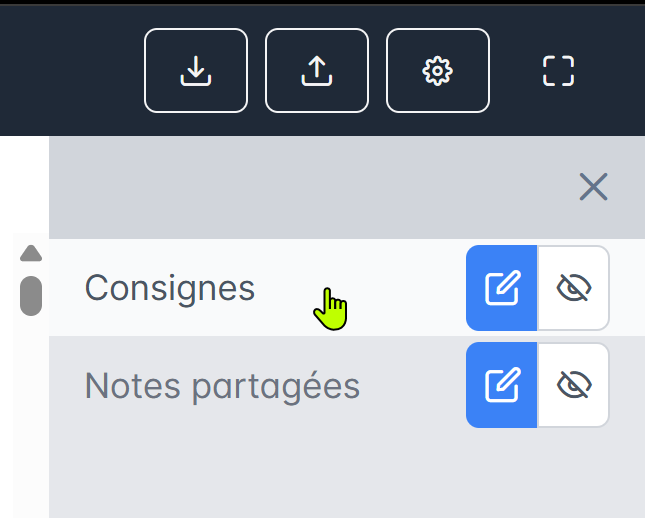
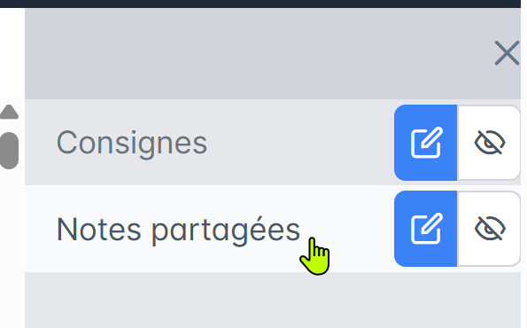
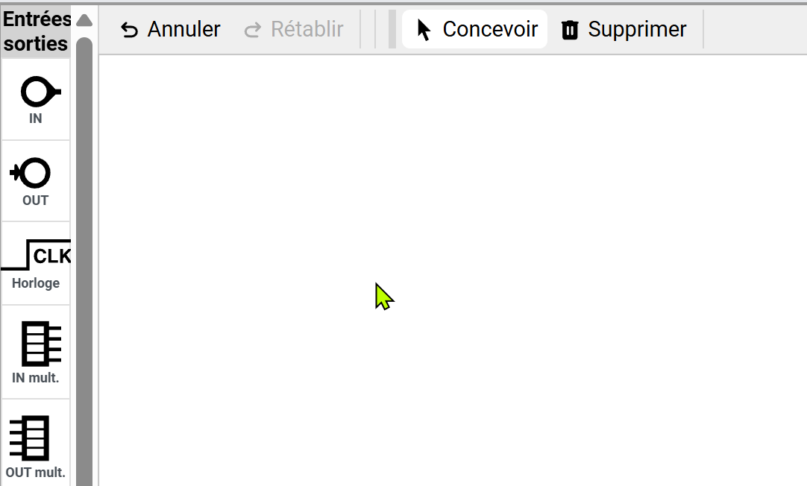
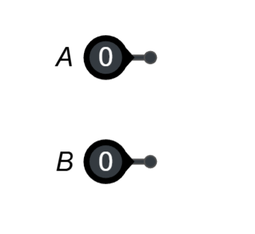
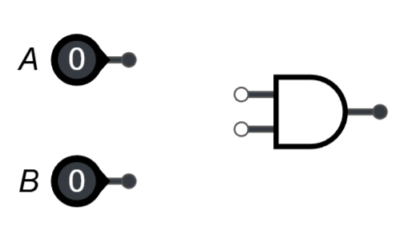
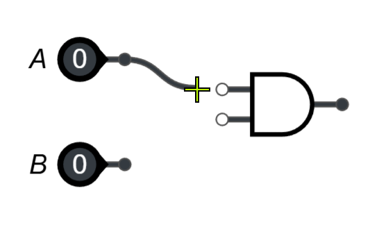
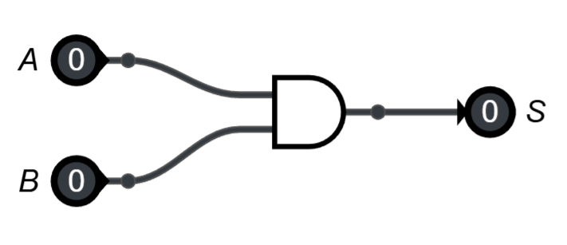
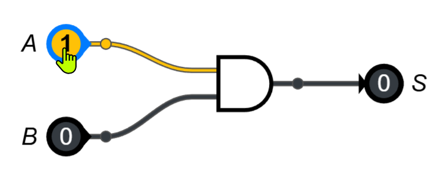
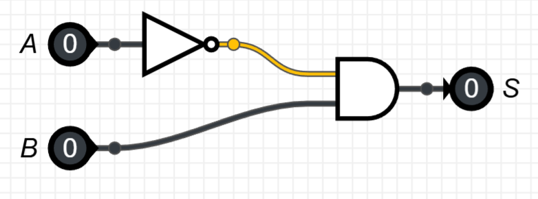

# 🧭 **FICHE MÉTHODE – Créer et tester un circuit logique sur Capytale**

## 🎯 **Objectifs**

1. Savoir utiliser l’interface de Capytale pour réaliser un circuit logique.
2. Savoir insérer les portes logiques, relier les entrées et les sorties.
3. Savoir lire un schéma logique pour écrire l’**expression booléenne** de la sortie S.
4. Savoir compléter une **table de vérité**.

---

# 1️⃣ **Présentation rapide de l’interface Capytale**

Lorsque vous ouvrez l’activité, vous avez deux zones importantes :

### ✔ **A. La zone “Consignes”**

Elle contient les exercices à faire (ex: réaliser un circuit, donner S, compléter la table…).

### ✔ **B. La zone “Notes partagées”**

👉 **C’EST ICI QUE VOUS RÉPONDEZ**
(texte : expression booléenne, table de vérité, explications)

### ✔ **C. La zone de dessin du circuit**

En bas de l’écran :

* À gauche : **les entrées**, **sorties**, et **portes logiques**.
* Au centre : **la feuille blanche** où vous construisez le circuit.
* En haut : les boutons *Annuler*, *Concevoir*, *Supprimer*.

🎯 **C’est ici que vous construisez le circuit pour répondre à la question n°1.**

---

# 2️⃣ **Créer un circuit logique pas à pas**

## Étape 1 – Ajouter les entrées

Dans la barre de gauche → section **Entrées / sorties**

1. Cliquez sur **“Entrée”**
2. Faites glisser **deux entrées** dans la zone blanche
3. Renommez-les si besoin : clic sur le nom → tapez **A** et **B**

---

## Étape 2 – Ajouter les portes logiques

Dans la barre de gauche → section **Portes**
Choisissez la porte dont vous avez besoin :

* **ET** → symbole "∧"
* **OU** → symbole "≥1"
* **NON** → triangle + rond
* **OU exclusif (XOR)** → =1
* etc.

👉 Faites glisser chaque porte dans votre zone de travail comme un Lego.

---

## Étape 3 – Relier les éléments

* Cliquez sur une patte (petit carré) → un fil apparaît.
* Cliquez sur la patte de la porte ou entrée à connecter → le fil se colle.
* Recommencez jusqu'à terminer le circuit.

💡 *Astuce* : si un fil est mauvais → clic droit → *supprimer*.

---

## Étape 4 – Ajouter la sortie

Dans **Entrées / sorties**, cliquez sur **Sortie** et placez-la à droite.
Renommez-la **S**.

---

## Étape 5 – Tester le circuit

* Changez les valeurs de A et B (0 ou 1)
* Vérifiez que S donne le bon résultat
* Reportez ces valeurs dans la **table de vérité** dans les Notes partagées.

---

# 3️⃣ **Rappel : écrire l’expression booléenne de S**

Pour un schéma logique, on écrit la sortie S avec les opérateurs suivants :

| Porte       | Symbole logique | 
| ----------- | --------------- | 
| NON         |  NOT(A)    | 
| ET          |  A . B    | 
| OU          |  A + B          | 
| OU exclusif | A ⊕ B           | 

👉 **S = expression de la dernière porte**
On part de la droite et on remonte pour voir quelles portes la fabriquent.

### Exemple :

Si le schéma montre :

* une porte NON sur A
* puis une porte ET entre (NON A) et B

Alors :

➡️ **S = NOT(A) . B**

---

# 4️⃣ **Compléter une table de vérité**

On liste toutes les combinaisons possibles de A et B :

| A | B | S |
| - | - | - |
| 0 | 0 | ? |
| 0 | 1 | ? |
| 1 | 0 | ? |
| 1 | 1 | ? |

Pour remplir S :

* soit vous utilisez votre circuit en **Test**
* soit vous appliquez l’expression booléenne trouvée

---

