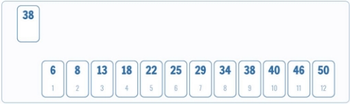
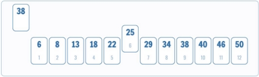
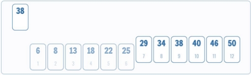
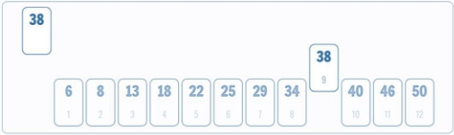
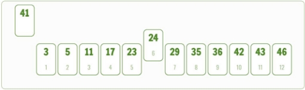
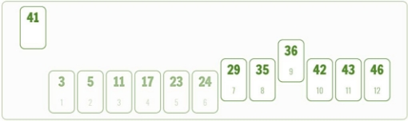
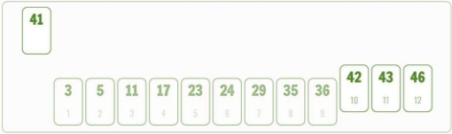
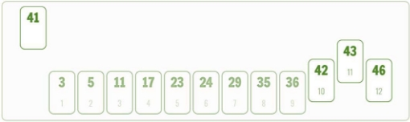
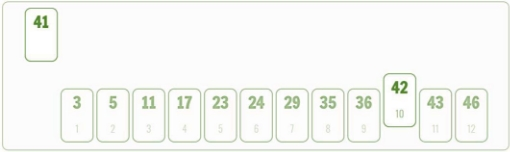

---
author: ELP
title: 06c La recherche dichotomique
---

**Table des matières**

1. [Introduction](#_page0_x40.00_y275.92)
2. [TP](#_page0_x40.00_y599.92)
3. [Le pseudo-code (version itérative)](#_page4_x40.00_y332.92)
4. [Complexité](#_page4_x40.00_y600.92)
5. [Preuve de correction](#_page5_x40.00_y211.92)
6. [Implémentation en Python](#_page6_x40.00_y408.92)
7. [Exercices](#_page7_x40.00_y407.92)

## <H2 STYLE="COLOR:BLUE;">1. Introduction<a name="_page0_x40.00_y275.92"></a></H2>

Les algorithmes de la famille **"Diviser pour régner"** suivent une stratégie qui consiste à :

1️⃣ **Diviser** : Découper le problème en plusieurs sous-problèmes plus petits.

2️⃣ **Régner** : Résoudre chaque sous-problème, soit récursivement, soit directement si celui-ci est suffisamment simple.  

3️⃣ **Combiner** : Fusionner les solutions des sous-problèmes pour obtenir la solution du problème initial.  

✨ Pourquoi utiliser cette approche ?

✅ Elle permet souvent d’obtenir **des algorithmes très efficaces** (faible complexité).  

✅ Elle s’applique à **de nombreux problèmes** comme la recherche dichotomique ou le tri fusion.  

✅ Elle est utilisée dans des **applications modernes**, comme la compression d’images, l’intelligence artificielle et le traitement des grandes quantités de données.

🎯 **Exemples d’algorithmes utilisant "Diviser pour régner"** : 

🔹 **Tri fusion** et **tri rapide** pour le tri de grandes listes.  

🔹 **Recherche dichotomique** pour trouver efficacement un élément dans un tableau trié.  

🔹 **Algorithme d’Euclide** pour trouver le plus grand commun diviseur (PGCD).  

🔎 **Illustration** :


💡 **Fait historique** :  

- La **recherche dichotomique** a été formalisée en 1946 par **John Mauchly**, mais son principe remonte à **Babylone (-220 av. J.-C.)**.  

- **John von Neumann** a inventé le **tri fusion** en 1945.  

- L’algorithme d’**Euclide**, découvert en **-300 av. J.-C.**, peut être vu comme un exemple d’algorithme **Diviser pour régner**.


## <H2 STYLE="COLOR:BLUE;">2. TP<a name="_page0_x40.00_y599.92"></a></H2>

L'idée de base est simple :

- On dispose d'un tableau trié de valeurs, et on cherche à déterminer si une valeur v est présente dans le tableau.
- Pour cela, on procède par *dichotomie* :

### <H3 STYLE="COLOR:GREEN;">2.1. Méthode<a name="_page1_x40.00_y36.92"></a> visuelle : La valeur se trouve dans le tableau</H3>









### <H3 STYLE="COLOR:GREEN;">2.2. Méthode<a name="_page1_x40.00_y518.92"></a> visuelle : La valeur ne se trouve pas dans le tableau</H3>












Animation : [https://www.infoforall.fr/art/algo/animation-de-la-recherche-dichotomique/](https://www.infoforall.fr/art/algo/animation-de-la-recherche-dichotomique/)

### <H3 STYLE="COLOR:GREEN;">2.2. Application<a name="_page2_x40.00_y511.92"></a> de l’algorithme à un exemple</H3>

🔍 **Problème**
Imaginons que nous avons une liste triée de nombres et que nous devons **trouver rapidement** la position d’un nombre donné.

**Exemple** : Nous avons la liste suivante triée et cherchons la position de **35**.

```
[ 2, 7, 15, 22, 29, 33, 35, 40, 47, 50, 55, 60, 67, 72, 80, 91 ]
```

💡 **Idée** : Plutôt que de parcourir toute la liste un élément après l’autre (**O(n)**), nous allons exploiter le fait qu’elle est triée pour diviser le problème en **deux moitiés** à chaque étape.


📌 **Étape 1 : Définition des bornes**

On commence avec :

- **Indice bas** = 0

- **Indice haut** = 15

- **Indice milieu** = (0 + 15) // 2 = **7**

- Valeur au **milieu** = 40 ❌ (trop grand)

💡 **Le nombre 35 est plus petit que 40** 👉 Nous cherchons **dans la moitié gauche**.


 📌 **Étape 2 : Nouvelle division**

On ajuste les indices :

- **Nouvel Indice bas** = 0

- **Nouvel Indice haut** = **6**

- **Nouvel Indice milieu** = (0 + 6) // 2 = **3**

- Valeur au **milieu** = 22 ❌ (trop petit)

💡 **Le nombre 35 est plus grand que 22** 👉 Nous cherchons **dans la moitié droite**.


 📌 **Étape 3 : Réduction de l’espace de recherche**

On ajuste les indices :

- **Nouvel Indice bas** = **4**

- **Nouvel Indice haut** = **6**

- **Nouvel Indice milieu** = (4 + 6) // 2 = **5**

- Valeur au **milieu** = 33 ❌ (trop petit)

💡 **Le nombre 35 est plus grand que 33** 👉 Nous cherchons **dans la moitié droite**.

 📌 **Étape 4 : Trouvé !**

- **Nouvel Indice bas** = **6**

- **Nouvel Indice haut** = **6**

- **Nouvel Indice milieu** = **6**

- Valeur au **milieu** = ✅ **35** 🎉

**Le nombre 35 se trouve à l’indice 6 !**  

🎯 **Résultat final :** Nombre trouvé en **4 étapes seulement**, au lieu de **16** avec une recherche classique !


## <H2 STYLE="COLOR:BLUE;">3. Le<a name="_page4_x40.00_y332.92"></a> pseudo-code (version itérative)</H2>

```
ALGORITHME recherche_dichotomique
    PROCEDURE recherche_dichotomique(x, tableau)
        gauche ← 0
        droite ← taille du tableau - 1
        TANT QUE gauche <= droite FAIRE
            milieu ← (gauche + droite) // 2   # on cherche l'élément central
            SI T[milieu] < x ALORS
                gauche = milieu + 1  # Cherche à droite
            SINON SI T[milieu] > x ALORS
                droite = milieu - 1  # Cherche à gauche
            SINON
                renvoyer milieu  # On a trouvé l'élément iy True selon l'énoncé
        FIN TANT QUE
        renvoyer None  # L'élément n'est pas présent ou False selon l'énoncé
```

## <H2 STYLE="COLOR:BLUE;">4. Complexité<a name="_page4_x40.00_y600.92"></a></H2>


🔹 À **chaque itération**, on divise la taille du problème par **2**. 

🔹 On cherche donc **combien de fois** on peut diviser **n** par **2** avant d’atteindre **1 élément**.

📌 **Formule mathématique** :  
$n = 2^a$  
$a = log_2(n)$ 

Autrement dit, combien de fois faut-il diviser n par 2 pour obtenir 1?

Mathématiquement cela se traduit par l'équation  $\frac {n }{ 2^a}  =1$ avec a le nombre de fois qu'il faut diviser n par 2 pour obtenir 1. Il faut donc trouver a.


$\frac {n }{ 2^a}  =1$

n = 2<sup>a</sup>

log<sub>2</sub>(n) = log<sub>2</sub>(2<sup>a</sup>)

log<sub>2</sub>(n) = a

nous avons donc  a = log<sub>2</sub>(n)


🎯 **Complexité de l’algorithme** : **O(log₂(n))**  

🔹 **Beaucoup plus rapide** qu’une recherche séquentielle **O(n)** !  

## <H2 STYLE="COLOR:BLUE;">5. Preuve<a name="_page5_x40.00_y211.92"></a> de correction</H2>

### <H3 STYLE="COLOR:GREEN;">5.1. Correction partielle</H3>

**Invariant** : Avant chaque itération, si la cible **x** est présente, alors elle se trouve entre les indices `gauche` et `droite`.

✔ **Initialisation** :

- Au départ, `gauche = 0` et `droite = len(T) - 1`, donc **toute la liste est prise en compte**.

- Si **x est présent**, il est forcément dans cet intervalle.

✔ **Maintien** :  

À chaque étape, on compare `T[milieu]` à **x** :

  - Si `T[milieu] == x`, on a trouvé **x** et on le retourne.

  - Si `T[milieu] < x`, **x** est forcément à droite, donc on met `gauche = milieu + 1`.

  - Si `T[milieu] > x`, **x** est forcément à gauche, donc on met `droite = milieu - 1`.

L'invariant est **conservé** car on réduit toujours la recherche **sans exclure x**.

✔ **Terminaison** :  

- La boucle s’arrête quand `gauche > droite`.  

- Si **x** n’a pas été trouvé avant, c'est qu'il **n'est pas dans la liste**.

✅ **Conclusion** : L'algorithme **renvoie bien l'indice correct si x est présent** et **None sinon**.


### <H3 STYLE="COLOR:GREEN;">5.2. Correction Totale</H3>

📌 **Pourquoi l’algorithme termine toujours ?** 

Il faut montrer que la boucle **while** ne tourne pas indéfiniment.

✔ **Définition du variant** :  

Le **variant** est la longueur de l’intervalle `droite - gauche`, qui représente la zone de recherche.

✔ **Diminution stricte**  

À chaque itération :

  - Si `T[milieu] < x`, alors `gauche = milieu + 1` ⬅ Réduction de l'intervalle.

  - Si `T[milieu] > x`, alors `droite = milieu - 1` ⬅ Réduction de l'intervalle.

Dans **tous les cas**, `droite - gauche` **diminue strictement**.

✔ **Borne inférieure** : 

- `droite - gauche` est toujours positif ou nul.

- Quand `gauche > droite`, la boucle s'arrête.

✅ **Conclusion** :  

L’algorithme **ne peut pas entrer dans une boucle infinie** et **s'arrête toujours après au plus** **O(log₂(n))** **itérations**.


## <H2 STYLE="COLOR:BLUE;">6. Implémentation<a name="_page6_x40.00_y408.92"></a> en Python</H2>

=> CAPYTALE Le code vous sera donné par votre enseignant

???+ question "Activité n°1 :" 

    Complétez l’algorithme de recherche dichotomique

    ```python
    def recherche_dichotomique(T, x):
        """
        Recherche l'indice d'un élément x dans une liste triée T
        :param T: liste triée d'entiers
        :param x: élément recherché
        :return: indice de x ou None si absent
        """
        # à compléter

    # Exemple d'utilisation
    tableau = [2, 7, 15, 22, 29, 33, 35, 40, 47, 50]
    print(recherche_dichotomique(tableau, 35))  # Affiche 6
    print(recherche_dichotomique(tableau, 100))  # Affiche None
    ```


???+ question "Activité n°2.: Observation de durées"

    On peut mesurer les durées pour trouver une valeur dans un tableau déjà trié. Comme les temps d’exécution sont très faibles, et que la fonction time est peu précise il faut avoir recours à la fonction magique %timeit de iPython. Voilà un exemple de script pour mesurer les durées sur des tableaux de longueurs différentes :

    ```python
    # construction d'un tableau par compréhension
    import random
    t1 = [random.randint(1,100_000_000) for _ in range(10_000)]
    t1.sort()

    t2 = [random.randint(1,100_000_000) for _ in range(100_000)]
    t2.sort()

    t3 = [random.randint(1,100_000_000) for _ in range(1_000_000)]
    t3.sort()

    t4 = [random.randint(1,100_000_000) for _ in range(2_000_000)]
    t4.sort()

    t5 = [random.randint(1,100_000_000) for _ in range(4_000_000)]
    t5.sort()
    ```

    Observer et commenter

    ```
    %timeit rechercheDichotomique(t1, 0)
    2.69 µs ± 144 ns per loop (mean ± std. dev. of 7 runs, 100000 loops each)

    %timeit rechercheDichotomique(t2, 0)
    2.9 µs ± 105 ns per loop (mean ± std. dev. of 7 runs, 100000 loops each)

    %timeit rechercheDichotomique(t3, 0)
    4.02 µs ± 425 ns per loop (mean ± std. dev. of 7 runs, 100000 loops each)

    %timeit rechercheDichotomique(t4, 0)
    4.37 µs ± 457 ns per loop (mean ± std. dev. of 7 runs, 100000 loops each)

    %timeit rechercheDichotomique(t5, 0)
    4.64 µs ± 256 ns per loop (mean ± std. dev. of 7 runs, 100000 loops each)
    ```

## <H2 STYLE="COLOR:BLUE;">7. Exercices<a name="_page7_x40.00_y407.92"></a></H2>

=> CAPYTALE Le code vous sera donné par votre enseignant

!!! abstract "Exercice 1 : Recherche d’un maximum dans une liste de n éléments :" 

    1. Ecrire l’algorithme en pseudo – code
    2. Calculer la complexité de cet algorithme
    3. L’implémenter en Python
    4. Modifier le programme pour créer une fonction ```maximum(T :list) -> int```
    5. Tester la fonction avec une liste aléatoire de 20 valeurs

!!! abstract "Exercice 2 : Recherche de la moyenne des éléments d’une liste de n éléments:"

    1. Ecrire l’algorithme en pseudo – code
    2. Calculer la complexité de cet algorithme
    3. L’implémenter en Python
    4. Modifier le programme pour créer une fonction ```moyenne(T :list) -> int```
    5. Tester la fonction avec une liste aléatoire de 20 valeurs

!!! abstract "Exercice 3 : Recherche en table"

    Si on utilisait une méthode séquentielle pour chercher un nom dans un annuaire, on ouvrirait celui-ci à la première page et on comparerait le nom recherché au premier nom de l’annuaire, puis au deuxième, puis au troisième, etc., jusqu’à trouver le nom recherché, ou arriver au dernier nom de l’annuaire. Un annuaire contenant 30.000 noms et une comparaison prenant 100 ms, il faudrait, dans le pire des cas, 3.000 secondes, soit 50 minutes, pour trouver le nom recherché ou se convaincre qu’il n’appartient pas à l‘annuaire.

    Bien entendu, ce n’est pas ainsi que l’on procède : on ouvre l‘annuaire au milieu, on compare le nom recherché au nom médian. Si le nom recherché est avant le nom médian dans l’ordre alphabétique, on élimine la seconde moitié de l’annuaire, sans même la regarder ; s’il est après le nom médian, on élimine la première moitié. En recommençant avec le demi-annuaire restant, on élimine ensuite un demi-demi-annuaire et on continue jusqu’à trouver le nom en question ou obtenir l’ensemble vide.

    1. Compléter le tableau ci-dessous pour rechercher un nom dans un annuaire de 30.000 noms :

    |**Comparaison** |**Ensemble de recherche (mots)** |
    | - | - |
    |1 |15\.000 |
    |2 |7\.500 |
    |... |... |

    2. En déduire le temps de recherche dans le pire des cas et conclure.

    On appelle logarithme à base 2, log<sub>2</sub>(x) d’un nombre x ≥ 1, le nombre de fois qu’il faut le diviser x par 2 pour obtenir un nombre inférieur ou égal à 1.

    Sur la calculatrice, log<sub>2</sub>(x) = $\frac{ln(x)}{ln(2)}$

    3. A partir du logarithme à base 2, retrouver le résultat obtenu à la question 1.
    4. Calculer le temps nécessaire pour rechercher un nom dans l’annuaire français pour n = 60 millions d’entrées.