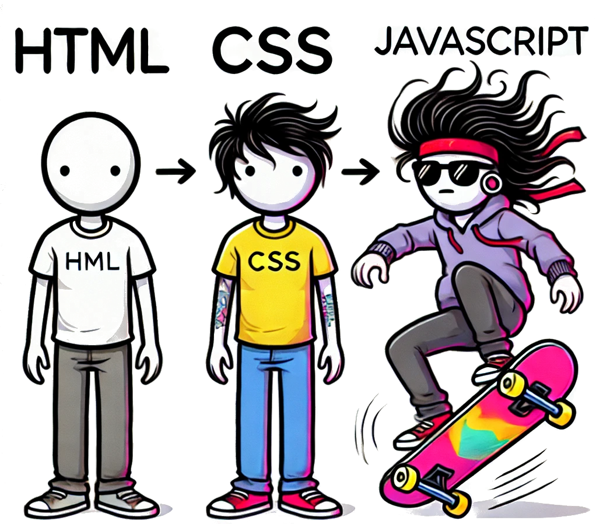
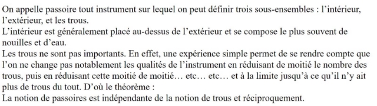
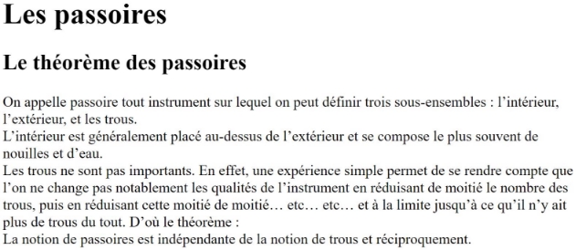
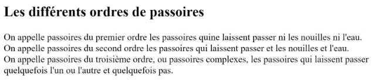
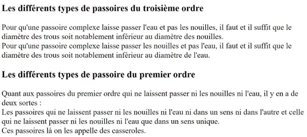
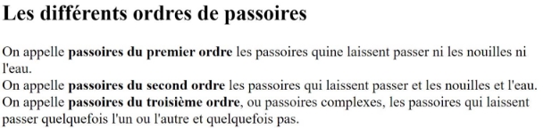
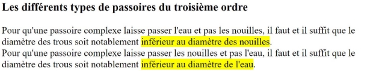
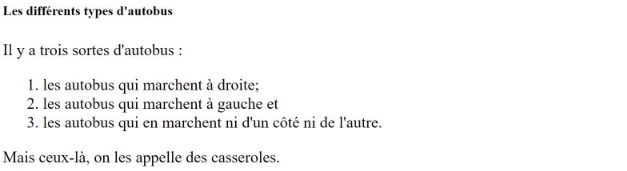
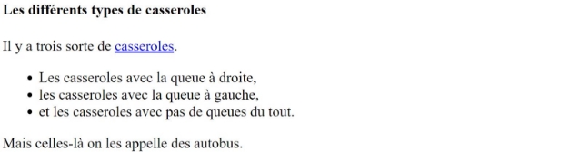
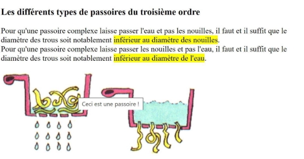

**Table des matières** 

1. [Historique](#_page0_x40.00_y600.92)
2. [Le fonctionnement des sites web](#_page1_x40.00_y237.92)
3. [Le langage HTML5](#_page2_x40.00_y48.92)
4. [L’organisation d’une page HTML5](#_page3_x40.00_y117.92)
5. [Insérer une image](#_page9_x40.00_y607.92)


## **<H2 STYLE="COLOR:BLUE;">1. Historique**<a name="_page0_x40.00_y600.92"></a></H2>

🔎 **Vidéo explicative**  
🎥 [Regarder l'historique du Web](https://ladigitale.dev/digiview/#/v/6690fec0420aa)

Le **World Wide Web** (souvent appelé **Web**) a été développé en **1991** au **CERN** (Conseil Européen pour la Recherche Nucléaire) par :

- **Tim Berners-Lee** 🇬🇧 (informaticien britannique)

- **Robert Cailliau** 🇧🇪 (ingénieur belge)

💡 **Pourquoi ?**  

➡ À cette époque, les chercheurs étaient déjà connectés entre eux, mais **l'échange d’informations était compliqué**.  

➡ Tim Berners-Lee invente alors le **système hypertexte**, qui permet de cliquer sur des **hyperliens** (mots soulignés en bleu) pour passer d’un document à un autre.

📌 **Première page web**  

Le tout premier site Web est encore visible ici :  
🔗 [http://info.cern.ch/hypertext/WWW/TheProject.html](http://info.cern.ch/hypertext/WWW/TheProject.html)

📌 **Le premier navigateur Web**  

Il s’appelait **"WorldWideWeb"**, développé par Tim Berners-Lee lui-même.

📌 **Le Web repose sur trois technologies principales** :

1. **Le protocole HTTP** (HyperText Transfer Protocol)  

2. **Les URL** (Uniform Resource Locator)  

3. **Le langage HTML** (HyperText Markup Language)

> ❗ **Attention !** Le Web et Internet sont **deux choses différentes** :  

> - **Internet** est un **réseau mondial** reliant des millions d’ordinateurs.  

> - **Le Web** est **un service** qui repose sur Internet, utilisant **HTTP, URL et HTML**.

Tim Berners-Lee est donc **l’inventeur du Web**, mais **pas d’Internet**.


## **<H2 STYLE="COLOR:BLUE;">2. Le<a name="_page1_x40.00_y237.92"></a> fonctionnement des sites web**</H2>
### **<H3 STYLE="COLOR:GREEN;">2.1. Les<a name="_page1_x40.00_y259.92"></a> navigateurs utilisés** 🔎</H3>

Un site web est **affiché** grâce à un **navigateur web**.  
Les plus connus sont :

- **Google Chrome**

- **Mozilla Firefox**

- **Microsoft Edge**

- **Safari**

💡 **Pourquoi tester son site sur plusieurs navigateurs ?**  

➡ Tous les navigateurs **n’interprètent pas** les sites **de la même manière**.  

➡ Il faut s’assurer que le site fonctionne partout !

> **Outil utile** : 🔗 [Can I Use](https://caniuse.com/)  

> Ce site permet de vérifier si une fonctionnalité **HTML, CSS ou JavaScript** est compatible avec chaque navigateur.


### **<H3 STYLE="COLOR:GREEN;">2.2. Les<a name="_page1_x40.00_y340.92"></a> langages** 🔎</H3>

Un site web est **construit avec trois langages** principaux :

| Langage | Rôle |
|---------|------|
| **HTML** (*HyperText Markup Language*) | Structure le contenu (titres, textes, images, liens…) |
| **CSS** (*Cascading Style Sheets*) | Met en forme (couleurs, marges, disposition…) |
| **JavaScript** | Ajoute des fonctionnalités dynamiques (effets visuels, formulaires interactifs…) |

📌 **Résumé** :  

✅ **HTML** → Structure le contenu 

✅ **CSS** → Définit l’apparence  

✅ **JavaScript** → Ajoute de l’interactivité

{ width=400px .center }


### **<H3 STYLE="COLOR:GREEN;">2.3. Les<a name="_page1_x40.00_y687.92"></a> éditeurs et les logiciels conseillés** 🔎</H3>

💻 **Logiciels à utiliser en cours** :

- **Capytale** → Pour réaliser des exercices et tester du code.

- **Visual Studio Code** (VS Code) → Un éditeur de code professionnel, gratuit et puissant.

Autres outils pratiques :

- **CodePen**, **JSFiddle**, **Glitch** → Pour tester rapidement du HTML/CSS.

📌 **Bonnes pratiques** :

✔ Installer **plusieurs navigateurs** pour tester un site.  

✔ Vérifier la compatibilité avec 🔗 [Can I Use](https://caniuse.com/).  


## **<H2 STYLE="COLOR:BLUE;">3. Le<a name="_page2_x40.00_y48.92"></a> langage HTML5**</H2>
### **<H3 STYLE="COLOR:GREEN;">3.1. Page<a name="_page2_x40.00_y70.92"></a> web en HTML** 🔎</H3>

**=> CAPYTALE Le code vous sera donné par votre enseignant**

**<p STYLE="COLOR:red;">=> seules les activités sont à faire sur Capytale (pas les exemples)</p>**

???+ question "Activité n°1. :"

    ✅ Ouvrir **Capytale** et saisir ce code HTML minimal :

    ```html
    <!DOCTYPE html>
    <html>
    <head>
        <meta charset="utf-8">
        <title>Ma première page HTML</title>
    </head>
    <body>
        <p>Bonjour, voici ma première page web !</p>
    </body>
    </html>
    ```
    ➡ **Oserver le résultat.


### **<H3 STYLE="COLOR:GREEN;">3.2. Les<a name="_page2_x40.00_y155.92"></a> balises**</H3>

Un fichier **HTML** est composé de **balises** qui définissent les éléments de la page.

📌 **Types de balises :**

| Type de balise | Exemple | Description |
|---------------|---------|-------------|
| **Balises en paires** | `<p> ... </p>` | Début (`<p>`) et fin (`</p>`) |
| **Balises orphelines** | `<br>` `` | Pas besoin de balise fermante |

**Exemple de balise en paire :**
```html
<p>Ceci est un paragraphe.</p>
```

**Exemple de balise orpheline :**
```html

<br> <!-- Saut de ligne -->
```


### **<H3 STYLE="COLOR:GREEN;">3.3. Les<a name="_page2_x40.00_y290.92"></a> attributs** 🔎</H3>

Les **attributs** ajoutent des informations aux balises.

Exemples :
```html
<a href="https://example.com">Un lien</a>

```

📌 **Explication des attributs** :

| Attribut | Rôle |
|----------|------|
| `href="..."` | Définit le lien d’une balise `<a>` |
| `src="..."` | Définit l’image affichée avec `` |
| `alt="..."` | Texte alternatif si l’image ne s’affiche pas |

Si l'image ne s'affiche pas, le texte contenu dans le alt apparaîtra. 
C'est essentiel pour les personne malvoyantes qui auront mis en route l'option lecture à haute voix de la page. 

### **<H3 STYLE="COLOR:GREEN;">3.4. Structure<a name="_page2_x40.00_y347.92"></a> de base d’une page HTML5**</H3>

???+ question "Activité n°2. :"

    ✅ Recopier ce code et l’afficher dans le navigateur :

    ```html
    <!DOCTYPE html>
    <html>
        <head>
            <meta charset="utf-8">
            <title>Première page HTML</title>
        </head>
        <body>
            <h1>Bonjour tout le monde</h1>
            <p>Ceci est ma première page HTML.</p>
        </body>
    </html>
    ```

📌 **Explication du code** :

| Élément | Rôle |
|---------|------|
| `<!DOCTYPE html>` | Indique qu’on utilise HTML5 |
| `<html>` | Contient toute la page |
| `<head>` | Métadonnées (titre, encodage…) |
| `<meta charset="utf-8">` | Gère les accents et caractères spéciaux |
| `<title>` | Titre affiché dans l’onglet du navigateur |
| `<body>` | Contenu visible de la page |
| `<h1>` | Titre principal |
| `<p>` | Paragraphe de texte |


📝 Bonnes pratiques :

- Toujours bien indenter le code pour le rendre lisible (non obligatoire mais recommandé).

- Utiliser des commentaires pour expliquer le code :
```html
<!-- Ceci est un commentaire en HTML -->
```


## **<H2 STYLE="COLOR:BLUE;">4. L’organisation<a name="_page3_x40.00_y117.92"></a> d’une page HTML5** </H2>
### **<H3 STYLE="COLOR:GREEN;">4.1. Les<a name="_page3_x40.00_y139.92"></a> paragraphes** 🔎</H3>

En **HTML**, le texte est généralement structuré sous forme de **paragraphes** à l'aide de la balise `<p>`.  

📌 **Règle importante :**  

✔️ **Un paragraphe doit toujours être inclus dans `<body>`**.  


???+ question "Activité n°3. :"
    
    Créer un paragraphe simple.

    ```html
    <!DOCTYPE html>
    <html>
        <head>
            <meta charset="utf-8">
            <title>Les passoires</title>
        </head>
        <body>
            <p>Bonjour et bienvenue sur ma page.</p>   
        </body>
    </html>
    ```

<p STYLE="COLOR:red;">📌 Attention à partir de cette activité on ne va modifier QUE le body!! </p>

???+ question "Activité n°4. :"

    Je voudrais écrire le texte suivant exactement avec la même mise en page ci-dessous à la place de « Bonjour et bienvenue sur ma page ». **À vous de jouer !!**
    ```html
    <body>
        <p>
            On appelle passoire tout instrument sur lequel on peut définir trois sous-ensembles : l’intérieur, l’extérieur, et les trous.
            L’intérieur est généralement placé au-dessus de l’extérieur et se compose le plus souvent de nouilles et d’eau.
            Les trous ne sont pas importants. En effet, une expérience simple permet de se rendre compte que l’on ne change pas notablement les qualités de l’instrument en réduisant de moitié le nombre des trous, puis en réduisant cette moitié de moitié… etc… etc… et à la limite jusqu’à ce qu’il n’y ait plus de trous du tout. D’où le théorème :
            La notion de passoires est indépendante de la notion de trous et réciproquement.
        </p>
    </body>
    ```
    
📝 Conseil : Indentez bien votre code pour qu’il soit lisible et compréhensible !

### **<H3 STYLE="COLOR:GREEN;">4.2. La<a name="_page3_x40.00_y481.92"></a> balise retour à la ligne `<br>`** 🔎</H3>

En **HTML**, les **retours à la ligne ne sont pas pris en compte automatiquement**. 

➡️ Il faut utiliser la **balise orpheline** `<br>` pour forcer un saut de ligne.

???+ question "Activité n°5. :" 
    
    Modifier l’activité précédente pour **garder la mise en page** avec `<br>`.

    


### **<H3 STYLE="COLOR:GREEN;">4.3. Les<a name="_page3_x40.00_y702.92"></a> titres** 🔎</H3>

HTML propose **6 niveaux de titres**, du plus important (`<h1>`) au moins important (`<h6>`).  

| Balise | Niveau |
|--------|--------|
| `<h1>` | Titre principal |
| `<h2>` | Sous-titre |
| `<h3>` | Sous-sous-titre |
| …      | … |
| `<h6>` | Niveau le plus bas |


???+ question "Activité n°6. :" 

    Ajouter un titre à l’application précédente : Les passoires Puis un sous-titre : Le théorème des passoires,

    Ainsi, on aura :

    

???+ question "Activité n°7. :" 

    Ajouter un autre paragraphe à la suite dont voici le texte :

    ```
    Les différents ordres de passoires
    On appelle passoires du premier ordre les passoires qui ne laissent passer ni les nouilles ni l'eau. 
    On appelle passoires du second ordre les passoires qui laissent passer et les nouilles et l'eau.
    On appelle passoires du troisième ordre, ou passoires complexes, les passoires qui laissent passer quelquefois l'un ou l'autre et quelquefois pas.   
    ```

    Ajouter les bonnes balises pour observer cela sur le navigateur.

    


???+ question "Activité n°8. :" 

    Ajouter des titres d’ordre inférieurs et des paragraphes correspondants, dont voici le texte :

    ```
    Les différents types de passoires du troisième ordre
    Pour qu'une passoire complexe laisse passer l'eau et pas les nouilles, il faut et il suffit que le diamètre des trous soit notablement inférieur au diamètre des nouilles.
    Pour qu'une passoire complexe laisse passer les nouilles et pas l'eau, il faut et il suffit que le diamètre des trous soit notablement inférieur au diamètre de l'eau.
    Les différents types de passoire du premier ordre
    Quant aux passoires du premier ordre qui ne laissent passer ni les nouilles ni l'eau, il y en a de deux sortes : 
    Les passoires qui ne laissent passer ni les nouilles ni l'eau ni dans un sens ni dans l'autre et celles qui ne laissent passer ni les nouilles ni l'eau que dans un sens unique. 
    Ces passoires là on les appelle des casseroles.
    ```

    Ajouter les bonnes balises pour observer cela sur le navigateur.

    

???+ question "Activité n°9. :" 

    Ajouter des titres d’ordre inférieurs et des paragraphes correspondants, dont voici le texte :

    ```
    Les différents types de casseroles
    Il y a trois sortes de casseroles. Les casseroles avec la queue à droite, les casseroles avec la queue à gauche, et les casseroles avec pas de queues du tout. Mais celles-là on les appelle des autobus.
    Les différents types d'autobus
    Il y a trois sortes d'autobus : les autobus qui marchent à droite ; les autobus qui marchent à gauche et les autobus qui ne marchent ni d'un côté ni de l'autre. Mais ceux-là, on les appelle des casseroles.
    ```

    

### **<H3 STYLE="COLOR:GREEN;">4.4. Mettre<a name="_page5_x40.00_y676.92"></a> en valeur** 🔎</H3>

En HTML, on peut **mettre en valeur du texte** de différentes manières :  

| Balise | Effet |
|--------|------|
| `<em>` | Italique (mise en valeur légère) |
| `<strong>` | Gras (mise en valeur forte) |
| `<mark>` | Surligné |


???+ question "Activité n°10. :" 

    utiliser les balises précédentes pour le mot passoire et théorème du premier paragraphe.

    


???+ question "Activité 11. :"

    Utiliser les balises précédentes pour les mots ci-dessous du deuxième paragraphe.

    


???+ question "Activité n°12. :" 

    Utiliser les balises précédentes pour les mots ci-dessous du troisième paragraphe.

    

**Pourquoi structurer correctement son HTML ?**  

L'utilisation correcte des balises (`<h1>`, `<p>`, `<strong>`, etc.) est essentielle pour : 

✅ **La lisibilité** du code. 

✅ **Le référencement** (SEO) : Google repère les titres et le texte important.  

✅ **L’accessibilité** : les logiciels de lecture d’écran comprennent mieux le contenu.  


### **<H3 STYLE="COLOR:GREEN;">4.5. Les<a name="_page7_x40.00_y36.92"></a> listes** 🔎</H3>

En HTML, il existe **deux types de listes** :  

#### <H4 STYLE="COLOR:MAGENTA;">4.5.1. Les listes non ordonnées (listes à puces) </h4> 

Les listes **non ordonnées** sont des listes où l’ordre des éléments n’a pas d’importance.  

Pour les créer, on utilise :  

- `<ul>` (unordered list) pour **délimiter** la liste. 

- `<li>` (list item) pour chaque **élément** de la liste. 

**Exemple :**  
```html
<ul>
    <li>Fraises</li>
    <li>Framboises</li>
    <li>Cerises</li>
</ul>
```

???+ question "Activité n°13. :" 

    Utiliser les balises précédentes pour les mots ci-dessous du cinquième paragraphe.

    


#### **<H4 STYLE="COLOR:MAGENTA;">4.5.2. Les listes ordonnées (listes numérotées)** </h4>

Les listes **ordonnées** sont des listes **numérotées** où l’ordre des éléments a de l’importance.  

Pour les créer, on remplace `<ul>` par `<ol>` (ordered list).  

**Exemple :**  
```html
<ol>
    <li>Fraises</li>
    <li>Framboises</li>
    <li>Cerises</li>
</ol>
```

???+ question "Activité n°14. :" 

    Utiliser les balises précédentes pour les mots ci-dessous du dernier paragraphe.

    

### **<H3 STYLE="COLOR:GREEN;">4.6. Les<a name="_page7_x40.00_y697.92"></a> liens hypertexte** 🔎</H3>

Les **liens hypertexte** permettent de naviguer sur le web.  
On les crée avec la balise `<a>` et l’attribut `href`. 

#### **<H4 STYLE="COLOR:MAGENTA;">4.6.1. Les<a name="_page7_x40.00_y717.92"></a> liens absolus**</H4>

Un **lien absolu** mène vers une adresse **externe**, c’est-à-dire vers un autre site web.  

**Exemple :**  
```html
<a href="https://fr.wikipedia.org/wiki/Passoire">Passoire</a>
```

???+ question "Activité n°15. :" 

    Créer un lien vers la page **Wikipedia de "Casserole"** en utilisant `<a>`. comme ci-dessous.

    

📌 **Remarque :**  

Si une URL contient des **```"&"```**, il faut remplacer chaque **"&"** par **```"&amp;"```**.  

Exemple :  
```html
<a href="http://www.site.com/?data=15&amp;name=mateo21">Mon lien</a>
```


#### **<H4 STYLE="COLOR:MAGENTA;">4.6.2. Lien<a name="_page8_x40.00_y259.92"></a> relatif vers une page d’un même dossier**</H4>

Un **lien relatif** pointe vers une page située dans **le même dossier**.  

Exemple :  
```html
<a href="page2.html">Aller à la page 2</a>
```


???+ question "Activité n°16. :" 

    **ATTENTION** : sur Capytale dans la partie gauche (là où il y a "Fichiers") utiliser le ```+```pour ajouter une page!

    1. Créer un fichier `page2.html` dans le même dossier que `index.html`.  

    2. Ajouter un lien dans `page2.html` pour **revenir à `index.html`**. 


#### **<H4 STYLE="COLOR:MAGENTA;">4.6.3. Lien<a name="_page8_x40.00_y391.92"></a> relatif vers une page située dans un dossier fils**</H4>

Un lien peut mener à une page située dans **un sous-dossier**.  

**ON NE POURRA PAS LE FAIRE AVEC CAPYTALE**

Exemple :  
```html
<a href="contenu/page3.html">Accéder à la page 3</a>
```

**ON NE POURRA PAS LE FAIRE AVEC CAPYTALE**

Donc on créera simplement une page3

Créer un fichier `page3.html` dans le même dossier que `index.html


#### **<H4 STYLE="COLOR:MAGENTA;">4.6.4. Lien<a name="_page8_x40.00_y511.92"></a> relatif vers une page située dans un dossier parent**</H4>

Si la page se trouve **dans un dossier parent**, on utilise `../` pour remonter d’un niveau. 

**ON NE POURRA PAS LE FAIRE AVEC CAPYTALE**

Exemple :  
```html
<a href="../page2.html">Revenir à la page 2</a>
```

**ON NE POURRA PAS LE FAIRE AVEC CAPYTALE**

#### **<H4 STYLE="COLOR:MAGENTA;">4.6.5. Lien<a name="_page8_x40.00_y599.92"></a> vers une ancre sur une même page**</H4>

Les **ancres** permettent de **naviguer à l’intérieur d’une même page**.  

- On crée une ancre avec un `id` sur un élément.

- On fait un lien vers cet `id` avec `#`.  

**Exemple :**  
```html
<h1 id="haut">Les passoires</h1>
<a href="#haut">Revenir en haut</a>
```


???+ question "Activité n°17. :"

    Sur la index.html, on va faire une ancre sur le titre en haut de page
    ```html
    <h1 id="haut">Les passoires</h1>
    ```

    On crée un lien en bas de la page pour remonter vers le haut. Rajouter tout en bas (mais dans le body) la référence avec `#`
    ```html
    <p>
        <a href="#haut">Aller en haut</a>
    </p>
    ```
    Enregistrer et observer. S’il ne se passe rien, augmenter le zoom afin de faire apparaître les barres de défilement sur le côté.

#### **<H4 STYLE="COLOR:MAGENTA;">4.6.6. Lien<a name="_page9_x40.00_y36.92"></a> vers une ancre sur une autre page**</H4>

Pour faire un lien vers **une ancre située dans une autre page**, on précise la page suivie de `#id`.  

**Exemple :** 

```html
<a href="index.html#haut">Retour au début de index.html</a>
```


???+ question "Activité n°18. :" 

    Sur la page2.html, on va faire un lien vers l’ancre de la index.html.
    ```<h1 id="haut">Les passoires</h1>```
    On crée un lien en bas de la page aller vers le haut de la page index.html. Rajouter tout en bas (mais dans le body) la référence avec #
    ```html
    <p>
        <a href="index.html#haut">Aller en haut de la page logique sur les passoires</a>
    </p>
    ```
    Enregistrer et observer.

#### **<H4 STYLE="COLOR:MAGENTA;">4.6.7. Lien<a name="_page9_x40.00_y195.92"></a> affichant une infobulle**</H4>

Une infobulle est un petit texte d’information qui apparaît lorsqu’on passe la souris sur un élément d’une page web, sans avoir besoin de cliquer. 
Elle permet d’afficher une explication, une définition ou toute autre information complémentaire. On peut mettre une infobulle sur différentes balises : texte, un lien, une image...

L’attribut `title` permet d’afficher une **infobulle** lorsque l’utilisateur survole un lien.  

**Exemple :**  
```html
<p title="Ceci est une infobulle">Passez la souris sur ce texte pour voir l'infobulle.</p>
```
Ici, si on survole le texte avec la souris, une boîte d’information s’affichera avec le message "Ceci est une infobulle".

**Exemple :**  
```html

```
Lorsque on passe la souris sur l’image, une infobulle contenant le texte "Ceci est une infobulle sur l'image" apparaît.

**Exemple :**  
```html
<a href="index.html#haut" title="Vous ne le regretterez pas !">Retour au début</a>
```
Ici, si on survole le lien avec la souris, une boîte d’information s’affichera avec le message "Vous ne le regretterez pas !"

???+ question "Activité n°19. :" 

    Sur la page2.html, on va faire une infobulle
    ```html
    <p>
        <a href="index.html#haut" title="Vous ne le regretterez pas !">Aller en haut de la page logique sur les passoires</a>
    </p>
    ```
    Enregistrer et observer.

#### **<H4 STYLE="COLOR:MAGENTA;">4.6.8. Lien<a name="_page9_x40.00_y316.92"></a> qui ouvre une nouvelle fenêtre**</H4>

L’attribut `target="_blank"` ouvre le lien **dans un nouvel onglet**.  

**Exemple :**  
```html
<a href="https://example.com" target="_blank">Visitez ce site</a>
```


???+ question "Activité n°20. :" 

    Sur la page2.html, on va faire une infobulle
    ```html
    <p>
        <a href="index.html#haut" title="Vous ne le regretterez pas !" target="_blank">Aller en haut de la page logique sur les passoires</a>
    </p>
    ```
    Enregistrer et observer.

#### **<H4 STYLE="COLOR:MAGENTA;">4.6.9. Un<a name="_page9_x40.00_y437.92"></a> lien pour envoyer un e-mail**</H4>

Un lien **mailto** ouvre automatiquement une fenêtre pour envoyer un e-mail.  

**Exemple :**  
```html
<a href="mailto:exemple@email.com">Envoyez-moi un e-mail !</a>
```


???+ question "Activité n°21. :" 

    Sur la index.html, on va faire un lien vers un mail
    ```html
    <p>
        <a href="mailto:votrenom@bidule.com">Envoyez-moi un e-mail !</a>
    </p>
    ```
    Enregistrer et observer.

#### **<H4 STYLE="COLOR:MAGENTA;">4.6.10. Un<a name="_page9_x40.00_y544.92"></a> lien pour télécharger un fichier**</H4>

Un lien peut être utilisé pour télécharger un fichier en le pointant directement.  

**Exemple :**  
```html
<a href="monfichier.zip">Télécharger le fichier</a>
```

## **<H2 STYLE="COLOR:BLUE;">5. Insérer<a name="_page9_x40.00_y607.92"></a> une image**</H2>

Les images sont essentielles sur une page web :  

✔ **Illustrent le contenu**  

✔ **Attirent l’attention**  

✔ **Améliorent l’expérience utilisateur**  


### **<H3 STYLE="COLOR:GREEN;">5.1. Les<a name="_page9_x40.00_y629.92"></a> différents formats d’images**</H3>

Le **format d’image** influence **la qualité et le poids du fichier**.  
➡️ Une bonne optimisation est essentielle pour éviter **des chargements trop longs**.

| **Format** | **Caractéristiques** | **Extensions** |
|------------|----------------------|---------------|
| **JPEG** | Compression avec perte, 16M de couleurs, idéal pour photos | `.jpg`, `.jpeg` |
| **PNG** | Compression sans perte, supporte la transparence | `.png` |
| **GIF** | Animations, 256 couleurs max | `.gif` |
| **BMP** | Pas de compression, fichiers très lourds | `.bmp` |

📌 **Recommandation** :  

✔ **JPEG** pour les **photos**.  

✔ **PNG** pour les **logos et images avec transparence**.  

✔ **GIF** pour les **animations**.  


### **<H3 STYLE="COLOR:GREEN;">5.2. Insérer<a name="_page10_x40.00_y183.92"></a> une image**</H3>

📌 **Syntaxe de base :**  
On utilise la balise **orpheline** ``, qui nécessite **deux attributs obligatoires** :

| **Attribut** | **Description** |
|-------------|----------------|
| `src`  | Définit **l’URL ou le chemin** de l’image |
| `alt`  | **Texte alternatif** (affiché si l’image ne charge pas) |

📌 **Exemple :**  
```html

```

📌 **Bonnes pratiques :**  

✔ **Éviter les noms d’images avec des espaces**.  

✔ **Renseigner toujours l’attribut `alt`** pour l’accessibilité des personnes malvoyantes.  


### **<H3 STYLE="COLOR:GREEN;">5.3. Ajouter une infobulle sur une image** </h3> 

L’attribut `title` permet d’afficher une **infobulle** au survol de l’image.

📌 **Exemple :**
```html

```


???+ question "Activité n°22 :"

    1. Cherchez **trois images** sur le Web (**passoire, casserole et autobus**).  

    ATTENTION : sur Capytale dans la partie gauche (là où il y a "Fichiers") utiliser la flèche à droite de "Fichiers" pour importer les images!

    (2. Enregistrez-les dans un dossier si vous n'êtes pas dans Capytale)

    2. Enregistrez-les à la racine  

    3. Insérez-les dans `index.html` en ajoutant une infobulle pour chacune.  


    

    

    

    Enregistrer et observer.

### **<H3 STYLE="COLOR:GREEN;">5.4. Créer une miniature cliquable**</h3>

Si une image est **trop grande**, on peut afficher une **version réduite** qui redirige vers l’image originale.

📌 **Exemple :**
```html
<a href="fleur.jpg">
    
</a>
```

✔ **La petite image (`fleur_mini.jpg`) s’affiche sur la page.**  

✔ **Si on clique dessus, l’image originale (`fleur.jpg`) s’ouvre en grand.**  


???+ question "Activité n°23 :"

    1 Créez une miniature de votre **image de passoire**.  

    2 Liez la miniature à l’image **grande taille**.  


On peut proposer une miniature cliquable pour des images très grosses :


Il faut les placer toutes les deux dans le même dossier. On affiche la version mini sur la page et on fait un lien vers la plus grosse image pour que l’image agrandie s’affiche lorsqu’on clique sur la miniature.


### **<H3 STYLE="COLOR:GREEN;">5.5. Vérification du code HTML  **</h3>

**Pourquoi valider son code HTML ?**  

✔ **Éviter les erreurs d’affichage**.  

✔ **Améliorer le référencement SEO**.  

✔ **Faciliter la compatibilité avec tous les navigateurs**.  

💡 **Utiliser le validateur W3C :**  

🔗 [https://validator.w3.org](https://validator.w3.org)  

📌 **Si votre page n’est pas encore en ligne :**  

- **Utiliser "Validate by File Upload"**.  

- **Cliquer sur "Check"**.  

Si des erreurs sont détectées, elles seront expliquées et **faciles à corriger**.
