**Table des matières** 

1. [Quelques éléments physiques d'un réseau](#1234)
2. [Première situation : communication dans un réseau local](#2345)9
3. [Deuxième situation : communication entre réseaux locaux (Internet)](#3456)
4. [Autres commandes sur un réseau](#_titre4)
5. [Menaces courantes sur les réseaux](#_titre5)
6. [Mesures de protection des réseaux](#_titre6)
7. [Analyse de trame](#_titre7)
8. [Simulation d’un réseau avec Filius](#_page10_x40.00_y36.92)

Un **réseau informatique** est un ensemble de **machines interconnectées** permettant l’échange d’informations en utilisant des **protocoles de communication communs**. Ces protocoles définissent les règles de transmission des données.  

Le terme **réseau** désigne à la fois :  

- **Les machines** qui y sont connectées (ordinateurs, serveurs, routeurs, etc.).  

- **Les infrastructures physiques** qui permettent la connexion (câbles, Wi-Fi, commutateurs, routeurs).  

👉 **Vidéo :** [Histoire de l’Internet](https://ladigitale.dev/digiview/#/v/6690fd5d7c1bd)  

Le Web correspond à **World Wide Web**, composé de *worldwide* (« **mondial** ») et *web* (« **toile d’araignée** »).  

## <H2 STYLE="COLOR:BLUE;">**1. Quelques <a name="1234"></a> éléments physiques d'un réseau</h2>**

Voici quelques éléments physiques d'un réseau :

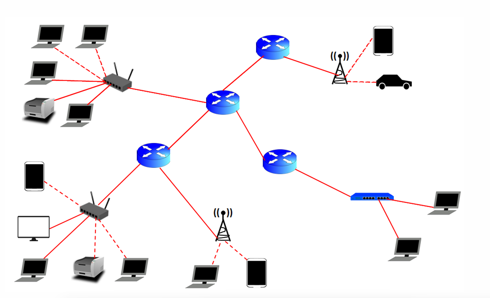


### <H3 STYLE="COLOR:GREEN;"> **1.1 Périphériques terminaux :</h3>**

Ce sont les **appareils utilisateurs**, situés en bout de chaîne, qui **émettent ou reçoivent des données** :

* les **serveurs** : c'est un ordinateur qui offre un service par exemple : un serveur web ou un serveur de messagerie
* les **ordinateurs**
* les **imprimantes**
* les **téléphones**
* des **objets connectés** (voiture, frigo, aspirateur robot,...)

> 💡 Ces périphériques ont une **adresse IP** et une **adresse MAC**.


### <H3 STYLE="COLOR:GREEN;"> **1.2. Périphériques intermédiaires :</h3>**

Ce sont les équipements chargés **d’acheminer les données** entre les terminaux :

* les **commutateurs** (aussi appelés **switchs**)
* les **routeurs**
* les **box** (modem/routeur/pare-feu combinée)

> 💡 Ces équipements agissent aux **couches 2 et/ou 3** du modèle OSI.


### <H3 STYLE="COLOR:GREEN;">**1.3. Types de connexions réseau</h3>**

🔸 **Connexions filaires**

🔸 **Connexions sans-fil :**

* **Wi-Fi**
* **Bluetooth**

🔸 **Connexions optiques :**

* **Fibre optique**

> 💡 Le type de connexion influence la **vitesse**, la **portée** et la **qualité** de la communication.


## <H2 STYLE="COLOR:BLUE;">**2. Première situation : <a name="2345"></a> communication dans un réseau local</h2>**

Voici le réseau que l'on va étudier :

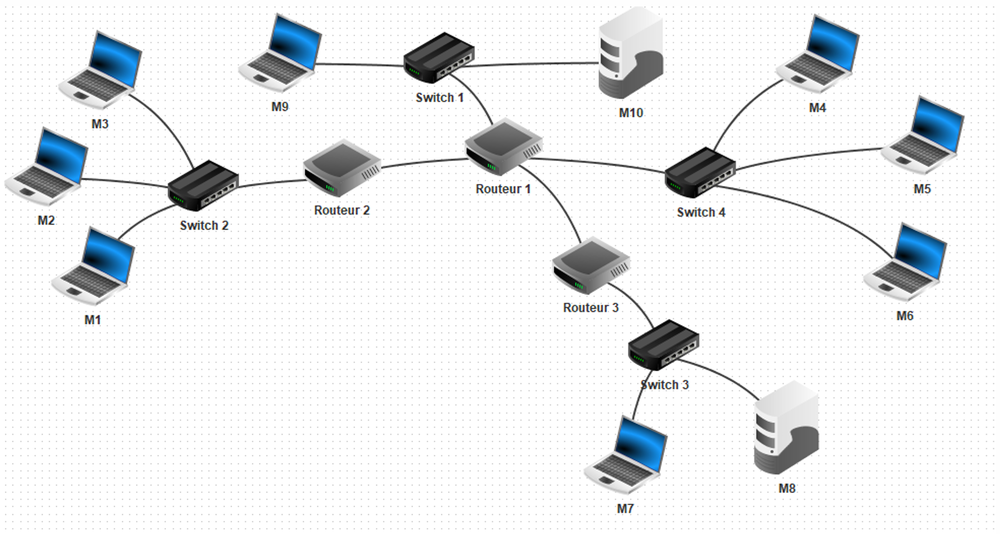

Ce réseau est composé de plusieurs **sous-réseaux**.

Par exemple, un sous-réseau peut contenir deux ordinateurs, un switch et un routeur.

Un autre sous-réseau peut relier deux routeurs entre eux, ou contenir d'autres équipements.

On voudrait faire communiquer M9 avec un autre ordinateur de son réseau local

### <H3 STYLE="COLOR:GREEN;">**2.1. Le protocole TCP</h3>**


**Un protocole réseau** est un **ensemble de règles et de formats normalisés** qui permettent à **deux entités (ordinateurs, serveurs, équipements réseau, etc.) de communiquer entre elles** de manière fiable et compréhensible.

Le protocole **TCP (Transmission Control Protocol)** est l’un de ces protocoles. Il fonctionne à la **couche transport** du modèle TCP/IP. Il est responsable de la **gestion de la connexion**, du **contrôle des erreurs**, et de l’**acheminement fiable des données** d’un point à un autre sur le réseau.


### <H3 STYLE="COLOR:GREEN;">**2.2. Envoi du message</h3>**


On souhaite envoyer un poème :

> **L’Albatros**
>
> *Charles Baudelaire*
>
> Souvent, pour s’amuser, les hommes d’équipage
> 
> Prennent des albatros, vastes oiseaux des mers,
> 
> Qui suivent, indolents compagnons de voyage,
> 
> Le navire glissant sur les gouffres amers.
>
> À peine les ont-ils déposés sur les planches,
> 
> Que ces rois de l’azur, maladroits et honteux,
> 
> Laissent piteusement leurs grandes ailes blanches
> 
> Comme des avirons traîner à côté d’eux.
>
> *(On ne transmet que les deux premiers quatrains)*

Mais : **on ne peut envoyer qu’un seul vers par message**.


Voici ce qu'on doit envoyer mais ce qu’on **reçoit réellement** pose problème 


* Les vers **arrivent dans le désordre**.
* Certains **vers manquent** complètement.


**Quels problèmes techniques cela illustre-t-il ?**

* Transmission **non fiable** sans contrôle d’ordre ni d’intégrité.
* Données perdues en chemin.


**Quelles solutions simples peut-on imaginer ?**

1. **Numéroter chaque vers** avant l’envoi → pour permettre la remise en ordre à l’arrivée.
2. **Demander un accusé de réception** pour chaque message → pour pouvoir **renvoyer** un vers si l’accusé n’arrive pas.

Ces idées sont similaires à ce que fait le protocole **TCP** :

* **découpage des données en paquets (1460 octets au maximum)**
* **numérotation des paquets**,
* **accusés de réception (ACK)**,
* **retransmission automatique des paquets perdus**.


### <H3 STYLE="COLOR:GREEN;">**2.3. les ports</h3>**

Sur notre ordinateur, on utilise souvent **plusieurs logiciels en même temps**.

Par exemple :

* un navigateur Internet pour consulter des sites web,
* un logiciel pour envoyer ou recevoir des fichiers,
* un client de messagerie pour consulter ses e-mails, etc.

En face, **une machine distante (un serveur)** peut offrir plusieurs services en parallèle :

* un serveur web (HTTP),
* un serveur de messagerie (SMTP/IMAP/POP),
* un serveur FTP pour les fichiers, etc.


❓**Quel service (logiciel serveur) va recevoir les données envoyées ?**

Pour cela, on associe un **identifiant numérique à chaque service**, appelé **port**.

➤ Ce **numéro de port** est **ajouté aux données** pour indiquer à quel logiciel (serveur) elles sont destinées.

🧠 **Exemple** :
>
> Port 80 → pour le serveur HTTP (web)
>
> Port 25 → pour le serveur SMTP (mail sortant)
>
> Port 21 → pour le serveur FTP

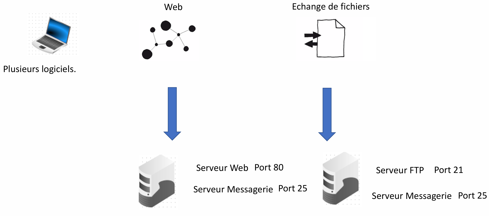

Quand le serveur répond à l’ordinateur client :

❓**Quel logiciel (client) doit recevoir la réponse ?**

➤ Là encore, on utilise des **ports**.

Lorsqu’un logiciel sur votre ordinateur envoie une requête, le système **lui attribue un port aléatoire temporaire** (appelé **port source**).
Le serveur **utilise ce même port source** pour répondre au bon logiciel.

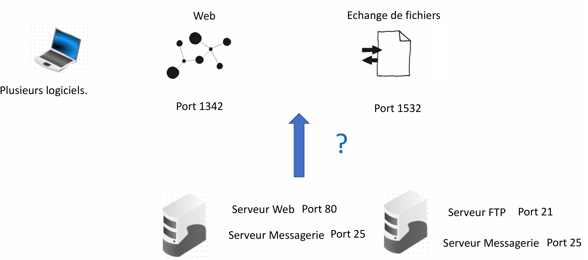


💡 **Résumé** :
>
> * Un **port** identifie un **logiciel de communication** sur un appareil.
> * Les **ports bien connus** (de 0 à 1023) sont réservés aux services standard.
> * Les ports permettent de **multiplier les communications simultanées** entre les mêmes machines.


### <H3 STYLE="COLOR:GREEN;">**2.4. les segments</h3>**


Pour envoyer un message (par exemple, un **vers du poème**), on ajoute des **métadonnées** aux données à transmettre : c’est ce qu’on appelle **l’en-tête TCP** (ou **en-tête du segment TCP**).

Cette en-tête contient plusieurs informations essentielles pour que le message soit bien acheminé, reçu, et éventuellement reconstitué.

Elle est constituée notamment :
>
> * du **port source** (pour savoir **quel logiciel client** a envoyé le message),
> * du **port de destination** (pour savoir **quel service du serveur** doit le recevoir),
> * d’un **numéro de séquence** (ou numéro du message), pour **remettre les messages dans le bon ordre**,
> * d’un ou plusieurs **drapeaux** (flags), comme le **flag ACK** qui indique que l’on attend un **accusé de réception**.
>

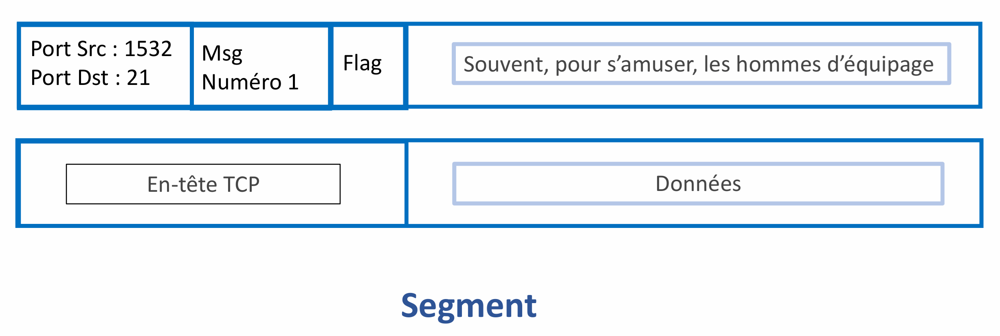

### <H3 STYLE="COLOR:GREEN;">**2.5. Anatomie d'une adresse IP</h3>**


On souhaite envoyer des données à une machine.
On connaît son **adresse IP**, mais **on ne sait pas sur quel réseau local elle se trouve** ni **comment l’atteindre physiquement**.

#### <H4 STYLE="COLOR:MAGENTA;">**2.5.1. Adresse IP</h4>**

📌 **Définition** :

L’**adresse IP** (Internet Protocol) est une **adresse logique**, **temporaire ou permanente**, qui permet d’**identifier un équipement sur un réseau**.

➤ Elle est utilisée pour acheminer les données vers la bonne machine, que ce soit dans un **réseau local** ou sur **Internet**.

📌 **Exemple d'adresse IP** : `192.168.1.10`

➤ Cette adresse est **liée à un réseau ou un sous-réseau**. Elle permet de savoir à **quel réseau appartient l'appareil**.


🌐 Il existe deux versions d’adresses IP :

* **IPv4** (32 bits) → format classique : `192.168.1.1`
* **IPv6** (128 bits) → format étendu : `2001:db8::ff00:42:8329`


ℹ️ **Pourquoi IPv6 ?**
> Le stock d’adresses IPv4 (environ **4,3 milliards**) est **presque entièrement épuisé**.
> L’IPv6 permet de générer un **nombre quasi infini d’adresses** pour répondre à la croissance des appareils connectés.


#### <H4 STYLE="COLOR:MAGENTA;">**2.5.2. Adresse<a name="_page1_x40.00_y181.92"></a> machine</h4>**


Une **adresse IP** est composée de **deux parties** :
>
> * **NetID** (ou **identifiant du réseau**) : permet d’identifier le réseau auquel appartient la machine.
> * **HostID** (ou **identifiant de l’hôte**) : permet d’identifier une **machine spécifique** au sein de ce réseau.

🧪 **Exemple :**

Adresse IP : `131.254.100.48/24`

Cela signifie que :

* Les **24 premiers bits** correspondent à l’**identifiant du réseau (NetID)**
* Les **8 bits restants** sont utilisés pour identifier les **machines (HostID)**

| Octet 1            | Octet 2            | Octet 3 | Octet 4 |
| ------------------ | ------------------ | ------- | ------- |
| 131                | 254                | 100     | 48      |
|  | ⬅️ NetID (24 bits) |         |➡️ HostID (8 bits)         |

🧠 Tous les appareils du **même réseau** auront une adresse IP de la forme :
`131.254.100.xxx`

❓**Combien de machines sont possibles sur ce réseau ?**

* Si l’**HostID occupe 8 bits**, cela donne :
  $2^8 = 256$ **adresses possibles**

* Mais **deux adresses sont réservées** :

  * `131.254.100.0` → **adresse du réseau**
  * `131.254.100.255` → **adresse de diffusion** (**broadcast**)

➡️ Il reste donc :
$256 - 2 = 254$
**machines adressables** sur ce réseau.


#### <H4 STYLE="COLOR:MAGENTA;">**2.5.3. Adresse<a name="_page1_x40.00_y612.92"></a> du sous réseau et masque de sous réseau</h4>**


✅ **Le masque de sous-réseau** 

Un **masque de sous-réseau** permet de **découper un réseau IP** en **sous-réseaux plus petits**, et de déterminer :

* l’**adresse du réseau**,
* l’**adresse de broadcast**,
* les **adresses des machines possibles (hôtes)**.

🔹 **Exemple 1** : IP `192.168.1.55/24`

➡️ Masque : `255.255.255.0`

| **Adresse IP** | **Masque**    | **Résultat (AND)** → Adresse réseau |
| -------------- | ------------- | ----------------------------------- |
| 192.168.1.55   | 255.255.255.0 | 192.168.1.0                         |

L’**adresse de broadcast** est : `192.168.1.255`.

🔍 Détail en binaire :

```
Adresse IP :     11000000.10101000.00000001.00110111
Masque :         11111111.11111111.11111111.00000000
Résultat (AND) : 11000000.10101000.00000001.00000000
```

✅ Table de vérité de l'opérateur logique **ET** (AND)

| Entrée A | Entrée B | A AND B |
| -------- | -------- | ------- |
| 0        | 0        | 0       |
| 0        | 1        | 0       |
| 1        | 0        | 0       |
| 1        | 1        | 1       |


➤ Ce qui donne : **192.168.1.0** → adresse du réseau

➤ L’adresse de **broadcast** sera : **192.168.1.255**

🧠 **Remarque** :

Avec des masques simples comme `255.255.255.0`, on peut **deviner rapidement** :

* l’adresse du sous-réseau (les parties à 255 ne changent pas),
* l’adresse de broadcast (on met tous les bits à 1 dans la partie hôte).


📌 **Quelques exemples directs sans conversion binaire** :

```text
192.168.1.239/24
  → Adresse réseau :     192.168.1.0
  → Partie hôte :        0.0.0.239
  → Broadcast :          192.168.1.255

192.168.1.239/16
  → Adresse réseau :     192.168.0.0
  → Partie hôte :        0.0.1.239
  → Broadcast :          192.168.255.255

192.168.1.239/8
  → Adresse réseau :     192.0.0.0
  → Partie hôte :        0.168.1.239
  → Broadcast :          192.255.255.255
```

🔹 **Exemple 2** : IP `90.98.100.3/21`

➡️ Masque : `255.255.248.0` = `11111111.11111111.11111000.00000000`


🔍 Calcul en binaire :

```
Adresse IP :     01011010.01100010.01100100.00000011
Masque :         11111111.11111111.11111000.00000000
Résultat (AND) : 01011010.01100010.01100000.00000000
```

➤ Adresse du sous-réseau : **90.98.96.0**

🔁 Adresse de broadcast :

```
Broadcast :      01011010.01100010.01100111.11111111
→ soit :         90.98.103.255
```


#### <H4 STYLE="COLOR:MAGENTA;">**2.5.4. Adresse<a name="_page2_x40.00_y473.92"></a> publique et adresse privée</h4>**


✅ **Tableau des types d'adresses IP**

| **Type d’adresse** | **Utilisation**                                                               | **Exemple**                  |
| ------------------ | ----------------------------------------------------------------------------- | ---------------------------- |
| **Publique**       | Adresse **visible sur Internet** ; attribuée par un fournisseur d’accès (FAI) | `8.8.8.8` (DNS de Google)    |
| **Privée**         | Adresse **utilisée dans un réseau local** (non routable sur Internet)         | `192.168.1.1` (box Internet) |


🔍 **Détails importants à retenir**

* 📌 **Les adresses IP privées ne peuvent pas circuler sur Internet**. Elles sont réservées à une utilisation **interne** (maison, entreprise, établissement scolaire...).
* 📌 Pour accéder à Internet, les équipements d’un réseau local utilisent un mécanisme appelé **NAT (Network Address Translation)**.


🌐 **NAT** : Network Address Translation

> Le **NAT** est une technique utilisée par les routeurs pour **traduire une adresse IP privée (locale)** en **adresse IP publique** lors d’un accès à Internet.
>
> Cela permet :
>
> * d’**économiser** les adresses IPv4 publiques,
> * de **protéger** les machines internes (les adresses privées ne sont pas directement accessibles depuis Internet),
> * de **faire communiquer plusieurs machines** avec une seule adresse publique.


### <h3 style="color:green;">**2.6. Le paquet IP</h3>**

Pour envoyer des données à une autre machine sur un réseau, il faut d'abord déterminer si cette machine appartient au **même réseau local** (LAN) que la nôtre.

Cela se fait en **calculant l'adresse du réseau** à partir de l'adresse IP et du **masque de sous-réseau** à l'aide d'une opération logique **ET (AND binaire)**.

🧮 **Exemple : Machine locale**

* **Adresse IP :** `192.168.1.1`
* **Masque de sous-réseau :** `255.255.255.0`

En binaire :

```
Adresse IP : 11000000.10101000.00000001.00000001  
Masque     : 11111111.11111111.11111111.00000000  
Résultat   : 11000000.10101000.00000001.00000000  
→ Adresse réseau : 192.168.1.0
```

🧮 **Exemple : Machine de destination**

* **Adresse IP :** `192.168.1.11`
* **Masque de sous-réseau :** `255.255.255.0`

En binaire :

```
Adresse IP : 11000000.10101000.00000001.00001011  
Masque     : 11111111.11111111.11111111.00000000  
Résultat   : 11000000.10101000.00000001.00000000  
→ Adresse réseau : 192.168.1.0
```

✅ **Conclusion**

Ces deux machines ont la **même adresse réseau** : `192.168.1.0`
➡ Elles sont donc **sur le même réseau local** et peuvent **communiquer directement**, **sans passer par une passerelle** (routeur).

📦 **Le paquet IP**

Pour envoyer des données à une autre machine, on encapsule les **données du segment TCP** dans un **paquet IP**, en y ajoutant une **en-tête IP** (ou *IP header*), qui contient notamment :

* **l’adresse IP source**
* **l’adresse IP de destination**

Cela permet au réseau d'acheminer les données correctement vers leur destinataire.

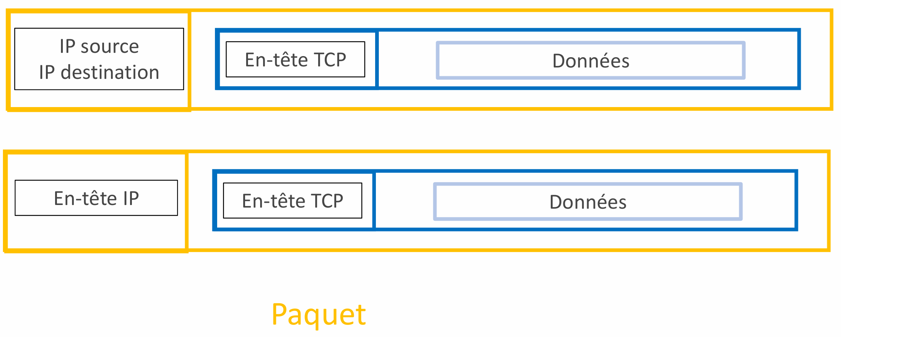


### <H3 STYLE="COLOR:GREEN;">**2.7. Une adresse MAC</h3>**

🔎 **Qui possède cette adresse IP de destination dans le sous-réseau ?**

Dans un réseau local, **chaque machine est connectée à un switch via une carte réseau** (Ethernet ou Wi-Fi).
Chaque carte réseau possède un identifiant matériel unique : **l'adresse MAC**.

📌 **Qu’est-ce qu’une adresse MAC ?**

L’**adresse MAC** (Media Access Control) est un **identifiant physique unique** attribué à chaque carte réseau.
Elle est généralement **gravée en usine** dans la carte.

* **Format :** 6 octets (48 bits)
* **Exemple :** `00:1A:2B:3C:4D:5E`

🧭 **Rôle de l’adresse MAC**

* Elle permet **d’identifier une machine de manière unique** dans un réseau local.
* Elle est utilisée par les protocoles de la **couche 2 (liaison de données)** du modèle OSI.
* **Elle ne sort pas du réseau local** : elle n’est pas utilisée sur Internet.


???+ question "🧪 Activité n°1 — Trouver votre adresse MAC"
    Ouvrez un terminal et tapez la commande suivante pour afficher les informations réseau de votre machine :

    
    Sous **Windows** :
    ```bash
    ipconfig /all
    ```
    Sous **Linux / macOS** :
    ```bash
    ip a
    ```

    → Recherchez la ligne contenant "Adresse physique" (Windows) ou "link/ether" (Linux) pour obtenir votre adresse MAC.
    

### <H3 STYLE="COLOR:GREEN;">**2.7. Un<a name="_page3_x40.00_y36.92"></a> switch (commutateur réseau)</h3>**


Un **switch** est un équipement qui **transmet les données uniquement aux destinataires concernés**.  

- Il fonctionne en **couche 2 (liaison de données)**.

- Il **enregistre les adresses MAC** dans une table (CAM).


### <H3 STYLE="COLOR:GREEN;">**2.8 Qu’est-ce que le protocole ARP ?</h3>**

🧩 **Comment trouver l’adresse MAC à partir de l’adresse IP dans un réseau local ?**

Lorsque deux ordinateurs sont connectés au **même réseau local** via un **switch**, et que l’un d’eux veut envoyer un message à une **adresse IP locale**, il doit d'abord connaître **l’adresse MAC correspondante**.

Mais **l’ordinateur ne connaît que l’adresse MAC de destination**. Il va donc utiliser un protocole spécifique : **ARP** (Address Resolution Protocol).

🧠 **Que fait ARP ?**

Le **protocole ARP** permet de faire le lien entre une **adresse IP** et l’**adresse MAC** associée dans le même réseau local.

⚙️ **Étapes détaillées :**

1 🖥️ **Notre ordinateur veut envoyer un message à l’IP `192.168.1.11`**
   Il vérifie si cette IP est dans le **même sous-réseau** que lui (grâce au masque de sous-réseau).
   Si c’est le cas → **pas besoin de passer par la passerelle**.

2 🔍 Il **cherche dans son cache ARP** (mémoire temporaire) :

   > "Est-ce que je connais déjà l’adresse MAC correspondant à `192.168.1.11` ?"

3 ❌ Si l’adresse MAC **n’est pas connue** :
   il envoie un **message ARP en broadcast** (diffusion) sur le réseau :

   
   > Qui a l'adresse IP 192.168.1.11 ? Donne-moi ton adresse MAC !
   

4 📨 L’ordinateur ayant cette adresse IP (`192.168.1.11`) **répond directement** :

   
   > Moi ! Mon adresse MAC est 00:1A:2B:3C:4D:5E
   

5 ✅ Notre ordinateur **enregistre cette correspondance dans sa table ARP** et peut maintenant **envoyer les données au bon destinataire** via son adresse MAC.


???+ question "Activité n°2"
    Afficher la table ARP locale (IP → MAC) dans une **fenêtre de terminal** (`cmd` sous Windows, `terminal` sous Linux/macOS)

    * Sous **Windows** :

      ```bash
      arp -a
      ```

    * Sous **Linux / macOS** :

      ```bash
      ip neigh
      ```


### <H3 STYLE="COLOR:GREEN;">**2.9 La trame</h3>**


Notre ordinateur va **ajouter une nouvelle entête** au paquet IP :
👉 **l'entête Ethernet**, utilisée pour l’envoi dans le **réseau local** (LAN).

Elle est constituée de :

* **l'adresse MAC source** (notre machine)
* **l'adresse MAC de destination** (machine cible ou passerelle)
* (et d'autres champs comme le type, mais non abordés ici)


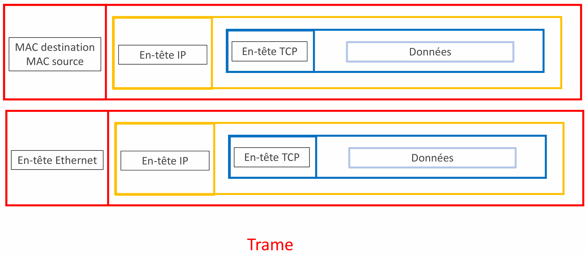

### <H3 STYLE="COLOR:GREEN;">**2.10. Le modèle TCP/IP</h3>**

🧱 **Pourquoi utilise-t-on un modèle en couches en réseau ?**

📌 **Définition :**

Un modèle en couches est une manière de découper le fonctionnement d’un réseau en étapes successives et indépendantes, appelées couches.

Chaque couche a un rôle précis et ne communique qu’avec la couche juste au-dessus et la couche juste en dessous.

{ width=70%; .center }


📚 **Comparaison des modèles OSI et TCP/IP avec explication des couches**

Le **modèle OSI** (à gauche) est un modèle théorique à 7 couches qui décrit **comment les données circulent** dans un réseau.
Le **modèle TCP/IP** (à droite) est plus **réaliste et utilisé dans Internet**. Il regroupe certaines couches de l’OSI.


🎯 Dans le **modèle TCP/IP** :

* Les **couches 5 à 7** de l'OSI sont regroupées en **Application**.
* Les couches **1 et 2** sont regroupées en **Accès au réseau**.
* Les couches **Transport** et **Internet** correspondent respectivement aux couches 4 et 3 de l’OSI.

Lorsque l'ordinateur 1 veut transférer des fichiers à l'ordinateur 2 sur le même réseau local :

- **couche application** : il utilise le protocole FTP 
- **couche transport** : les données sont encapsulées avec l'entête TCP
- **couche internet** : ce segment est encapsulé avec l'entête IP (IP source, IP destination)
- **couche réseau** : ce paquet est encapsulé avec l'entête Ethernet


La trame est ensuite envoyé à l'ordinateur 2 qui va ensuite **décapsuler** chaque entête.

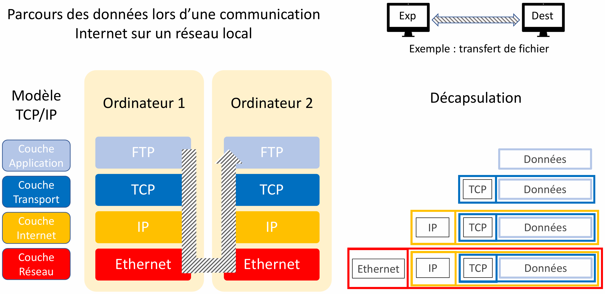

## <H2 STYLE="COLOR:BLUE;">**3. Deuxième situation : <a name="3456"></a> communication entre réseaux locaux (Internet)</h2>**


La machine M9 possède l’adresse IP `192.168.1.1/24`
Elle souhaite contacter une autre machine à l’adresse `192.168.3.2/24`

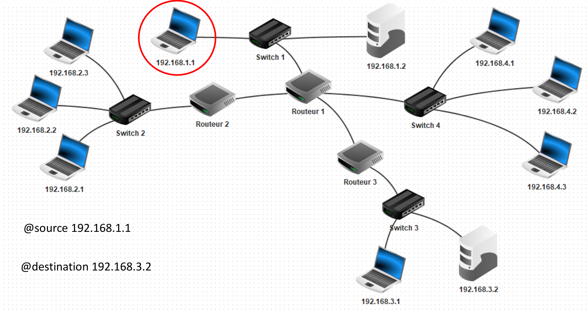


### <H3 STYLE="COLOR:GREEN;">**3.1. Le rôle du routeur</h3>**

Tout d'abord, on cherche à savoir si les deux adresses IP font partie du même réseau local.


🖥️ **Machine 1**

* **Adresse IP :** `192.168.1.1`
* **Masque :** `255.255.255.0`
* **Binaire de l’adresse IP :** `11000000.10101000.00000001.00000001`
* **Binaire du masque :** `11111111.11111111.11111111.00000000`
* **Résultat AND (adresse réseau) :** `11000000.10101000.00000001.00000000` → `192.168.1.0`

🖥️ **Machine 2**

* **Adresse IP :** `192.168.3.2`
* **Masque :** `255.255.255.0`
* **Binaire de l’adresse IP :** `11000000.10101000.00000011.00000010`
* **Binaire du masque :** `11111111.11111111.11111111.00000000`
* **Résultat AND (adresse réseau) :** `11000000.10101000.00000011.00000000` → `192.168.3.0`

🔍 **Conclusion**

* **Adresse réseau de la machine 1 :** `192.168.1.0`
* **Adresse réseau de la machine 2 :** `192.168.3.0`

❌ Ces deux machines **ne sont pas dans le même sous-réseau** (elles n’ont pas la même adresse réseau), **elles auront donc besoin d'au moins un routeur pour communiquer**.


Il faut donc envoyer les données à une **passerelle** : c'est le rôle du routeur. La passerelle est indiquée au niveau de l'ordinateur, dans l'exemple c'est le routeur 1 connecté au switch.


🔄 **Le rôle du routeur**

La passerelle par défaut (un **routeur**) est configurée sur chaque machine pour envoyer les paquets hors du réseau local.


Un **routeur** :

* assure la **connexion entre plusieurs réseaux**,
* fonctionne en **couche 3 (réseau)** du modèle OSI,
* utilise une **table de routage** pour choisir le chemin vers la destination.

💡 **Exemple courant :** la **box Internet** joue le rôle de routeur entre votre réseau domestique et Internet.


### <H3 STYLE="COLOR:GREEN;">**3.2. Que fait le routeur ?</h3>**


Le **routeur n°1** possède **quatre interfaces réseau**, donc **quatre adresses IP**. Il est connecté à **deux sous-réseaux** et à **deux autres routeurs**.

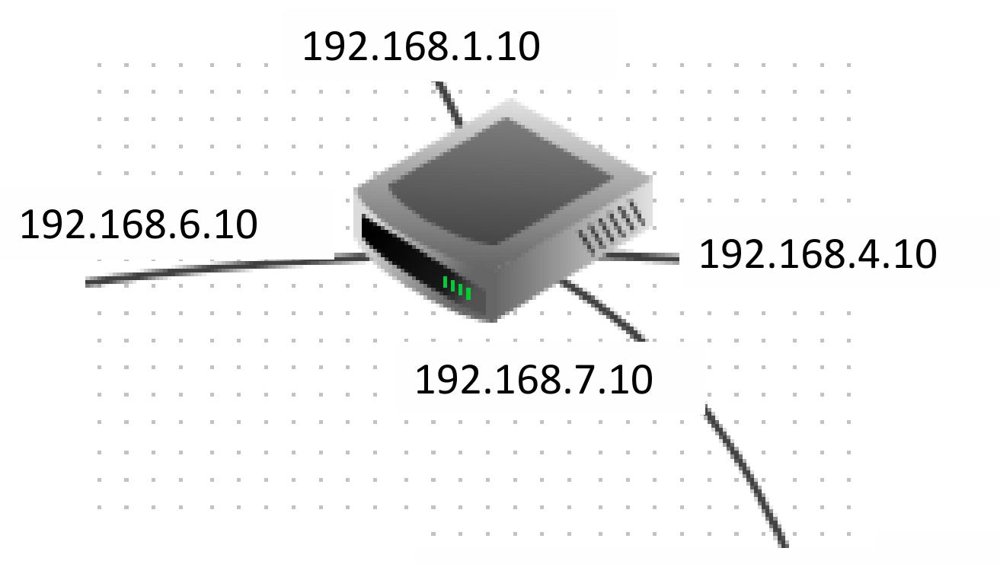{ width=35%; .center }

1. **Réception de la trame :**

    Il reçoit une trame Ethernet contenant un paquet IP.

    → Il **décapsule** la trame pour lire l’**entête IP**.

    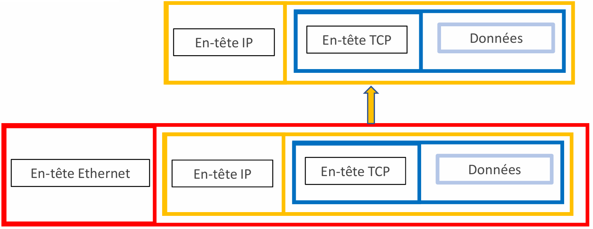{ width=75%; .center }

2. **Comparaison :**

    Il applique le **masque** à chaque adresse IP de ses interfaces pour voir si l’**IP de destination** appartient à l’un de ses sous-réseaux.

3. **Consultation de la table de routage :**

    Si l’IP de destination n’est pas dans un de ses sous-réseaux, il consulte sa **table de routage** pour savoir **quel routeur** contacter.

4. **Choix du prochain saut :**

    Il choisit ici le **routeur n°3**, qui connaît le sous-réseau de destination.

5. **Encapsulation :**

    Il crée une **nouvelle trame Ethernet**, avec :

      * **MAC source** : la sienne (dans le sous-réseau partagé avec le routeur 3),
   
      * **MAC destination** : celle du **routeur n°3**.

    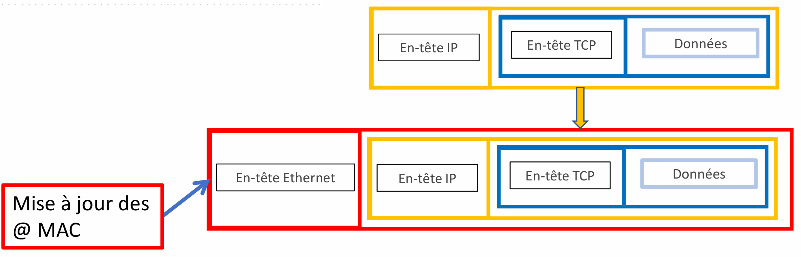{ width=60%; .center }

6. **Transmission :**

    Le **routeur n°3** reçoit la trame, **décapsule** et lit l’**adresse IP de destination**.

7. **Décision finale :**

    Il applique le masque, constate que l’IP est dans son sous-réseau, et peut **acheminer les données jusqu'à la machine finale**.

8. **Résolution ARP (si nécessaire)**
    
    Le routeur connaît l’**adresse IP de destination**, mais **pas sa MAC**.

    Il doit donc :

      * Envoyer une **requête ARP** :

      « Qui a l’adresse IP `192.168.X.Y` ? Donne-moi ton adresse MAC. »
      
      * **Seule la machine concernée répond** avec :
      
      « Moi ! Voici mon adresse MAC. »

    > Si l’adresse MAC est déjà en cache ARP, cette étape est **skippée** (ignorée).

9. **Création de la trame Ethernet finale**
    
    Le routeur encapsule les données dans une trame :
      
      * **MAC source** : l’adresse MAC du routeur sur ce réseau
      
      * **MAC destination** : celle de la machine finale (trouvée par ARP)
      
      * **Paquet IP** : inchangé (conserve l’IP source et destination)

10. **Envoi au switch**
    
    Le **routeur envoie la trame Ethernet** sur le **port relié au switch**.

11. **Comportement du switch**
    
    * Le **switch reçoit la trame** et lit l’**adresse MAC de destination**
    
    * Il **consulte sa table de commutation (CAM table)** pour savoir **sur quel port** se trouve cette adresse MAC
      
      * Si elle est connue : il **envoie la trame uniquement sur ce port**
      
      * Si elle est inconnue : il fait un **broadcast** à tous les ports sauf celui d’entrée

12. **Réception par la machine finale**
    
    * La **machine cible** reçoit la trame
    
    * Elle vérifie que **l’adresse MAC destination** correspond bien à la sienne
    
    * Elle **décapsule la trame** pour récupérer le **paquet IP**
    
    * Puis **décapsule le paquet IP** pour accéder à la **donnée utile (segment TCP/UDP puis donnée applicative)**

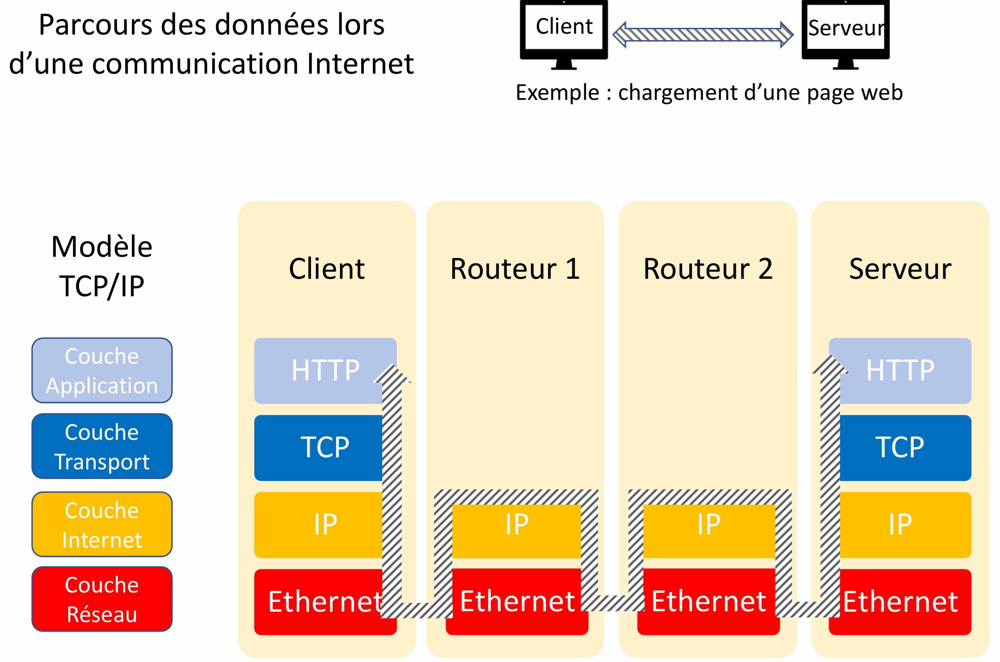


### <h3 style="color:green;">**3.3. Établissement de la communication TCP (« Three-Way Handshake »)**</h3>

Avant de pouvoir échanger des données avec fiabilité, le protocole **TCP (Transmission Control Protocol)** met en place une **connexion** entre le client et le serveur via un processus appelé **three-way handshake**.

🤝 **Trois étapes pour établir une connexion TCP fiable** :

| Étape          | Description                                                                                      |
| -------------- | ------------------------------------------------------------------------------------------------ |
| **1. SYN**     | Le client envoie une demande de connexion au serveur : un segment **SYN** (synchronize).         |
| **2. SYN-ACK** | Le serveur accepte la demande et répond avec un segment **SYN-ACK** (synchronize + acknowledge). |
| **3. ACK**     | Le client confirme la réponse du serveur avec un segment **ACK** (acknowledge).                  |

 🔢 **Exemple avec des numéros de séquence** :

* **Client → Serveur** : `SYN` avec **seq = 1010**
* **Serveur → Client** : `SYN-ACK` avec **seq = 3001**, **ack = 1011**
* **Client → Serveur** : `ACK` avec **ack = 3002**

📌 **Pourquoi cette étape est-elle indispensable ?**

Elle garantit que :

* Le serveur **est bien en ligne** et prêt à recevoir les données.
* Le client **est bien identifié**.
* La **fiabilité de la transmission** est assurée dès le début.

Elle permet donc **d’éviter l’envoi de données inutiles** si la connexion ne peut être établie.


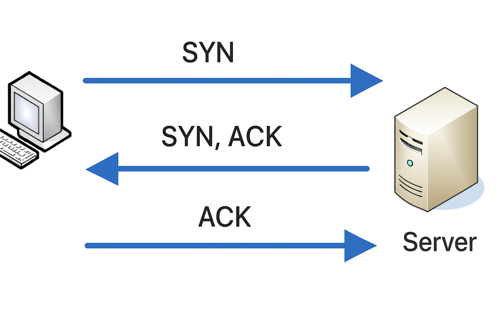{ width=60%; .center }

⚠️ Sécurité : attention au **spoofing IP**

> Il existe une attaque appelée **IP spoofing**, dans laquelle un pirate falsifie l'adresse IP source lors de l'envoi d'un paquet SYN. Cette technique peut être utilisée pour **perturber le handshake TCP**, ou mener des attaques de type **SYN Flood**.


### <H3 STYLE="COLOR:GREEN;">**3.4. Fiabilité<a name="_page8_x40.00_y36.92"></a> des transferts : protocole du bit alterné</h3>**


Le protocole **TCP** garantit un **transfert fiable des données**. Il repose notamment sur un système d'**accusé de réception**, permettant à l'émetteur et au récepteur de vérifier que les données ont bien été reçues.

🔄 **Le protocole du bit alterné**

Ce protocole utilise un **bit de séquence** (0 ou 1) pour marquer chaque trame envoyée, et un **accusé de réception (ACK)** pour valider la bonne réception.

✅ **Cas normal : tout se passe bien**

* À chaque trame envoyée, l’émetteur **alterne la valeur** du bit de séquence (0 → 1 → 0 → ...).
* Le récepteur 

    * accepte la trame si le bit est celui **attendu**
    * envoie un **accusé de réception** (ACK) avec le même bit.

🧾 **Exemple :**

* Trame 1 : bit de séquence = 0
* Réponse : ACK avec bit = 0 (attente de la prochaine trame avec bit 1)
* Trame 2 : bit de séquence = 1
* Réponse : ACK avec bit = 1
  ...

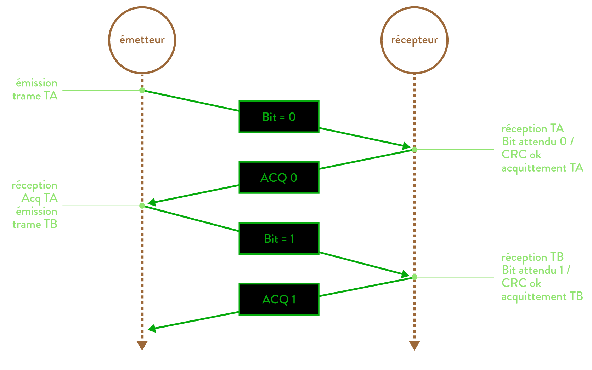


❌ **Cas 1 : trame non reçue**

Si une trame n’est **pas reçue** ou si l'ACK n'arrive pas à temps :

* L’émetteur **renvoie** la trame après un délai.

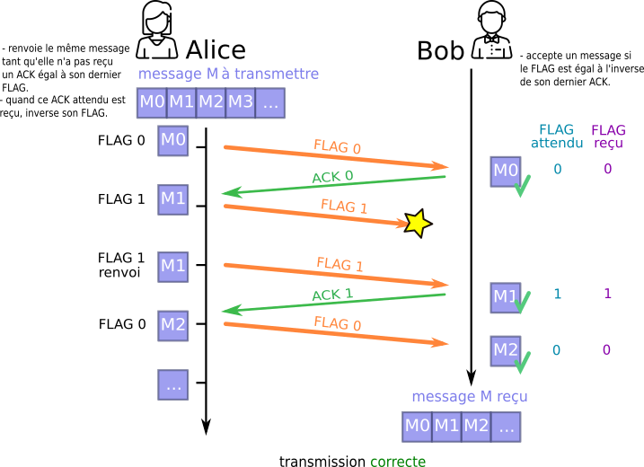

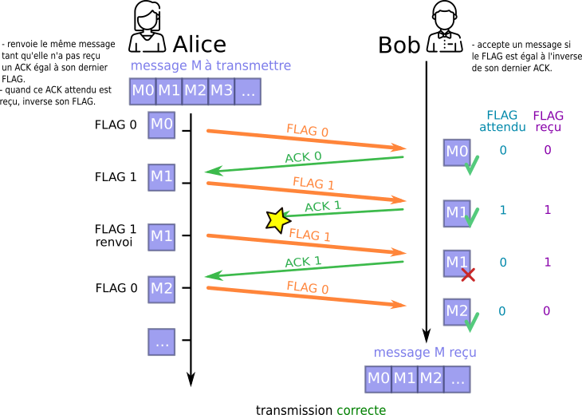

⚠️ **Cas 2 : chevauchement de trames ou d'acquitement**

Parfois, la trame initialement perdue arrive **en retard** :

* Le récepteur reçoit deux trames identiques.
* Il **rejette la seconde** car son bit de séquence **n’est plus attendu**.


De la même façon, si deux **ACK** identiques arrivent au même moment :

* L’émetteur **rejette l’ACK en double**, car le bit ne correspond pas au prochain attendu.

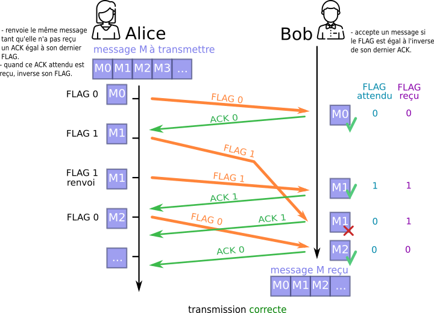

❓ **Pourquoi appelle-t-on cela le bit alterné** ?

> Parce que le bit de séquence **alterne à chaque trame** :

* La première trame a un **bit = 0**.
* Si elle est reçue correctement, le récepteur envoie un **ACK avec bit = 1**, pour demander la prochaine trame avec bit = 1.
* Si l’émetteur reçoit l’ACK attendu, il envoie la **deuxième trame** avec bit = 1, etc.


### <h3 style="color:green;">**3.5. Les protocoles**</h3>

Les **protocoles de communication** sont répartis dans les différentes **couches du modèle en couches** (comme le modèle TCP/IP ou OSI). Chaque couche a ses propres **protocoles**, qui remplissent des fonctions précises.

📡 **Couche Application**

Elle regroupe les **protocoles utilisés par les logiciels** pour accéder au réseau. 

Par exemple : 

* **FTP** (File Transfer Protocol) : pour transférer des fichiers entre deux machines.
* **HTTP** (HyperText Transfer Protocol) : pour accéder aux pages web.
* **HTTPS** : version sécurisée de HTTP, utilisant un chiffrement (SSL/TLS).

🚚 **Couche Transport**

Elle assure le **transport des données** entre deux applications.

* **TCP** (Transmission Control Protocol) : protocole **fiable**, avec **accusés de réception**, utilisé pour les sites web, les emails, etc.
* **UDP** (User Datagram Protocol) : protocole **rapide**, **sans accusé de réception**, utilisé pour les **jeux en ligne**, le **streaming**, les **appels en visio**, etc.


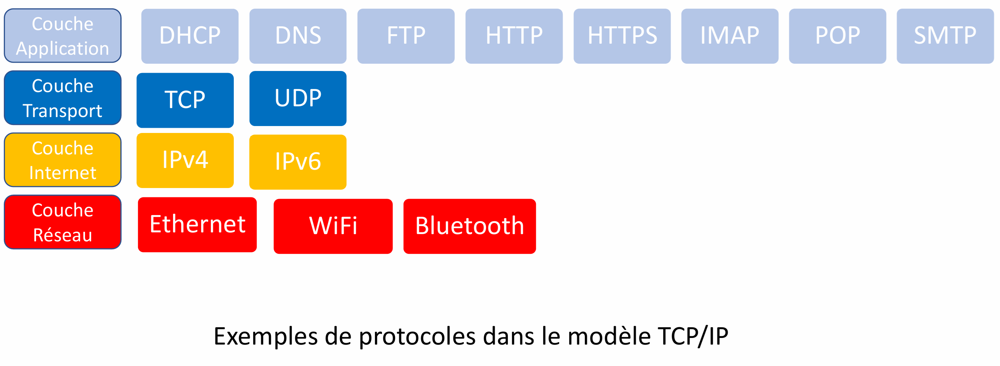


🧱 **Pourquoi ces différentes couches ?**

Le **modèle en couches** permet de **séparer les responsabilités** et de **faciliter l’évolution des réseaux**.
👉 Si un protocole d'une couche est modifié (ex. passage de HTTP à HTTPS), **les autres couches n'ont pas besoin d’être modifiées**.
Cela garantit la **modularité**, la **compatibilité** et la **pérennité** des systèmes de communication.


## <H2 STYLE="COLOR:BLUE;">**4. Autres <a name="#_titre4">commandes sur un réseau</a></h2>**

???+ question "Activité n°3"
    Dans une **fenêtre de terminal** (`cmd` sous Windows, `terminal` sous Linux/macOS), utilisez les commandes suivantes pour observer et analyser le réseau :  

    | **Commande** | **Description** |
    |-------------|----------------|
    | `hostname` | Affiche le nom réseau de l’ordinateur. |
    | `ipconfig` (ou `ifconfig` sous Linux/macOS) | Affiche un résumé des paramètres IP des interfaces réseau : adresse IP, masque de sous-réseau, passerelle par défaut, IPv4 ou IPv6. |
    | `ipconfig /all` | Donne des informations détaillées : nom d’hôte, adresse MAC, serveurs DNS. |
    | `ipconfig /flushdns` | Vide le cache DNS. |
    | `ipconfig /displaydns` | Affiche le cache DNS. |
    | `ping [adresse]` | Vérifie la connexion à une adresse IP ou un site web. Par exemple ping 8.8.8.8|
    | `tracert [adresse]` (ou `traceroute` sous Linux) | Affiche les étapes (sauts) nécessaires pour atteindre une adresse réseau. Par exemple tracert www.google.fr|
    | `netstat` | Affiche les ports actifs et les connexions réseau, utile pour détecter un virus. |

## <H2 STYLE="COLOR:BLUE;">**5. Menaces <a name="#_titre5">courantes sur les réseaux</a></h2>**


### <h3 style="color:green;">**5.1. Phishing (hameçonnage)**</h3>

* **Définition** : Le phishing (ou hameçonnage) est une technique de fraude dans laquelle un attaquant se fait passer pour une entité de confiance (banque, administration, entreprise connue) afin de tromper la victime et lui soutirer des **informations sensibles** : identifiants, mots de passe, numéros de carte bancaire, etc.

* **Exemple** : Une personne reçoit un **email frauduleux** prétendant venir de sa banque. Le message l'invite à cliquer sur un lien pour "vérifier ses informations". Ce lien redirige vers un **faux site web** qui ressemble au vrai site bancaire. Si la victime saisit ses identifiants, l’attaquant les récupère.


### <h3 style="color:green;">**5.2. Attaque DDoS (Déni de service distribué)**</h3>

* **Définition** : Une attaque DDoS (Distributed Denial of Service) consiste à **inonder un serveur ou un service en ligne de requêtes** provenant de milliers d’appareils compromis (appelés bots), dans le but de **le rendre indisponible** pour les utilisateurs légitimes.

* **Conséquences** : Le service devient **lent, instable ou totalement inaccessible**, provoquant souvent des pertes économiques ou une perte de confiance des utilisateurs.

* **Exemple** : Un site de e-commerce est ciblé par une attaque DDoS. Des milliers d’ordinateurs infectés (botnet) envoient des requêtes en boucle vers le serveur du site, qui finit par **saturer et planter**, empêchant les clients d’y accéder.


### <h3 style="color:green;">**5.3. Attaque de type Man-In-The-Middle (MITM)**</h3>

* **Définition** : Dans une attaque **Man-In-The-Middle** (l’homme du milieu), un attaquant **intercepte et peut modifier les échanges de données** entre deux parties qui pensent communiquer directement entre elles. Cela permet de **voler des données sensibles** (identifiants, mots de passe, numéros de carte…) ou d’**injecter du contenu malveillant**.

* **Exemple** : Une personne se connecte à un **réseau Wi-Fi public non sécurisé**. Un attaquant intercepte les données échangées entre l'utilisateur et un site web, capturant ainsi les identifiants de connexion à un compte bancaire.


## <h2 style="color:blue;">**6. Mesures de protection <a name="#_titre6">des réseaux</a></h2>**

### <h3 style="color:green;">**6.1. Pare-feu (firewall)**</h3>

* **Définition** : Un **pare-feu** (ou firewall) est un dispositif de sécurité — matériel, logiciel ou les deux — qui **filtre les échanges entre un réseau interne et l’extérieur** (comme Internet), selon des **règles prédéfinies**.

* **Fonctions principales** :

  * 🔒 **Filtrage de paquets** : analyse chaque **paquet de données** entrant ou sortant, et autorise ou bloque sa transmission selon les critères définis (adresse IP, port, protocole…).

  * 🛡️ **Proxy** : agit comme un **intermédiaire** entre l’utilisateur et Internet. Il peut inspecter, modifier ou enregistrer les communications, offrant une **protection et un contrôle renforcé**.

* **Exemple** : Un firewall empêche une machine extérieure suspecte d’accéder à un serveur interne en bloquant les connexions provenant de son adresse IP.


### <h3 style="color:green;">**6.2. VPN (Virtual Private Network)**</h3>

* **Définition** : Un **VPN** (Réseau Privé Virtuel) établit une **connexion chiffrée et sécurisée** entre l’utilisateur et un réseau distant. Il permet de **masquer l’adresse IP réelle** de l’utilisateur et de **protéger les données échangées** contre toute interception.

* **Fonctionnement** :

  * 🔄 **Tunneling** : Les données sont encapsulées dans un **canal sécurisé** (ou "tunnel") et **chiffrées**, empêchant leur lecture ou modification par des tiers.

  * 🔐 **Authentification** : L’accès au VPN est protégé par une **authentification** (mot de passe, certificat, clé…), garantissant que seuls les utilisateurs autorisés peuvent se connecter.

* **Exemple** : Un salarié utilise un **VPN d’entreprise** depuis son domicile pour accéder à des fichiers internes, en toute sécurité, comme s’il était physiquement dans les locaux de son entreprise.


### <h3 style="color:green;">**6.3. Chiffrement des données**</h3>

* **Définition** : Le **chiffrement** (ou cryptage) est un procédé qui **convertit des données lisibles en données inintelligibles** pour toute personne ne possédant pas la **clé de déchiffrement**. C’est un pilier fondamental de la **cybersécurité**.

* **Fonctionnement** :

  * 🔁 **Chiffrement symétrique** : la **même clé** est utilisée pour **chiffrer et déchiffrer** les données (ex : AES).

  * 🔄 **Chiffrement asymétrique** : repose sur une **paire de clés** (clé **publique** pour chiffrer, clé **privée** pour déchiffrer). Ex : RSA, utilisé dans SSL/TLS.

* **Exemple** : Lors d’un paiement en ligne, les données bancaires sont **chiffrées via SSL/TLS**, garantissant qu’aucun tiers ne puisse intercepter ou modifier les informations échangées.


## <H2 STYLE="COLOR:BLUE;">**7. Analyse <a name="#_titre7">de trame</a></h2>**

???+ question "Activité n°4"
    ```
    Frame 1: 66 bytes on wire (528 bits), 66 bytes captured (528 bits) on interface en0, id 0
    Ethernet II, Src: 00:0c:29:36:bc:5a, Dst: 00:50:56:c0:00:01
    Internet Protocol Version 4, Src: 192.168.1.101, Dst: 192.168.1.1
    Transmission Control Protocol, Src Port: 443, Dst Port: 56324, Seq: 1, Ack: 1, Len: 0
    ```

    - Question 1 : Adresse MAC : Quelle est l'adresse MAC source et l'adresse MAC de destination ?

    - Question 2 : Adresse IP: Quelle est l'adresse IP source et l'adresse IP de destination ?

    - Question 3 : Protocole utilisé : Quel protocole de couche transport est utilisé par cette trame ?

    - Question 4 : Ports utilisés : Quels sont les ports source et destination ?

    - Question 5 : Numéro de séquence et d'accusé de réception : Quel est le numéro de séquence et le numéro d'accusé de réception de cette trame TCP ?

**Remarque** pour faire une analyse de trame, on peut utiliser un logiciel type wiresharp
> **Installation et prise en main de Wireshark**
>
> 1 **Installation de Wireshark**
>
>  - Aller sur le site officiel de Wireshark : [https://www.wireshark.org/](https://www.wireshark.org/).
>
>  - Télécharger la version appropriée pour votre système d'exploitation (Windows, macOS, Linux).
>
>  - Suivre les instructions d'installation.
>
> 2 **Premier lancement et configuration**
>
>  - Ouvrir Wireshark.
>
>  - Sélectionner l'interface réseau à utiliser pour la capture (par exemple, Wi-Fi ou Ethernet).
>
>  - Démarrer une capture en cliquant sur le bouton "Start capturing packets".
>
>
> **Capture et analyse de trames réseau**
>
> 1 **Démarrer une capture réseau**
>
>  - Avec Wireshark ouvert et une capture en cours, ouvrir un navigateur web et visiter quelques sites web (ex. : www.google.com, www.wikipedia.org).
>
>  - Retourner à Wireshark et arrêter la capture en cliquant sur le bouton "Stop capturing packets".
>
> 2 **Analyse des trames capturées**
>
>   - Dans la fenêtre principale de Wireshark, vous verrez une liste de trames capturées.
>
>   - Sélectionner une trame TCP et observer les détails dans les différentes sections (Frame, Ethernet, IP, TCP).


## <H2 STYLE="COLOR:BLUE;">**8.  Simulation d’un réseau avec Filius<a name="_page10_x40.00_y36.92"></a></h2>**

???+ question "Activité n°5 : Lien direct entre 2 ordinateurs"
      
    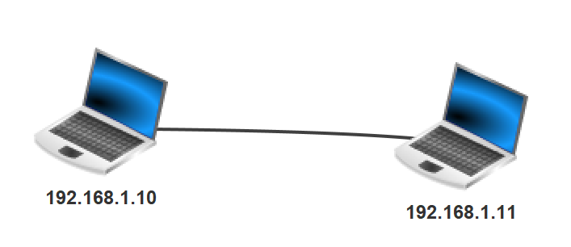

    - Lancer **Filius**.  

    - Créer le réseau illustré ci-dessus.  

    - Lancer la simulation.  

    - Sur le poste **10**, installer **Ligne de commande**.  

    - Ouvrir l’application et exécuter :  
      ```bash
      ping 192.168.1.11
      ```
    - Afficher les données échangées en effectuant un clic droit sur l’ordinateur.  

    - Effectuer un `ipconfig` dans le terminal du poste **10** et comparer l’adresse **MAC** avec celle de la source affichée dans le tableau des données échangées.  

???+ question "Activité n°6 : entre 2 ordinateurs et un serveur"
 
    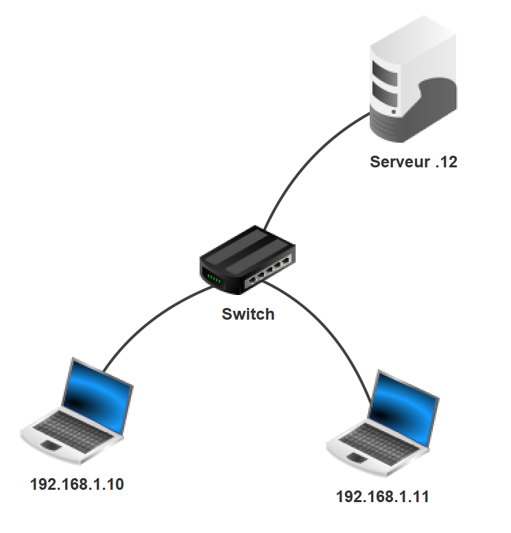

    - Modifier le réseau précédent pour y ajouter un **serveur** (IP : `192.168.1.12`) et un **switch**.  

    - Installer un **serveur générique** sur le serveur (`port 55555`) et le démarrer.  

    - Sur un des ordinateurs, installer un **client générique** et le connecter au serveur. 

    - Envoyer un **message** au serveur via le client générique. 

    - Observer les **données échangées** en effectuant un clic droit sur l’ordinateur.  


    **Comprendre la couche transport : le Three-Way Handshake TCP**  

    Lorsqu’une connexion TCP s’établit, trois étapes sont nécessaires :  

    1. **SYN** : Le client envoie une demande (`SYN`) au serveur avec un **numéro de séquence A**. 

    2. **SYN-ACK** : Le serveur répond avec un **SYN-ACK**, où le numéro de séquence du `ACK` est **A+1**, et envoie un **numéro aléatoire B**.  

    3. **ACK** : Le client envoie un dernier `ACK`, où le numéro du **ACK** est **B+1**.  

    Ensuite :  

    - Le client envoie son message au serveur.  

    - Le serveur accuse réception en **A+2**.  

    - Le serveur envoie sa réponse au client. 

    - Le client accuse réception en **B+2**.  

    Pour terminer la connexion, cliquez sur **Déconnexion**.  

    On observe que les échanges entre le client et le serveur suivent **4 étapes**.  

???+ question "Activité n°7 : 2 réseaux"
    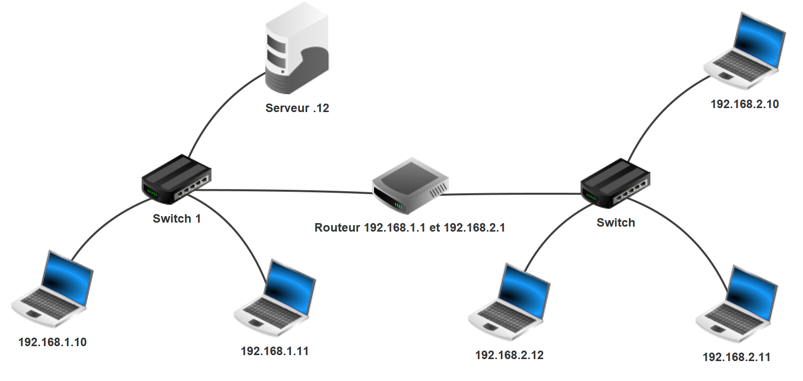

    - Modifier le réseau précédent pour obtenir **deux réseaux interconnectés**.  

    - Essayer de **pinguer** (`ping 1.10 → 2.10`). 

    - Normalement, le message ne peut pas traverser le premier réseau vers le second.  

    **Ajouter une passerelle pour permettre la communication**  
    - Configurer la passerelle du **routeur** :

      - **Réseau 1** : `192.168.1.1`

      - **Réseau 2** : `192.168.2.1`

    - Ajouter la passerelle correspondante sur **chaque ordinateur** (`1.x` et `2.x`). 

    - Pinguer de **1.10** vers **2.10** après configuration.  

    📌 **Test avancé** : Installer un **client générique** sur **2.10** et l’envoyer au **serveur 1.12** avec le message `"Bonjour"`. Observer les **données échangées**.  

???+ question "Activité n°8 : Simulation du web avec adresse IP"

    Installer un **serveur Web** et un **éditeur de texte** sur **1.12**.  

    Modifier le fichier **index.html** (situé dans `/root/webserver`).

    Ajouter **vos propres fichiers** (ou d'autres fichiers que vous avez) en installant un explorateur de document et en important dans `/root/webserver` par exemple :

      - `page1.html`

      - `script.js` (`/js/`)

      - `style.css` (`/css/`)

      - Images (`/images/`)

    Renommer :

      - `index.html` → `indexold.html`

      - `page1.html` → `index.html`

    Sauvegarder les modifications.  

    **Démarrer et tester le serveur Web**  

    - Ouvrir l’application **Serveur Web**, cliquer sur **Démarrer**.  

    - Depuis un **navigateur Web** sur **2.10**, entrer l’URL :  
      ```
      http://192.168.1.12
      ```
    📌 **Problème observé :**  

    - **CSS ne fonctionne pas**. 

    - **Encodage UTF-8 incorrect**.  

???+ question "Activité n°9 : Simulation  du  web  avec  serveur DNS"

    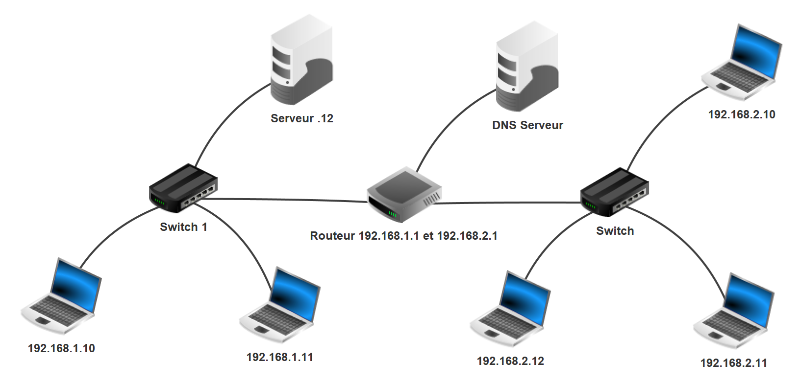

    **Pourquoi utiliser un DNS ?**  

    Sur Internet, on utilise des **noms de domaine** au lieu d’adresses IP. Le **serveur DNS** traduit ces noms en adresses IP.  

    **Configuration d’un serveur DNS**  

    1. Ajouter un **serveur DNS** avec l’IP `192.168.3.10` et comme passerelle `192.168.3.1`.  

    2. Connecter le **serveur DNS** au **routeur** (`192.168.3.1`).  

    3. Ajouter l’**IP du serveur DNS** dans la configuration **réseau de tous les postes**.  

    4. Installer et **paramétrer** l’application **serveur DNS** sur `192.168.3.10` :

      - Associer **www.serverwebdensi.fr** → `192.168.1.12` (serveur Web).  

      - **Démarrer** le serveur DNS.  

    5. Sur **2.10**, tester en tapant dans un navigateur :  
      ```
      http://www.serverwebdensi.fr
      ```
    **Vérification**  

    - Sur **1.10**, ouvrir un terminal et exécuter :  
      ```bash
      host www.serverwebdensi.fr
      ```
    - Observer le résultat.  


???+ question "Activité n°10 : Chemin d’un client à un serveur" 

    - Télécharger le fichier `snt_sim_res.fls` :[snt_sim_res.fls](https://pixees.fr/informatiquelycee/n_site/asset/snt_sim_res.fls).  

    - Lancer un **traceroute** entre **M14** et **M9** :  
      ```bash
      tracert [IP de M9]  # Windows
      traceroute [IP de M9]  # Linux/macOS
      ```
    - Supprimer le câble **routeur F → routeur E** (simulation de panne). 

    - Refaites un **traceroute** entre **M14** et **M9**.  

    📌 **Remarque** : Il se peut que la mise à jour des tables de routage prenne du temps.

    - Si `ping` ne fonctionne pas immédiatement, **attendez quelques secondes et réessayez**.  


???+ question "Activité n°11 : Chemin d’un client à un serveur version graphique" 

    Utiliser le site : [Traceroute en ligne](https://gsuite.tools/traceroute) 

    - Entrer une **URL** pour observer son chemin.  

    **Exemples de sites à tester :**  

    - `gs-cassaigne.fr`  

    - `aliexpress.com`  

    - `www.intechinfo.fr` 

    - `malekal.com`  


[^1]: Network Address Translation : Traduction d’adresse réseau

*Je remercie mon ami Charles Poulmaire pour m’avoir inspiré *