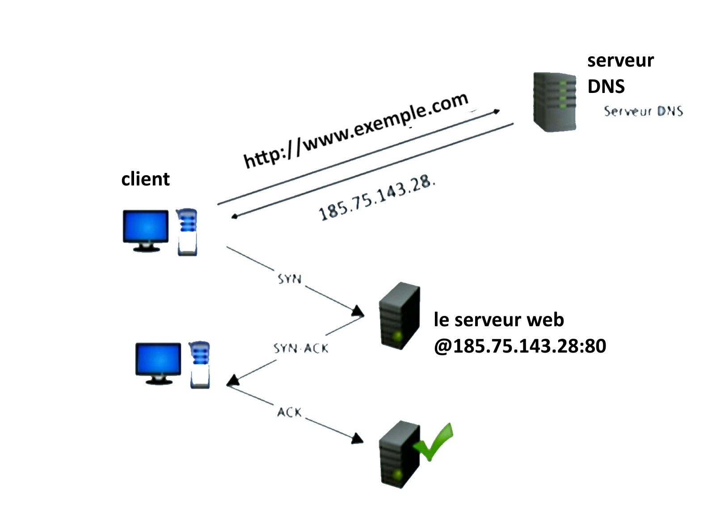
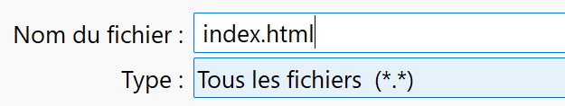
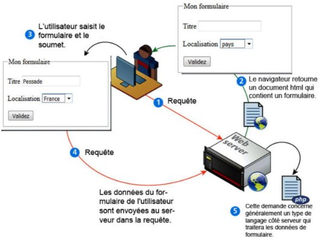
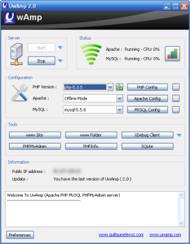
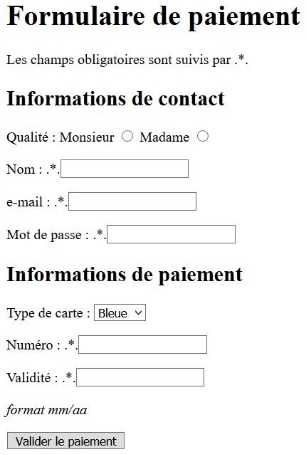

**Table des matières** 

1. [Modèle client/serveur](#1234)
2. [Le protocole HTTP](#2345)
3. [APPLICATION : Création d’une page web dynamique](#3456)
4. [Exercices](#4567)


## **<H2 STYLE="COLOR:BLUE;">1. Modèle<a name="1234"></a> client/serveur**</H2>
### <H3 STYLE="COLOR:GREEN;"> **1.1. La résolution de nom : obtenir l'adresse IP du site</h3>**

Lorsqu’un utilisateur saisit une URL dans la barre d’adresse d’un navigateur, par exemple :
`http://www.exemple.com/index.html`, le navigateur doit **trouver l’adresse IP** du serveur pour pouvoir lui envoyer une requête.


📌 **Structure d’une URL**

```
protocole://nom-de-domaine:port/chemin?paramètre1=valeur1&paramètre2=valeur2#ancre
```

🔍 **Explication:**

✔️ `protocole` → HTTP ou HTTPS (selon que la connexion est sécurisée ou non)

✔️ `nom-de-domaine` → Adresse du serveur (ex. : `www.example.com`)

✔️ `:port` → (Facultatif) numéro de port utilisé (ex. `:443` pour HTTPS, `:80` pour HTTP)

✔️ `chemin` → Page demandée ou ressource (`/index.html`)

✔️ `?paramètre1=valeur1` → Paramètres transmis dans l’URL (ex. recherche)

✔️ `#ancre` → Cible une **section précise** d’une page (ex. `#Algorithmique`)

💡 **Exemple concret**

```
https://fr.wikipedia.org/wiki/Informatique#Algorithmique
```

➡️ Le fragment `#Algorithmique` permet **d’accéder directement à la section "Algorithmique"** de la page.

???+ question "Activité n°1 : 🧪 **Passage de paramètres à un serveur**"

    1️⃣ Va sur [Wikipedia](https://fr.wikipedia.org/)

    2️⃣ Tape **"informatique"** dans la barre de recherche

    3️⃣ Observe et **note l’URL générée**

    4️⃣ Compare les deux URLs suivantes :

    * [https://fr.wikipedia.org/w/index.php?search=informatique](https://fr.wikipedia.org/w/index.php?search=informatique)

    * [https://fr.wikipedia.org/wiki/Informatique#Algorithmique](https://fr.wikipedia.org/wiki/Informatique#Algorithmique)

    ❓ **Que remarquez-vous ?**

    📌 La première URL utilise un **paramètre de recherche** (`?search=informatique`) → typique d’une requête **GET**.

    📌 La deuxième URL cible une **page existante** + une **ancre** (`#Algorithmique`) pour aller **directement à une section précise**.

    ??? success "Solution"

        ```https://fr.wikipedia.org/w/index.php?search=informatique``` : Cette URL contient un **paramètre de requête** (après le `?`) : `search=informatique`
        
        Cela signifie que :

        * Le **navigateur envoie une requête GET** au **serveur Wikipedia**

        * Le serveur interprète le paramètre `search` pour effectuer une **recherche du mot "informatique"**
   

        La première URL montre un **formulaire de recherche avec la méthode GET**

        La deuxième URL utilise une **ancre HTML** pour accéder **directement à une section** d’une page déjà existante

        **GET permet de transmettre des paramètres** dans l’URL, tandis que `#` sert à **naviguer à l’intérieur de la page**


Cependant, sur Internet, les machines ne sont identifiées **ni par leur nom**, ni par leur URL, mais par leur **adresse IP**.


🌐 **Rôle du DNS (Domain Name System)**

Le **serveur DNS** est chargé de faire la correspondance entre un **nom de domaine** et son **adresse IP**. C’est l’équivalent d’un annuaire téléphonique pour Internet.


🔄 **Processus de résolution DNS :**

1. **Le navigateur consulte le cache local** :
   Il vérifie s’il a déjà l’adresse IP correspondant au nom de domaine.

2. **Si ce n’est pas le cas, il envoie une requête DNS** à :

   * La **box internet** (DNS local)
   * Le **serveur DNS du fournisseur d’accès à Internet (FAI)**
   * Ou un **serveur DNS public** (ex. : Google DNS `8.8.8.8`, Cloudflare `1.1.1.1`)

3. **Réponse du serveur DNS** :
   Il retourne l’adresse IP associée au nom de domaine. Cette IP est alors stockée en cache pour les prochaines requêtes.

Une fois l'adresse IP envoyé, il y a établissement de la connextion TCP selon le modèle déjà étudié :

* le client envoie un paquet SYN à l'adresse IP
* le serveur lui répond avec un paquet SYN - ACK
* le client renvoie un accusé de réception au serveur




### **<H3 STYLE="COLOR:GREEN;">1.2. Principe<a name="_page1_x40.00_y564.92"></a> d’une requête HTTP**</H3>

Une fois que la connexion est établie, le client va faire sa **requête HTTP** au serveur web. Le **HyperText Transfer Protocol (HTTP)** est un protocole de communication entre un **client** et un **serveur**. Il permet l’**envoi de requêtes** par le client et la **réception de réponses** du serveur.  

**Structure d’une requête HTTP**

```http
GET /recherche?q=chat HTTP/1.1
Host: www.exemple.com
User-Agent: Mozilla/5.0 (Windows NT 10.0; Win64; x64)
Accept: text/html
Connection: close
```

🧩 **Explication**


* **`GET`** : méthode HTTP utilisée ici. Elle demande au serveur de **récupérer une ressource** (en lecture seule, sans modification côté serveur).

* **`/recherche?q=chat`** : chemin d’accès à la ressource.
  > * `/recherche` est le chemin (endpoint) sur le serveur.
  > * `?q=chat` est un **paramètre de requête** (query string) signifiant ici qu’on cherche le mot "chat".

* **`HTTP/1.1`** : version du protocole HTTP utilisée. 

* **`Host: www.exemple.com`**

    > * Ce champ **obligatoire en HTTP/1.1** indique **le nom du serveur cible** (nom de domaine).

    > * Permet à un même serveur d’héberger plusieurs sites web (virtualisation).

* **`User-Agent: Mozilla/5.0 (Windows NT 10.0; Win64; x64)`**

    > * Ce champ permet d’indiquer **qui fait la requête** (navigateur, version, OS...).

    > * Ici, c’est un navigateur Mozilla Firefox tournant sur Windows 10.

* **`Accept: text/html`** : Indique **le type de contenu** attendu par le client (ici, du HTML).

* **`Connection: close`** : Indique que le client souhaite **fermer la connexion TCP** après la réponse.


### **<H3 STYLE="COLOR:GREEN;">1.3. Réponse du serveur**</H3>

📩 **Exemple de réponse HTTP**

```http
HTTP/1.1 200 OK
Date: Tue, 15 Jul 2025 08:30:00 GMT
Server: Apache/2.4.41 (Ubuntu)
Content-Type: text/html; charset=UTF-8
Content-Length: 1024
Connection: close

<!DOCTYPE html>
<html>
  <head><title>Résultat de la recherche</title></head>
  <body>
    <h1>Résultats pour "chat"</h1>
    <p>Voici les résultats de votre recherche...</p>
  </body>
</html>
```


🧩 **Explication**


* **`HTTP/1.1`** : version du protocole HTTP utilisée pour la réponse.

* **`200 OK`** : **code de statut** suivi de son message. Ici :

    > * `200` signifie que la requête a réussi.
    >
    > * `OK` est un message humainement lisible.
    > 
    > 🧠 Autres exemples de statuts :
    >
    > * `404 Not Found` → ressource inexistante.
    >
    > * `500 Internal Server Error` → erreur côté serveur.

* `Date: Tue, 15 Jul 2025 08:30:00 GMT` : Indique la **date et l'heure** à laquelle la réponse a été générée.

* **`Server: Apache/2.4.41 (Ubuntu)`** : Donne des informations sur le **logiciel serveur web** utilisé : **Apache** version 2.4.41 tournant sous **Ubuntu**.

* **`Content-Type: text/html; charset=UTF-8`**
    
    > Indique le **type de contenu** de la réponse.
    >
    > Ici :
    >
    > * `text/html` signifie que le corps est une page HTML.
    >
    > * `charset=UTF-8` précise l’encodage des caractères (important pour les accents !).

* **`Content-Length: 1024`** : Spécifie la **taille du corps de la réponse** en octets (ici 1024 octets) : permet au client de savoir combien d’octets il doit lire.

* **`Connection: close`** :  Le serveur signale que la connexion TCP va être **fermée** après cette réponse.

* 📄 **Corps de la réponse (à partir de la 7e ligne)**
    
    > Tout ce qui vient **après la ligne vide** (séparateur) constitue le **corps** de la réponse, ici une **page HTML**.

### **<H3 STYLE="COLOR:GREEN;">1.4. Le protocole HTTPS**</H3>

🔹 **Différences entre HTTP et HTTPS**  

✔️ **HTTP** → Données **non chiffrées**, vulnérables aux attaques  

✔️ **HTTPS** → Données **chiffrées** grâce au protocole TLS  


✅ **Pourquoi HTTPS est indispensable aujourd’hui ?**

* 🔐 **Sécurité** : mots de passe, paiements, données personnelles… tout est **protégé**
* 🛡️ **Confiance** : présence du **cadenas 🔒** dans la barre d’adresse
* 📈 **Référencement** : Google favorise les sites en **HTTPS** dans les résultats
* 🌍 **Standard web** : Tous les sites sérieux l’utilisent (e-commerce, banque, réseaux sociaux…)


## **<H2 STYLE="COLOR:BLUE;">2. Les langages <a name="2345"></a> clients**</H2>


### **<H3 STYLE="COLOR:GREEN;">2.1. HTML, CSS, JS**</H3>

📄 **Quand vous consultez une page web**, le **navigateur du client (votre ordinateur)** reçoit du code écrit en trois langages essentiels :

* **HTML** : structure la page (titres, paragraphes, formulaires, etc.)
* **CSS** : gère l’apparence visuelle (couleurs, marges, mise en forme…)
* **JavaScript** : rend la page interactive (animations, menus déroulants, traitement de formulaires…)

💡 Ces langages sont dits **"clients"** car ils sont **interprétés par le navigateur du client**, sans intervention du serveur (sauf pour les données).


### **<H3 STYLE="COLOR:GREEN;">2.2. Les méthodes HTTP : GET vs POST**</H3>

💬 Lorsqu’un utilisateur envoie des données via un **formulaire HTML**, deux méthodes principales sont utilisées :

* `GET` : données dans l’URL (visible)
* `POST` : données dans le corps de la requête (invisible)


🔹 1️⃣ Formulaire avec la méthode `GET` (⚠️ données visibles)

```html
<form method="GET" action="/search">
    <input type="text" name="query" placeholder="Rechercher">
    <button type="submit">Rechercher</button>
</form>
```

➡️ Exemple d’URL après envoi :

```
https://www.example.com/search?query=informatique
```

⚠️ **Problème** : les données sont **visibles dans l’URL**. Elles peuvent être stockées dans l’historique, partagées, interceptées.


🔹 2️⃣ Formulaire avec la méthode `POST` (✔️ plus sécurisé)

```html
<form method="POST" action="/login">
    <input type="text" name="username" placeholder="Nom d'utilisateur">
    <input type="password" name="password" placeholder="Mot de passe">
    <button type="submit">Se connecter</button>
</form>
```

✅ Les données sont envoyées **dans le corps** de la requête HTTP → **non visibles dans l’URL**.


???+ question "🔧 Activité n°2"
        
    Objectif : Créer un fichier HTML avec un formulaire en méthode `GET` pour **observer l’URL générée**.

    🔸 **Étapes :**

    1. Ouvrir le Bloc-notes
    2. Copier le code suivant :

    ```html
    <!DOCTYPE html>
    <html lang="fr">
    <head>
    <meta charset="UTF-8">
    <title>Requête</title>
    </head>
    <body>
    <form method="GET" action="./login">
        <input name="user" type="text" required placeholder="Nom d'utilisateur">
        <input name="password" type="password" required placeholder="Mot de passe">
        <button type="submit">Login</button>
    </form>
    </body>
    </html>
    ```

    3 Enregistrer sous : `index.html`

    📌 **Attention** : choisir « Tous les fichiers » dans le type lors de l’enregistrement.
    

    ??? success "Solution"

        * Ce formulaire fonctionne en GET : les données sont ajoutées à l’URL.

        * C’est utile pour faire des recherches, tester ou partager un lien, mais pas pour des données sensibles.

        * Pour un mot de passe, il faudra utiliser la méthode POST.


???+ question "🔍 Activité n°3 : observer l’URL générée"

    Remplir le formulaire avec :

    * 👤 **Nom d'utilisateur** : `Dupont`
    * 🔑 **Mot de passe** : `azerty`

    ➡ Après clic sur "Login", l’URL devient :

    ```
    ./login?user=dupont&password=azerty
    ```

    🛑 **Problème identifié :**

    * Le mot de passe est **visible dans l’URL**.

    * Risque de fuite, stockage dans l’historique, partage involontaire…

???+ question "🔐 Activité n°4 : passer à la méthode POST"

    🎯 Objectif : protéger les données sensibles en utilisant `POST`.

    ✅ **Étapes :**

    1. Modifier l’attribut `method` :

    ```html
    <form method="POST" action="./login">
    ```

    2 Recharger la page dans le navigateur, remplir le formulaire et observer :

    * L’**URL reste la même**
    
    * Les données sont **envoyées dans le corps de la requête**, donc **non visibles** dans l’URL

    ??? success "Solution"

        La méthode POST est donc plus adaptée aux formulaires contenant des informations confidentielles, comme des mots de passe ou des identifiants.


📄 Exemple de requête HTTP POST

```
POST /login HTTP/1.1
Host: monsite.com
Content-Type: application/x-www-form-urlencoded
Content-Length: 32

user=dupont&password=azerty
```

🧠 Récapitulatif : GET vs POST

| Critère                        | **GET**                    | **POST**                       |
| ------------------------------ | -------------------------- | ------------------------------ |
| **Visibilité des données**     | ✔️ Dans l’URL              | ❌ Non, dans le corps           |
| **Sécurité**                   | ❌ Faible                   | ✅ Plus sécurisé                |
| **Taille des données**         | ⚠️ Limitée (URL max \~2Ko) | ✅ Plus grande (corps illimité) |
| **Stockage dans l’historique** | ✔️ Oui                     | ❌ Non                          |
| **Exemples d’usage**           | 🔍 Recherche, filtres      | 🔐 Login, paiement, contact    |

💡 **Bonne pratique** : Toujours utiliser **`POST`** pour transmettre **des mots de passe ou données personnelles**.


### **<H3 STYLE="COLOR:GREEN;">2.3. Les éléments d’un formulaire HTML**</H3>

Un formulaire HTML est composé de plusieurs éléments permettant de structurer et saisir des données. 
Dans les activités, on utilisera la méthode GET pour mieux comprendre et voir les données directement dans l’URL.


???+ question "**🧪 Activité n°5: Découverte d’un formulaire HTML**"

    1. Crée un fichier dans un éditeur de texte (Notepad sous Windows, TextEdit sur Mac,...)

    2. Copie-colle le code suivant dans le fichier :

    ```html
    <!DOCTYPE html>
    <html lang="fr">
    <head>
    <meta charset="UTF-8">
    <title>Formulaire de test</title>
    </head>
    <body>
    <form method="get" action="">
        <fieldset>
        <legend>Mon formulaire</legend>

        <p>
            <label>Titre :</label>
            <input type="text" name="titre">
        </p>

        <p>
            <label>Localisation :</label>
            <select name="lieu">
            <option>pays</option>
            <option>Canada</option>
            <option>Finlande</option>
            <option>France</option>
            </select>
        </p>

        <input type="submit" value="Validez">
        </fieldset>
    </form>
    </body>
    </html>
    ```

    3 Enregistrer sous : `formulaire.html`

    📌 **Attention** : choisir « Tous les fichiers » dans le type lors de l’enregistrement.
    

    4 Ouvrir le fichier dans un navigateur Internet

    5 🧠 Questions d’exploration (à faire avec le fichier ouvert dans le navigateur)

    a. **Remplis le champ "Titre" et choisis un pays dans la liste, puis clique sur "Validez".**

    * Que se passe-t-il ?
    
    * Que remarques-tu dans la barre d'adresse (URL) ?

    b. **Observe l’URL générée. Que signifient les mots qui apparaissent après le `?` ?**

    * Exemple : `?titre=Test&lieu=France`
    
    * Quels noms correspondent aux champs du formulaire ? À quelles valeurs ?

    c. **Modifie l’attribut `method="get"` en `method="post"`, puis recharge la page.**

    * Recommence le test.
    
    * Que remarques-tu cette fois dans l’URL ?
     
    * Pourquoi n'y a-t-il rien dans la barre d'adresse ?

    ??? success "Solution"

        🔹 **a. Remplis le champ "Titre" et choisis un pays, puis clique sur "Validez".**

        * ✅ **Ce qui se passe** : la page se recharge, et l’**URL est modifiée**.

        * Exemple d’URL après validation :  ```file:///.../formulaire.html?titre=Bonjour&lieu=Canada```

        🔹 **b. Observe l’URL générée. Que signifient les mots après le `?` ?**

        * Ce sont les **données transmises par le formulaire**, encodées dans l’URL.

        * `titre=Bonjour` → correspond au champ `<input name="titre">`

        * `lieu=Canada` → correspond au champ `<select name="lieu">`

        * Le signe `&` sépare les différents paramètres.

        🧠 **Règle** :

        * **`name="..."`** détermine le **nom du paramètre**

        * La valeur saisie ou sélectionnée devient la **valeur du paramètre**

        🔹 **c. Modifie `method="get"` en `method="post"`, recharge la page et recommence.**

        * ✅ **Ce qui se passe** : la page **ne change pas visiblement**, mais :

            * L’URL **reste la même**
            
            * Les données **ne sont plus visibles dans l’URL**

        📌 **Pourquoi ?**
        Parce que la méthode **`POST`** envoie les données **dans le corps de la requête HTTP**, et non dans l’URL.


🧠 **Bilan**

| **Type**        | **Description** |
|----------------|---------------|
| `<button>`     | Définit un bouton cliquable. |
| `<fieldset>`   | Regroupe les éléments liés dans un formulaire. |
| `<form>`       | Définit le conteneur de formulaire. |
| `<input>`      | Définit un champ de saisie. |
| `<label>`      | Définit une étiquette pour un élément de formulaire. |
| `<legend>`     | Définit l’étiquette d’un groupe de champs. |
| `<option>`     | Définit une option dans une liste déroulante. |
| `<optgroup>`   | Regroupe des options connexes dans une liste. |
| `<select>`     | Définit une liste à choix multiples. |
| `<textarea>`   | Définit une zone de saisie de texte multiligne. |


???+ question "🧪 **Activité n°6: Créer et tester un formulaire HTML avec différents champs**"

    1. Crée un nouveau fichier nommé `formulaire2.html`

    2. Copie-colle le code suivant dans le fichier :

    ```html
    <!DOCTYPE html>
    <html lang="fr">
    <head>
    <meta charset="UTF-8">
    <title>Formulaire 2</title>
    </head>
    <body>
    <form method="get" action="">
        <p>
        Prénom : <input type="text" name="prenom">
        </p>

        <p>
        Mot de passe : <input type="password" name="psw">
        </p>

        <p>
        Genre :<br>
        <input type="radio" name="genre" value="homme"> homme<br>
        <input type="radio" name="genre" value="femme" checked> femme<br>
        <input type="radio" name="genre" value="non"> ne souhaite pas répondre
        </p>

        <p>
        Véhicules :<br>
        <input type="checkbox" name="vehicule" value="velo" checked> J’ai un vélo<br>
        <input type="checkbox" name="vehicule" value="auto"> J’ai une voiture
        </p>

        <input type="submit" value="Valider">
    </form>
    </body>
    </html>
    ```

    3 🔍 **Questions de compréhension (à faire après test dans le navigateur)**

    a. **Remplis le champ prénom, choisis un genre, sélectionne les moyens de transport, puis clique sur "Valider".**

    * Que vois-tu apparaître dans l’URL après le `?` ?
    
    * Que représentent les parties `prenom=...`, `genre=...`, `vehicule=...` ?

    b. **Coche uniquement "J’ai une voiture". Quelle différence dans l’URL ?**

    * Que se passe-t-il si aucun véhicule n’est coché ?

    c. **Pourquoi peut-on cocher plusieurs cases pour les véhicules, mais un seul genre ?**

    d. **Quel est le rôle de l’attribut `checked` ? Peux-tu modifier le fichier pour que "homme" soit sélectionné par défaut ?**

    ??? success "Solution"

        🔹 a. Remplis tous les champs et clique sur **"Valider"**

        Exemple de test :

        * Prénom : `Alice`
        * Genre : `femme`
        * Véhicules : `J’ai un vélo`

        🔎 Résultat dans l’URL :```formulaire2.html?prenom=Alice&psw=&genre=femme&vehicule=velo```

        ✅ Explication :

        * `prenom=Alice` → champ texte
        * `psw=` → champ mot de passe vide
        * `genre=femme` → bouton radio sélectionné
        * `vehicule=velo` → case cochée

        **Chaque `name` dans le formulaire devient un paramètre** dans l’URL.

        🔹 b. Coche uniquement **"J’ai une voiture"** (décocher vélo)

        🔎 Résultat :```...&vehicule=auto```

        ✅ Seule la **valeur de la case cochée** est transmise.
        ❌ Si **aucune case** n’est cochée, **`vehicule` n’apparaît pas du tout** dans l’URL.
        👉 Cela montre que **seuls les champs cochés ou remplis sont envoyés** avec la méthode `GET`.

        🔹 c. Pourquoi peut-on cocher plusieurs véhicules, mais un seul genre ?

        👉 C’est le fonctionnement HTML :

        * `radio` impose **un choix exclusif**
        * `checkbox` permet **plusieurs réponses**

        🔹 d. Quel est le rôle de `checked` ? Peut-on changer l’option par défaut ?

        ✅ L’attribut `checked` permet de **pré-sélectionner** une case ou un bouton.


🧠 **Bilan**

| Élément HTML      | Rôle                                      |
| ----------------- | ----------------------------------------- |
| `type="text"`     | Saisie libre (ex : prénom)                |
| `type="password"` | Masque le texte saisi (ex : mot de passe) |
| `type="radio"`    | Un seul choix possible dans un groupe     |
| `type="checkbox"` | Plusieurs choix possibles                 |
| `type="submit"`   | Envoie les données                        |
| `checked`         | Rend une option sélectionnée par défaut   |


???+ question "🧪 **Activité n°7 : HTML : Explorer les menus déroulants `<select>` et les valeurs envoyées**"

    📄 **Partie 1 – Menu déroulant simple**

    1. Crée un fichier `menu1.html`
    2. Copie-colle ce code :

    ```html
    <!DOCTYPE html>
    <html lang="fr">
    <head>
    <meta charset="UTF-8">
    <title>Menu déroulant simple</title>
    </head>
    <body>
    <form method="get">
        <label for="choix">Choisis une option :</label><br>
        <select name="choix" id="choix">
        <option>Option 1</option>
        <option selected>Option 2</option>
        <option>Option 3</option>
        </select>
        <br><br>
        <input type="submit" value="Envoyer">
    </form>
    </body>
    </html>
    ```

    3 **Questions :**

    * Quelle option est sélectionnée par défaut ?
    
    * Que vois-tu dans l’URL après avoir cliqué sur "Envoyer" ?
    
    * Modifie l’attribut `selected` pour que "Option 1" soit sélectionnée par défaut. Vérifie le résultat.

    📄 **Partie 2 – Valeurs envoyées avec `value`**

    1. Crée un nouveau fichier `menu2.html`
    2. Utilise ce code :

    ```html
    <form method="get">
    <label>Choix codé :</label><br>
    <select name="choix">
        <option value="1">Option 1</option>
        <option value="2" selected>Option 2</option>
        <option value="3">Option 3</option>
    </select>
    <br><br>
    <input type="submit" value="Envoyer">
    </form>
    ```

    3 🧠 **Questions :**

    * Quelle est la valeur envoyée dans l’URL ?
    
    * Que se passe si tu sélectionnes "Option 3" ?
    
    * Quelle est la différence entre le texte affiché et la donnée réellement transmise ?

    📄 **Partie 3 – Menu élargi avec `size` (liste déroulante dépliée)**

    ```html
    <form method="get">
    <label>Liste visible (3 lignes) :</label><br>
    <select name="choix" size="3">
        <option>Un</option>
        <option>Deux</option>
        <option>Trois</option>
        <option>Quatre</option>
    </select>
    <br><br>
    <input type="submit" value="Envoyer">
    </form>
    ```

    🧠 **Questions :**

    * Qu’est-ce qui change visuellement avec `size="3"` ?
    
    * Peut-on toujours sélectionner plusieurs éléments ?
    
    * Si non, comment modifier cela ? (💡 : `multiple`)

    📄 **Partie 4 – Menu groupé avec `<optgroup>`**

    ```html
    <form method="get">
    <label>Choisis une ville :</label><br>
    <select name="ville">
        <optgroup label="Amérique du Nord">
        <option>Montréal</option>
        <option>New York</option>
        </optgroup>
        <optgroup label="Europe">
        <option>Paris</option>
        <option>Berlin</option>
        </optgroup>
    </select>
    <br><br>
    <input type="submit" value="Envoyer">
    </form>
    ```

    🧠 **Questions :**

    * Quelle est l’utilité de `<optgroup>` ?
    
    * Est-ce que `<optgroup>` a un rôle dans les données transmises ?
    
    * Comment rendre ce menu plus clair pour l’utilisateur ?


    ??? success "Solution"

        📄 **Partie 1 – Menu déroulant simple**

        🧠 **Questions :**

        | Question                                                                                               | Réponse attendue                                                                                    |
        | ------------------------------------------------------------------------------------------------------ | --------------------------------------------------------------------------------------------------- |
        | ❓ Quelle option est sélectionnée par défaut ?                                                          | **Option 2**, car elle est marquée `selected`.                                                      |
        | ❓ Que vois-tu dans l’URL après avoir cliqué sur "Envoyer" ?                                            | Quelque chose comme `...?choix=Option+2` si Option 2 était sélectionnée.                            |
        | ❓ Modifie l’attribut `selected` pour que "Option 1" soit sélectionnée par défaut. Vérifie le résultat. | Il faut déplacer `selected` vers `<option>Option 1</option>` → `<option selected>Option 1</option>` |

        📄 **Partie 2 – Valeurs envoyées avec `value`**

        🧠 **Questions :**

        | Question                                                                              | Réponse attendue                                                                                                                                        |
        | ------------------------------------------------------------------------------------- | ------------------------------------------------------------------------------------------------------------------------------------------------------- |
        | ❓ Quelle est la valeur envoyée dans l’URL ?                                           | **1**, **2** ou **3**, selon l’option choisie. Par défaut, c’est `choix=2`.                                                                             |
        | ❓ Que se passe si tu sélectionnes "Option 3" ?                                        | L’URL devient `...?choix=3`.                                                                                                                            |
        | ❓ Quelle est la différence entre le texte affiché et la donnée réellement transmise ? | Le texte visible est `"Option 3"`, mais la valeur transmise est `"3"`. On peut donc afficher un libellé parlant tout en transmettant un code simplifié. |

        📄 **Partie 3 – Menu élargi avec `size="3"`**

        🧠 **Questions :**

        | Question                                              | Réponse attendue                                                                                                            |
        | ----------------------------------------------------- | --------------------------------------------------------------------------------------------------------------------------- |
        | ❓ Qu’est-ce qui change visuellement avec `size="3"` ? | Le menu **est déplié** et affiche **directement 3 options visibles** sans clic.                                             |
        | ❓ Peut-on toujours sélectionner plusieurs éléments ?  | Non, **seulement un** élément à la fois est sélectionnable.                                                                 |
        | ❓ Si non, comment modifier cela ?                     | Il faut ajouter l’attribut `multiple` → `<select name="choix" size="3" multiple>` pour permettre la **sélection multiple**. |

        ---

        ### 📄 **Partie 4 – Menu groupé avec `<optgroup>`**

        🧠 **Questions :**

        | Question                                                          | Réponse attendue                                                                                                                                                                                                                                                                                                  |
        | ----------------------------------------------------------------- | ----------------------------------------------------------------------------------------------------------------------------------------------------------------------------------------------------------------------------------------------------------------------------------------------------------------- |
        | ❓ Quelle est l’utilité de `<optgroup>` ?                          | Elle permet de **regrouper visuellement les options** sous un même intitulé, pour **mieux organiser** les choix (par zone géographique ici).                                                                                                                                                                      |
        | ❓ Est-ce que `<optgroup>` a un rôle dans les données transmises ? | Non, seul l’élément `<option>` sélectionné est envoyé (ex. `ville=Paris`), **l’optgroup ne fait que structurer visuellement**.                                                                                                                                                                                    |
        | ❓ Comment rendre ce menu plus clair pour l’utilisateur ?          | En ajoutant des **libellés explicites** dans les `<optgroup>`, en **classant logiquement** les options, et en précisant le **choix à faire** via le `<label>`. On peut aussi ajouter une première option grisée de type : `<option disabled selected>Choisissez une ville...</option>` pour guider l'utilisateur. |


📦 **Bilan**

| Élément    | Rôle                                            |
| ---------- | ----------------------------------------------- |
| `<select>` | Crée un menu déroulant                          |
| `selected` | Définit l’option par défaut                     |
| `value`    | Détermine la valeur envoyée au serveur          |
| `size`     | Affiche plusieurs lignes visibles en même temps |
| `optgroup` | Regroupe visuellement les options               |


???+ question "🧪 **Activité n°8 : Explorer les différents boutons HTML**"

    📁 **Partie 1 – Crée un formulaire avec 3 types de boutons**

    1. Crée un fichier `boutons1.html`
    2. Colle le code suivant :

    ```html
    <!DOCTYPE html>
    <html lang="fr">
    <head>
    <meta charset="UTF-8">
    <title>Test des boutons HTML</title>
    </head>
    <body>
    <form action="" method="get">
        Prénom : <input type="text" name="prenom"><br><br>

        <input type="submit" value="Envoyer">
        <input type="reset" value="Réinitialiser">
        <input type="button" value="Ne fait rien">
    </form>
    </body>
    </html>
    ```
    3 🔍 Questions :

    a. Que fait le bouton **"Envoyer"** ?
    
    b. Que fait le bouton **"Réinitialiser"** ?
     
    c. Que fait le bouton **"Ne fait rien"** ?
    
    d. Peux-tu modifier l’URL du formulaire avec la méthode GET pour voir les données envoyées ?

    📁 **Partie 2 – Bouton avec image**

    1. Crée un fichier `boutons2.html`
    2. Colle ce code (utilise une image comme bouton) :

    ```html
    <form method="get">
    <p>Clique sur l'image pour envoyer :</p>
    <input type="image" src="https://upload.wikimedia.org/wikipedia/commons/thumb/e/e8/Calendar_font_awesome.svg/48px-Calendar_font_awesome.svg.png" alt="Envoyer" width="40" height="40">
    </form>
    ```

    3 🔍 Questions :

    a. Que se passe-t-il quand tu cliques sur l’image ?
    
    b. Est-ce que l’image est un bouton "submit" ?
    
    c. Quelle différence avec un vrai `<input type="submit">` ?

    📁 **Partie 3 – Bouton personnalisé avec `<button>`**

    ```html
    <form method="get">
    <button type="submit">
        
        Éditer
    </button>
    </form>
    ```

    🔍 Questions :

    a. Ce bouton est-il un "submit" ou un simple bouton ?
    
    b. Que contient ce bouton en plus par rapport à `<input>` ?
    
    c. Peux-tu ajouter un champ de formulaire au-dessus pour voir si ça envoie bien les données ?


    📁 **Partie 4 – Bouton avec lien**

    ```html
    <button>
    <a href="https://www.wikipedia.org">
        
        Aller sur Wikipedia
    </a>
    </button>
    ```

    ⚠️ Attention : Ce bouton **n’envoie pas de formulaire**, il agit comme un **lien décoré**.

    ??? success "Solution"
    
        📁 **Partie 1 – Formulaire avec 3 types de boutons**

        🧠 **Questions :**

        | Question                                                   | Réponse attendue                                                                                                                  |
        | ---------------------------------------------------------- | --------------------------------------------------------------------------------------------------------------------------------- |
        | a. Que fait le bouton **"Envoyer"** ?                      | Il **soumet** le formulaire. Avec la méthode `GET`, les données sont visibles dans l’URL, par exemple : `?prenom=Elisa`.          |
        | b. Que fait le bouton **"Réinitialiser"** ?                | Il **efface** les champs du formulaire (remise à zéro).                                                                           |
        | c. Que fait le bouton **"Ne fait rien"** ?                 | Rien du tout par défaut. C’est un **bouton neutre**, il n’exécute aucune action sans JavaScript.                                  |
        | d. Peux-tu modifier l’URL pour voir les données envoyées ? | Oui, en entrant une valeur dans le champ "Prénom" puis en cliquant sur **Envoyer**, on observe une URL comme : `...?prenom=Jean`. |

        📁 **Partie 2 – Bouton avec image (`<input type="image">`)**

        🧠 **Questions :**

        | Question                                                    | Réponse attendue                                                                                                         |
        | ----------------------------------------------------------- | ------------------------------------------------------------------------------------------------------------------------ |
        | a. Que se passe-t-il quand tu cliques sur l’image ?         | Le formulaire est **envoyé**. L’image agit comme un **bouton de soumission**.                                            |
        | b. Est-ce que l’image est un bouton "submit" ?              | Oui, c’est un **`input type="image"`**, donc elle déclenche un **submit**.                                               |
        | c. Quelle différence avec un vrai `<input type="submit">` ? | Elle **envoie en plus les coordonnées** du clic dans l’image via les paramètres `x` et `y` de l’URL (ex : `?x=12&y=34`). |

        📁 **Partie 3 – Bouton personnalisé avec `<button>`**

        🧠 **Questions :**

        | Question                                                    | Réponse attendue                                                                                                                                    |
        | ----------------------------------------------------------- | --------------------------------------------------------------------------------------------------------------------------------------------------- |
        | a. Ce bouton est-il un "submit" ou un simple bouton ?       | Oui, grâce à l’attribut `type="submit"`, c’est bien un **bouton de soumission**.                                                                    |
        | b. Que contient ce bouton en plus par rapport à `<input>` ? | Il peut contenir **du HTML enrichi** : images, texte stylé, icônes, etc.                                                                            |
        | c. Peux-tu ajouter un champ de formulaire au-dessus ?       | Oui. Si on ajoute par exemple : `<input name="prenom" type="text">`, alors cliquer sur le bouton **envoie bien la donnée `prenom=...`** dans l’URL. |

        📁 **Partie 4 – Bouton avec lien (faux bouton)**

        🧠 **Explication :**

        | Éléments       | Observations                                                                                                                                                                                                           |
        | -------------- | ---------------------------------------------------------------------------------------------------------------------------------------------------------------------------------------------------------------------- |
        | Code utilisé   | `<button><a href="...">...</a></button>`                                                                                                                                                                               |
        | Fonctionnement | Ce n’est **pas un vrai bouton de formulaire**. Il agit comme un **lien cliquable stylisé**.                                                                                                                            |
        | Que fait-il ?  | Il **redirige vers un autre site** (ici Wikipedia) sans soumettre de données.                                                                                                                                          |
        | Problème ?     | Il est préférable de ne **pas imbriquer un `<a>` dans un `<button>`**, car ce n’est pas conforme HTML5. Il vaut mieux utiliser directement : `<a class="button" href="...">Aller sur Wikipedia</a>` avec un style CSS. |


🧠 **Bilan**

| Balise                   | Rôle                                            |
| ------------------------ | ----------------------------------------------- |
| `<input type="submit">`  | Envoie le formulaire                            |
| `<input type="reset">`   | Réinitialise les champs                         |
| `<input type="button">`  | Ne fait rien sans JS                            |
| `<input type="image">`   | Agit comme un bouton submit avec une image      |
| `<button type="submit">` | Bouton plus riche (peut contenir texte + image) |
| `<button>` + `<a>`       | Simule un lien stylisé                          |


### **<H3 STYLE="COLOR:GREEN;">2.4. Comment le serveur interagit avec le formulaire?**</H3>



1. **Le client (navigateur) envoie une requête initiale au serveur** pour afficher une page contenant un formulaire (fichier `.html` ou `.php`).
2. **Le serveur retourne une page HTML** contenant le formulaire à remplir.
3. **L’utilisateur remplit le formulaire** dans son navigateur et clique sur "Valider".
4. **Le navigateur envoie une nouvelle requête HTTP** avec les **données du formulaire** (via `GET` ou `POST`) au **serveur**.
5. **Le serveur traite ces données** grâce à un **langage côté serveur** : c’est là qu’intervient **PHP** (ou un autre langage comme Python, Node.js, etc.).

## **<H2 STYLE="COLOR:BLUE;">3. APPLICATION<a name="3456"></a> : Création d’une page web dynamique** 🌍💻</H2>
Un site web peut être **statique** (HTML pur) ou **dynamique** (généré à la volée par un langage comme PHP).  

Nous allons mettre en place un **serveur web local** et apprendre à **créer une page dynamique en PHP**.


 


### **<H3 STYLE="COLOR:GREEN;">3.1. Mise en place d’un serveur Apache Wamp** 🚀</H3>  

📥 **Téléchargement**  

Télécharger un serveur WAMP : [UwAmp Wamp Server - Apache MySQL PHP](https://www.uwamp.com/fr/)  
Normalement, il s’installe dans `C:\UwAmp`. 

???+ question "**Activité n°9**"

    **Démarrer le serveur WAMP**  

    - Ouvrir `UwAmp.exe` et s'assurer qu'Apache et MySQL sont en cours d'exécution.  

    - Vérifier en tapant **localhost** dans un navigateur.  

    

### **<H3 STYLE="COLOR:GREEN;">3.2. Affichage d'une d’une page Web statique**</H3>


Avant de passer à **PHP**, créons une **page HTML statique**.


???+ question  "**Activité n°10**"

    Créer avec le bloc note, un fichier où on aura copier :
    ```html
    <!doctype html>
    <html lang="fr">
        <head>
            <meta charset="utf-8">
            <title>Utilisation d'Apache</title>
        </head>
        <body>
            <p>Le serveur Apache fonctionne parfaitement</p>
        </body>
    </html>
    ```

    📂 **Enregistrer sous** `C:\UwAmp\www\index.html`  

    📌 **Attention** : choisir « Tous les fichiers » dans le type lors de l’enregistrement.
    


???+ question "**Activité n°11**" 

    ✅ **Tester dans le navigateur**  

    1️⃣ Ouvrir **`localhost`**  

    2️⃣ La page doit afficher : *"Le serveur Apache fonctionne parfaitement !"*   

### **<H3 STYLE="COLOR:GREEN;">3.3. Affichage d'une d’une page Web dynamique**</H3>

???+ question "**Activité n°12**"

    🔧 Avant de commencer, supprime les fichiers index.html et index.php du dossier www s’ils existent. Un seul fichier nommé index doit exister à la fois, sinon Apache en exécutera un par défaut.
    Créer avec le bloc note, un fichier où on aura copier : toujours dans le répertoire "www". 
    ```php
    <?php
    date_default_timezone_set('Europe/Paris'); // Fuseau horaire Paris
    $heure = date("H:i");
    echo '<h1>Bienvenue sur mon site</h1>
        <p>Il est '.$heure.'</p>';
    ?>
    ```
    📂 **Enregistrer sous** `C:\UwAmp\www\index.php`  

    📌 **Attention** : choisir « Tous les fichiers » dans le type lors de l’enregistrement.
    


???+ question "**Activité n°13**"

    Ouvrir votre navigateur Web  

    ✅ **Tester dans le navigateur** 

    1️⃣ Ouvrir `localhost`    

    2️⃣ La page doit afficher **l’heure actuelle**  

    📌 **Si vous actualisez la page, l’heure change** → preuve que **la page est générée dynamiquement** ! 🔄

### **<H3 STYLE="COLOR:GREEN;">3.4. Interaction avec un Formulaire en PHP** 🖊️</H3>

Un site web dynamique doit pouvoir **interagir avec l’utilisateur**.  


???+ question "**Activité n°14**" 

    🔧 Avant de commencer, supprime les fichiers index.html et index.php du dossier www s’ils existent. Un seul fichier nommé index doit exister à la fois, sinon Apache en exécutera un par défaut.
    Créer avec le bloc note, un fichier où on aura copier : toujours dans le répertoire "www". 

    ```html
    <!doctype html>
    <html lang="fr">
        <head>
            <meta charset="utf-8">
            <title>Le formulaire</title>
        </head>
        <body>
            <form action="trait_form.php" method="post">
                    <label>Nom</label> : <input type="text" name="nom" />
                    <label>Prénom</label> : <input type="text" name="prenom" />
                    <input type="submit" value="Envoyer" />
            </form>
        </body>
    </html>
    ```
    📂 **Enregistrer sous** `C:\UwAmp\www\index.html` . 

    📌 **Attention** : choisir « Tous les fichiers » dans le type lors de l’enregistrement.
    

???+ question "**Activité n°15**" 

    Créer avec le bloc note, un fichier où on aura copier : toujours dans le répertoire "www".  

    ```php
    <?php
        $n=$_POST['nom'];
        $p=$_POST['prenom'];
        echo "<p>Bonjour ".$p." ".$n.", j'espère que vous allez bien.</p>";
    ?>
    ```
    📂 **Enregistrer sous** `C:\UwAmp\www\trait_form.php`. 

    📌 **Attention** : choisir « Tous les fichiers » dans le type lors de l’enregistrement.
    

???+ question "**Activité n°16**"

    Ouvrir le navigateur Web 

    ✅ **Tester dans le navigateur**  

    1️⃣ Ouvrir `localhost/index.html`  

    2️⃣ Remplir le formulaire et cliquer sur **"Envoyer"**  

    3️⃣ La page doit afficher **"Bonjour [Prénom] [Nom],  j'espère que vous allez bien."**  

    📌 **Explication** : 

    - **Le formulaire envoie les données en `POST` à `trait_form.php`**  

    - **PHP récupère les données et affiche un message personnalisé** 


### **<H3 STYLE="COLOR:GREEN;">3.5. Comparer les méthodes GET et POST** 🖊️</H3>

???+ question "**Activité n°17**"

    Modifier les fichiers "index.html" et "trait_form.php" comme suit : 

    📂 Modifier `index.html` :  

    ```html
    <form action="trait_form.php" method="get">
        <label>Nom</label> : <input type="text" name="nom" />
        <label>Prénom</label> : <input type="text" name="prenom" />
        <input type="submit" value="Envoyer" />
    </form>
    ```

    📂 Modifier `trait_form.php` :  

    ```php
    <?php
        $n=$_GET['nom'];
        $p=$_GET['prenom'];
        echo "<p>Bonjour ".$p." ".$n.", j'espère que vous allez bien.</p>";
    ?>
    ```

???+ question "**Activité n°18**" 

    Ouvrir le navigateur Web 

    ✅ **Tester et observer l’URL après soumission** 

    ➡️ Avec **GET**, les données sont visibles dans l’URL :  
    ```
    localhost/trait_form.php?nom=Dupont&prenom=Jean
    ```

???+ question "**Activité n°19**"

    📌 **Objectif** : Observer les différences entre **les méthodes GET et POST**.

    1️⃣ **Tester avec `POST`** et vérifier que les données **ne sont pas visibles dans l’URL**  

    2️⃣ **Tester avec `GET`** et observer l’URL après validation du formulaire  

    Fermer le serveur Wamp

📚 **Ressources utiles**

- [Introduction à PHP](http://www.phpdebutant.org/article118.php)  

- [Afficher la date et l’heure](http://www.phpdebutant.org/article53.php)  

- [PHP dans du code HTML](http://www.phpdebutant.org/article54.php)  

- [Les sessions PHP](http://www.phpdebutant.org/article69.php)  

🔧 **Editeurs PHP en ligne**  

- [PHPFiddle](http://phpfiddle.org/)  

- [RunPHPOnline](https://www.runphponline.com/)  


## **<H2 STYLE="COLOR:BLUE;">4. Exercices<a name="4567"></a>**</H2> 


!!! abstract "Exercice n°1" 

    Réaliser le visuel du formulaire suivant :

    

    Pour cela : 

    - vous utilisez les balises input et select,  

    - vous préciserez le type lors de l'utilisation d'une balise input, 

    - vous préciserez le name dans chacun des cas (attribut name utilisé plus tard pour retrouver la valeur d'un élément d'un formulaire).

    - vous proposerez deux types de carte bancaire possibles : 'Visa' et 'Bleue' (carte par défaut).

    - Attention ! Sans Javascript, votre bouton 'Valider le paiement' sera sans effet.

!!! abstract "Exercice n°2"  

    Expliquer ce que fait ce code. 
    ```html
    <form>
    <p> Choix d'une nationalité :</p>
        <select id="choix" name="lang" onchange="selection()">
            <option value="ras">Choisir sa nationalité</option>
            <option value="fr">Français</option>
            <option value="zh">Chinois</option>
            <option value="it">Italien</option>
        </select>
    <p> Vous avez choisi comme nationalité :<span id="nat">  </span>

    </p>
    </form>
    ```


**Pour aller plus loin (avec du JS) :** 

!!! abstract "Exercice n°3" 

    Pour l'exercice on a besoin de trois instructions (déjà vues) : 

    - **getElementById('id')** est une méthode qui récupère l'objet de la page identifié par 'id'. 

    document.getElementById('id') récupère l'objet de la page en cours identifié par 'id'.

    - **selectedIndex** est une méthode qui renvoie la valeur l'option choisie par une liste déroulante ; plus généralement, cette méthode indique le rang à partir de 0 de l'élément de la liste qui a été sélectionnée par l'utilisateur.

    selecteur.selectedIndex renvoie l'indice du choix fait par l'utilisateur de la liste déroulante nommée 'selecteur'. 

    - **innerHTML** est une méthode qui permet de récupérer tout le contenu HTML d'un élément d'une page html.

    document.getElementById('ici').innerHTML intégre du contenu html à l'emplacement de la page identifié par l'id nommé 'ici'. 

    voilà le script d'une fonction écrite en javascript :
    ```JS
    function selection() {
            const selecteur = document.getElementById('choix');
            const monChoix = selecteur[selecteur.selectedIndex];
            console.log(monChoix.value +' '+ monChoix.text);
            document.getElementById('nat').innerHTML = monChoix.text;
        }
    ```


    1. Intégrer au code de l'exercice 2 ci-dessus ce script, soit directement, soit avec un lien vers un fichier javascript. 

    1. Relancer le code ainsi augmenté de l'exercice 2. Que remarquez-vous ? 

    1. Commenter chaque ligne de cette fonction écrite en JavaScript. 

    Utiliser la console de votre navigateur afin de voir l'effet d'une des lignes. 

**Pour aller plus loin (avec du JS) :** 

!!! abstract "Exercice n°4" 

    Ecrire un formulaire qui demande votre âge et qui indique dans la même page si vous êtes majeur ou mineur. 

     

**Pour aller plus loin (avec du JS) :**

!!! abstract "Exercice n°5"  

    On donne le code suivant : 
    ```html
    <form>
        <fieldset>
            <legend>Veuillez sélectionner vos spécialités l'année prochaine :
            </legend>
            <div>
                <input type="checkbox" id="nsi" name="interest" value="nsi">
                <label for="nsi">NSI</label>
            </div>
            <div>
                <input type="checkbox" id="ma" name="interest" value="ma">
                <label for="ma">Maths</label>
            </div>
            <div>
                <input type="checkbox" id="svt" name="interest" value="svt">
                <label for="svt">SVT</label>
            </div>
        </fieldset>
    </form>
    ```


    En vous inspirant de l'exercice précédent, faire un formulaire qui demande quelles spécialités vous allez conserver l'année prochaine 

    Vous ferez une question pour la première 

    La réponse sera affichée dans la page HTML. 

    Si la réponse contient NSI, la page HTML doit afficher : "Bravo, bon choix !". 