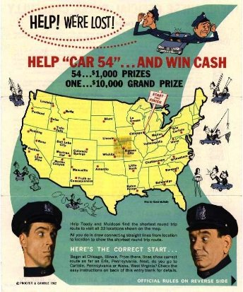

---

author: ELP
title: 09 Algorithme glouton

---

**Table des matières** 

1. [ALGORITHMES GLOUTONS](#_page0_x51.00_y229.00)
2. [EXERCICES](#_page7_x51.00_y32.00)
3. [PROBLEME : TSP - LE VOYAGEUR DE COMMERCE](#_page9_x51.00_y32.00)

## <H2 STYLE="COLOR:BLUE;"> **1. Algorithmes<a name="_page0_x51.00_y229.00"></a> gloutons**</H2> 

En informatique, un **algorithme glouton** (*greedy algorithm*) est une **technique de résolution** de problème.  

Un algorithme glouton suit **un principe simple** :

- À chaque **étape**, il choisit la **meilleure solution immédiate**.

- Il ne revient **jamais en arrière** pour modifier un choix précédent.  

- Son **objectif** est d’obtenir un résultat **optimal**, mais ce n’est **pas toujours garanti**.  

💡 **Remarque :** Les algorithmes gloutons sont souvent utilisés pour **les problèmes d'optimisation**, comme le **rendu de monnaie** ou le **problème du sac à dos**.

### <H3 STYLE="COLOR:GREEN;"> **1.1. Le<a name="_page0_x51.00_y404.00"></a> problème de rendu de monnaie**</H3> 

Ce problème consiste à rendre une somme avec **le moins de pièces (ou billets) possible**.  

🔹 **Principe de l’algorithme glouton** :  

1. Sélectionner **la pièce la plus grande possible** (sans dépasser la somme restante).  

2. Répéter jusqu’à ce que la somme soit totalement rendue.  
 

**Exemple avec le système de pièces européen :** 


Rendre **8€** 💶  

| Solution optimale | Solution non optimale |
|------------------|----------------------|
| 1 billet de 5€  | 4 pièces de 2€ |
| 1 pièce de 2€   | |
| 1 pièce de 1€   | |

✅ Avec **le système de pièces européen**, l’algorithme glouton **donne toujours un choix optimal**.  

⚠️ Cependant, ce n’est pas **toujours** le cas avec d’autres systèmes de pièces.


**Exemple avec un autre système monétaire :**


🔹 Rendre **6€** avec les pièces {4€, 3€, 1€}  

| Solution optimale | Solution obtenue par l'algorithme glouton |
|------------------|----------------------|
| 2 pièces de 3€ | 1 pièce de 4€ + 2 pièces de 1€ |

🚨 **L’algorithme glouton donne ici une solution non optimale**, car il ne prévoit **pas les étapes suivantes**.


🧠 **Complexité des algorithmes gloutons**

Les algorithmes gloutons sont souvent très efficaces car ils **n’explorent pas toutes les solutions possibles**, mais choisissent à chaque étape la meilleure option locale. Cela leur permet d’avoir une **complexité en temps généralement faible**, souvent **linéaire ou linéaire en fonction du nombre d’éléments**.

Par exemple, dans le problème du rendu de monnaie, l’algorithme glouton **parcourt une seule fois la liste des pièces** (déjà triée), ce qui donne une **complexité en O(n)**, avec *n* le nombre de types de pièces. Cette rapidité en fait un bon choix pour des problèmes où le temps d’exécution est crucial.

Cependant, cette efficacité a un prix : **la solution obtenue n’est pas toujours optimale**, car l’algorithme **ne revient jamais sur ses choix**. Il est donc important de vérifier si la méthode gloutonne est **adaptée au problème étudié**.


=> **CAPYTALE Le code vous sera donné par votre enseignant**

???+ question "Activité n°1" 

    Implémentation en Python**

    📌 **Objectif :** Traduire cet algorithme en Python sur **Capytale**  

    **Algorithme en pseudo-code :**
    ```
    Fonction renduMonnaie(somme : entier, pièces : liste triée par ordre décroissant) -> liste des pièces choisies
      n ← longueur de la liste pièces
      initialiser à zéro la liste "choisies" de dimension n
      Pour i de 1 à n :
        Tant que somme >= pièces[i]
          somme ← somme - pièces[i]
          choisies[i] ← choisies[i] + 1
      Fin Pour
      retourner choisies
    ```

    Aide : 	

    - le prototype de la fonction est donc : ```renduMonnaie(somme: int, pieces: list) -> list``` 

    - Ne pas oublier de documenter la fonction 

    **Test n°1 :**
    ```python
    #pieces en centimes d'euros
    pieces=[500,200,100,50,20,10,5,2,1]
    somme=780
    print('Les pièces choisies sont')
    print(renduMonnaie(somme,pieces))
    ```

    Soit 780 centimes, <b>l’algorithme fonctionne et est optimal</b> avec le système de pièces européen  

    **Test n°2 :**
    ```python
    print('Test n°2')
    #pieces en euros
    pieces=[4,3,1]
    somme=6
    print('Les pièces choisies sont')
    print(renduMonnaie(somme,pieces))
    ```

    Soit 6 euros, l’algorithme fonctionne, <b>mais n’est pas optimal</b>, car on aurait pu rendre 2 pièces de 3 € 

    **Remarque**:  Il existe d’autres méthodes permettant d’optimiser le rendu de monnaie comme la programmation dynamique (non abordé ici). L’idée est de calculer toutes les possibilités permettant d’obtenir 6 € avec le jeu de pièces tout en choisissant le nombre minimal de pièces.

    **Test n°3**
    ```python
    print('Test n°3')
    #pieces en euros
    pieces=[10,5,2]
    somme=31
    print('Les pièces choisies sont')
    print(renduMonnaie(somme,pieces))
    ```

    Soit 30 euros, l’algorithme ne fonctionne plus, car il manque une pièce de 1 euro. 


### <H3 STYLE="COLOR:GREEN;"> **1.2. Le<a name="_page2_x51.00_y32.00"></a> problème du sac à dos**</H3> 

Le **problème du sac à dos** (*Knapsack Problem*) est un problème d’optimisation :

- On dispose **d’objets**, chacun ayant une **valeur** et un **poids**.

- Le sac a une **capacité maximale**.

- **Objectif :** choisir les objets pour **maximiser la valeur** sans dépasser le poids.

**Exemple :**  
🔹 Sac limité à **4.7 kg**  

| Objet  | Valeur | Poids | Choix de l’algorithme glouton |
|--------|--------|-------|-------------------------------|
| Jumelles | 5 | 0.5 kg | ✅ Prend |
| Tente | 3 | 4 kg | ✅ Prend |
| Gourde | 2 | 1 kg | ❌ Impossible (dépasse la limite) |
| Carte | 1 | 0.2 kg | ✅ Prend |

⚠️ **Problème** : L’algorithme glouton **ne vérifie pas toutes les combinaisons** possibles.  


???+ question "**Activité n°2 : Sac à dos**"

    Implémentation en Python**

    📌 **Objectif :** Programmer une fonction qui **remplit un sac à dos** selon la **méthode gloutonne**.

    **Pseudo-code :**
    ```
    Fonction remplirSac(objets : liste triée par valeur, poidsMax : float) -> liste des objets choisis
      p ← 0  
      n ← longueur de objets
      initialiser à zéro la liste objetsChoisis
      Pour i de 1 à n :
        Si p + objets[i][1] ≤ poidsMax :
          objetsChoisis[i] ← 1
          p ← p + objets[i][1]
      Fin Pour
      retourner objetsChoisis
    ```


    **Aide :** 

    - Ne pas oublier le prototype de la fonction et de la documenter

    **Test** 

    Attention **: il faudra trier les objets par ordre décroissant de valeur** avant d’appeler la fonction remplirSac(objets,poidsMax)

    **Résultat dans la console** 
    ```python
    print('Test')
    #liste du matériel
    objets=[[2,1],[5,0.5],[1,0.2],[3,4]]
    objets=list(reversed(sorted(objets)))
    print(objets)
    poidsMax=4.7
    print('Les objets choisis sont')
    print(remplirSac(objets,poidsMax))
    ```

### <H3 STYLE="COLOR:GREEN;"> **1.3. Variante : Affichage sous forme de dictionnaire**</H3> 


???+ question "**Activité n°3 : Sac à dos**"

    📌 **Objectif :** Adapter la fonction pour **retourner un dictionnaire** indiquant les objets pris.

    **Test avec une valise de voyage** ✈️
    ```python
    objets = [[6,5.0,'chaussures'], [5,5.0,'habits'], [4.5,2.0,'trousse de toilette'], 
              [4,2.0,'crèmes'], [3,8.0,'livres'], [2,2.0,'palmes tuba'], [1,0.5,'guide touristique']]
    poidsMax = 23  
    print(remplirSacDico(objets, poidsMax))
    ```
    ✅ **Résultat attendu :**  
    ```python
    {'chaussures': 1, 'habits': 1, 'trousse de toilette': 1, 'crèmes': 1, 'livres': 1, 'guide touristique': 1}
    ``` 


### <H3 STYLE="COLOR:GREEN;"> **1.4. Variante : Méthode gloutonne avec ratio valeur/poids**</H3> 


???+ question "**Activité n°4 : Sac à dos et ratio**"

    📌 **Objectif :** Implémenter une stratégie gloutonne **basée sur le ratio valeur/poids**.


    🧠 **Principe du problème**

    On veut remplir une **valise de 23 kg** avec des objets de voyage.
    Chaque objet a :

    * une **valeur** (utilité, confort, importance…),
    * un **poids**,
    * un **nom**.

    🎯 But : choisir **les objets les plus utiles par kilo**, c’est-à-dire avec le **meilleur ratio**
    $\text{ratio} = \frac{\text{valeur}}{\text{poids}}$

    🧮 **Pseudo-code à traduire**

    ```plaintext
    Fonction remplirSacRatio(objets : liste de [valeur, poids, nom], poidsMax : float) → dictionnaire des objets pris

        Étape 1 : Calculer la liste des ratios
            Pour chaque objet de la liste :
                Calculer le ratio valeur/poids
                Ajouter [valeur, poids, nom, ratio] à une nouvelle liste

        Étape 2 : Trier cette nouvelle liste manuellement (du plus grand au plus petit ratio)
            (utiliser une méthode simple comme le tri par sélection ou insertion)

        Étape 3 : Remplir le sac avec les objets triés par ratio
            Initialiser poids_total ← 0
            Initialiser objets_choisis ← dictionnaire vide

            Pour chaque objet de la liste triée :
                Si poids_total + poids ≤ poidsMax :
                    Ajouter nom à objets_choisis avec la valeur 1
                    Ajouter poids à poids_total

        Retourner objets_choisis
    ```

    🧪 **Test**

    ```python
    objets = [
        [6, 5.0, 'chaussures'],
        [5, 5.0, 'habits'],
        [4.5, 2.0, 'trousse de toilette'],
        [4, 2.0, 'crèmes'],
        [3, 8.0, 'livres'],
        [2, 2.0, 'palmes tuba'],
        [1, 0.5, 'guide touristique']
    ]

    poidsMax = 23
    print(remplirSacRatio(objets, poidsMax))
    ```

    🧠 **Aide**

    * 💡 Pour trier, créer une nouvelle liste `objetsAvecRatio = [[valeur, poids, nom, ratio], …]` puis la **trier à la main** (ex : tri par sélection).


### <H3 STYLE="COLOR:GREEN;"> **1.5. Conclusion**</H3> 


- **Les algorithmes gloutons sont rapides et simples**, mais ils ne garantissent pas toujours une solution optimale.

- Pour des solutions optimales, on utilise des méthodes plus avancées comme **la programmation dynamique** ou **l’arbre de recherche**.

💡 **Remarque :** Le **problème du sac à dos optimal** sera étudié en **Terminale** avec des techniques comme la **séparation et évaluation** (*Branch & Bound*).

## <H2 STYLE="COLOR:BLUE;"> **2. Exercice<a name="_page7_x51.00_y32.00"></a>**</H2>  

=> **CAPYTALE Le code vous sera donné par votre enseignant**

!!! abstract "**Exercice n°1  ★ : Le voyageur**"


    🟢 Étape 1 – Force brute très simple (3 stations)

    🚗 Contexte :

    ```python
    distance = [40, 30, 20]  # Entre les stations
    autonomie = 100
    ```

    ✍️ Question 1:

    > Liste toutes les **combinaisons possibles d'arrêts** (0, 1, 2 arrêts), et indique lesquelles permettent d'atteindre la fin sans panne.


    🟡 Étape 2 – Force brute plus complexe (6 stations)

    🚗 Contexte :

    ```python
    distance = [23, 40, 12, 44, 21, 9]
    autonomie = 100
    ```

    ✍️ Question 2 :

    > Énumère toutes les **séquences d’arrêts possibles** (par exemple : \[3], \[2, 5], etc.) et teste si elles permettent de finir le trajet.
    > Indique la **meilleure séquence**, celle qui utilise **le moins d’arrêts**.

    🔶 Étape 3 – Force brute infaisable (17 stations)

    🚗 Contexte :

    ```python
    distance = [23, 40, 12, 44, 21, 9, 67, 32, 51, 30, 11, 55, 24, 64, 32, 57, 12, 80]
    autonomie = 100
    ```

    ✍️ Question 3 :

    > Estime **le nombre de combinaisons possibles d’arrêts**.
    > Est-il **raisonnable** de toutes les tester par un programme ou à la main ?
    > Propose une **méthode pour aller plus vite**.


    🔴 Étape 4 – Introduction de la **méthode gloutonne**

    ✍️ Enoncé :

    > Propose une **stratégie efficace** qui :
    >
    > * ne teste pas toutes les combinaisons,
    > * mais **choisit intelligemment** les stations où s’arrêter **au fur et à mesure du trajet**.


    🔴 Étape 5 – Mise en œuvre de la méthode gloutonne


    ✍️ Activité 

    ```python
    distance = [23, 40, 12, 44, 21, 9]
    autonomie = 100
    ```

    1. Calcule les **distances cumulées** à chaque étape.
    2. Repère à quel moment la **station suivante** est **inaccessible** (trop loin).
    3. Propose une **règle locale** : quand faut-il faire un arrêt ?
    4. Note les stations où tu t’arrêterais.


    5.  Maintenant, traduis cette stratégie en Python.


    ```python
    def voyage_glouton(distance: list, autonomie: int) -> list:
        """
        Détermine les stations où s'arrêter pour ne jamais dépasser l'autonomie.
        distance : liste des distances entre les stations
        autonomie : distance maximale que l’on peut parcourir avec un plein
        Retourne la liste des stations où on s’arrête (indices)
        """
        pass
    ```


    🧪 Test : 

    ```python
    distance = [23, 40, 12, 44, 21, 9]
    autonomie = 100
    print(voyage_glouton(distance, autonomie))
    # Résultat attendu : [3] → arrêt à la station 3 avant de dépasser l'autonomie
    ```


!!! abstract "**Exercice n°2  ★ : Rendu de monnaie**"


    Étant donné un système de monnaie (pièces et billets), comment rendre une somme donnée de façon optimale, c'est-à- dire avec le nombre minimal de pièces et billets ? 

    Par exemple, la meilleure façon de rendre 7€ est de rendre un billet de cinq et une pièce de deux, même si d'autres façons existent (rendre 7 pièces de 1€, par exemple). 

    Ce problème est **NP-complet**[^1] dans le cas général, c'est-à-dire difficile à résoudre. Cependant pour certains systèmes de monnaie, l'algorithme glouton est optimal, c'est-à-dire qu'il suffit de rendre systématiquement la pièce ou le billet de valeur maximale — ce tant qu'il reste quelque chose à rendre. 

    Dans la zone euro, le système S en vigueur est, en mettant de côté les centimes d'euros : 

    ```S = (1, 2, 5, 10, 20, 50, 100, 200, 500)```. 

    Il y a par exemple six triplets de pièces (ou billets) de 1, 2 et 5 euros qui permettent de rendre la valeur v = 7€ (les billets de 10 euros ou plus étant inutiles) : (7,0,0), (5,1,0), (3,2,0), (1,3,0), (2,0,1), (0,1,1). 

    La solution au problème de rendu de monnaie (S, 7) est alors le triplet (x1, x2, x3) qui minimise le nombre total x1 + x2 + x3 de pièces rendues, soit (0, 1, 1), c'est-à-dire une pièce de 2 euros et une de 5 (un billet). On a donc le nombre minimal de pièces du système $M_{(1,2 5)}$(7) = 2. 

    Pour rendre toute somme inférieure à 500€ pièces il faut au plus 3 pièces pour les unités, 3 billets pour les dizaines et jusqu'à 2 billets pour les centaines, soit au plus 8 pièces ou billets. L'optimum au-delà est alors formé de $v/500$ billets de 500€, plus les pièces et billets nécessaires pour le reste v modulo 500€. 

    Ainsi, 2019 = 500×4 + 19 = 500×4 + 10×1 + 5×1 + 2×2, soit 4+1+1+2 = 6 billets et 2 pièces. 

    **1** Écrire **l’algorithme de rendu de monnaie en pseudo-code** pour une valeur** v à rendre avec un système de pièces S, trié par ordre croissant.  

    **Aide :** 

    - Noter les entrées et le(s) sortie(s).  
    - S’inspirer de l’algorithme en pseudo-code de recherche dichotomique 

    **2** Montrer que l’algorithme termine. 

    **Rappels :** 

    Pour s'assurer qu'un algorithme est correct, il faut démontrer deux choses : 

    - que l'algorithme se termine (**terminaison**), autrement dit qu'il **ne boucle pas** ou ne diverge pas, produisant au moins un résultat. 

    - que le résultat de l'algorithme **satisfait la spécification du résultat** comme énoncé dans la description de l'algorithme (**correction partielle**). 

    La conjonction de la **correction partielle et de la terminaison** s'appelle la **correction totale.** 

    **3** Implémenter cet algorithme en langage Python. On donne le prototype de la fonction : 

    ```rendu(S : list, valeur : int) -> list``` 

    - ```S``` -- liste des pièces ordonnées 

    - ```valeur``` -- somme à rendre 

    - la fonction retourne la liste des pièces à rendre 

    **4** Documenter la fonction  

    **5** Tester le programme pour deux systèmes de monnaies : 

    - européen : ```S = (1, 2, 5, 10, 20, 50, 100, 200, 500)```

    - royaume uni : ```S = (1, 3, 4, 10, 30, 40, 100, 300, 400)```[^2] on prendra 2019 pour somme à rendre 

!!! abstract "**Exercice n°3  ★★ : Le voyageur**"

    Une route comporte n+1 stations-service, numérotées dans l'ordre du parcours, de 0 à n. La première est à une distance d[0] du départ, la deuxième est à une distance d[1] de la première, la troisième à une distance d[2] de la deuxième, etc. La fin de la route est à une distance d[n] de la n-ième et dernière station-service. 

    Un automobiliste prend le départ de la route avec une voiture dont le réservoir d'essence est plein. Il désire faire le plein le moins souvent possible. Sa voiture possède une autonomie notée autonomie avec un plein. 

    **1** Écrire l’algorithme qui détermine à quelles stations-service il doit s'arrêter avec la distance parcourue. 

    **2** Montrer que l’algorithme termine. 

    **3** Implémenter cet algorithme en langage Python. On donne le prototype de la fonction : 
    ```voyage(distance : list, autonomie : int) -> list```

    - ```distance``` -- liste des distances entre les stations-service 

    - ```autonomie``` -- distance maximum que l'on peut parcourir 

    - la fonction retourne la liste de tuple (numéro de la station, distance parcourue depuis le début) 

    **4** Documenter la fonction 

    **5** Tester le programme : 

    - 17 stations-service avec 

    ```python
    distance = [23, 40, 12, 44, 21, 9, 67, 32, 51, 30, 11, 55, 24, 64, 32, 57, 12, 80] 
    autonomie = 100 
    ```
!!! abstract "**Exercice n°4 ★★★ : le cambrioleur**"
    
    Un cambrioleur entre par effraction dans une maison. Il n'est capable de porter qu’une masse limitée : il lui faudra donc choisir entre les différents objets de valeur, afin d'amasser le plus gros magot possible. 

    **1** Écrire un algorithme qui donne un choix optimal pour le voleur. 

    **Aide** : 

    - Pour amasser le plus gros butin, il suffit de considérer le rapport prix/masse. A chaque fois, on en prend le rapport maximal. 
    - il faut rajouter ce critère à la liste [prix, poids] et la trier sur ce critère par ordre décroissant. 

    **2** Montrer que cet algorithme termine.

    **3** Programmez une fonction remplir dont le prototype est le suivant : 
    ```voleur(articles : list, masse : int) -> list```

    - ```articles``` -- liste des articles (masse, valeur)  

    - ```masse``` -- masse maximale

    - la fonction retourne la liste des articles : liste de tuple(masse, valeur)

    - Le programme ou la fonction précédente retournera aussi** la masse totale **et** la valeur totale 

    **4** Documenter la fonction 

    On dispose d’une liste d’objets de masses ```m = [9, 10, 12, 14, 11, 5, 7, 5, 6, 2]``` ainsi que de leurs valeurs associées ```v = [10, 8, 7, 7, 5, 4, 3, 2, 2, 1]```.

    **5** Tester le programme pour une masse maximale de 22 kg. Conclure. 

## <H2 STYLE="COLOR:BLUE;"> **3.  Problème : TSP - Le voyageur de commerce<a name="_page9_x51.00_y32.00"></a>**</H2> 

Le problème du voyageur de commerce - *Traveling Salesman Problem* TSP -, étudié depuis le 19e siècle, est l’un des plus connus dans le domaine de la recherche opérationnelle. William Rowan Hamilton a posé pour la première fois ce problème sous forme de jeu dès 1859.

**Problème**  


Le problème du TSP sous sa forme la plus classique est  le suivant : « Un voyageur de commerce doit visiter une  et une seule fois un nombre fini de villes et revenir à son  point d’origine. **Comment trouver l’ordre de visite des  villes qui minimise la distance totale parcourue par le  voyageur. ? »** 

Ce problème d’optimisation combinatoire appartient à la  classe des problèmes NP-Complets. 

Les domaines d’application sont nombreux : problèmes  de logistique, de transport aussi bien de marchandises  que  de  personnes,  et plus largement  toutes  sortes  de  problèmes d’ordonnancement.  Certains  problèmes rencontrés dans l’industrie se modélisent sous la forme  d’un  problème  de  voyageur  de  commerce, comme  l’optimisation  de  trajectoires  de  machines outils  :  comment  percer  plusieurs  points  sur  une carte  électronique le plus vite possible ? 

!!! abstract "**Exercice n°1**"

    **1**- Pour un ensemble de 4 villes, combien existe t-il de chemins différents possibles ?  

    **2**- Pour un ensemble de 5 villes, combien existe t-il de chemins possibles ?

    **3**- Pour un ensemble de 71 villes, combien existe t-il de chemins différents possibles ?

    **4**- Sachant que mon ordinateur est capable de traiter 10 000 000 de trajets par seconde, en combien de temps aura t-il traité le problème des 71 villes ? 

    **L'objectif de ce TP est de réaliser un algorithme glouton pour résoudre le TSP** en considérons les villes nommées succinctement A, B, C, D, E, F et G dont ont connaît les coordonnées géographiques (longitude, latitude) :

    **A ( 0 ; 0 )  B ( 7 ; 3 )  C ( 3 ; 1 )  D ( 2 ; 4 )  E ( 4 ; 6 )  F ( 3 ; 2 )  G ( 5 ; 0 )**

!!! abstract "**Exercice n°2**"

    Sur la première "carte" à votre disposition, **en partant de la ville F (que vous entourerez)**, tracer l'itinéraire (boucle) **qui vous semble optimal pour minimiser la distance à parcourir**.

!!! abstract "**Exercice n°3**" 

    Ecrire en une phrase **la méthode gloutonne** qui détermine le choix (qui vous semble optimale) de votre prochaine étape.

!!! abstract "**Exercice n°4**" 

    sur chacune des autres "cartes" à votre disposition, **en partant d'une autre ville (que vous entourerez)**, tracer l'itinéraire (boucle) déterminée par la méthode gloutonne précédente.

!!! abstract "**Exercice n°5**"

    Quels sont les itinéraires qui paraissent bien "longs" et que l’on peut éliminer ?

    Visuellement, à l'aide de la carte, vous arrivez assez facilement à distinguer quelle est la ville la plus proche de votre étape, mais un ordinateur n'a pas accès à cette "vision d'ensemble"! Pour chaque étape, il doit calculer la distance qui sépare la position actuelle de chacune des autres villes à partir de leur coordonnées.

**A vous de vous mettre dans "la peau d'un ordinateur" en CACHANT les cartes.**

!!! abstract "**Exercice n°6**"

    Compléter le *distancier* ci-dessous en utilisant les coordonnées des villes :

    **A ( 0 ; 0 )  B ( 7 ; 3 )  C ( 3 ; 1 )  D ( 2 ; 4 )  E ( 4 ; 6 )  F ( 3 ; 2 )  G ( 5 ; 0 )**

    <table>
      <tr>
        <td></td>
        <td>A</td>
        <td>B</td>
        <td>C</td>
        <td>D</td>
        <td>E</td>
        <td>F</td>
        <td>G</td>
      </tr>
      <tr>
        <td>A</td>
        <td>0</td>
        <td></td>
        <td></td>
        <td></td>
        <td></td>
        <td></td>
        <td></td>
      </tr>
      <tr>
        <td>B</td>
        <td></td>
        <td>0</td>
        <td></td>
        <td>√26</td>
        <td></td>
        <td></td>
        <td></td>
      </tr>
      <tr>
        <td>C</td>
        <td></td>
        <td></td>
        <td>0</td>
        <td></td>
        <td></td>
        <td></td>
        <td></td>
      </tr>
      <tr>
        <td>D</td>
        <td></td>
        <td>√26</td>
        <td></td>
        <td>0</td>
        <td></td>
        <td></td>
        <td></td>
      </tr>
      <tr>
        <td>E</td>
        <td></td>
        <td></td>
        <td></td>
        <td></td>
        <td>0</td>
        <td></td>
        <td></td>
      </tr>
      <tr>
        <td>F</td>
        <td></td>
        <td></td>
        <td></td>
        <td></td>
        <td></td>
        <td>0</td>
        <td></td>
      </tr>
      <tr>
        <td>G</td>
        <td></td>
        <td></td>
        <td></td>
        <td></td>
        <td></td>
        <td></td>
        <td>0</td>
      </tr>
    </table>


    Exemple : détermination de la distance BD ou DB: B ( 7 ; 3 )	D ( 2 ; 4 )

    D'après le théorème de Pythagore : 
    ```
    BD² = (xB-xD)² + (yB – yD)²
        = (7-2)²+(3-4)²
        = 5² + 1² 
        = 25 + 1 
        = 26
    ```

    Avec un petit peu d'organisation, on pourrait se répartir le travail…

    **Uniquement en utilisant ce distancier (SANS REGARDER les "cartes"), déterminer :** 

    Itinéraire glouton en partant de A : Longueur de l'itinéraire en partant de A :

    Itinéraire glouton en partant de B : Longueur de l'itinéraire en partant de B :

    Itinéraire glouton en partant de C : Longueur de l'itinéraire en partant de C : 

    Itinéraire glouton en partant de D : Longueur de l'itinéraire en partant de D :

    Itinéraire glouton en partant de E : Longueur de l'itinéraire en partant de E :

    Itinéraire glouton en partant de F : Longueur de l'itinéraire en partant de F :

    Itinéraire glouton en partant de G : Longueur de l'itinéraire en partant de G :

    **Pour le plus court itinéraire glouton : il faut partir de …**

    **Longueur de ce plus court itinéraire :**

    

     

     

     

     

**Maintenant c’est à vous de compléter le fichier sur capytale**  


[^1]: c'est-à-dire un problème complet pour la classe NP (non déterministe polynomial) 
[^2]: avant sa réforme en 1971

