---
author: ELP
title: 11 Algorithme des k plus proches voisins
---

**Table des matières** 

1. [**ALGORITHMES DES K PLUS PROCHES VOISINS (K NEAREST NEIGHBORS : K-NN)**](#_page0_x61.00_y296.92)
2. [**EXERCICES**](#_page12_x40.00_y36.92)
3. [**PROBLEME : ANALYSE DE TEXTE**](#_page14_x40.00_y36.92)


## <span style="color:blue;">1. Le machine learning : quand la machine apprend</span>

L’**apprentissage automatique** (*machine learning*) est un domaine de l’**intelligence artificielle (IA)** dans lequel on programme **non pas des règles fixes**, mais des **méthodes d’apprentissage à partir de données**.

🎯 **Objectif** : la machine généralise ce qu’elle a “compris” à partir des exemples.


### <span style="color:green;">1.1 Trois grandes familles d’apprentissage</span>

| Type d’apprentissage | Description                                               | Exemple                                   |
| -------------------- | --------------------------------------------------------- | ----------------------------------------- |
| **Supervisé**        | Données **étiquetées** (avec réponses connues)            | Prédire la météo, reconnaître un chiffre  |
| **Non supervisé**    | Données **sans étiquette**, la machine cherche des motifs | Regrouper des profils clients             |
| **Par renforcement** | L’agent agit et reçoit des **récompenses ou punitions**   | Apprendre à jouer à un jeu (ex : AlphaGo) |

💡 **Deep Learning** (ou apprentissage profond) : une **technique particulière** du machine learning, qui utilise des **réseaux de neurones artificiels**, notamment dans le traitement d’images ou de sons.

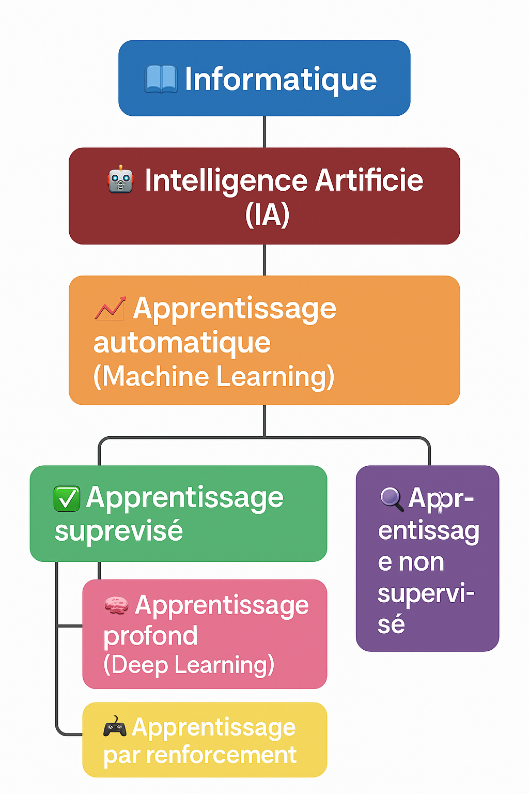{width=60%}

### <span style="color:green;">1.2 L’algorithme des k plus proches voisins (k-NN)</span>

Le **k-NN (k Nearest Neighbors)** est un **algorithme simple et efficace** d’apprentissage supervisé.

> 🔍 **But** : Classer un nouvel élément selon les exemples connus les plus proches.

🧮 Principe :

1. Calculer la **distance** entre le point à classer et les autres points.
2. Sélectionner les **k plus proches voisins**.
3. Attribuer à l’élément la **classe majoritaire** parmi ces voisins.

🎥 Exemple visuel :


> 💡 Choix de **k** :
>
> * Trop petit → trop sensible au bruit
> * Trop grand → lisse trop les différences


### <H3 STYLE="COLOR:GREEN;"> 1.3. **Distances entre les points<a name="_page1_x40.00_y681.92"></a>** </H3>

L’algorithme **k-NN repose sur la notion de distance**. L’une des plus courantes est la **distance euclidienne** :

$\text{distance}(P_1, P_2) = \sqrt{(x_1 - x_2)^2 + (y_1 - y_2)^2}$

Autres distances possibles :

- **Manhattan** : $|x_1 - x_2| + |y_1 - y_2|$

- **Tchebychev** : $\max(|x_1 - x_2|, |y_1 - y_2|)$


=> **CAPYTALE Le code vous sera donné par votre enseignant**

???+ question "**Activité n°1 : Calcul de distance euclidienne**"

    Implémentez une fonction Python pour calculer la distance entre deux points :

    ```python
    from math import sqrt

    def distance(x1, y1, x2, y2):
        """Renvoie la distance euclidienne entre deux points."""
        return sqrt((x1 - x2)**2 + (y1 - y2)**2)

    # Test
    print(distance(4, 0, 1, 4))  # Résultat attendu : 5.0
    ```

### **<H3 STYLE="COLOR:GREEN;"> 1.4. Génération aléatoire de points** </H3>

Nous allons générer des **points aléatoires** dans un espace défini.

???+ question "**Activité n°2 : Génération d’une liste de points**"

    ```python
    from random import randint

    xmin, xmax = -20, 20
    ymin, ymax = -20, 20

    def genereListePoints(nbmin, nbmax):
        """Génère une liste de points avec coordonnées aléatoires."""
        nb_points = randint(nbmin, nbmax)
        return [(randint(xmin, xmax), randint(ymin, ymax)) for i in range(nb_points)]

    # Test
    print(genereListePoints(5, 15))
    ```

### **<H3 STYLE="COLOR:GREEN;"> 1.5. Trouver le plus proche voisin** </H3>

???+ question "**Activité n°3 : Trouver le point le plus proche d’un point donné**"

    ```python
    def plusProcheVoisin(listePoints, x, y):
        """
        listePoints -- liste de tuples représentant les points (x, y)
        x -- coordonnée x du point cible
        y -- coordonnée y du point cible

        Objectif :
        Trouver et retourner le point de listePoints qui est le plus proche de (x, y).
        """

        # Étape 1 : Initialisation
        point_le_plus_proche = None  # Pour stocker le point le plus proche
        distance_minimale = float('inf')  # Commence avec une distance très grande

        # Étape 2 : Parcourir chaque point de la liste
        for (x_point, y_point) in listePoints:
            # Étape 3 : Calculer la distance entre ce point et (x, y)
            d = distance(x, y, x_point, y_point)

            # Étape 4 : Vérifier si cette distance est la plus petite trouvée jusqu'à présent
            if d < distance_minimale:
                distance_minimale = d  # Mettre à jour la distance minimale
                point_le_plus_proche = (x_point, y_point)  # Mettre à jour le point le plus proche

        # Étape 5 : Retourner le point ayant la plus petite distance
        return point_le_plus_proche

    # Test
    liste = genereListePoints(5, 15)
    point_cible = (5, 5)
    print("Point le plus proche de", point_cible, ":", plusProcheVoisin(liste, *point_cible))
    ```


### <H3 STYLE="COLOR:GREEN;"> **1.6. Représentation graphique des points<a name="_page3_x40.00_y36.92"></a>** </H3>


???+ question "**Activité n°4 : Visualisation avec Matplotlib**"

    ```python
    import matplotlib.pyplot as plt

    # Points de type 1
    x1 = [1, 3, 8, 13]
    y1 = [28, 27.2, 37.6, 40.7]

    # Points de type 2
    x2 = [2, 3, 10, 15]
    y2 = [30, 26, 39, 35.5]

    plt.axis([0, 15, 0, 50])
    plt.xlabel('Caractéristique 1')
    plt.ylabel('Caractéristique 2')
    plt.title('Représentation des deux types')

    plt.scatter(x1, y1, label='Type 1', color='red')
    plt.scatter(x2, y2, label='Type 2', color='blue')

    plt.legend()
    plt.grid()
    plt.show()
    ```

### **<H3 STYLE="COLOR:GREEN;"> 1.7. Présentation de l’algorithme des k plus proches voisins**</h3>

L’algorithme des **k plus proches voisins** (k-Nearest Neighbors, k-NN) est une méthode d’apprentissage supervisé qui permet de classer une nouvelle donnée en fonction des échantillons déjà connus.  

**Principe de fonctionnement**

1. On dispose d’un **jeu de données** comprenant des éléments appartenant à différentes **catégories**. Chaque élément est décrit par plusieurs caractéristiques.  

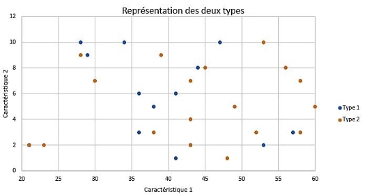

2 On introduit une **nouvelle donnée** (appelée cible) dont on souhaite **déterminer la catégorie**.  

3 On choisit un **nombre de voisins** à considérer : **k** (par exemple, k = 6).  

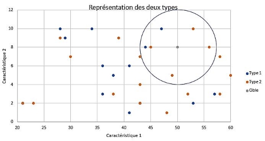

4 On calcule la **distance** entre la cible et chaque élément du jeu de données (le plus souvent la **distance euclidienne**). 

5 On sélectionne les **k données les plus proches**.  

6 On **attribue à la cible** la classe majoritaire parmi ces k voisins.  

L'illustration suivante montre un exemple où l'on doit classer une nouvelle donnée en fonction des 6 plus proches voisins :  


**Interprétation :** 

Dans ce cas, parmi les **6 plus proches voisins**, il y a **4 éléments rouges (Type 2) et 2 éléments bleus (Type 1)**.  

➡️ **La cible sera classée comme Type 2.**  

> **Remarque :** 

> On utilise la **distance Euclidienne** dans cet exemple, mais on pourrait également choisir d’autres mesures comme la distance de **Manhattan** ou de **Tchebychev**.


### <H3 STYLE="COLOR:GREEN;"> **1.8. L’algorithme k-NN en détail<a name="_page3_x40.00_y616.92"></a>** </H3>

#### <H4 STYLE="COLOR:MAGENTA;"> **1.8.1. Préconditions**<a name="_page3_x40.00_y636.92"></a>  </H4>

Pour classer une donnée avec k-NN, il faut :

✅ Un **échantillon de données** où chaque élément est associé à une catégorie.  

✅ Une **nouvelle donnée** dont on veut déterminer la catégorie.  

✅ Une **valeur de k**, qui représente le nombre de voisins à considérer.  


#### <H4 STYLE="COLOR:MAGENTA;"> **1.8.2. <a name="_page4_x40.00_y149.92"></a>Exemples** </H4>

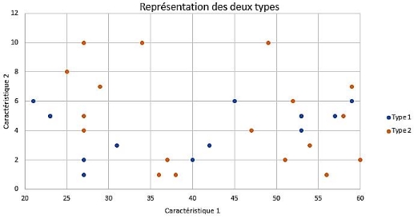

???+ question "**Activité n°5 : Exemple 1**"


    Une cible a pour caractéristiques **(50,8)** et on choisit **k = 4**.  
    On trace un cercle englobant les **4 voisins les plus proches**.  

    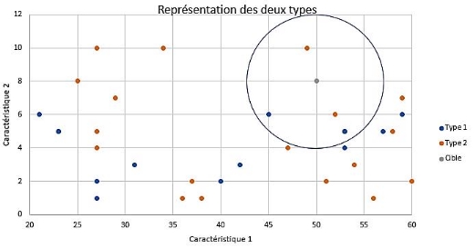

    **Questions :**  

    - Quelle est la catégorie majoritaire ?  

    - Quelle valeur de k permet d’avoir une classification fiable ?  


???+ question "**Activité n°6 :Exemple 2**"

    On fixe **k = 10**, mais cette fois, on **n’utilise que la deuxième caractéristique** (la première n’a pas d’impact sur la distance). 

    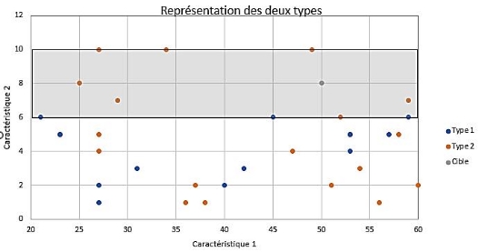

    **Questions :** 

    - La décision change-t-elle ?  

    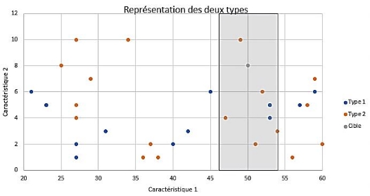

    - Que se passe-t-il si on utilise **k = 7** mais que seule la première caractéristique est prise en compte ?  


#### <H4 STYLE="COLOR:MAGENTA;"> **1.8.3. Comment<a name="_page5_x40.00_y520.92"></a> représenter ce type de donnée en Python avec matplotlib** </H4>

L’algorithme k-NN est plus compréhensible lorsqu’il est visualisé.  

💡 **Vérification des bibliothèques nécessaires :**  
Avant d’exécuter les scripts suivants, vérifiez que les bibliothèques **Matplotlib** et **Scikit-learn** sont installées sur votre éditeur knn (Thonny par exemple):

```bash
pip install matplotlib scikit-learn pandas
```


???+ question "**Activité n°7 : Première visualisation des données avec Matplotlib**" 

    ```python
    import matplotlib.pyplot as plt

    # Données de type 1 (exemple)
    liste_x_1 = [1, 3, 8, 13]
    liste_y_1 = [28, 27.2, 37.6, 40.7]

    # Données de type 2 (exemple)
    liste_x_2 = [2, 3, 10, 15]
    liste_y_2 = [30, 26, 39, 35.5]

    plt.axis([0, 15, 0, 50])  # Définition des limites du graphique [xmin, xmax, ymin, ymax]
    plt.xlabel('Caractéristique 1')
    plt.ylabel('Caractéristique 2')
    plt.title('Représentation des deux types')
    plt.grid()

    # Affichage des points
    plt.scatter(liste_x_1, liste_y_1, label='Type 1', color='blue')
    plt.scatter(liste_x_2, liste_y_2, label='Type 2', color='red')

    plt.legend()
    plt.show()
    ```
    📌 **Résultat attendu :**  

    - Les points sont bien séparés en **deux groupes**  

    - Chaque point est coloré en fonction de son **type**  


    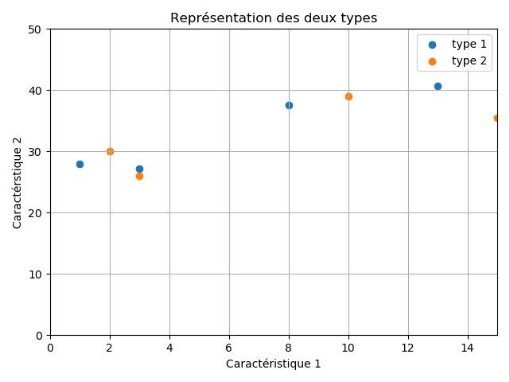

???+ question "**Activité n°8 : Ajout d’une nouvelle donnée et visualisation des voisins :**" 

    ```python
    import matplotlib.pyplot as plt

    # Données de type 1
    liste_x_1 = [1, 3, 8, 13]
    liste_y_1 = [28, 27.2, 37.6, 40.7]

    # Données de type 2
    liste_x_2 = [2, 3, 10, 15]
    liste_y_2 = [30, 26, 39, 35.5]

    fig, ax = plt.subplots()

    plt.axis([0, 15, 0, 50])
    plt.xlabel('Caractéristique 1')
    plt.ylabel('Caractéristique 2')
    plt.title('Représentation des deux types avec cible')
    plt.grid()

    # Points existants
    plt.scatter(liste_x_1, liste_y_1, label='Type 1', color='blue')
    plt.scatter(liste_x_2, liste_y_2, label='Type 2', color='red')

    # Nouvelle donnée à classer
    plt.scatter(6, 30, color='green', label="Cible")

    # Cercle représentant la zone des k plus proches voisins
    ax.add_artist(plt.Circle((6, 30), 4, edgecolor='b', facecolor='none'))

    plt.legend()
    plt.show()
    ```
    📌 **Résultat attendu :**  

    - La **cible** est représentée par un **point vert**  

    - Le **cercle bleu** montre les **k voisins les plus proches**  


    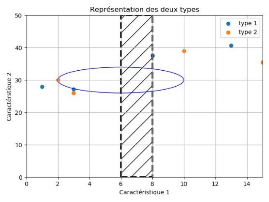

**Conclusion**

L’algorithme k-NN est une **méthode simple mais efficace** pour classer de nouvelles données en fonction des plus proches voisins.  

📌 **Points à retenir :**  

✅ Le choix de **k** influence fortement la précision du modèle.  

✅ La **distance utilisée** (euclidienne, Manhattan, etc.) peut modifier les résultats.  

✅ On peut **visualiser graphiquement** les données pour mieux comprendre les classifications. 

### <H3 STYLE="COLOR:GREEN;"> **1.9. Etude<a name="_page8_x40.00_y36.92"></a> sur le jeu de données « iris »** </H3>

En 1936, Edgar Anderson a collecté des données sur 3 espèces d'iris : "iris setosa", "iris virginica" et "iris versicolor" 


iris setosa


iris virginica


iris versicolor


Par souci simplification, on étudiera uniquement 

- la longueur des pétales  

- la largeur des pétales  

- l'espèce de l'iris (au lieu d'utiliser les noms des espèces, on utilisera  des chiffres : 0 pour "iris setosa", 1 pour "iris virginica" et 2 pour  "iris versicolor") 


Pour ceux qui travaillent avec Thonny : le fichier iris.csv se trouve dans le dossier Ressources. Copier le dans  le dossier personnel noté kNN  


???+ question "**Activité n°9 : Représentation avec matplotlib et pandas :**"

    ```python
    import pandas as pd
    import matplotlib.pyplot as plt

    # Chargement des données
    iris = pd.read_csv("iris.csv")

    # Sélection des caractéristiques
    x = iris["petal_length"]
    y = iris["petal_width"]
    lab = iris["species"]

    # Tracé des points en fonction de l’espèce
    plt.scatter(x[lab == 0], y[lab == 0], color='g', label='setosa')
    plt.scatter(x[lab == 1], y[lab == 1], color='r', label='virginica')
    plt.scatter(x[lab == 2], y[lab == 2], color='b', label='versicolor')

    plt.legend()
    plt.show()
    ```

    📌 **Résultat attendu :**  

    - Les **trois espèces d’iris** sont bien séparées  

    - La **longueur et la largeur des pétales** permettent une classification visuelle  


    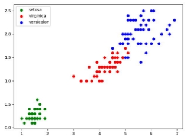


???+ question "**Activité n°10 : Choix de la cible :**" 

    Nous allons choisir un pétale de **0,5 cm de large** et **2 cm de long**.  

    Pour cela, il suffit de rajouter au fichier Python précédent la ligne suivante avant `plt.legend()` :  

    ```python
    plt.scatter(2.0, 0.5, color='k')
    ```

    **Visualisation du graphique :**  
    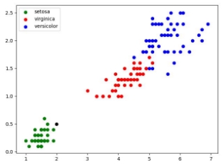

    **Conclusion :**  

    Il y a de **fortes chances** que l’iris soit de l’espèce **« iris setosa »**, car il est positionné dans la zone des points verts correspondant à cette espèce.


???+ question "**Activité n°11 : Autre choix de la cible :**"

    Nous choisissons maintenant un pétale de **0,75 cm de large** et **2,5 cm de long**.  

    Il faut modifier le fichier pour observer la **nouvelle cible**.

    **Visualisation du graphique :**  
    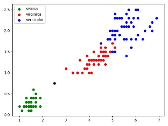

    Dans ce cas, il devient **plus difficile** de déterminer l’espèce de l’iris **à l’œil nu**. 

    ➡ **Il faut alors utiliser l’algorithme des k plus proches voisins (k-NN)**.

L’algorithme suit ces étapes :

- **1.** Calculer la **distance** entre la cible et chaque point du jeu de données « iris » (c'est un calcul entre deux points).

- **2.** Sélectionner uniquement les **k distances les plus petites** (les k plus proches voisins).

- **3.** Déterminer quelle est l'**espèce majoritaire** parmi les k plus proches voisins.

- **4.** Attribuer cette espèce à la **cible**.

Si **k = 3** :  

**Visualisation avec les 3 plus proches voisins :**  


**Résultat :**  
L’espèce inconnue est classée comme **« iris setosa »**.

 

???+ question "**Activité n°12 : Représentation avec matplotlib, pandas et sklean :**"

    Nous allons maintenant utiliser **Scikit-Learn** pour implémenter l’algorithme des k plus proches voisins.

    #### **Code Python :**
    ```python
    import pandas
    import matplotlib.pyplot as plt
    from sklearn.neighbors import KNeighborsClassifier

    # Chargement du jeu de données
    iris = pandas.read_csv("iris.csv")
    x = iris.loc[:, "petal_length"]
    y = iris.loc[:, "petal_width"]
    lab = iris.loc[:, "species"]

    # Valeurs de la cible
    longueur = 2.5
    largeur = 0.75
    k = 3

    # Affichage des points
    plt.scatter(x[lab == 0], y[lab == 0], color='g', label='setosa')
    plt.scatter(x[lab == 1], y[lab == 1], color='r', label='virginica')
    plt.scatter(x[lab == 2], y[lab == 2], color='b', label='versicolor')
    plt.scatter(longueur, largeur, color='k')
    plt.legend()

    # Algorithme k-NN
    d = list(zip(x, y))
    model = KNeighborsClassifier(n_neighbors=k)
    model.fit(d, lab)
    prediction = model.predict([[longueur, largeur]])

    # Affichage du résultat
    txt = "Résultat : "
    if prediction[0] == 0:
        txt += "setosa"
    elif prediction[0] == 1:
        txt += "virginica"
    else:
        txt += "versicolor"

    plt.text(3, 0.5, f"largeur : {largeur} cm longueur : {longueur} cm", fontsize=12)
    plt.text(3, 0.3, f"k : {k}", fontsize=12)
    plt.text(3, 0.1, txt, fontsize=12)

    plt.show()
    ```


➡ **L’algorithme k-NN classe la cible comme étant un iris setosa.**


**Explication du fonctionnement de k-NN en Python**  

L’algorithme k-NN est implémenté en Python avec **Scikit-Learn**.  

La ligne suivante **associe chaque point (x, y) avec son label** :
```python
d = list(zip(x, y))
```
Nous passons d’un format sous forme de **deux listes séparées** :
```python
x = [1.4, 1.4, 1.3, 1.5, 1.4, 1.7, 1.4, ...] 
y = [0.2, 0.2, 0.2, 0.2, 0.2, 0.2, 0.4,....] 
```
➡ **à une liste de tuples** représentant les coordonnées :
```python
d = [(1.4, 0.2), (1.4, 0.2), (1.3, 0.2), (1.5, 0.2), ...] 
```

**Explication du modèle k-NN :**
```python
model = KNeighborsClassifier(n_neighbors=k)
model.fit(d, lab)
prediction = model.predict([[longueur, largeur]])
```
- **`KNeighborsClassifier(n_neighbors=k)`** : crée un modèle k-NN avec k voisins.

- **`model.fit(d, lab)`** : entraîne le modèle en associant les points `(x, y)` à leurs étiquettes (`lab`).

- **`model.predict([[longueur, largeur]])`** : prédit l’espèce de la cible `[longueur, largeur]`.

⚠ **Attention :** `prediction` est une **liste contenant un seul élément**, il faut donc utiliser `prediction[0]` pour obtenir l’étiquette.


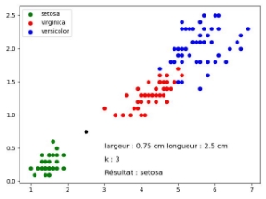


???+ question "**Activité n°13 : Utilisation de l’algorithme knn :**"

    Modifier l’algorithme précédent pour qu’il affiche un nombre de voisin différents → k = 5 


## <H2 STYLE="COLOR:BLUE;"> **2. Exercices<a name="_page12_x40.00_y36.92"></a>** </H2>

=> **CAPYTALE Le code vous sera donné par votre enseignant**

!!! abstract "**Exercice 1 : Distance de Hamming :**" 

    On appelle[ distance de Hamming ](https://fr.wikipedia.org/wiki/Distance_de_Hamming)entre deux chaînes de caractères A et B de même longueur le nombre d'indices i tels que A[i] ≠≠ B[i]. 

    Exemples. 

    - distance('ami' , 'amu') = 1 

    - distance('don' , 'bon') = 1 

    - distance('zozo' , 'bobo') = 2 

    Écrire une fonction python prenant en entrée deux chaînes de caractères de même longueur et renvoyant la distance de Hamming entre ces deux chaînes. 

    Tests : 
    ```python
    if __name__ == '__main__':
        assert hamming('abri', 'ubri') == 1
        assert hamming('010101', '010110') == 2
    ```

!!! abstract "**Exercice 2 : k-NN et distance :**"

    ```python
    from math import *
    # from random import *
    import matplotlib.pyplot as plt

    # import numpy as np
    # from scipy.stats import linregress

    # Données de type 1
    liste_x_1 = [1, 3, 8, 13]
    liste_y_1 = [28, 27.2, 37.6, 40.7]

    # Données de type 2
    liste_x_2 = [2, 3, 10, 15]
    liste_y_2 = [30, 26, 39, 35.5]

    plt.axis([0, 15, 0, 50])  # Attention [x1,x2,y1,y2]
    plt.axis('equal')
    plt.xlabel('Caractéristique 1')
    plt.ylabel('Caractérstique 2')
    plt.title('Représentation des deux types')
    plt.grid()
    plt.scatter(liste_x_1, liste_y_1, label='type 1')
    plt.scatter(liste_x_2, liste_y_2, label='type 2')

    plt.scatter(7, 28.4, label='cible')
    plt.legend()
    plt.show()

    table = [['t1', 1, 28], ['t1', 3, 27.2], ['t1', 8, 37.6], ['t1', 13, 40.7], ['t2', 2, 30], ['t2', 3, 26],
            ['t2', 10, 39], ['t2', 15, 35.5]]
    cible = [7, 28.4]
    k = 3


    def k_plus_proches_voisins(table, cible, k):
        """Revoie la liste des k plus proches voisins de la cible"""

        def distance_cible(donnee):
            """ renvoie la distance entre la donnée et la cible, on choisit la distance de Manhattan"""

            distance = abs(donnee[1] - cible[0]) + abs(donnee[2] - cible[1])
            return distance

        table_triee = sorted(table, key=distance_cible)
        proches_voisins = []

        for i in range(k):
            proches_voisins.append(table_triee[i])
        return proches_voisins

    print("La liste des ", k, " plus proches voisins de la cible : ", k_plus_proches_voisins(table, cible, k))
    ```

    1 Afficher le résultat de la fonction k_plus_proches_voisins(table,cible,k). Quel est le type de la cible ? 

    2 Quelle est la valeur de k ? 

    3 Quelle distance a-t-on utilisée ? 

    4 Utiliser d'autres valeurs de k. Quel est l'effet sur le type de la cible ? 

    5 Changer la distance. Programmer la distance de Tchebychev. Quel est l'effet sur le type de la cible ? 

!!! abstract "**Exercice 3 : Algorithme k-NN**"

    Sur un champ de bataille de la Première Guerre Mondiale un mémorial a été construit. Afin de réaliser une extension, des fouilles préventives ont été réalisées par l'INRAP (Institut National de Recherches Archéologiques Préventives). Au cours de ces fouilles, différents objets ou éléments de squelettes humains ont été trouvés. L'étude de ces découvertes a permis d'identifier la nationalité de nombreux artéfacts retrouvés : soit allemand, anglais ou français. Le plan ci-dessous représente la zone de fouille et la position des éléments dont l'origine a été identifiée. L'unité est le mètre. 

    Un élément d'un squelette a été retrouvé en (10;4) ; il est représenté par un losange couleur magenta sur le plan. L'objectif est de déterminer une origine probable pour cet élément de squelette avant de le déposer dans un ossuaire. 


    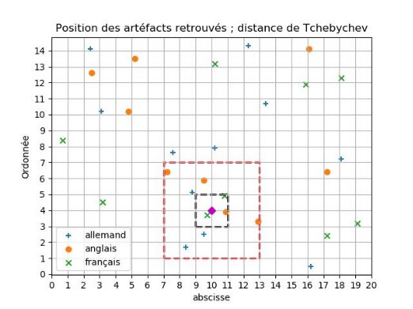

    La distance qui sera prise en compte est la distance dite de Tchebychev. (la définition précise de celle-ci sera donnée au 2.) 

    Ce que vous devez seulement savoir sur cette distance pour cet exercice c'est que l'ensemble des points se trouvant à une  distance r d'un  point I correspond  au  pourtour  du  carré,  de  centre I,  de  côtés  parallèles  aux  axes  et  de longueurs 2r. 

    Sur le graphique ci-dessus, le carré dessiné : 

    - en rouge correspond ainsi à l'ensemble des points se trouvant à 3 mètres. 

    - en noir correspond ainsi à l'ensemble des points se trouvant à 1 mètre. 
    
    1 À quelle valeur de k correspond le carré noir ? 

    2 Quelle serait l'origine de l'élément de squelette en considérant cette valeur de k ? 

    3 On choisit k=9. Quelle serait l'origine de l'élément de squelette en considérant cette valeur de k ? 

    4 On choisit k=11. Quelle serait l'origine de l'élément de squelette en considérant cette valeur de k ? 

    5 Peut-on savoir à coup sûr, en prenant une valeur de k inférieure au égale à 11, si le combattant dont on a trouvé un élément de squelette était un combattant de la Triple-Entente (France + Royaume-Uni + Russie) ou de la Triple-Alliance (Allemagne + Autriche-Hongrie + Italie) ? 

## <H2 STYLE="COLOR:BLUE;"> **3.  Problème : analyse de texte<a name="_page14_x40.00_y36.92"></a>** </H2>
=> **A faire avec Thonny**

**Nous aurons besoin de quelques connaissances : Lecture et écriture dans un fichier** 

### <H3 STYLE="COLOR:GREEN;"> **3.1. Ecriture dans un fichier** </H3>

#### <H4 STYLE="COLOR:MAGENTA;"> **3.1.1. Le mode write**</H4>

L’écriture dans un fichier se fait avec la fonction ```open()``` en mode écriture : 

???+ question "**Activité n°14 : Création, ouverture et écriture dans un fichier texte**"

    ```python
    # coding=utf-8
    # script lecture.py

    NomFichier = 'test.txt'
    # création et ouverture du fichier test.txt en mode write 'w' (écriture)
    # si le fichier test.txt existe déjà, il est écrasé
    Fichier = open(NomFichier,'w')      # instanciation de l'objet Fichier de la classe file

    # écriture dans le fichier avec la méthode write()
    Fichier.write('Bonjour à tous !')

    # fermeture du fichier avec la méthode close()
    Fichier.close()
    ```

    Enregistrer le script dans Documents et lancer le script 
    Ouvrir le fichier test.txt qui se trouve dans Documents 

    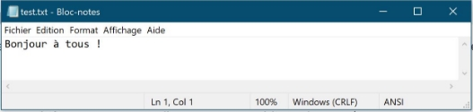

#### <H4 STYLE="COLOR:MAGENTA;"> **3.1.2. Le mode append**</H4>

Pour écrire à la fin d’un fichier, on utilise la fonction ```open()``` en mode ajout. 

???+ question "**Activité n°15 :**" 

    Repartons du fichier précédent : en mode append (ajout)  
    ```python
    # coding=utf-8
    # ouverture du fichier test.txt en mode append 'a' (ajout)
    Fichier = open('test.txt','a')    # instanciation de l'objet Fichier
    Fichier.write('\nUne deuxième ligne.\n')# '\n' saut de ligne
    Fichier.write('abc\tABC\t123\n')   # '\t' tabulation
    Fichier.write(str(126.85)+'\n')       # str() transforme un nombre en chaîne de caractères
    Fichier.write('\x31\x41\x61\n')       # écriture de '1Aa' en code ASCII
    Fichier.write(chr(0x62)+'\n')     # écriture de 'b' en code ASCII
    Fichier.write(chr(99))       # écriture de 'c' en code ASCII
    Fichier.close()
    ```

    Enregistrer le script dans Documents et lancer le script 
    Ouvrir le fichier test.txt qui se trouve dans Documents 

    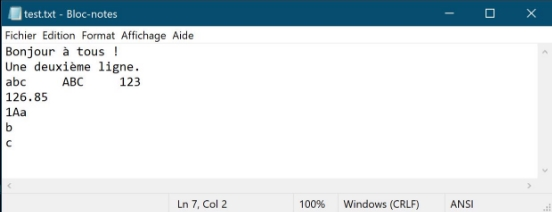


### <H3 STYLE="COLOR:GREEN;"> **3.2. Lecture dans un fichier** </H3>
#### <H4 STYLE="COLOR:MAGENTA;"> **3.2.1. Lecture en mode texte** </H4>

???+ question "**Activité n°16 :**" 

    La lecture dans un fichier texte se fait avec la fonction ```open()``` en mode … lecture : 
    ```python
    # coding=utf-8
    # ouverture du fichier test.txt en mode read 'r' (lecture en mode texte)
    Fichier = open('test.txt','r')      # instanciation de l'objet Fichier de la classe file
    # lecture dans le fichier avec la méthode read()
    chaine = Fichier.read()
    # affichage du contenu du fichier
    print('Contenu du fichier :\n' + chaine)
    # fermeture du fichier avec la méthode close()
    Fichier.close()
    ```

#### <H4 STYLE="COLOR:MAGENTA;"> **3.2.2. Conversion un fichier txt en Liste en insertion d’une phrase dans un fichier txt**</H4>   

???+ question "**Activité n°17 :**" 

    la méthode ```readlines()``` permet de récupérer l’ensemble des lignes du fichier texte sous forme d’une liste. Le premier élément de la liste sera la première ligne, le second élément sera le deuxième élément … 
    ```python
    # coding: utf-8
    Fichier = open('test.txt', 'r')
    Liste = Fichier.readlines() # permet de récupérer le fichier txt sous forme d'une liste
    Fichier.close()
    ```

???+ question "**Activité n°18 :**" 

    La méthode ```insert()``` permet de d’insérer un élément dans une liste, puis on utilise ```writelines()```pour insérer chaque élément de la liste dans une ligne seule : le premier élément sera sur la première ligne, … 
    ```python
    # coding: utf-8
    Fichier = open('test.txt', 'r')
    Liste = Fichier.readlines() # permet de récupérer le fichier txt sous forme d'une liste
    Fichier.close()
    phrase_a_inserer = "Je suis en NSI! \n" # ne pas oublier le retour à la ligne
    Liste.insert(2,phrase_a_inserer) # insertion de la phrase à la troisième position
    Fichier = open("test.txt", "w") # on mode write donc on écrase le contenu existant
    Fichier.writ

    elines(Liste)
    Fichier.close()
    ```

### <H3 STYLE="COLOR:GREEN;"> **3.3. Suivre les indications du fichier knn_analyse_texte_eleve.py**</H3>
=> **CAPYTALE Le code vous sera donné par votre enseignant**