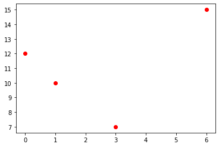
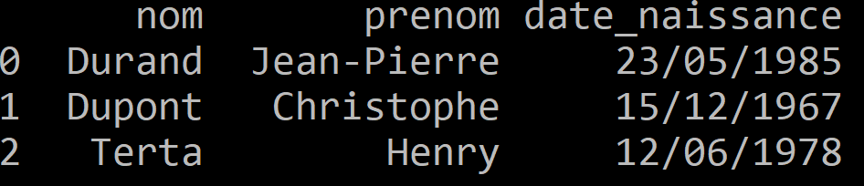
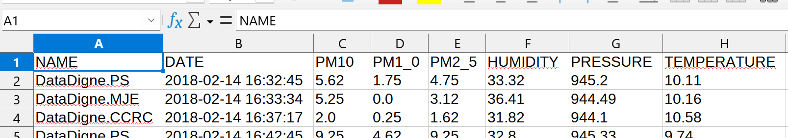

---
author: ELP
title: 12 Traitement des données en tables
---

**Table des matières** 

1. [**LES FICHIERS CSV ET LES FICHIERS JSON**](#_page0_x40.00_y360.92)
2. [**IMPORTATION D’UN FICHIER CSV**](#_page7_x40.00_y36.92)
3. [**TRI**](#_page7)
4. [**FUSION DE TABLES**](#_page12)
5. [**PROJET (DEMARCHE D’INVESTIGATION)**](#_page13_x40.00_y36.92)

## <H2 STYLE="COLOR:BLUE;">**1. Les fichiers CSV et les fichiers JSON<a name="_page0_x40.00_y360.92"></a></h2>**

Les jeux de données en libre accès sont souvent fournis sous les formats suivants :

- **CSV (Comma Separated Values)** : format simple de fichier texte structurant les données sous forme de tableau, où chaque ligne représente un enregistrement et chaque colonne une variable.

- **JSON (JavaScript Object Notation)** : format structuré sous forme de paires clé-valeur, utilisé principalement pour les échanges de données entre applications.

### <H3 STYLE="COLOR:GREEN;">**1.1. Exemple de format CSV</h3>** 

Un fichier CSV contenant des albums de musique pourrait être structuré ainsi :
```
Album;Groupe;Année;Classement
Master of Puppets;Metallica;1986;1
Paranoid;Black Sabbath;1970;2
Rage Against the Machine;Rage Against the Machine;1992;3
Ride the Lightning;Metallica;1984;4
```
📌 **Remarques :**  

- Les valeurs sont séparées par un **point-virgule (`;`)**, mais d'autres séparateurs comme la **virgule (`,`)** ou la **tabulation (`\t`)** existent.

- En France, le **point-virgule (`;`)** est souvent utilisé contrairement à d'autres pays où la virgule prédomine.  

### <H3 STYLE="COLOR:GREEN;">**1.2. Exemple de format JSON</h3>** 

L'équivalent en JSON du fichier précédent :
```json
{
    "albums": [
        {"Album": "Master of Puppets", "Groupe": "Metallica", "Année": 1986, "Classement": 1},
        {"Album": "Paranoid", "Groupe": "Black Sabbath", "Année": 1970, "Classement": 2},
        {"Album": "Rage Against the Machine", "Groupe": "Rage Against the Machine", "Année": 1992, "Classement": 3},
        {"Album": "Ride the Lightning", "Groupe": "Metallica", "Année": 1984, "Classement": 4}
    ]
}
```
📌 **Remarques :**  

- JSON est plus structuré et convient aux **applications web** et **bases de données NoSQL**. 

- Il permet d’imbriquer des objets et de gérer des types variés (**nombres, chaînes de caractères, booléens, listes…**).  

### <H3 STYLE="COLOR:GREEN;">**1.3. Exemple de format XML</h3>** 

Un autre format structuré est le **XML (Extensible Markup Language)** :
```xml
<albums>
    <album>
        <titre>Master of Puppets</titre>
        <groupe>Metallica</groupe>
        <annee>1986</annee>
        <classement>1</classement>
    </album>
</albums>
```
📌 **Remarque :** XML est utilisé dans certaines bases de données et échanges de données.


## <H2 STYLE="COLOR:BLUE;">**2. Importation d’un fichier CSV<a name="_page7_x40.00_y36.92"></a></h2>**

### <H3 STYLE="COLOR:GREEN;">**2.1. Lecture d'un fichier CSV en liste simple<a name="_page1_x40.00_y36.92"></a></h3>** 

=> **CAPYTALE Le code vous sera donné par votre enseignant**


???+ question "**Activité n°1 : Lire un fichier CSV avec `csv.reader`**" 

    ```python
    import csv

    f = open("musique.csv", encoding="utf-8")  # Ouvre le fichier CSV avec encodage UTF-8
    donnees = csv.reader(f, delimiter=';')  # Lecture avec séparateur ";"
    for row in donnees:  
        print(row)  # Affiche chaque ligne
    f.close()  # Toujours fermer le fichier
    ```

    **Attention sur Thonny** (par exemple) il faut enregistrer le fichier python au même endroit que le fichier CSV.
    ```
    >>>
    ['Album', 'groupe', 'année', 'classement']
    ['Master of Puppets', 'Metalica', '1986', '1']
    ['Paranoid', 'Black Sabbath', '1970', '2']
    ['Rage against the machine', 'Rage against the machine', '1992', '3']
    ['Ride the lightning', 'Metallica', '1984', '4']
    ['Rust in peace', 'Megadeth', '1990', '5']
    ['Metallica', 'Metallica', '1991', '6']
    ['Toxicity', 'System of a down', '2001', '7']
    ['reign in blood', 'Slayer', '1986', '8']
    ['the number of the beast', 'Iron maiden', '1982', '9']
    ['From mars to sirius', 'Gojira', '2005', '10']
    ['..and justice for all', 'Metallica', '1988', '11']
    ['Mutter', 'Rammstein', '2001', '12']
    ['Painkiller', 'Judas Priest', '1990', '13']
    ['Powerslave', 'Iron maiden', '1984', '14']
    ['Blawater Park', 'Opeth', '2001', '15']
    ```

📝 **Problème** : Les données sont des **listes non structurées**. La première ligne correspond aux **descripteurs**, les autres lignes aux **valeurs**.

### <H3 STYLE="COLOR:GREEN;">**2.2. Lecture en liste de liste<a name="_page5_x40.00_y36.92"></a></h3>** 

???+ question "**Activité n°2 :  Stocker un fichier CSV sous forme de liste de listes**"

    ```python
    import csv

    table = []
    with open("musique.csv", encoding="utf-8") as f:
        donnees = csv.reader(f, delimiter=';')  
        for row in donnees:
            table.append(row)  # Ajoute chaque ligne à la liste table

    print(table)  # Affichage de la liste de listes
    ```

    ```
    >>>
    [['Album', 'groupe', 'année', 'classement'], ['Master of Puppets', 'Metalica', '1986', '1'], ['Paranoid', 'Black Sabbath', '1970', '2'], ['Rage against the machine', 'Rage against the machine', '1992', '3'], ['Ride the lightning', 'Metallica', '1984', '4'], ['Rust in peace', 'Megadeth', '1990', '5'], ['Metallica', 'Metallica', '1991', '6'], ['Toxicity', 'System of a down', '2001', '7'], ['reign in blood', 'Slayer', '1986', '8'], ['the number of the beast', 'Iron maiden', '1982', '9'], ['From mars to sirius', 'Gojira', '2005', '10'], ['..and justice for all', 'Metallica', '1988', '11'], ['Mutter', 'Rammstein', '2001', '12'], ['Painkiller', 'Judas Priest', '1990', '13'], ['Powerslave', 'Iron maiden', '1984', '14'], ['Blawater Park', 'Opeth', '2001', '15']]
    ```

✅ **Avantage** : Structure en **tableau** facilitant l’accès aux données. 

❌ **Inconvénient** : Il faut manipuler les indices (`table[0]`, `table[1]`...) pour récupérer les données.

### <H3 STYLE="COLOR:GREEN;">**2.3. Lecture en liste de dictionnaires<a name="_page6_x79.00_y408.92"></a></h3>** 


???+ question "**Activité n°3 : Transformer un fichier CSV en liste de dictionnaires**"

    ```python
    import csv

    dico = []
    with open("musique.csv", encoding="utf-8") as f:
        donnees = csv.DictReader(f, delimiter=';')  
        for row in donnees:
            dico.append(row)  

    print(dico)  # Affichage de la liste de dictionnaires
    ```


    ```
    >>>
    [{'Album': 'Master of Puppets', 'groupe': 'Metalica', 'année': '1986', 'classement': '1'}, {'Album': 'Paranoid', 'groupe': 'Black Sabbath', 'année': '1970', 'classement': '2'}, {'Album': 'Rage against the machine', 'groupe': 'Rage against the machine', 'année': '1992', 'classement': '3'}, {'Album': 'Ride the lightning', 'groupe': 'Metallica', 'année': '1984', 'classement': '4'}, {'Album': 'Rust in peace', 'groupe': 'Megadeth', 'année': '1990', 'classement': '5'}, {'Album': 'Metallica', 'groupe': 'Metallica', 'année': '1991', 'classement': '6'}, {'Album': 'Toxicity', 'groupe': 'System of a down', 'année': '2001', 'classement': '7'}, {'Album': 'reign in blood', 'groupe': 'Slayer', 'année': '1986', 'classement': '8'}, {'Album': 'the number of the beast', 'groupe': 'Iron maiden', 'année': '1982', 'classement': '9'}, {'Album': 'From mars to sirius', 'groupe': 'Gojira', 'année': '2005', 'classement': '10'}, {'Album': '..and justice for all', 'groupe': 'Metallica', 'année': '1988', 'classement': '11'}, {'Album': 'Mutter', 'groupe': 'Rammstein', 'année': '2001', 'classement': '12'}, {'Album': 'Painkiller', 'groupe': 'Judas Priest', 'année': '1990', 'classement': '13'}, {'Album': 'Powerslave', 'groupe': 'Iron maiden', 'année': '1984', 'classement': '14'}, {'Album': 'Blawater Park', 'groupe': 'Opeth', 'année': '2001', 'classement': '15'}]
    ```

✅ **Avantage** : Chaque ligne est convertie en **dictionnaire** avec des **clés explicites**.

❌ **Inconvénient** : Utilisation légèrement plus gourmande en mémoire.


## <H2 STYLE="COLOR:BLUE;">**3. Application : Analyse et Visualisation de données CSV<a name="_page7_x40.00_y36.92"></a></h2>**

### <H3 STYLE="COLOR:GREEN;">**3.1. Tracer un graphique avec `matplotlib`</h3>** 

📌 **Exemple de graphique avec Matplotlib**
```python
import matplotlib.pyplot as plt

X = [0, 1, 3, 6]  # Liste des abscisses
Y = [12, 10, 7, 15]  # Liste des ordonnées

plt.plot(X, Y, 'ro')  # 'ro' = points rouges
plt.xlabel("Abscisse")
plt.ylabel("Ordonnée")
plt.title("Exemple de nuage de points")
plt.show()
```
📌 **Explication** :  
- `plt.plot(X, Y, 'ro')` affiche les points rouges.  
- `plt.show()` affiche le graphique.  




### <H3 STYLE="COLOR:GREEN;">**3.2. Analyse du fichier `MetalBands.csv`</h3>** 

???+ question "**Activité n°4 : Analyse de données CSV**"


    ```python
    import csv

    dico = []
    with open("MetalBands.csv", encoding='ISO-8859-1') as f:  
        donnees = csv.DictReader(f, delimiter=',')  
        for row in donnees:
            dico.append(row)

    print(len(dico))  # 1. Nombre de groupes
    print(dico[811])  # 2. Nom du groupe en 812
    ```
    📌 **Explications** :

    1️⃣ `len(dico)` : Affiche le nombre de groupes présents.  

    2️⃣ `dico[811]` : Affiche le groupe en **812e position** (indexation commence à 0).  

### <H3 STYLE="COLOR:GREEN;">**3.3. Recherche de groupes par année</h3>** 

???+ question "**Activité n°5**" 

    📌 **Compter les groupes formés en 1981**
    ```python
    groupes_1981 = [band for band in dico if band['formed'] == '1981']
    print(f"Nombre de groupes formés en 1981 : {len(groupes_1981)}")
    ```
    📌 **Explication** :

    - On **filtre** les groupes avec `formed == '1981'`.

    - On affiche la **taille** de la liste filtrée.

### <H3 STYLE="COLOR:GREEN;">**3.4. Liste des groupes de "Melodic Death</h3>** 

???+ question "**Activité n°6 :**" 

    📌 **Lister les groupes en supprimant les doublons**
    ```python
    genres = set()  # Utilisation d'un ensemble pour éviter les doublons
    for band in dico:
        if "melodic death" in band['genre'].lower():
            genres.add(band['band_name'])  

    print(genres)
    ```
    📌 **Explication** :

    - `band['genre'].lower()` convertit en **minuscule** pour éviter les erreurs de casse.

    - `set()` supprime automatiquement les doublons.

### <H3 STYLE="COLOR:GREEN;">**3.5. Visualisation des groupes sur un graphique</h3>** 

???+ question "**Activité n°7 :**"

    📌 **Tracer le nombre de fans en fonction de l'année de formation**
    ```python
    import matplotlib.pyplot as plt

    X = []  # Années
    Y = []  # Nombre de fans

    for band in dico:
        if band['formed'].isdigit() and band['fans'].isdigit():
            X.append(int(band['formed']))  
            Y.append(int(band['fans']))  

    plt.plot(X, Y, 'ro', label="Tous les groupes")  # Points rouges
    plt.xlabel("Année de formation")
    plt.ylabel("Nombre de fans")
    plt.title("Évolution du nombre de fans des groupes de métal")
    plt.legend()
    plt.show()
    ```


## <H2 STYLE="COLOR:BLUE;">**4.Tri des données<a name="_page7"></a></h2>**

L’exploitation des données passe souvent par un **tri** afin de faciliter la recherche et l’analyse des informations.

📌 **Pourquoi trier ?** 

- Obtenir un classement (exemple : tri des groupes de métal par popularité).  

- Optimiser les recherches (exemple : la **recherche dichotomique** est plus efficace sur un tableau trié).  


### <H3 STYLE="COLOR:GREEN;">**4.1. Fonction filtre : rechercher un groupe selon son genre<a name="_page7_x"></a></h3>** 

???+ question "**Activité n°8 : Développer une fonction `groupeGenre()` qui filtre les groupes par genre musical.**:" 

    **Exemple d'utilisation :**
    ```python
    >>> print(groupeGenre('Extreme folk'))
    [{'band_name': 'Ensiferum', 'fans': '1879', 'formed': '1995', 'origin': 'Finland', 'style': 'Extreme folk'}, 
    {'band_name': 'Finntroll', 'fans': '967', 'formed': '1997', 'origin': 'Finland', 'style': 'Extreme folk'}, 
    {'band_name': 'Brymir', 'fans': '108', 'formed': '2006', 'origin': 'Finland', 'style': 'Extreme folk'}]
    ```
    📌 **Attention** : Vérifier les majuscules/minuscules pour éviter les erreurs.

    🔹 **Implémentation de la fonction `groupeGenre()`**
    ```python
    def groupeGenre(genre_recherche):
        """Retourne la liste des groupes appartenant au genre donné."""
        genre_recherche = genre_recherche.lower()  # Normalisation en minuscules
        groupes = [band for band in dico if band['style'].lower() == genre_recherche]
        return groupes

    # Exemple d'utilisation
    print(groupeGenre('Extreme folk'))
    ```


### <H3 STYLE="COLOR:GREEN;">**4.2. Fonction de tri<a name="_page7_x40.00_y"></a></h3>** 

Le tri permet d'ordonner les données selon un critère donné.  

- `sorted()` retourne une **nouvelle liste triée**.  

- `.sort()` trie la **liste en place** (modifie la liste originale).  


La méthode **.sort()**  trie la liste en place, alors que la fonction **sorted()** renvoie une **nouvelle liste** correspondant la liste triée, la liste initiale étant laissée intacte.

Un exemple de tri de dictionnaire
```python
Simpsons = [{"Prenom" : "Bart", "age estimé": "10"},
           {"Prenom" : "Lisa", "age estimé": "8"},
           {"Prenom" : "Maggie", "age estimé": "1"},
           {"Prenom" : "Homer", "age estimé": "38"},
           {"Prenom" : "Marge", "age estimé": "37"}]

def age(personnage):
    return int(personnage["age estimé"])
```

🔹 **Exemple de tri d'un dictionnaire**  
```python
Simpsons = [{"Prenom": "Bart", "age": "10"},
           {"Prenom": "Lisa", "age": "8"},
           {"Prenom": "Maggie", "age": "1"},
           {"Prenom": "Homer", "age": "38"},
           {"Prenom": "Marge", "age": "37"}]

def age(personnage):
    return int(personnage["age"])  # Conversion en entier

# Tri des personnages par âge croissant
triSimpsons = sorted(Simpsons, key=age)

# Tri par âge décroissant
triSimpsonsDesc = sorted(Simpsons, key=age, reverse=True)
```


???+ question "**Activité n°9 : Trier les groupes par nombre de fans (ordre décroissant)**"

    🎯 **Objectif** : Afficher les groupes ayant **plus de 2000 fans**, sans doublon.

    ```python
    def tri_par_fans(dico):
        """Trie les groupes par nombre de fans en ordre décroissant et affiche ceux avec +2000 fans."""
        fans_sorted = sorted(dico, key=lambda x: int(x['fans']), reverse=True)  # Tri décroissant
        groupes_uniques = set()  # Pour éviter les doublons

        for band in fans_sorted:
            if int(band['fans']) > 2000 and band['band_name'] not in groupes_uniques:
                print(f"{band['band_name']} - {band['fans']} fans")
                groupes_uniques.add(band['band_name'])  # Ajout dans l'ensemble

    # Exécution
    tri_par_fans(dico)
    ```
    📌 **Aide** : Il y a **13 groupes** ayant plus de 2000 fans.


???+ question "**Activité n°10 : Trier les groupes par année de formation (1980-1985)**"

    🎯 **Objectif** : Afficher les groupes créés entre **1980 et 1985**, sans doublon.

    ```python
    def groupes_1980_1985(dico):
        """Retourne la liste des groupes formés entre 1980 et 1985."""
        groupes_sorted = sorted(dico, key=lambda x: int(x['formed']))  # Tri par année croissante
        groupes_uniques = set()

        for band in groupes_sorted:
            if 1980 <= int(band['formed']) <= 1985 and band['band_name'] not in groupes_uniques:
                print(f"{band['band_name']} - {band['formed']}")
                groupes_uniques.add(band['band_name'])  # Évite les doublons

    # Exécution
    groupes_1980_1985(dico)
    ```
    📌 **Aide** : Il y a **240 groupes** correspondant à ces critères.


## <H2 STYLE="COLOR:BLUE;">**5.Fusion de tables : Croisement des données CSV<a name="_page12"></a></h2>**

Nous disposons de **trois fichiers CSV** contenant des informations sur les pays, langues et villes :

1. **countries.csv** (pays) 

2. **languages.csv** (langues parlées)  

3. **cities.csv** (villes)  


???+ question "**Activité n°11 : Ouverture et chargement des fichiers CSV**"

    ```python
    import csv

    # Chargement du fichier countries.csv
    pays = []
    with open("countries.csv", encoding="utf-8") as f:
        donnees = csv.DictReader(f, delimiter=',')
        for row in donnees:
            pays.append(row)

    # Chargement du fichier languages.csv
    langues = []
    with open("languages.csv", encoding="utf-8") as f:
        donnees = csv.DictReader(f, delimiter=',')
        for row in donnees:
            langues.append(row)

    # Chargement du fichier cities.csv
    villes = []
    with open("cities.csv", encoding="utf-8") as f:
        donnees = csv.DictReader(f, delimiter=',')
        for row in donnees:
            villes.append(row)
    ```


???+ question "**Activité n°12 : Rechercher les langues parlées en Haïti**"  

    🎯 **Objectif** : Trouver les langues parlées en Haïti à partir du code pays.

    ```python
    # Trouver le code de Haïti
    def code_pays(pays, nom):
        """Renvoie le code du pays donné."""
        for country in pays:
            if country["Name"] == nom:
                return country["CountryCode"]
        return None  # Si le pays n'est pas trouvé

    # Trouver les langues parlées
    def langues_parlees(pays, langues, nom):
        """Renvoie la liste des langues parlées dans un pays donné."""
        code = code_pays(pays, nom)
        return [langue["Language"] for langue in langues if langue["CountryCode"] == code]

    # Exécution
    print(langues_parlees(pays, langues, "Haiti"))
    ```
    📌 **Exemple de sortie** : `['French', 'Haiti Creole']`


???+ question "**Activité n°13 : Trouver la capitale d’un pays**"

    🎯 **Objectif** : Associer chaque pays à sa capitale.  

    ```python
    # Associer les capitales aux pays
    for country in pays:
        capital_id = country["Capital"]
        capital_name = ""

        for city in villes:
            if city["ID"] == capital_id:
                capital_name = city["Name"]
                break  # Dès qu'on trouve la capitale, on arrête

        country["CapitalName"] = capital_name  # Ajout au dictionnaire

    # Exécution pour Haïti
    print(f"La capitale de {pays[72]['Name']} est {pays[72]['CapitalName']}.")
    ```
    📌 **Cas particulier** : Certains pays comme l'**Antarctique** n'ont pas de capitale.


Merci à Nicolas Revéret

## <H2 STYLE="COLOR:BLUE;">**6.  Projet (démarche d’investigation)<a name="_page13_x40.00_y36.92"></a></h2>** 

!!! abstract "**projet 1 : ★ pandy pandas pas à pas**"

    => **CAPYTALE Le code vous sera donné par votre enseignant**

    On trouve énormément de données au format CSV sur internet. Une partie de ces données sont publiques, par exemple le site[ data.gouv.fr ](https://www.data.gouv.fr/fr/)récence un grand nombre de données publiques. Ces données sont librement réutilisables. 

    Voici un exemple du contenu d'un fichier CSV : 
    ```CSV
    nom,prenom,date_naissance
    Durand,Jean-Pierre,23/05/1985
    Dupont,Christophe,15/12/1967
    Terta,Henry,12/06/1978
    ```


    1 Donner les différentes valeurs du descripteur "date_naissance". 

    **Les données structurées au format CSV** 

    2 Afin de découvrir ce qu'est "l'open data", se rendre sur le site [ data.gouv.fr ](https://www.data.gouv.fr/fr/). En haut et à gauche de la page d’accueil, cliquer sur "Découvrez L’OpenData". Résumer en quelques lignes ce que vous aurez appris en lisant cette page.

    3 Explorer pendant quelques minutes le site [ data.gouv.fr ](https://www.data.gouv.fr/fr/). Rechercher les données "Opérations coordonnées par les CROSS" à l'aide du moteur de recherche proposé par le site. Quel est le format proposé dans les fichiers principaux ?

    4 on va travailler sur le fichier ident_virgule.csv (pour ceux sur Thonny :du dossier Ressources), le séparateur est la "virgule".
    Dans un tableur type libre offiche on obtient :

    

    Les données sont bien "rangées" dans un tableau avec des lignes et des colonnes (voilà pourquoi on parle de données tabulaires). 


    5 on va travailler avec ville_virgule.csv (pour Thonny : du dossier Ressources) 

    On obtient 12 colonnes (et 36700 lignes si on ne compte pas l'entête !), voici la signification de ces colonnes : 

    - dep : numéro de département 
    - nom : nom de la commune 
    - cp : code postal 
    - nb_hab_2010 : nombre d'habitants en 2010 
    - nb_hab_1999 : nombre d'habitants en 1999 
    - nb_hab_2012 : nombre d'habitants en 2012 (approximatif) 
    - dens : densité de la population (habitants par kilomètre carré) 
    - surf : superficie de la commune en kilomètre carré 
    - long : longitude 
    - lat : latitude 
    - alt_min : altitude minimale de la commune (il manque des données pour certains territoires d'outre-mer) 
    - alt_max : altitude maximale de la commune (il manque des données pour certains territoires d'outre-mer) 


    **Le traitement des données structurées** 


    6 Executer le code Python suivant : 
    ```python
    import pandas

    ident = pandas.read_csv("ident_virgule.csv")
    print(ident)
    ```


    Le code ci-dessus est très simple : 

    - Avec la première ligne, import de la bibliothèque pandas afin de pouvoir l'utiliser 
    - À la deuxième ligne, création d’une variable "ident" qui va contenir les données présentes dans le fichier "ident_virgule.csv"  
    - La troisième ligne affiche les données contenues dans la variable "ident" rangées sous la forme d'un tableau, un peu comme ce que nous obtenions en ouvrant le fichier "ident_virgule.csv" avec un tableur. 

    Une colonne a été ajoutée par rapport à ce que nous obtenions avec le tableur : 

    Les  nombres  présents  dans  cette  colonne  sont  appelés  des  index. Chaque ligne du tableau a un index (première ligne :  index 0, deuxième ligne index 1...)   

    Les  colonnes  possèdent  également  des  index,  dans  notre  exemple ces index correspondent au "nom" (index de la première colonne), au "prenom" (index de la deuxième colonne) et à "date_naissance" (index de la troisième colonne) 
    
    En résumé : les lignes possèdent des index (0,1,2..), les colonnes possèdent aussi des index ("nom", "prenom", …). 

    7 Il est possible de récupérer certaines données du tableau, par exemple, certaines lignes, certaines colonnes ou bien encore des valeurs uniques. Pour cela, il suffit d'utiliser l'instruction "loc" avec les index des lignes et les index des colonnes. Le principe de fonctionnement de "loc" est relativement simple puisque l'on aura une instruction de la forme "```loc[index_ligne,index_colonne]```" 
    ```python
    import pandas

    ident = pandas.read_csv("ident_virgule.csv")
    print(ident)

    info  = ident.loc[1, 'prenom']
    print(info)
    ```
 


    8 Recopier et modifier le programme pour que la variable info affiche "12/06/1978".

    9 Il  est  possible  de  récupérer  plusieurs  toutes  les  lignes  d'une  colonne,  il  suffit  de  remplacer  la  partie "index_ligne" de "loc" par ":" (pour faire un slicing): 
    ```python
    import pandas

    ident = pandas.read_csv("ident_virgule.csv")
    info  = ident.loc[:, 'prenom']
    print(info)
    ```


    10 Il est aussi possible de récupérer seulement certaines lignes et certaines colonnes en utilisant la notation suivante : ```loc[[index_ligne_1,index_ligne_2,...],[index_colonne_1,index_colonne_2,…]]``` : 
    ```python
    import pandas

    ident = pandas.read_csv("ident_virgule.csv")
    info  = ident.loc[[0,1], ['nom','date_naissance']]
    print(info)
    ```

    

    Afin d'avoir des exemples plus complexes à traiter, on travaille dans la suite sur les données contenues dans le fichier ville_virgule.csv. 

    Les descripteurs de ce fichier sont :

    | dep | nom          | cp    | nb_hab_2010 | nb_hab_1999 | nb_hab_2012 | dens | surf | long | lat  | alt_min | alt_max |


    11 Tester le programme suivant : 
    ```python
    import pandas

    info_villes = pandas.read_csv("villes_virgule.csv")
    print(info_villes)
    ```


    Vérifier que la variable "info_villes" contient bien les données contenues dans le fichier ville_virgule.csv. Il manque des données dans le tableau qui s'affiche dans la console (les données manquantes sont symbolisées par des …). En effet, le tableau contient trop données pour qu'il soit entièrement affiché dans la console. 

    En explorant le tableau, on devrait, notamment dans les colonnes l'altitude mini et maxi, voir apparaître un étrange "NaN" (Not a Number) pour les dernières villes du tableau car certaines données sont manquantes. 

    Maintenant, pour obtenir un tableau contenant toutes les villes qui ont une altitude minimum supérieure à 1500 m, on va devoir introduire des conditions dans la sélection des villes. 

    12 Tester le programme suivant : 
    ```python
    import pandas

    info_villes = pandas.read_csv("villes_virgule.csv")
    nom_alt = info_villes.loc[info_villes["alt_min"] > 1500, ["nom","alt_min"]]
    print(nom_alt)
    ```

    Dans la fonction "loc", l'expression "```info_villes["alt_min"]>1500```" est bien avant la virgule, elle concerne donc les index des lignes du tableau. On sélectionnera uniquement les lignes qui auront la valeur du descripteur "alt_min" supérieure à 1500. Nous allons donc bien sélectionner les villes qui ont une altitude minimum supérieure à 1500 m. 

    13 Écrire un programme qui permet d'avoir les villes qui ont une densité d'habitant (descripteur : "dens") inférieure à 50 (dans le tableau ainsi créé, on aura 3 colonnes : le nom de la ville, la densité de la population et l'altitude minimum)  

    14 Il est possible de combiner plusieurs facteurs de sélection en utilisant un "et"("&") ou un "ou"("|") : 
    ```python
    import pandas

    info_villes = pandas.read_csv("villes_virgule.csv")
    nom_alt = info_villes.loc[(info_villes["alt_min"] > 1500) \
        & (info_villes["dens"] > 50), ["nom","dens","alt_min"]]
    print(nom_alt)
    ```


    Il y a, en France, une seule ville avec une densité de population inférieure à 2 et une altitude minimum supérieure à 1600 m. Donner son nom.  

    15 Il est aussi possible d'effectuer des calculs sur des colonnes, par exemple des moyennes. Il suffit d'utiliser l'instruction "mean" pour effectuer une moyenne : 
    ```python
    import pandas

    info_villes = pandas.read_csv("villes_virgule.csv")
    moyenne_alt_min = info_villes.loc[:,"alt_min"].mean()
    print(moyenne_alt_min)
    ```


    

    On rappelle que dans "```loc[:,"alt_min"]```" le ":" signifie que l'on considère toutes les lignes du tableau. De plus le "alt_min" que le calcul de la moyenne porte bien sur les données du descripteur "alt_min". 

    16 Écrire un programme permettant de calculer le nombre moyen d'habitants en 2012 

    17 Pour l'instant nous avons calculé une moyenne sur l'ensemble des lignes, il est aussi possible d'imposer une condition sur les lignes qui seront utilisées pour le calcul : 
    ```python
    import pandas

    info_villes = pandas.read_csv("villes_virgule.csv")
    nombre_hab = info_villes.loc[info_villes["alt_min"] > 1500, \
        "nb_hab_2012"].mean()
    print(nombre_hab)
    ```
    

    On constate que les villes ayant une altitude minimum supérieure à 1500 m avaient en moyenne 350 habitants en 2012. 

    18 Il est aussi possible de trier le tableau en fonction des valeurs d'un descripteur. Il suffit d'utiliser l'instruction "sort_values" : 
    ```python
    import pandas
    info_villes=pandas.read_csv("villes_virgule.csv")
    tri_alt_min=info_villes.sort_values(by=["alt_min"])
    print(tri_alt_min)
    ```


    On obtient un nouveau tableau de données "tri_alt_min" trié dans l'ordre croissant des altitudes minimums. Donner la ville ayant l'altitude minimum la plus faible de France. 

    19 Il est aussi possible de trier par ordre décroissant en ajoutant "```ascending=False```" 
    ```python
    import pandas

    info_villes = pandas.read_csv("villes_virgule.csv")
    tri_alt_min = info_villes.sort_values(by=["alt_min"], ascending=False)
    print(tri_alt_min)
    ```


    Indiquer la ville ayant l'altitude minimum la plus importante de France. 

    20 Écrire un programme permettant de répondre à la question suivante de façon très facile : quelle est la ville ayant la densité de population la plus forte ? 

    Il est possible de fusionner 2 tableaux de données qui ont une colonne commune. 

    Afin  de  travailler  sur  cette  fusion,  nous  allons  utiliser  2  fichiers  au  format  CSV  : fiches_client.csv  et fiches_com.csv. 

    21 (pour Thonny, copier les 2 fichiers ci-dessus dans le dossier Documents), tester le code suivant : 
    ```python
    import pandas

    client = pandas.read_csv("fiches_client.csv")
    commande = pandas.read_csv("fiches_com.csv")

    print(client)
    print("--")
    print(print(commande))
    ```
    

    Nous avons un tableau qui référence les clients (nom, prénom, ville), chaque client possède un numéro de client. Le deuxième tableau référence des commandes : pour chaque commande, nous avons un numéro de commande, une date et le numéro du client qui a passé la commande, ce numéro de client correspond évidemment au numéro de client que l'on trouve dans le premier tableau. 

    22 Sachant que nous avons deux colonnes contenant les mêmes types d'information (numéros de client), nous allons pouvoir fusionner les deux tableaux en un seul : 
    ```python
    import pandas

    client = pandas.read_csv("fiches_client.csv")
    commande = pandas.read_csv("fiches_com.csv")

    cmde_client = pandas.merge(client, commande)
    print(cmde_client)
    ```
    

    Prenons l'exemple de Mme Julie Gabriaux qui habite à Bordeaux (n° de client 2454) et de la commande effectuée le 02/02/2012 par le client ayant le n° 2454 (commande n° 45). La cliente qui a passé cette commande n° 45 est bien Mme Gabriaux, nous avons une ligne dans notre tableau "cl-com" : 

    

    Nous avons bien fusionné les 2 tableaux "client" et "commande" en un seul tableau "cl_com" qui regroupe les informations pour chaque commande. Quand on effectue ce genre de fusion, on dit souvent que l'on effectue une jointure. 

    23 Il faut prendre garde à l'ordre des arguments de la fonction "merge" : 
    ```python
    import pandas

    client = pandas.read_csv("fiches_client.csv")
    commande = pandas.read_csv("fiches_com.csv")

    cmde_client = pandas.merge(commande, client)
    print(cmde_client)
    ```


    Comme vous pouvez le constater, l'ordre des colonnes est différent. Il faudra donc être attentif à l'ordre des paramètres de la fonction "merge". 

    24 Mme Élodie Gaulin (n° de client 895) bien que présente dans le tableau "client", est absente du tableau "com_cl" (ou "cl_com"). Dire pourquoi. 

    25 De la même manière, aucun trace de la commande n° 1324 du 01/02/2017 dans le tableau "com_cl" (ou "cl_com"). Dire pourquoi. 

!!! abstract "**projet 2 :★★  Qualité de l’air** "

    => **CAPYTALE Le code vous sera donné par votre enseignant**

    La ville de Digne, en association avec[ les petits débrouillards du 04 ](https://www.lespetitsdebrouillardspaca.org/-04-Alpes-de-Hautes-Provence-.html)a initié une campagne de  mesures de la qualité de l’air. Ces mesures sont issues des[ 4 stations ](http://umap.openstreetmap.fr/fr/map/capteurs-datadigne_131379#17/44.09167/6.23628)répartis dans le centre-ville de Digne-les-Bains. 

    Les stations de qualité de l’air sont connectées et ont été réalisées par les élèves du Lycée Pierre Gilles de Gennes dans le cadre du projet [ Data'Digne.](https://www.dignelesbains.fr/2018/01/datadigne-concevoir-de-capteurs-de-mesure-de-la-qualite-de-lair/) Ces capteurs ont une vocation pédagogique et citoyenne sur la pollution atmosphérique. 

    Le fichier fourni permet de connaître la concentration dans l’air des particules fines PM10, PM2.5 et PM1 ainsi que le taux d’humidité, la pression atmosphérique et la température sur une année. Le fichier est composé de 78 986 lignes. La mise à jour du fichier est annuelle, le fichier le plus récent remplace le précédent. 

    Pour des mesures de qualité de l’air à vocation non pédagogique, rendez-vous sur[ https://www.atmosud.org/ ](https://www.atmosud.org/)

    **Récupération dans un fichier d’une seule journée d’enregistrement** 

    

    On désire exploiter fichier des mesures 2018 fourni au format CSV. On  souhaite en particulier voir l’évolution des mesures sur la journée choisie  par  l’utilisateur,  conformément  au  graphe  ci-contre.  Pour  cela  on  va  décomposer le programme en fonctions élémentaires que l’on validera  avant de passer à la suite.  

    Pour ceux qui travaille sur Thonny : On complétera le programme air_quality.py à l’aide de l’objet Python csv.

    Voici une image du fichier :
    

    1 Écrire une fonction qui enregistre uniquement les mesures sur une date précise dans un fichier CSV ayant comme  nom digne-année-mois-jour.csv,  où  année,  mois  et  jour  seront  saisies  interactivement  par l’utilisateur sous la forme jour/mois/année. 

    On donne le prototype suivant : 

    ```create_daily_list(input_file : str, output_file : str, date : str) -> list```

    - ```input_file``` -- fichier en entrée
    - ```output_file ``` -- fichier en sortie
    - ```date``` -- date pur filtrage de données
    - la fonction retourne les enregistrements de la jouréne sélectionnée si OK ou None si erreur


    **Aide** : 

    - l’ouverture du fichier d’entrée utilisera la virgule comme delimiter 
    - l’ouverture du fichier de sortie sera codée : 
    ```new_file = open(output_file, 'w', newline='', encoding='utf-8') ```


    - la date sera entrée sous la forme ‘01/04/2018’. On pourra séparer le jour, le mois et l’année avec la méthode split('/')
    - la même date peut apparaitre sur plusieurs lignes 
    - attention la date sur le fichier CSV est notée 2018-04-01 et est contenu dans la colonne 1 donc pour pouvoir comparer la date entrée avec la date sur le fichier CSV il faut donc ne sélectionner que le début jusqu’à l’heure et changer l’affichage. On écrira : 

    ```if row[1].split(' ')[0] == year+"-"+month+"-"+day :```


    NB : on utilisera les méthodes reader, writer et writerow de l’objet Python csv. 

    2 Tester la fonction pour le 01/04/2018. 

    Résultat attendu :

    ```
    [['DataDigne.PS', '2018-04-01 00:01:49', '1.12', '0.0', '1.12', '50.93', '937.13', '8.08'],  ['DataDigne.HDV',  '2018-04-01  00:06:27',  '0.5',  '0.0',  '0.5',  '48.5', '935.01', '8.15'], ['DataDigne.CCRC', '2018-04-01 00:08:10', '0.0', '0.0', '0.0', '46.0', '935.9', '9.61'], ['DataDigne.PS', '201 ... 
    ```

    3 Le tableau précédent ne contient pas de ligne d’entêtes. On va donc la rajouter  L’idée est de mettre une condition qui ne fonctionne qu’une seule fois pour la première ligne que l’on ajoutera à la liste puis la condition n’étant plus respectée on ajoute les autres lignes à la liste. 

    7 Documenter la fonction 

    **Création d’une liste de valeurs classées par heures, sur une journée** 

    8 ★** ★** ★**  On veut écrire une fonction qui renvoie une liste de mesures pour chaque heure. Chaque liste contient les valeurs mesurées correspondant à une colonne (un type de mesure) pour l’heure concernée. Le prototype de la fonction est le suivant : 

    ```create_hourly_values_list(output_file : str, colunm : str) -> list```
    - ```output_file``` -- fichier en sortie (fonction précédente fichier CSV déjà sélectionné par jour) 
    - ```colunm``` -- entête de colonne pour sélectionner la mesure souhaitée 
    - la  fonction  retourne  une  liste  contenant  24  listes  (une  pour  chaque  heure)  avec  les  mesures correspondantes (par exemple la température) si ok, ou None si erreur 

    Résultat attendu avec la température  
    ```
    [[8.08, 8.15, 9.61, 7.92, 8.17, 9.35, 7.33, 7.83, 9.57, 7.48, 7.54, 10.0, 7.49, 7.53, 9.59, 7.18, 7.41, 9.74], [7.04, 6.95, 9.0, 6.76, 6.9, 9.73, 6.5, 6.67, 9.3, 6.26, 6.66, 9.28, 6.46, 6.54, 9.05, 6.53, 6.7, 8.83], [6.19, 6.55, 9.01, 6.16, 6.04, 8.4, 6.13, 6.01, 8.77, 5.79, 6.05, 8.25, 6.12, 6.2, 8.26, 5.77, 6.37, 8.08], [5.69, 6.49, 8.24, 6.48, 5.98, 8.14, 5.91, 6.28, 8.43, 6.23, 6.39, 7.85, 6.14, 6.42, 8.3, 6.01, 6.13, 6.8], [6.29, 5.79, 6.59, 5.49, 5.43, 5.72, 5.82, 5.31, 5.93, 5.72, 5.44,… 
    ```
    **Aide** : 

    - on utilisera la même méthode que précédemment pour mettre la ligne d’en-tête sur la liste  
    - pour récupérer l’heure  

    ```hour, min, sec = row[1].split(' ')[1].split(':') ```

    - on créera une liste de 24 listes vides à l’aide de la compréhension de liste. 
    - Si vous avez converti les mesures en float, comme c’est souhaitable, une erreur apparaît car certains champs sont vides. D’autres peuvent contenir tout autre chose. 
    - Traiter les problèmes de conversion à l’aide d’une exception. 

    La fonction est déjà créée au-dessus si vous n’y arrivez pas copier là en dessous de la fonction create_daily_list

    **Création d’une liste de valeurs horaires moyenne pour une journée** 

    On souhaite obtenir la valeurs moyenne des mesures heure par heure. Pour cela, on va écrire une fonction qui prend en paramètre la liste retournée par la fonction create_hourly_values_list. Pour rappel, cette liste contient 24 listes, chacune des listes contient les valeurs de mesures pour une heure donnée. 

    9 ★** ★** Écrire la fonction dont on donne le prototype : 

    ```create_hourly_averages_list(hourly_values_list : list) -> list```

    - ```hourly_values_list``` -- liste de 24 listes contenant chacune les valeurs numériques (de type float) pour l'heure concernée 

    - la fonction retourne la liste des 24 moyennes horaires 

    **Aide :**  

    - Pour limiter l’impact des erreurs de mesures, on souhaite supprimer au préalable la valeur min et la valeur max de la liste des mesures effectuées chaque heure. 
    - on pourra appeler une fonction interne qui effectue ce calcul avec les fonctions built_in de Python (sum, max et min). 

    10 Documenter la fonction 

    **Affichage des données** 

    11 Ecrire un script qui permet de demander à l’utilisateur une date et qui retourne la moyenne par heure de cette date de « TEMPERATURE » en combinant les fonctions précédentes 

    On  veut  afficher  l’évolution  des  valeurs  journalières  sous  forme  de  graphe  avec  matlibplot. [https://matplotlib.org/3.1.0/tutorials/index.html ](https://matplotlib.org/3.1.0/tutorials/index.html)

    12 Appeler la fonction ```show_plot()``` pour afficher les valeurs moyennes des températures sur 24 h.  


!!! abstract "**projet 3 : ★ Pokémon**"

    => **CAPYTALE Le code vous sera donné par votre enseignant**