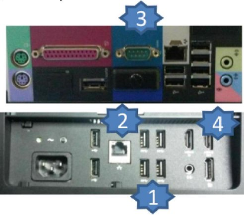
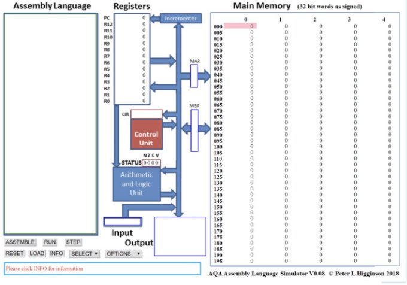

---
author: ELP
title: 13 Architecture de l’ordinateur
---

**Table des matières**

1. [**Historique de l’informatique**](#_page0_x40.00_y403.92)
2. [**Les différents types de mémoires**](#_page3_x40.00_y539.92)
3. [**Architecture de Von Neumann**](#_page4_x40.00_y536.92)
4. [**Langage assembleur**](#_page8_x40.00_y390.92)
5. [**Simulation CPU**](#_page11_x40.00_y36.92)


## <H2 STYLE="COLOR:BLUE;"> **1. Historique<a name="_page0_x40.00_y403.92"></a> de l’informatique** </H2>

🎥 **Video 1** : [Histoire de l’informatique (Dailymotion)](https://www.dailymotion.com/video/xhleks) 

🎥 **Video 2** : [Évolution des ordinateurs](https://ladigitale.dev/digiview/#/v/669d6e5b4ed67)  


### <H3 STYLE="COLOR:GREEN;"> **1.1. Les<a name="_page0_x40.00_y459.92"></a> machines à programmes externes** </H3>

- **Machines électromécaniques**

L’allemand **Konrad ZUSE** achève le **Z1** en 1938, un ordinateur mécanique utilisant le système binaire, puis le **Z3** en 1941, premier ordinateur entièrement automatique lisant son programme sur une bande perforée. Le Z3 utilisait déjà le calcul en virgule flottante et réalisait 3 à 4 additions par seconde.


**Réplique du Zuse Z3 au Deutsches Museum de Munich.**


Peu après, aux États-Unis, **Howard H. AIKEN** construit l’ordinateur électromécanique **MARK I** (1944). Le MARK I pesait environ **5 tonnes** et était composé de plus de **750 000 pièces**.


Source : espace-turing.fr

Le **Mark I** lisait ses instructions sur des cartes perforées, exécutait l’instruction courante, puis lisait la suivante.


Source : Wikipédia

- **Machines électroniques**

L’apparition des **tubes à vide**, bien plus rapides que les relais des machines électromécaniques, marque le début de l’électronique moderne.

Entre 1943 et 1945, les Britanniques **Max NEWMAN** et **Tommy FLOWERS** mettent en service **COLOSSUS**, utilisé pour déchiffrer le code **Lorenz** employé par les Allemands durant la Seconde Guerre mondiale.

Le célèbre **ENIAC**, développé par **John MAUCHLY** et **John ECKERT**, est achevé en novembre 1945 et utilisé pour des calculs balistiques grâce à **18 000 tubes à vide**.


Source : Wikipédia

L’ENIAC est le **premier ordinateur entièrement électronique** et peut être reprogrammé pour résoudre divers problèmes de calcul.

### <H3 STYLE="COLOR:GREEN;"> **1.2. Les<a name="_page1_x40.00_y480.92"></a> machines à programmes enregistrés** </H3>

Basées sur les travaux de **MAUCHLY, ECKERT et VON NEUMANN**, ces machines sont les ancêtres des ordinateurs modernes. Dans ce type de machine, **les données et les programmes sont stockés en mémoire**.

Les premières machines de ce type apparaissent dès 1948 avec les ordinateurs britanniques **BABY** et **EDSAC**, suivis par leurs homologues américains **EDVAC** et **UNIVAC**.

Dès les années 1950, les premiers ordinateurs commerciaux apparaissent, dominés par les constructeurs **IBM** (International Business Machines), **DEC** (Digital Equipment Corporation) et **BULL**.


### <H3 STYLE="COLOR:GREEN;"> **1.3. Du<a name="_page1_x40.00_y644.92"></a> micro-ordinateur à la micro-informatique** </H3>
- **Miniaturisation et explosion du marché**

- **Le transistor** (1947) marque la fin des tubes à vide et devient un produit industriel fiable et peu coûteux dès les années 1950.  

- **Le circuit intégré** (1958) miniaturise davantage les composants électroniques.  

- **Le microprocesseur** (**Intel 4004** en 1971) révolutionne l’informatique et ouvre la voie aux ordinateurs personnels.

💻 **Premiers micro-ordinateurs** :  

- **ALTAIR 8800** (1975) : premier ordinateur grand public, sans clavier ni écran.  

- **APPLE II** (1977)  

- **IBM PC** (1981)  

- **COMMODORE 64** (1982)  

- **APPLE MACINTOSH** (1984) : premier ordinateur personnel avec une souris et une interface graphique.


ALTAIR 8800


APLLE II


IBM PC


COMMODORE 64


APPLE MACINTOSH

- **Langages et système d’exploitation**

💾 **Les langages de programmation**  

- **1951** : Premiers compilateurs créés par **Grace HOPPER**.  

- **1956** : **FORTRAN** (John BACKUS).  

- **Années 1960-2000** : **LISP, COBOL, BASIC (1964), C (1972), ADA (1983), C++ (1986), PYTHON (1991), JAVASCRIPT (1995)**.

💻 **Les systèmes d’exploitation**  

- **1960s** : Chaque constructeur crée son propre OS (**OS 360, MVS, UNIX (1970)**).  

- **1984** : **Richard STALLMAN** lance le projet **GNU** et le mouvement du logiciel libre.  

- **1985** : **MS-DOS (Microsoft) domine les micro-ordinateurs**, suivi de **Windows**.  

- **1991** : **GNU/Linux** voit le jour grâce à **Linus TORVALDS**.

Actuellement, les principaux systèmes d’exploitation sont **Windows, macOS et GNU/Linux**.


=> **CAPYTALE Le code vous sera donné par votre enseignant**

???+ question "**Activité n°1**"

    Répondre par Vrai ou faux 

    Certaines questions nécessitent une recherche Internet.  

    1️⃣ Blaise Pascal a mis au point le logiciel Turbo Pascal. 

    2️⃣ George Boole était un spécialiste de la logique binaire.  

    3️⃣ Alan Turing a travaillé sur l’intelligence artificielle. 

    4️⃣ Alan Turing a cassé le code Enigma.  

    5️⃣ L’ordinateur ENIAC était aussi petit qu’une boîte à chaussures.  

    6️⃣ John Von Neumann a conçu l’architecture de base des ordinateurs modernes.  

    7️⃣ L’invention du transistor a permis de miniaturiser les ordinateurs.  

    8️⃣ Le premier micro-ordinateur est américain. 

    9️⃣ Le processeur 8086 possède 1 000 000 de transistors.  

    🔟 Gary Kasparov est imbattable aux échecs. 

    1️⃣1️⃣ La loi de Moore est toujours valide en 2020.  


???+ question "**Activité n°2**" 

    Cocher la ou les bonnes réponses. 

    Certaines questions nécessitent une recherche Internet.  

    1️⃣ Le premier algorithme connu remonte... 

    📌 XXe siècle / 📌 XIXe siècle / 📌 Ier siècle / 📌 Bien avant  

    2️⃣ Le mot "algorithme" vient du nom…  

    📌 Al-Khwârizmi / 📌 Grace Hopper / 📌 Steve Jobs / 📌 Ada Lovelace  

    3️⃣ Le premier compilateur a été conçu par… 

    📌 Al-Khwârizmi / 📌 Grace Hopper / 📌 Steve Jobs / 📌 Ada Lovelace  

📌 **Et bien d’autres questions à explorer !**  


## <H2 STYLE="COLOR:BLUE;"> **2. Les<a name="_page3_x40.00_y539.92"></a> différents types de mémoires** </H2>
### <H3 STYLE="COLOR:GREEN;"> **2.1. Organisation<a name="_page3_x40.00_y567.92"></a> de la mémoire** </H3>

Il existe de nombreuses **technologies de mémoire**, qui se distinguent selon plusieurs critères :

- **Durabilité** : mémoire volatile (données perdues à l'arrêt du courant) ou permanente.  

- **Mode d’accès** : accès direct (adressage aléatoire) ou séquentiel.

- **Temps d’accès** : plus une mémoire est rapide, plus elle est chère.  

Les principales catégories de mémoire sont :  

- **Mémoire morte (ROM – Read Only Memory)** : mémoire **non volatile**, utilisée pour stocker des programmes essentiels comme le BIOS (Basic Input Output System). Elle est en lecture seule mais peut être mise à jour (flashage du BIOS).  

- **Mémoire vive (RAM – Random Access Memory)** : mémoire **volatile**, utilisée pour stocker temporairement les instructions et données des programmes en cours d'exécution.  

- **Mémoire de stockage secondaire** : disques durs (HDD, SSD), clés USB, CD-ROM...  

### <H3 STYLE="COLOR:GREEN;"> **2.2. Les<a name="_page4_x40.00_y47.92"></a> registres** </H3>

Un **registre** est un emplacement **mémoire interne** au processeur. Il s’agit de la mémoire **la plus rapide**, mais également **la plus coûteuse**, car son espace est limité.  

🔹 **Rôle des registres** : 

- Stocker des **opérandes** et **résultats intermédiaires** pendant le traitement des instructions.  

- Varier en capacité, nombre et fonctions selon les processeurs. 

- Être directement accessibles via le jeu d’instructions du processeur.  

💡 **La plupart des processeurs modernes ont des registres de 64 bits**.


### <H3 STYLE="COLOR:GREEN;"> **2.3. Mémoires<a name="_page4_x40.00_y175.92"></a> centrales et mémoires caches** </H3>

**Mémoire centrale (RAM)**  

La **mémoire centrale** stocke temporairement les programmes et leurs données pendant leur exécution. Elle est **volatile**, ce qui signifie que les informations sont perdues lorsque l’ordinateur s’éteint.  

🔹 Organisation :  

- Constituée de **cases mémoires** repérées par une **adresse unique**.  

- Accès rapide et en **temps constant**. 

- Types : **SDRAM, DDR, DDR2, DDR3, DDR4, DDR5**.

**Mémoire cache**  

Pour compenser la différence de vitesse entre le **processeur** et la **mémoire centrale**, on utilise une **mémoire cache** intégrée au processeur.  

🔹 Caractéristiques :  

- Stocke les **instructions et données les plus utilisées** pour éviter de les rechercher en RAM.

- Plus rapide que la RAM, mais plus petite et plus chère.

- **Types** :  

  1 **Cache L1** : la plus rapide, située directement dans le cœur du processeur.  

  2 **Cache L2** : plus grande, mais légèrement plus lente.  

  3 **Cache L3** : partagée entre plusieurs cœurs d’un processeur multi-cœur.  


???+ question "**Activité n°3**"

    Quelques interrogations 

    💡 Réfléchissez aux réponses aux questions suivantes :  

    1️⃣ Où sont stockés les programmes dans la mémoire ?  

    2️⃣ Comment l’ordinateur effectue-t-il une addition ?  

    3️⃣ D’où proviennent les données entrées via le clavier ?

    4️⃣ Où vont les informations envoyées vers l’écran ? 

## <H2 STYLE="COLOR:BLUE;"> **3. Architecture<a name="_page4_x40.00_y536.92"></a> de Von Neumann** </H2>

L’**architecture de Von Neumann** (1945) est un **modèle d’ordinateur** où **les instructions et les données partagent la même mémoire**. Ce modèle est toujours utilisé dans les ordinateurs modernes.  


### <H3 STYLE="COLOR:GREEN;"> **3.1. Organisation<a name="_page4_x633.92"></a> générale** </H3>

🔹 **Les trois parties du CPU** : 

- **L’unité arithmétique et logique (UAL ou ALU)** : effectue les **calculs** et les **opérations logiques**.  

- **L’unité de contrôle** : exécute les instructions en coordonnant les autres composants.  

- **La mémoire** : stocke **instructions et données**.  

🔹 **Le bus (système de communication interne)**  

Il permet aux composants de **transporter des données et instructions**.  

Il existe **trois types de bus** :  

1️⃣ **Bus d’adresses** : transporte les adresses mémoire. 

2️⃣ **Bus de données** : transporte les données elles-mêmes. 

3️⃣ **Bus de contrôle** : gère le type d’opération (lecture, écriture…).  

🔹 **Les périphériques d’entrée/sortie**  

Ils permettent à l’ordinateur de communiquer avec l’extérieur (**clavier, écran, imprimante...**).


💡 **L’architecture Harvard** est une alternative où les mémoires des programmes et des données sont séparées, permettant un **traitement plus rapide**.

???+ question "**Activité n°4 : Calcul de la mémoire disponible**"  

    1️⃣ **Combien d’adresses mémoire différentes peut-on avoir avec un bus d’adresses de 16 bits ?**  

    2️⃣ **Si chaque case mémoire contient 1 octet, quelle est la capacité maximale de mémoire vive ?**  


### <H3 STYLE="COLOR:GREEN;"> **3.2. Le<a name="_page6_x297.92"></a> CPU** </H3>


Le **processeur** (CPU – Central Processing Unit) est le **cœur de l’ordinateur**.  

🔹 **Caractéristiques** : 

- Manipule des **données binaires** et des **instructions**.  

- Contient des **millions de transistors** miniaturisés.  

- Intégré dans un **boîtier** surmonté d’un **ventilateur**.  


### <H3 STYLE="COLOR:GREEN;"> **3.3. Le rôle de l’horloge CPU**  </H3>

Le **processeur est cadencé** par une **horloge interne**, qui envoie des **impulsions électriques** synchronisant ses opérations.  

📌 **Caractéristiques du CPU** :  

- **Fréquence d’horloge** (en MHz ou GHz).  

- **Nombre d’instructions par seconde**. 

- **Taille des données traitées** (en bits).  

💡 **Un CPU cadencé à 2 GHz exécute 2 milliards d’opérations par seconde**.

???+ question "**Activité n°5**"

    Sur les photos ci-dessous, identifier le processeur. 

    
    
    

### <H3 STYLE="COLOR:GREEN;"> **3.4. Les<a name="_page7_x274.92"></a> limites** </H3>

🔹 **Le principal problème : le goulet d’étranglement**  

- Le processeur est **beaucoup plus rapide** que la mémoire. 

- Le **bus mémoire** ne peut **pas suivre la cadence**.  

- **Solution** : utilisation de **mémoires caches et multiprocesseurs**.  


### <H3 STYLE="COLOR:GREEN;"> **3.5. Évolution<a name="_page7_x423.92"></a> : le multiprocesseur et les mémoires caches** </H3>

🔹 **La loi de Moore** (1965) : 

- 🏆 **Le nombre de transistors double tous les 18 à 24 mois**. 

- 🚀 Augmentation des performances et miniaturisation. 

- ❌ **Depuis 2017, cette loi atteint ses limites physiques.**  

🔹 **Solution moderne** :  

✅ **Multiprocesseurs** et **multi-cœurs** permettent un traitement **parallèle** des données. 

✅ **Mémoire cache plus performante** pour compenser la lenteur de la RAM.  

💡 Aujourd’hui, **l’optimisation mémoire est devenue un enjeu majeur**.


???+ question "**Activité n°6**" 

    Ci-contre, retrouver les interfaces RJ45, VGA, HDMI et USB. 

    

## <H2 STYLE="COLOR:BLUE;"> **4. Langage<a name="_page8_x40.00_y390.92"></a> assembleur** </H2>

Le **microprocesseur** ne peut pas interpréter directement des instructions en langage naturel comme :

> _"Additionne le nombre 125 et la valeur située dans le registre R2, range le résultat dans le registre R1"._

Ces instructions doivent être traduites en **code binaire** compréhensible par le processeur :  
```binary
11100010100000100001000001111101
```
Cependant, l'écriture en binaire étant complexe et peu lisible, on utilise des **mnémoniques** sous forme de langage **assembleur**, plus compréhensible pour les programmeurs :  
```assembly
ADD R1, R2, #125
```

Ce code en assembleur signifie :  

- **ADD** : additionne  

- **R1** : registre où stocker le résultat  

- **R2** : registre contenant l'une des valeurs  

- **#125** : valeur immédiate ajoutée à R2  

### <H3 STYLE="COLOR:GREEN;"> **4.1. Exemples d’instructions en assembleur** </H3>

| **Instruction**  | **Description** |
|----------------|---------------|
| `LDR R1, 78`  | Charge la valeur située à l'adresse mémoire **78** dans le registre **R1**. |
| `STR R3, 125` | Stocke la valeur contenue dans le registre **R3** à l'adresse mémoire **125**. |
| `ADD R1, R0, #128` | Additionne **128** avec la valeur du registre **R0** et stocke le résultat dans **R1**. |
| `ADD R0, R1, R2` | Additionne les valeurs des registres **R1** et **R2**, et stocke le résultat dans **R0**. |
| `SUB R1, R0, #128` | Soustrait **128** à la valeur du registre **R0**, et stocke le résultat dans **R1**. |
| `MOV R1, #23` | Stocke la valeur **23** dans le registre **R1**. |
| `MOV R0, R3` | Copie la valeur de **R3** dans **R0**. |
| `B 45` | Change la séquence d'exécution en sautant à l’adresse **45**. |
| `CMP R0, #23` | Compare la valeur de **R0** avec **23**. |
| `CMP R0, #23 BEQ 78` | Si **R0 == 23**, alors saute à l’adresse **78**. |
| `CMP R0, #23 BGT 78` | Si **R0 > 23**, alors saute à l’adresse **78**. |
| `HALT` | Arrête l’exécution du programme. |

???+ question "**Activité n°7**" 

    Expliquer les instructions suivantes 

    📌 **Décrivez les instructions suivantes en langage naturel :** 

    1️⃣ `ADD R0, R1, #42`  

    2️⃣ `LDR R5, 98`  

    3️⃣ `CMP R4, #18`  

    4️⃣ `BGT 77`  

    5️⃣ `STR R0, 15`  

    6️⃣ `B 100`  

### <H3 STYLE="COLOR:GREEN;"> **4.2. Applications** </H3>

???+ question "**Activité n°8**"

    📌 **Écrivez les instructions en assembleur correspondant aux phrases suivantes :**  

    1️⃣ Additionne la valeur stockée dans **R0** et celle stockée dans **R1**, stocke le résultat dans **R5**. 

    2️⃣ Charge la valeur située à l’adresse mémoire **878** dans le registre **R0**.  

    3️⃣ Stocke la valeur du registre **R0** en mémoire à l’adresse **124**.  

    4️⃣ Sauter directement à l’instruction stockée en mémoire **478**.  

    5️⃣ Si **R0 == 42**, sauter à l’adresse **85**.

???+ question "**Activité n°9:**"

    📌 **Comparer le programme suivant en Python et en Assembleur** :

    **Python**  
    ```python
    x = 4
    y = 8
    if x == 10:
        y = 9
    else:
        x = x + 1
    z = 6
    ```

    **Assembleur équivalent**
    ```assembly
    MOV R0, #4
    STR R0, 30
    MOV R0, #8
    STR R0, 75
    LDR R0, 30
    CMP R0, #10
    BNE else
    MOV R0, #9
    STR R0, 75
    B endif
    else:
    LDR R0, 30
    ADD R0, R0, #1
    STR R0, 30
    endif:
    MOV R0, #6
    STR R0, 23
    HALT
    ```
    📌 **Questions** :  

    1️⃣ À quoi sert la ligne `B endif` ?  

    2️⃣ Que représentent les adresses mémoires `23`, `75` et `30` ?  


## <H2 STYLE="COLOR:BLUE;"> **5. Simulation<a name="_page11_x40.00_y36.92"></a> CPU** </H2>

Nous allons utiliser un **simulateur CPU** basé sur l’architecture **Von Neumann**.  

### <H3 STYLE="COLOR:GREEN;"> **5.1. Présentation du simulateur** </H3>

📌 Disponible en ligne : [🔗 Peter Higginson’s CPU Simulator](http://www.peterhigginson.co.uk/AQA/)  

📷 **Interface du simulateur**  

  

🔹 **Zones principales du simulateur** : 

1️⃣ **Mémoire vive (Main Memory)** : Contient les instructions et les données.(à droite)  

2️⃣ **Microprocesseur (CPU)** : Exécute les instructions. (au centre)

3️⃣ **Éditeur d’assembleur (Assembly Language)** : Permet d’écrire du code.  (à gauche)


### <H3 STYLE="COLOR:GREEN;"> **5.2. Configuration de la RAM<a name="_page11_x648.92"></a>** </H3>

Par défaut le contenu des différentes cellules de la mémoire est en base 10 (entier signé), mais d'autres options sont possibles : base 10 (entier non-signé, "unsigned"), base 16 ("hex"), base 2 ("binary"). On accède à ces options à l'aide du bouton "OPTIONS" situé en bas dans la partie gauche du simulateur.

???+ question "**Activité n°10**"  

    1️⃣ Utiliser le bouton **"OPTIONS"** pour afficher la mémoire en **binaire**.  

    2️⃣ Chaque cellule mémoire contient **32 bits**.  

    3️⃣ Vérifier l’adresse mémoire utilisée (entre **000 et 199**). 

    4️⃣ Remettre l’affichage en **base 10**.  (bouton "OPTION"->"signed")


### <H3 STYLE="COLOR:GREEN;"> **5.3. Le<a name="_page12_x73.92"></a> CPU** </H3>

Dans la partie centrale du simulateur, nous allons trouver en allant du haut vers le bas :

- le **bloc "registre"** ("Registers") : nous avons 13 registres (R0 à R12) + 1 registre (PC) qui contient l'adresse mémoire de l'instruction en court d'exécution
- le **bloc "unité de commande"** ("Control Unit") qui contient l'instruction machine en cours d'exécution (au format hexadécimal)
- le **bloc "unité arithmétique et logique"** ("Arithmetic and Logic Unit")

### <H3 STYLE="COLOR:GREEN;"> **5.4. Programmer<a name="_page12_x218.92"></a> en assembleur** </H3>

???+ question "**Activité n°11**"

    1️⃣ Dans l'éditeur **Assembly Language**, saisissez :  
    ```assembly
    MOV R0, #42
    STR R0, 150
    HALT
    ```
    2️⃣ Cliquez sur **Submit**.  

    3️⃣ Vérifiez que :  

    - L’instruction **MOV** est à l’adresse **000**.  

    - L’instruction **STR** est à l’adresse **001**.  

    - L’instruction **HALT** est à l’adresse **002**.  

???+ question "**Activité n°12**" 

    Exécution pas à pas :</H3>
    1️⃣ **Exécutez** le programme en cliquant sur **RUN**.  
    2️⃣ Observez l’animation du CPU.  
    3️⃣ Vérifiez que **l’adresse mémoire 150 contient bien 42**.  
    4️⃣ **Modifier** la vitesse avec **<< et >>**.  

📌 **Remarque** : Pour relancer la simulation, cliquez sur **RESET**.


Une fois la simulation terminée, on constate que la cellule mémoire d'adresse 150, contient bien le nombre 42 (en base 10) et que le registre R0 a bien stocké le nombre 42.


???+ question "**Activité n°13**"

    💡 **Modifier le programme précédent** pour **stocker 54 dans l’adresse mémoire 50** en utilisant **R1**. 

    ✅ **Testez** la modification en exécutant le programme.

???+ question "**Activité n°14**" 

    💡 **Tester le programme suivant** :
    ```assembly
    MOV R0, #4
    STR R0, 30
    MOV R0, #8
    STR R0, 75
    LDR R0, 30
    CMP R0, #10
    BNE else
    MOV R0, #9
    STR R0, 75
    B endif
    else:
    LDR R0, 30
    ADD R0, R0, #1
    STR R0, 30
    endif:
    MOV R0, #6
    STR R0, 23
    HALT
    ```
    ✅ **Analysez** le comportement du programme.  

