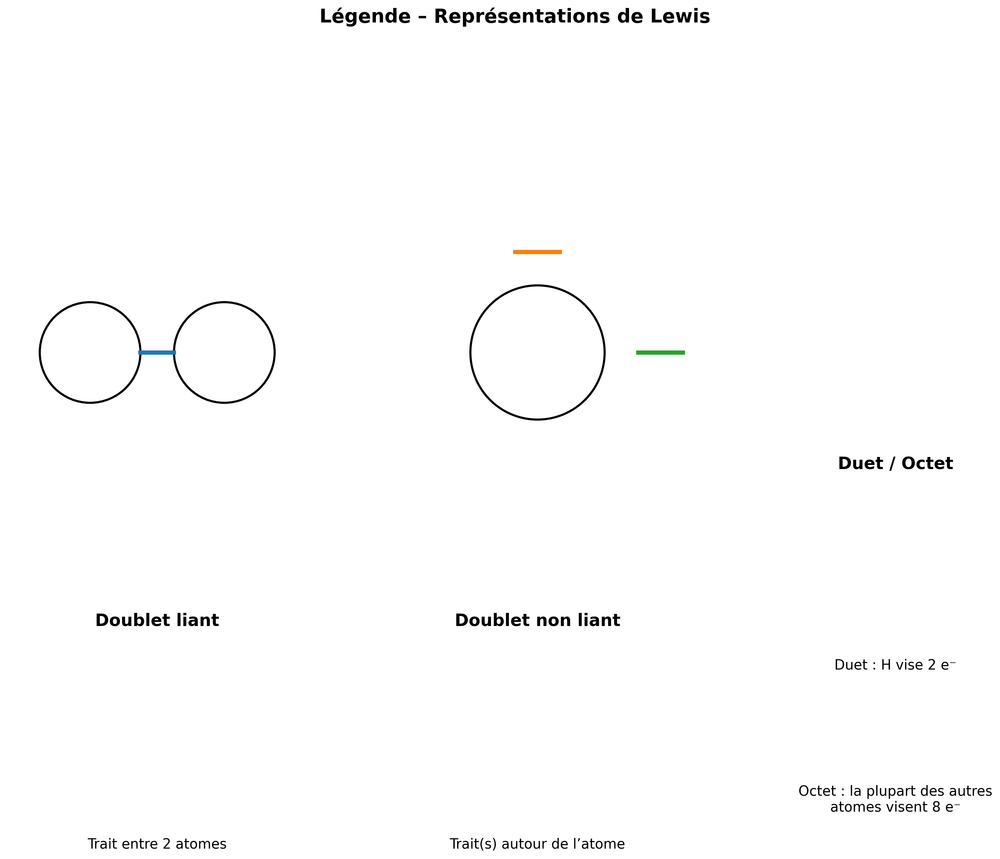
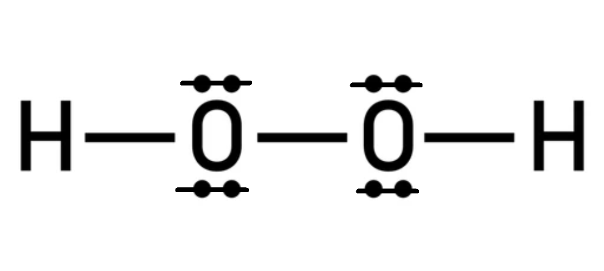
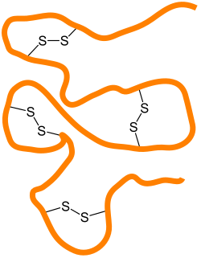

# 13 – Stabilité chimique : lecture de Lewis 🧴🧪  
**Gaz nobles – Représentations de Lewis – Lacunes / e⁻ célibataires – ROS – Liaisons fragiles O–O / S–S**

> En E2, on ne te demande pas “de réciter Lewis”.  
> On te demande de **lire une représentation**, d’en déduire un **niveau de stabilité / risque**, puis de **justifier une décision professionnelle** (CQ, sécurité, stabilité).

---

## 🎯 Objectifs de la séance

- Comprendre pourquoi les **gaz nobles** sont stables  
- Lire une **représentation de Lewis** (liaisons + doublets non liants)  
- Repérer des indices de **réactivité** :  

  - **octet incomplet** (lacune),  
  - **électron célibataire** (radical),  
  - **liaisons fragiles** : **O–O** et **S–S**  

- Relier ces indices à une situation cosmétique (stabilité / oxydation / sécurité)

---

## 🧴 Situation professionnelle

Vous êtes technicien(ne) dans un laboratoire cosmétique.

Un responsable CQ vous demande d’analyser des documents concernant :

- un **neutralisant** utilisé en coiffure (oxydant),
- et la **stabilité** de certains ingrédients sensibles à l’oxydation.

Vous devez justifier, à partir d’indices microscopiques, si certaines espèces sont :

- **stables**,
- ou **potentiellement réactives** (donc à risque).

---

# 🧠 Travail 1 – Stabilité des gaz nobles : “couche externe saturée”

### Document 1 – Repère (gaz nobles)

{ width=90% .center }

Les gaz nobles (He, Ne, Ar…) sont réputés **très stables**.

📌 Idée centrale :
- ils possèdent une **couche externe saturée** en électrons (stabilité).

1\. Expliquer en 2 lignes maximum pourquoi un gaz noble est chimiquement stable.  
    

2\. Faire le lien avec la séance précédente  : quel rôle jouent les **électrons de valence** ? 

{ width=90% .center } 

Schéma “couche externe saturée” : 

**Ne** avec couche externe pleine,  **Cl** avec 7 e⁻ de valence

    

---

# 🧩 Travail 2 – Lire une représentation de Lewis (sans complexifier)

### Document 2 – Rappels visuels (Lewis)

**Convention Lewis :**

- **Doublet liant** : trait entre deux atomes (liaison)

- **Doublet non liant** : deux points autour de l’atome (parfois un petit trait près de l’atome, mais jamais entre deux atomes). ⚠️ Ce n’est pas une liaison : une liaison est un trait entre deux atomes.

- règle simple (repère) :

  - H vise un **duet** (2 e⁻)
  - la plupart des autres atomes visent l’**octet** (8 e⁻ autour d’eux)

{ width=95% .center }

*Schéma de Lewis d'atomes courants*

{ width=75% .center }

**Exemples (lecture) :**

**(A) Eau H₂O**

{ width=30% .center }

**(B) Dichlore Cl₂**

{ width=30% .center }

**(C) Dioxygène O₂ (liaison double)**

{ width=30% .center }

3\. Sur l’exemple (A) H₂O :
- entourer (ou citer) le **doublet liant**  
- entourer (ou citer) un **doublet non liant**  
   

4\. Sur (C) O₂ :
- combien y a-t-il de **liaisons** entre les deux O ?  
- quel est l’intérêt de cette double liaison pour l’octet ?  
    

---

# ⚠️ Travail 3 – Repérer la réactivité : lacune / électron célibataire / liaisons fragiles

### Document 3 – Trois signaux d’alerte “réactivité” (niveau BTS)

**Signal 1 : octet incomplet (lacune électronique)**  
→ l’espèce cherche à “compléter” son octet, donc elle est souvent réactive.

{ width=40% .center }

**Signal 2 : électron célibataire (radical)**  
→ très réactif (réactions en chaîne, oxydation…).

{ width=40% .center }

**Signal 3 : liaison fragile**  
→ certaines liaisons se rompent plus facilement :
- **O–O** (peroxydes)  
- **S–S** (ponts disulfures)

> **Liaison fragile » (ex : O–O, S–S)** → se casse facilement → forme des radicaux / réagit
>
> Certaines liaisons sont faibles (énergie de liaison plus basse) → elles cassent plus facilement, notamment sous :
>
> - chaleur,
> - lumière UV,
> - présence de métaux,
> - pH, etc.
>
> **Pourquoi c’est un signal d’alerte ?**
> Quand une liaison fragile casse, elle peut casser :
> 
> - pour donner 2 radicaux (très réactifs),
> - pour donner ions réactifs.

---

## 3A – Liaison O–O : peroxydes

### Document 4 – Exemple de peroxyde (liaison O–O)

**Peroxyde d’hydrogène H₂O₂** (neutralisant / oxydant en coiffure)

Représentation simplifiée (lecture) :

{ width=30% .center }

5\. Repérer la liaison considérée comme “fragile” dans H₂O₂ : ____________  
  

6\. Expliquer en 2–3 lignes pourquoi la présence d’une liaison O–O peut être un indice de réactivité / risque d’oxydation.  
    

---

## 3B – Espèces réactives de l’oxygène (ROS)

### Document 5 – ROS (à connaître qualitativement)

Dans certains contextes (lumière, chaleur, traces de métaux…), des espèces très réactives peuvent apparaître :

- **radical hydroxyle** : HO•  
- **superoxyde** : O₂•⁻  

📌 Point clé : le symbole **•** indique un **électron célibataire**.

7\. Quel est l’indice microscopique qui rend une espèce “radicalaire” ?  
   

8\. Citer un risque cosmétique lié aux ROS (un exemple concret) :  
(ex : oxydation d’un parfum, rancissement d’une phase huileuse, dégradation d’un actif, changement de couleur…)  
    

---

## 3C – Liaison S–S : ponts disulfures (cheveux)

### Document 6 – Pont disulfure (keratine)

Dans la fibre capillaire, la kératine contient des **ponts disulfures** :

{ width=60% .center }

En permanente / défrisage, un réducteur peut transformer ces ponts (rupture/formation), puis un oxydant “fixe” la nouvelle forme.

9\. Repérer la liaison fragile dans ce document : ____________  
  

10\. Donner une conséquence possible si l’on fragilise trop les ponts S–S (professionnel) :  
    

---

# 🧪 Travail 4 – Mini dossier type E2 : “permanente / neutralisant”

### Document 7 – Extrait de dossier (simplifié)

> « Le protocole utilise une crème réductrice (action sur les ponts disulfures S–S) puis un neutralisant contenant du peroxyde (liaison O–O).  
> Le fabricant indique : *conserver à l’abri de la chaleur et de la lumière* et *éviter le contact avec certains métaux*. »

11\. À partir des documents, expliquer pourquoi ces précautions (chaleur/lumière/métaux) sont cohérentes scientifiquement (4–6 lignes).  
📌 Attendu E2 : au moins **2 arguments microscopiques** (O–O / radicaux / ROS…).  
       

12\. Proposer **2 recommandations professionnelles** (CQ/sécurité) pour limiter les risques lors du stockage / utilisation.  
- Recommandation 1 : ________________________________  
- Recommandation 2 : ________________________________  
    

---

## ✍️ Synthèse personnelle (brouillon E2 – 6 lignes max)

Avec tes mots, explique :
- ce que “montre” une représentation de **Lewis**,
- 2 indices de **réactivité** vus aujourd’hui,
- un lien avec la **stabilité** d’un produit cosmétique.

**Mots obligatoires à placer** :  
**Lewis – doublet – octet – réactivité – O–O ou S–S – décision**

     

---

## 🔗 Pour la suite…

Cette séance prépare directement :
- **S14 – Interactions et compatibilités** (polarité, liaison H, compatibilité des mélanges),
- l’analyse de **dossiers E2** où l’on doit expliquer stabilité / incompatibilités.

---
