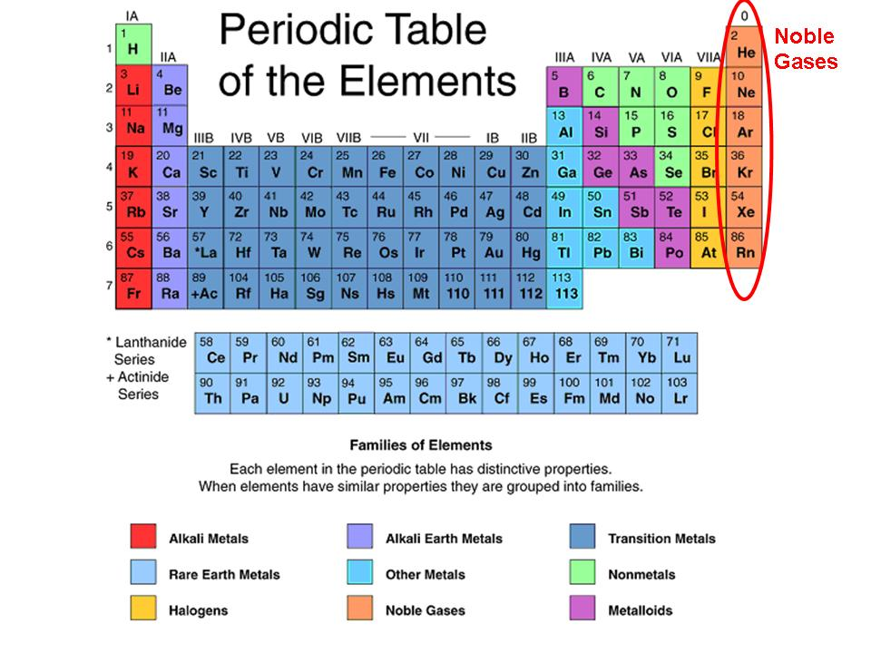
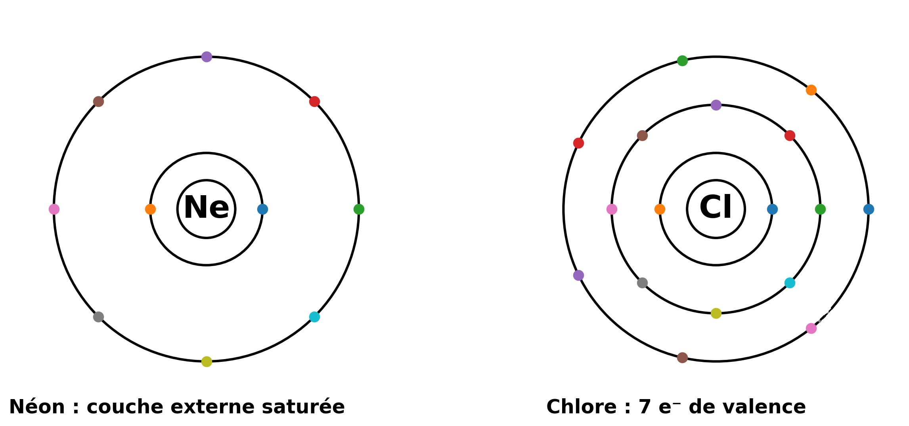
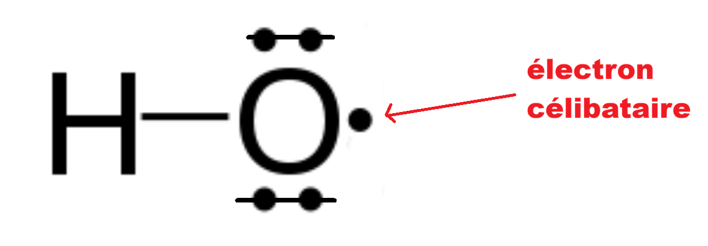

# 13 – Stabilité chimique : lecture de Lewis 🧴🧪  
**Gaz nobles – Lewis – Octet – Lacunes / e⁻ célibataires – ROS – Liaisons fragiles O–O / S–S**

---

## 1️⃣ Pourquoi parler de stabilité en cosmétologie (et en E2)

En cosmétique, la qualité d’un produit dépend de sa **stabilité** :
- maintien de l’odeur, de la couleur, de l’efficacité,
- absence de dégradation dangereuse,
- cohérence des résultats CQ (stabilité, sécurité, conservation).

À l’épreuve **E2**, on attend une démarche :
**document → indice scientifique → interprétation → décision professionnelle**.

👉 Les représentations de **Lewis** permettent de relier la structure microscopique à un risque de **réactivité / oxydation**.

---

## 2️⃣ Stabilité des gaz nobles (repère)

{ width=90% .center }

Les **gaz nobles** (He, Ne, Ar…) sont très stables car leur **couche externe** est **saturée** en électrons :
- duet pour He,
- octet pour la plupart des autres.

👉 Une couche externe “complète” = faible tendance à réagir.

{ width=90% .center } 

Schéma “couche externe saturée” : 

**Ne** avec couche externe pleine,  **Cl** avec 7 e⁻ de valence

---

## 3️⃣ Représentation de Lewis : ce que l’on lit

Une représentation de Lewis montre :

- **Doublet liant** : trait entre deux atomes (liaison)

- **Doublet non liant** : deux points autour de l’atome (parfois un petit trait près de l’atome, mais jamais entre deux atomes). ⚠️ Ce n’est pas une liaison : une liaison est un trait entre deux atomes.

- et permet de vérifier un repère :

  - H vise un **duet** (2 e⁻ sur sa couche externe),
  - les autres atomes visent souvent l’**octet** (8 e⁻ sur sa couche externe).

✅ En E2, on attend surtout :
- savoir **repérer** doublets,
- vérifier “octet / duet”,
- conclure “plutôt stable” ou “potentiellement réactif” (avec justification).

---

## 4️⃣ Trois indices microscopiques de réactivité (niveau BTS MECP)

### Indice 1 : octet incomplet (lacune électronique)
Une espèce dont un atome a un **octet incomplet** cherche souvent à réagir pour se stabiliser.

{ width=40% .center }

### Indice 2 : électron célibataire (radical)
Le symbole **•** indique un **électron célibataire**.
➡️ Les radicaux sont **très réactifs** et peuvent déclencher des réactions en chaîne (oxydation).

{ width=40% .center }

### Indice 3 : liaisons fragiles (O–O / S–S)

- **O–O** : liaisons des **peroxydes** (ex. H₂O₂) → rupture possible → espèces réactives (ROS).
- **S–S** : ponts **disulfures** (kératine) → rupture / réarrangement possible (coiffure : permanente/défrisage).

👉 Ces indices microscopiques aident à comprendre :
- les risques d’**oxydation** (parfums, lipides, actifs),
- la fragilisation de structures biologiques (cheveux),
- et la cohérence de consignes CQ (lumière/chaleur/métaux).

---

## 5️⃣ Espèces réactives de l’oxygène (ROS) – À connaître qualitativement

Exemples :
- HO• (radical hydroxyle)
- O₂•⁻ (superoxyde)

📌 Point clé : la présence d’un **électron célibataire** explique la forte réactivité.

Conséquences cosmétiques possibles :
- rancissement (phase huileuse),
- changement de couleur,
- dégradation d’actifs,
- altération d’odeur.

---

## 6️⃣ Ce qui est attendu en E2 (repère)

✅ Attendu :
- lire une représentation (Lewis),
- repérer un indice de réactivité (lacune / radical / O–O / S–S),
- relier à un risque (stabilité/sécurité),
- formuler une **décision** argumentée.

❌ Pas attendu :
- des schémas Lewis complexes,
- des explications encyclopédiques,
- des calculs lourds.

---

## 🔧 Outils méthodologiques associés

➡️ Voir : [*Fiche méthode 05 – Lire une représentation microscopique dans un dossier scientifique (E2)*](https://bts-mecp-physique-chimie-688080.forge.apps.education.fr/Methodologie/05_fiche_methode/)

➡️ Voir : [*Fiche méthode 01 – Justifier une réponse en physique-chimie*](https://bts-mecp-physique-chimie-688080.forge.apps.education.fr/Methodologie/01_fiche_methode/)

---

## 🔗 Pour la suite…

Cette séance prépare **S14 – Interactions et compatibilités** :
- polarité,
- liaisons H,
- compatibilité des mélanges / solubilité / stabilité.

---

