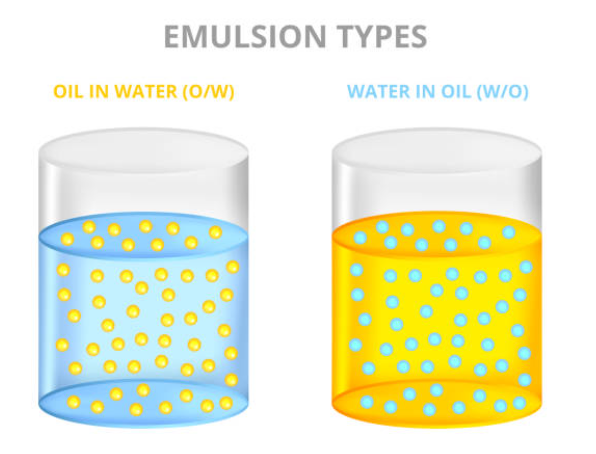

# Évaluation n°4 – Physique-Chimie appliquée

**BTS MECP – 1re année**

⏱️ **Durée** : 2h
📌 **Séances évaluées** : S01 à S21 + TP4
📊 **Barème** : /20

---

## Consignes générales

- **Calculatrice autorisée**
- Répondre directement sur le sujet ou sur copie selon les indications
- **Détailler tous les calculs** en utilisant la méthode D.U.C.I.
- **Justifier toutes les réponses** avec au moins **2 arguments** pour chaque conclusion CQ
- Soigner la présentation et utiliser le **vocabulaire scientifique**

---

## Contexte professionnel

Vous êtes technicien(ne) au **laboratoire de contrôle qualité** de la société **ÉclatNature**.

Un nouveau lot de **crème hydratante « Éclat Douceur »** vient d'être fabriqué. Avant sa commercialisation, vous devez effectuer plusieurs contrôles : analyse de la composition, type d'émulsion par conductivité, stabilité, pH et conformité au cahier des charges.

Par ailleurs, le service R&D optimise le **tensioactif** de la formule. Vous devez exploiter les résultats de conductimétrie obtenus au TP4 pour déterminer la **CMC** du tensioactif utilisé.

---

# DOSSIER DOCUMENTAIRE

## Document 1 – Fiche technique de la crème

| Caractéristique | Valeur |
|-----------------|--------|
| **Nom commercial** | Crème Hydratante Éclat Douceur |
| **Actif principal** | Panthenol (provitamine B5) |
| **Concentration annoncée** | 2% |
| **Forme galénique** | Émulsion |
| **Volume du pot** | 50 mL |
| **Conservation** | À l'abri de la chaleur, T < 30°C |

---

## Document 2 – Liste INCI

```
AQUA, GLYCERIN, CETEARYL ALCOHOL, CAPRYLIC/CAPRIC TRIGLYCERIDE,
PANTHENOL, SODIUM CETEARYL SULFATE, TOCOPHEROL, PHENOXYETHANOL,
CITRIC ACID, SODIUM CITRATE, SODIUM HYALURONATE
```

---

## Document 3 – Cahier des charges de la crème

| Paramètre | Spécification |
|-----------|:-------------:|
| **Type d'émulsion** | H/E |
| **Conductivité σ (25°C)** | 850 ± 100 µS/cm |
| **Concentration en panthenol** | 18 à 22 g/L |
| **pH (25°C)** | 5,5 ± 0,5 |
| **Masse volumique** | 0,98 à 1,02 g/mL |
| **Aspect** | Crème onctueuse, blanche, homogène |

---

## Document 4 – Données sur les ingrédients clés

### Panthenol (provitamine B5)

| Propriété | Valeur |
|-----------|--------|
| **Formule brute** | C₉H₁₉NO₄ |
| **Masse molaire** | M = 205,3 g·mol⁻¹ |
| **Solubilité dans l'eau** | Très soluble (miscible) |
| **Fonctions organiques** | Alcool (–OH × 2) + Amide (–CO–NH–) |
| **Propriétés cosmétiques** | Hydratant, apaisant, réparateur |

### Tocopherol (vitamine E)

| Propriété | Valeur |
|-----------|--------|
| **Fonctions organiques** | Alcool (–OH) + Phénol (–OH sur cycle) |
| **Propriétés cosmétiques** | Antioxydant |

### Sodium Cetearyl Sulfate

| Propriété | Valeur |
|-----------|--------|
| **Type** | Tensioactif anionique |
| **Dissociation** | R–OSO₃Na → R–OSO₃⁻ + Na⁺ |
| **Rôle** | Émulsifiant, stabilisant de l'émulsion H/E |

### Rappel : structure d'une émulsion


```
σ ÉLEVÉE (> 50 µS/cm)                  σ FAIBLE (< 10 µS/cm)
```

---

## Document 5 – Résultats d'analyse du lot n°EC-2026-03

### Conductivité

| Paramètre | Résultat |
|-----------|:--------:|
| σ mesurée (25°C) | 910 µS/cm |

### Dosage du panthenol

| Paramètre | Résultat |
|-----------|:--------:|
| Volume de crème analysé | 25,0 mL |
| Masse de panthenol dosée | 0,50 g |

### Mesures de pH

| Mesure | 1 | 2 | 3 |
|--------|:-:|:-:|:-:|
| pH (25°C) | 5,35 | 5,40 | 5,43 |

### Aspect observé

Crème onctueuse, blanche, homogène, sans grumeaux.

---

## Document 6 – Test de stabilité accélérée (stockage 45°C)

On suit la conductivité de la crème Éclat Douceur au cours du temps :

| Semaine | 0 | 1 | 2 | 3 | 4 | 6 | 8 | 10 | 12 |
|---------|:-:|:-:|:-:|:-:|:-:|:-:|:-:|:--:|:--:|
| σ (µS/cm) | 910 | 905 | 900 | 895 | 890 | 880 | 875 | 870 | 865 |

Un lot concurrent (Crème B, même formule mais avec un tensioactif différent) a donné :

| Semaine | 0 | 1 | 2 | 3 | 4 | 6 | 8 | 10 | 12 |
|---------|:-:|:-:|:-:|:-:|:-:|:-:|:-:|:--:|:--:|
| σ (µS/cm) | 920 | 910 | 890 | 850 | 720 | 350 | 45 | 9 | 5 |

---

## Document 7 – CMC du Sodium Cetearyl Sulfate par conductimétrie

Données obtenues lors du TP4 (mesures à 25°C) :

| C (mmol/L) | 0 | 0,5 | 1,0 | 1,5 | 2,0 | 2,5 | 3,0 | 3,5 | 4,0 | 5,0 | 6,0 | 7,0 | 8,0 |
|:----------:|:-:|:---:|:---:|:---:|:---:|:---:|:---:|:---:|:---:|:---:|:---:|:---:|:---:|
| σ (µS/cm) | 0 | 38 | 78 | 116 | 155 | 192 | 220 | 235 | 248 | 268 | 285 | 300 | 313 |

**Valeur de référence (fournisseur) :** CMC = 3,0 mmol/L ± 10% à 25°C

---

## Document 8 – Rappels

### Formules

| Grandeur | Formule | Unités |
|----------|---------|--------|
| Concentration massique | Cm = m / V | g/L (m en g, V en L) |
| Moyenne | x̄ = Σxᵢ / n | — |
| Étendue | E = x_max − x_min | — |
| Écart relatif | ε = |mesuré − référence| / référence × 100 | % |

### Échelle de pH et compatibilité cutanée

| Zone de pH | Compatibilité cutanée |
|:----------:|----------------------|
| pH < 3 | Risque d'irritation |
| pH 4 à 6 | Bonne tolérance, respect du film hydrolipidique |
| pH 6 à 8 | Tolérance acceptable |
| pH > 9 | Altération de la barrière cutanée |

pH physiologique de la peau : **4,5 à 5,5**

### Fonctions organiques et liaisons hydrogène

| Fonction | Motif | Forme des liaisons H ? |
|----------|:-----:|:----------------------:|
| Alcool | –OH | ✅ Oui |
| Ester | –COO– | ⚠️ Partiellement |
| Amide | –CO–NH– | ✅ Oui |
| Phénol | –OH (cycle) | ✅ Oui |
| Éther | –O– | ❌ Non |

---

# QUESTIONS

## Partie A – Analyse du produit et fonctions organiques (4 points)

### Question A.1 (1,5 point)

À partir des **Documents 1 et 2** :

a) Quel est le **solvant** de cette crème ? Justifiez.


b) La crème est-elle un **corps pur** ou un **mélange** ? Justifiez.


c) Citez **un actif**, **un conservateur** et **un émulsifiant** de la liste INCI.

| Catégorie | Nom INCI |
|-----------|----------|
| Actif | |
| Conservateur | |
| Émulsifiant | |

---

### Question A.2 (1,5 point)

À partir du **Document 4** (données sur le panthenol) :

a) Quelles sont les **fonctions organiques** présentes dans le panthenol ? Nommez-les et donnez leur motif.

| Fonction | Motif |
|----------|:-----:|
| | |
| | |

b) Le panthenol peut-il former des **liaisons hydrogène** avec l'eau ? Justifiez en précisant quelles fonctions sont impliquées.


---

### Question A.3 (1 point)

Expliquez en 3-4 lignes pourquoi le panthenol est un bon **actif hydratant** en vous appuyant sur ses fonctions organiques et les liaisons hydrogène.


---

## Partie B – Conductivité et type d'émulsion (4 points)

### Question B.1 (1 point)

a) Définissez la **conductivité σ** d'une solution en une phrase.


b) Donnez l'**unité** usuelle de σ en cosmétique.


c) Citez les **porteurs de charge** responsables de la conductivité. D'où viennent-ils dans la crème Éclat Douceur ? (Appuyez-vous sur le Document 4, données sur le Sodium Cetearyl Sulfate.)


---

### Question B.2 (1,5 point)

À partir des **Documents 4 et 5** :

Déterminez le **type d'émulsion** de la crème Éclat Douceur.

**Justifiez avec au moins 2 arguments :**

-Argument 1 : 
-Argument 2 : 

Type d'émulsion : ………………

---

### Question B.3 (1,5 point)

À partir du **Document 3** (cahier des charges) :

a) Rappelez l'intervalle de conformité pour σ.

Intervalle : [______ ; ______] µS/cm

b) Le lot EC-2026-03 est-il **conforme** concernant la conductivité ? Justifiez.


c) Si la mesure avait été réalisée à **35°C** au lieu de 25°C, la valeur de σ serait-elle plus élevée ou plus basse ? Expliquez pourquoi et précisez la conséquence pour la conformité.


---

## Partie C – Stabilité et CMC (5 points)

### Question C.1 (1,5 point)

À partir du **Document 6** :

a) Décrivez l'évolution de σ de la crème **Éclat Douceur** (lot EC-2026-03) au cours du test de stabilité.


b) Décrivez l'évolution de σ de la **Crème B** au cours du même test.


---

### Question C.2 (1,5 point)

a) Pour la **Crème B**, proposez une interprétation du phénomène observé entre les semaines 3 et 10.


b) Rédigez une **conclusion professionnelle** comparant la stabilité des deux crèmes :

> « Au vu des résultats, ………………………………
> En effet, ……………………………… (argument 1)
> De plus, ……………………………… (argument 2)
> Par conséquent, ……………………………… »

---

### Question C.3 (2 points)

À partir du **Document 7** (données du TP4) :

a) Représentez σ = f(C).

*(Axe horizontal : C en mmol/L de 0 à 8 ; Axe vertical : σ en µS/cm de 0 à 350)*

b) Identifiez les **deux zones** de la courbe :

Zone 1 (avant CMC) : pente ……………… (forte / faible)

Zone 2 (après CMC) : pente ……………… (forte / faible)

c) Tracez les **deux droites moyennes** et déterminez la CMC par lecture graphique :

**CMC ≈ ……… mmol/L**

d) La valeur de référence du fournisseur est CMC = 3,0 mmol/L ± 10%. Calculez l'**écart relatif** et concluez sur la compatibilité de votre mesure.

Écart relatif : ε = ……… %

Conclusion :

---

## Partie D – pH et conformité CQ (4 points)

### Question D.1 (1 point)

À partir du **Document 5** (mesures de pH) :

a) Calculez le **pH moyen** de la crème.


b) Cette crème est-elle **acide**, **neutre** ou **basique** ? Justifiez.


---

### Question D.2 (1 point)

D'après le **Document 3** :

a) Déterminez l'intervalle de conformité pour le pH.

Intervalle : [______ ; ______]

b) Le lot est-il **conforme** concernant le pH ? Justifiez.


---

### Question D.3 (1 point)

D'après le **Document 8** :

Cette crème est-elle **compatible** avec une application sur peau sensible ? Justifiez en faisant référence au **pH physiologique** et au **film hydrolipidique**.


---

### Question D.4 (1 point)

Dans la liste INCI (Document 2), identifiez les **deux ingrédients** qui forment un **système tampon** et expliquez brièvement leur rôle.

Ingrédients : __________________ et __________________

Rôle : 


---

## Partie E – Synthèse professionnelle (3 points)

### Question E.1 (3 points)

> 🎯 **Compétence E2 : Communiquer – Argumenter**

Vous devez rédiger un **rapport de contrôle qualité** pour votre responsable.

En **12 à 15 lignes**, rédigez une synthèse qui présente :

1. L'objectif du contrôle effectué
2. Les résultats obtenus (type d'émulsion, σ, concentration en panthenol, pH)
3. La conformité de chaque paramètre par rapport au cahier des charges
4. La stabilité du produit (résultats du test accéléré)
5. La compatibilité cutanée du produit
6. Votre conclusion et recommandation professionnelle

**Mots obligatoires à placer :** *conductivité – émulsion H/E – phase continue – conformité – cahier des charges – film hydrolipidique – CMC – stabilité*


---

## Barème récapitulatif

| Partie | Points | Compétences E2 |
|--------|:------:|----------------|
| A – Analyse du produit et fonctions organiques | /4 | Mobiliser, Analyser, Argumenter |
| B – Conductivité et type d'émulsion | /4 | Mobiliser, Analyser, Interpréter |
| C – Stabilité et CMC | /5 | Analyser, Interpréter, Argumenter |
| D – pH et conformité CQ | /4 | Mobiliser, Interpréter, Argumenter |
| E – Synthèse professionnelle | /3 | Communiquer, Argumenter |
| **TOTAL** | **/20** | |

---

*Fin du sujet – Bonne évaluation !*
