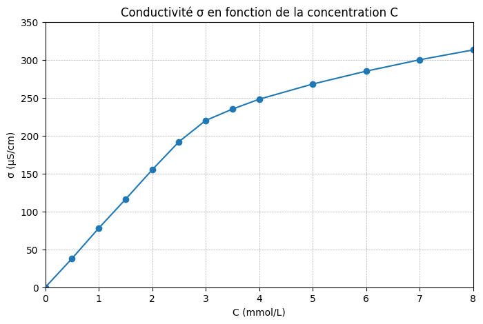

# Évaluation n°3 – Physique-Chimie appliquée

## CORRIGÉ

---

## Partie A – Analyse du produit et fonctions organiques (4 points)

### Question A.1 (1,5 point)

**a) Solvant (0,5 pt)**

> Le solvant est **l'eau** (AQUA). En effet, dans une liste INCI, les ingrédients sont classés par **ordre décroissant de concentration** : le premier de la liste est le constituant majoritaire, ce qui définit le solvant.

**Barème :**
- Réponse "eau/AQUA" : 0,25 pt
- Justification (ordre INCI) : 0,25 pt

**b) Corps pur ou mélange (0,5 pt)**

> La crème est un **mélange** car elle contient **plusieurs substances différentes** (eau, glycérine, tensioactifs, actifs, conservateurs…), comme l'indique la liste INCI qui comporte 11 ingrédients.

**Barème :**
- Réponse "mélange" : 0,25 pt
- Justification (plusieurs substances) : 0,25 pt

**c) Catégories d'ingrédients (0,5 pt)**

| Catégorie | Nom INCI |
|-----------|----------|
| **Actif** | PANTHENOL (ou SODIUM HYALURONATE, TOCOPHEROL) |
| **Conservateur** | PHENOXYETHANOL |
| **Émulsifiant** | SODIUM CETEARYL SULFATE |

*0,5 pt pour 3 réponses correctes ; 0,25 pt si 2 correctes*

---

### Question A.2 (1,5 point)

**a) Fonctions organiques du panthenol (1 pt)**

| Fonction | Motif |
|----------|:-----:|
| **Alcool** (× 2) | –OH |
| **Amide** | –CO–NH– |

**Barème :**
- Alcool identifié : 0,25 pt
- Mention "× 2" ou "deux groupes –OH" : 0,25 pt
- Amide identifié avec motif correct : 0,5 pt

**b) Liaisons hydrogène (0,5 pt)**

> Oui, le panthenol peut former des **liaisons hydrogène** avec l'eau. En effet, ses fonctions **alcool** (–OH) possèdent un H lié à un atome d'oxygène (O), ce qui permet de former des liaisons H avec l'eau (O–H···O). Sa fonction **amide** (–CO–NH–) possède un H lié à l'azote (N), qui peut aussi former des liaisons H (N–H···O), et un C=O qui peut recevoir des liaisons H de l'eau.

**Barème :**
- Réponse "oui" avec mention des fonctions : 0,25 pt
- Explication du mécanisme (H lié à O ou N) : 0,25 pt

---

### Question A.3 (1 point)

> Le panthenol est un bon actif hydratant car il possède **deux fonctions alcool** (–OH) et une **fonction amide** (–CO–NH–), toutes capables de former des **liaisons hydrogène** avec les molécules d'eau. Ces liaisons H permettent au panthenol de **retenir l'eau** sur la peau, ce qui assure une **hydratation durable**. De plus, sa très bonne **solubilité dans l'eau** (molécule hydrophile) facilite son incorporation dans la phase aqueuse de l'émulsion et sa pénétration dans les couches superficielles de la peau.

**Barème :**
| Critère | Points |
|---------|:------:|
| Mention des fonctions (alcool + amide) | 0,25 |
| Lien avec les liaisons H | 0,25 |
| Conséquence : hydratation / rétention d'eau | 0,25 |
| Lien avec hydrophilie ou formulation | 0,25 |
| **Total** | **1** |

---

## Partie B – Conductivité et type d'émulsion (4 points)

### Question B.1 (1 point)

**a) Définition (0,5 pt)**

> La conductivité σ mesure la **capacité d'une solution à conduire le courant électrique** grâce à la présence d'ions (porteurs de charge) en solution.

**b) Unité (0,25 pt)**

> L'unité usuelle en cosmétique est le **microsiemens par centimètre (µS/cm)**.

**c) Porteurs de charge (0,25 pt)**

> Les porteurs de charge sont les **ions** en solution. Dans la crème Éclat Douceur, le Sodium Cetearyl Sulfate se dissocie en **Na⁺** (cation) et **R–OSO₃⁻** (anion dodécylsulfate). Ces ions migrent sous l'effet d'une tension électrique et permettent le passage du courant.

---

### Question B.2 (1,5 point)

**Type d'émulsion : H/E (huile dans eau)** **(0,5 pt)**

**Argument 1 (0,5 pt) :**

> σ mesurée = 910 µS/cm > 50 µS/cm. Cette valeur élevée indique que la **phase continue est l'eau**, qui contient des ions dissous (Na⁺, R–OSO₃⁻). Le courant circule facilement dans la phase aqueuse continue, ce qui est caractéristique d'une émulsion H/E.

**Argument 2 (0,5 pt) :**

> L'émulsifiant utilisé (Sodium Cetearyl Sulfate) est un tensioactif **anionique** qui stabilise préférentiellement les émulsions **H/E**. De plus, la texture **onctueuse** et l'aspect **blanc** sont compatibles avec une émulsion H/E hydratante.

*Accepter aussi : l'eau (AQUA) est le premier ingrédient INCI → phase majoritaire → phase continue aqueuse.*

---

### Question B.3 (1,5 point)

**a) Intervalle (0,25 pt)**

σ = 850 ± 100 µS/cm → Intervalle : **[750 ; 950] µS/cm**

**b) Conformité (0,75 pt)**

> σ mesurée = 910 µS/cm. Or 750 ≤ 910 ≤ 950. Le lot est donc **conforme** au cahier des charges concernant la conductivité.

**Barème :**
- Intervalle correct : 0,25 pt
- Comparaison explicite : 0,25 pt
- Conclusion (conforme) : 0,25 pt

**c) Influence de la température (0,5 pt)**

> À 35°C (au lieu de 25°C), σ serait **plus élevée** car la température augmente l'agitation thermique des ions, qui se déplacent plus rapidement → conductivité augmente. Cette valeur de σ ne serait alors **pas directement comparable** au cahier des charges (spécifié à 25°C). On pourrait conclure à tort que le produit est conforme alors que l'écart est dû à la température. C'est pourquoi en CQ, on mesure **toujours σ à température contrôlée**.

**Barème :**
- σ plus élevée : 0,25 pt
- Explication + conséquence CQ : 0,25 pt

---

## Partie C – Stabilité et CMC (5 points)

### Question C.1 (1,5 point)

**a) Évolution de σ de la crème Éclat Douceur (0,75 pt) :**

> σ **diminue très lentement et régulièrement** de 910 à 865 µS/cm en 12 semaines (soit une baisse de 45 µS/cm, environ 5%). L'émulsion est **stable** : σ reste dans l'intervalle du cahier des charges [750 ; 950] µS/cm tout au long du test.

**b) Évolution de σ de la Crème B (0,75 pt) :**

> σ **diminue progressivement** de 920 à 850 µS/cm (semaines 0-3), puis **chute brutalement** de 850 à 5 µS/cm (semaines 3-12). La diminution est massive : de plus de 900 µS/cm à moins de 10 µS/cm. L'émulsion subit une **déstabilisation majeure**.

---

### Question C.2 (1,5 point)

**a) Interprétation de la Crème B (0,75 pt) :**

> La chute brutale de σ entre les semaines 3 et 10 (de 850 à 9 µS/cm) traduit une **inversion de phase** : l'émulsion H/E (phase continue aqueuse, σ élevée) s'est transformée en émulsion E/H (phase continue huileuse, σ très faible). Le tensioactif utilisé dans la Crème B n'a pas résisté à la température de 45°C, ce qui a provoqué la déstabilisation du système émulsifiant.

**b) Conclusion professionnelle (0,75 pt) :**

> *« Au vu des résultats du test de vieillissement accéléré, la crème **Éclat Douceur** présente une **excellente stabilité** alors que la **Crème B** est instable.*
> *En effet, la conductivité de la crème Éclat Douceur reste dans l'intervalle du cahier des charges pendant 12 semaines (de 910 à 865 µS/cm), confirmant le maintien de l'émulsion H/E (argument 1).*
> *De plus, la Crème B subit une **inversion de phase** dès la semaine 4 (σ chute de 850 à 5 µS/cm), ce qui la rend impropre à la commercialisation (argument 2).*
> *Par conséquent, je recommande de **conserver le tensioactif actuel** (Sodium Cetearyl Sulfate) pour la formule Éclat Douceur et de **rejeter le tensioactif alternatif** testé dans la Crème B. »*

**Barème :**
| Critère | Points |
|---------|:------:|
| Inversion de phase mentionnée | 0,25 |
| 2 arguments explicites | 0,25 |
| Conclusion + recommandation | 0,25 |
| **Total** | **0,75** |

---

### Question C.3 (2 points)

**a) Graphique (0,5 pt)**

Courbe σ = f(C) tracée avec les points correctement placés.

**b) Deux zones (0,25 pt) :**

- Zone 1 (C de 0 à ~3 mmol/L) : pente **forte** (≈ 78 µS·cm⁻¹ par mmol/L)
- Zone 2 (C > ~3 mmol/L) : pente **faible** (≈ 19 µS·cm⁻¹ par mmol/L)

**c) CMC (0,5 pt) :**

Droite 1 passe par (0 ; 0) et environ (2,5 ; 192), pente ≈ 77 µS·cm⁻¹/(mmol/L).
Droite 2 passe par environ (4 ; 248) et (8 ; 313), pente ≈ 16 µS·cm⁻¹/(mmol/L).

Intersection → **CMC ≈ 3,0 à 3,2 mmol/L**

*(Accepter 2,8 à 3,5 mmol/L selon la précision du tracé)*

**d) Écart relatif et conclusion (0,75 pt) :**

Avec CMC mesurée ≈ 3,1 mmol/L :

$$\varepsilon = \frac{|3,1 - 3,0|}{3,0} \times 100 = \frac{0,1}{3,0} \times 100 \approx 3,3\%$$

Tolérance : ± 10%

Conclusion : ε = 3,3% < 10%, donc la mesure est **compatible** avec la valeur de référence du fournisseur. La CMC du Sodium Cetearyl Sulfate est bien d'environ 3,0 mmol/L à 25°C.

*(Avec CMC = 3,2 : ε = 6,7% → compatible. Avec CMC = 2,8 : ε = 6,7% → compatible.)*

**Barème :**
| Critère | Points |
|---------|:------:|
| Graphique correct | 0,5 |
| Zones identifiées | 0,25 |
| CMC lue (valeur acceptable) | 0,5 |
| Écart relatif calculé | 0,25 |
| Conclusion sur la compatibilité | 0,5 |
| **Total** | **2** |

---

## Partie D – pH et conformité CQ (4 points)

### Question D.1 (1 point)

**a) pH moyen (0,5 pt)**

$$\bar{pH} = \frac{5,35 + 5,40 + 5,43}{3} = \frac{16,18}{3} = 5,39$$

**b) Caractère acido-basique (0,5 pt)**

> Le pH moyen est de 5,39, ce qui est **inférieur à 7**. La crème est donc **légèrement acide**.

---

### Question D.2 (1 point)

**a) Intervalle (0,25 pt)**

pH = 5,5 ± 0,5 → Intervalle : **[5,0 ; 6,0]**

**b) Conformité (0,75 pt)**

> Le pH moyen est de 5,39, or 5,0 ≤ 5,39 ≤ 6,0. Le lot est donc **conforme** au cahier des charges concernant le pH.

**Barème :**
- Intervalle correct : 0,25 pt
- Comparaison : 0,25 pt
- Conclusion : 0,5 pt

---

### Question D.3 (1 point)

> D'après le document 8, un pH entre 4 et 6 assure une « bonne tolérance » et le « respect du film hydrolipidique ». Le pH de 5,39 se situe dans cette zone ET est très proche du **pH physiologique de la peau** (4,5-5,5). Cette crème est donc **parfaitement compatible** avec une application sur peau sensible : elle respecte le film hydrolipidique cutané et ne risque pas de provoquer d'irritation.

**Barème :**
- Comparaison au pH physiologique : 0,5 pt
- Mention film hydrolipidique + conclusion : 0,5 pt

---

### Question D.4 (1 point)

**Ingrédients :** **CITRIC ACID** et **SODIUM CITRATE** **(0,5 pt)**

> Ces deux ingrédients forment un **système tampon** (acide citrique / citrate de sodium). Ce système **stabilise le pH** de la crème autour de 5,5 en neutralisant les variations de pH liées à l'ajout d'autres ingrédients, au vieillissement, ou aux conditions de stockage. Sans ce tampon, le pH pourrait dériver au cours du temps et compromettre la compatibilité cutanée.

**Barème :**
- Identification des 2 ingrédients : 0,5 pt
- Explication du rôle (stabiliser le pH) : 0,5 pt

---

## Partie E – Synthèse professionnelle (3 points)

### Question E.1 (3 points)

**Exemple de synthèse attendue :**

> **RAPPORT DE CONTRÔLE QUALITÉ – Lot n°EC-2026-03**
>
> Le contrôle qualité du lot EC-2026-03 de la crème Éclat Douceur avait pour objectif de vérifier la **conformité** du produit au **cahier des charges** avant commercialisation, en analysant le type d'émulsion, la conductivité, la concentration en actif, le pH, et la **stabilité**.
>
> La mesure de **conductivité** donne σ = 910 µS/cm (à 25°C), confirmant une **émulsion H/E** dont la **phase continue** est l'eau. Cette valeur est conforme à la spécification [750 ; 950] µS/cm. La concentration en panthenol est de 20 g/L, conforme à l'intervalle [18 ; 22] g/L. Le pH moyen est de 5,39, conforme à la spécification [5,0 ; 6,0] et compatible avec le **film hydrolipidique** cutané (pH physiologique : 4,5-5,5).
>
> Le test de **stabilité** accélérée (12 semaines à 45°C) montre que σ reste stable (de 910 à 865 µS/cm), confirmant l'absence d'inversion de phase. Par comparaison, un tensioactif alternatif (Crème B) a provoqué une inversion de phase dès la semaine 4.
>
> De plus, la détermination de la **CMC** du tensioactif (≈ 3,0 mmol/L) confirme que sa concentration dans la formule est bien supérieure à la CMC, assurant la formation de micelles et la stabilisation de l'émulsion.
>
> **Conclusion :** Le lot EC-2026-03 est **conforme** à toutes les spécifications. Je recommande de **libérer ce lot** pour commercialisation.

**Grille de correction :**

| Critère | Points |
|---------|:------:|
| Objectif du contrôle mentionné | 0,25 |
| Résultats présentés (σ, concentration, pH) | 0,5 |
| Conformité vérifiée pour chaque paramètre | 0,5 |
| Stabilité discutée (comparaison 2 crèmes) | 0,5 |
| Compatibilité cutanée / film hydrolipidique | 0,25 |
| Conclusion et recommandation | 0,25 |
| 8 mots obligatoires présents | 0,5 |
| Qualité de la rédaction | 0,25 |
| **Total** | **3** |

---

## Calcul de la concentration (non demandé explicitement mais utile pour la synthèse)

$$C_m = \frac{m}{V} = \frac{0,50}{0,0250} = 20 \text{ g/L}$$

Ce qui correspond à : 20 g/L ÷ 10 = 2,0% → cohérent avec l'étiquette (2%).

Cahier des charges : [18 ; 22] g/L → 20 g/L est **conforme**.

*(Note : la concentration n'est pas demandée dans une question séparée type D.U.C.I. comme en S10. Les étudiants doivent mobiliser le calcul de manière autonome dans la synthèse, ce qui teste un niveau d'expertise plus élevé.)*

---

## 📊 Barème récapitulatif

| Partie | Points | Compétences E2 |
|--------|:------:|----------------|
| A – Analyse du produit et fonctions organiques | /4 | Mobiliser, Analyser, Argumenter |
| B – Conductivité et type d'émulsion | /4 | Mobiliser, Analyser, Interpréter |
| C – Stabilité et CMC | /5 | Analyser, Interpréter, Argumenter |
| D – pH et conformité CQ | /4 | Mobiliser, Interpréter, Argumenter |
| E – Synthèse professionnelle | /3 | Communiquer, Argumenter |
| **TOTAL** | **/20** | |

---

## 📈 Seuils d'alerte et analyse

| Score | Diagnostic | Actions |
|:-----:|------------|---------|
| < 8/20 | Difficultés importantes | Remédiation sur les bases (formules, conformité) + conductivité |
| 8-12/20 | Acquis fragiles | Renforcement sur σ, type d'émulsion, CMC, argumentation |
| 12-16/20 | Bon niveau | Consolider l'argumentation et la synthèse |
| > 16/20 | Très bonne maîtrise | Profil E2 en bonne construction |

---

## 💡 Analyse des erreurs fréquentes

| Partie | Erreur typique | Remédiation |
|--------|----------------|-------------|
| A | Confondre alcool/phénol/éther | Revoir FM08 et les motifs caractéristiques |
| A | Oublier la fonction amide du panthenol | Rappeler : –CO–NH– = amide = liaison peptidique |
| B | σ élevée mais pas de lien avec phase continue | Exiger le raisonnement : eau = ions = σ élevée = H/E |
| B | Oublier l'influence de T sur σ | Rappeler la règle CQ : mesure à T contrôlée |
| C | Confondre stabilité et conformité | Stabilité = σ constante dans le temps, conformité = σ dans l'intervalle |
| C | CMC lue approximativement sans tracer les droites | Exiger les 2 droites + intersection |
| D | pH acide/basique inversé | Revoir l'échelle de pH |
| D | Système tampon non identifié | Rappeler : acide + sa base conjuguée = tampon |
| E | Synthèse incomplète (oubli stabilité ou CMC) | Rappeler les 6 éléments attendus |

---

## 📊 Correspondance avec les compétences E2

| Question | Mobiliser | Analyser | Interpréter | Argumenter | Communiquer |
|----------|:---------:|:--------:|:-----------:|:----------:|:-----------:|
| A.1 | ● | ● | | | |
| A.2 | ● | ● | | | |
| A.3 | | | | ● | |
| B.1 | ● | | | | |
| B.2 | | ● | | ● | |
| B.3 | | | ● | ● | |
| C.1 | | ● | | | |
| C.2 | | | ● | ● | |
| C.3 | | ● | ● | | |
| D.1 | ● | | ● | | |
| D.2 | | ● | ● | | |
| D.3 | | | ● | ● | |
| D.4 | | ● | | ● | |
| E.1 | | | | ● | ● |

---

## 📋 Comparaison des 3 évaluations

| Critère | Éval 1 (S06) | Éval 2 (S10) | Éval 3 (S22) |
|---------|:------------:|:------------:|:------------:|
| **Durée** | 1h30 | 2h | 2h |
| **Séances évaluées** | S01-S05 | S01-S09 | S01-S21 |
| **Blocs** | 1 | 1 | 1+2+3 |
| **Nouveautés** | — | ρ, pH, répétabilité | σ, CMC, fonctions org. |
| **Arguments requis** | 1 | 1-2 | **2 minimum** |
| **Difficulté** | ★★☆ | ★★★ | ★★★★ |
| **Synthèse** | 8-10 lignes | 10-12 lignes | 12-15 lignes |
