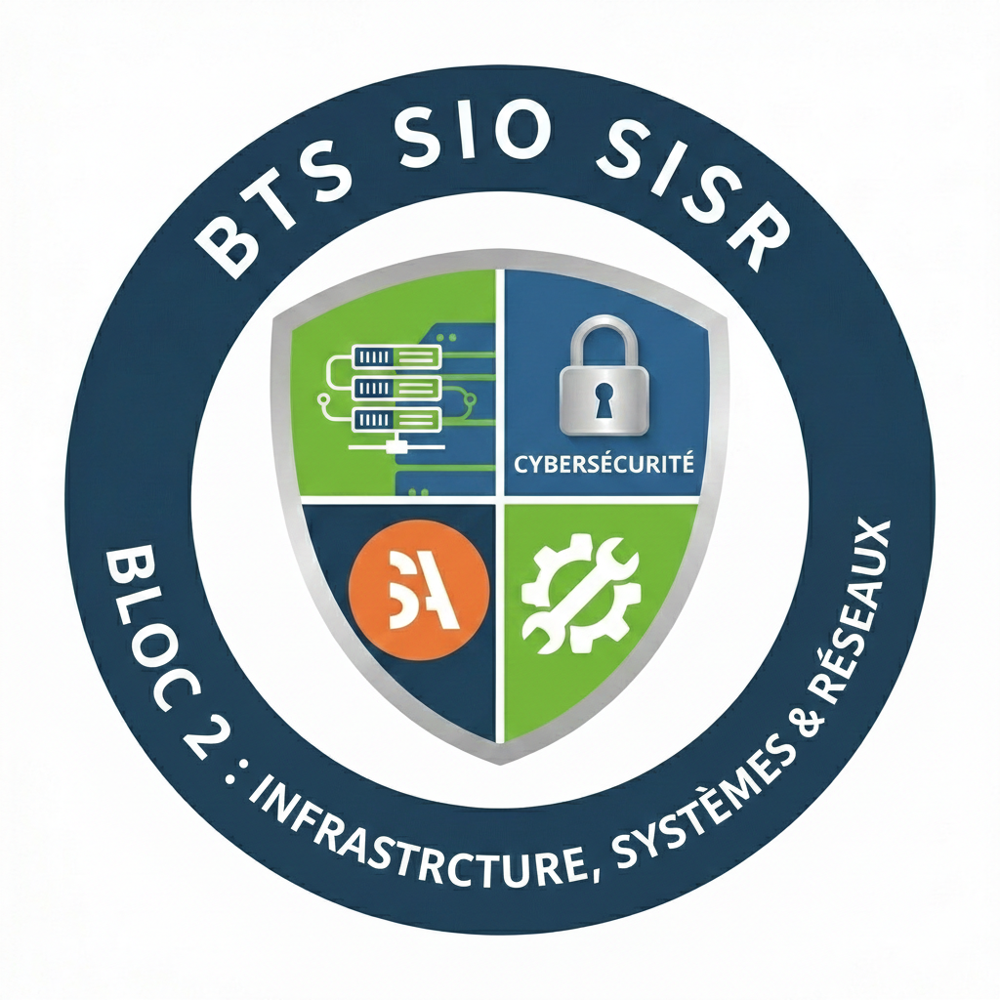

# BLOC 2 - Infrastructure, Systèmes et Réseaux - BTS SIO1

**SUP'ADOUR - MFR de Pontonx**

  

---

Bienvenue sur l'espace de ressources du BTS Services Informatique aux organisations Spécialité SISR.

# 💻 BTS SIO – Option SISR  

## Bloc 2 : Infrastructure, Systèmes et Réseaux

> 💡 *Concevoir, sécuriser et administrer des infrastructures informatiques professionnelles.*

---

## 🎯 Pourquoi le Bloc 2 en BTS SIO SISR ?

Le Bloc 2 correspond au **cœur du métier d’administrateur systèmes et réseaux**.  
Il vous forme à la **conception, la sécurisation et l’évolution d’une infrastructure informatique** adaptée aux besoins d’une organisation.

Vous apprendrez à :

- Concevoir une architecture réseau cohérente
- Administrer des serveurs Linux et Windows
- Mettre en œuvre des services d’infrastructure avancés
- Sécuriser les systèmes et les communications
- Superviser et maintenir une infrastructure en production

| Situation professionnelle                        | Ce que vous saurez faire                                  |
| ------------------------------------------------| ---------------------------------------------------------- |
| Une entreprise change d’infrastructure          | Concevoir et proposer une architecture adaptée             |
| Un serveur doit être virtualisé                 | Déployer et configurer un environnement virtualisé         |
| Un réseau doit être segmenté                    | Mettre en place VLAN et routage inter-VLAN                 |
| Une faille de sécurité est détectée             | Identifier le risque et appliquer des mesures correctives  |
| Les performances du réseau sont insuffisantes   | Diagnostiquer et optimiser l’infrastructure                |

👉 Les épreuves professionnelles (E5 notamment) évaluent ces compétences à travers des scénarios réalistes de gestion d’infrastructure.

---

## 🌐 Les environnements et technologies étudiés

Vous serez amené(e) à travailler sur :

- Architecture réseau avancée  
- Routage, VLAN, NAT  
- Pare-feu et sécurité réseau  
- Virtualisation (Proxmox, VMware, VirtualBox…)  
- Systèmes Linux avancé  
- Services d’infrastructure sécurisés  
- Supervision et monitoring  
- Scripts d’automatisation  

---

## 📚 Organisation du site

### 📘 Séances de cours

Progression structurée de la **conception d’un réseau** jusqu’à la **mise en production sécurisée d’une infrastructure complète**.

Chaque séance comprend :

- Une mise en situation professionnelle  
- Une analyse technique  
- Un TP guidé  
- Une validation des compétences  

➡️ Accès aux séances via l’espace dédié.

---

### 🖥️ Travaux pratiques (TP)

Les TP vous placent dans un contexte proche du réel :

- Déploiement de serveurs  
- Configuration réseau avancée  
- Mise en place de politiques de sécurité  
- Tests de fonctionnement et validation  

---

### 🧠 Méthodologie d’ingénierie

Des outils pour :

- Analyser un besoin technique  
- Rédiger un dossier d’architecture  
- Justifier un choix technologique  
- Documenter une infrastructure  
- Préparer une soutenance technique  

---

## 🧭 Comment utiliser cet espace ?

### En classe
Analyser la situation professionnelle

Identifier les contraintes techniques

Concevoir la solution

Implémenter et tester

### À la maison

Reproduire les configurations en environnement virtuel

Approfondir les notions vues en TP

Documenter les manipulations

Préparer les questions techniques

### En cas d’absence

Lire la situation et la synthèse

Reproduire les manipulations en autonomie

Consulter les ressources complémentaires

Faire valider la compréhension

---

## 🏆 Les clés de la réussite en Bloc 2

| Habitude                         | Pourquoi c’est essentiel                                           |
| -------------------------------- | ------------------------------------------------------------------ |
| Anticipation                     | Une architecture mal pensée devient instable                       |
| Sécurité intégrée                | La cybersécurité se conçoit dès le départ                          |
| Tests systématiques              | Toute modification doit être validée                               |
| Documentation technique          | Une infrastructure doit être compréhensible par toute l’équipe     |

> 📌 Message clé : En SISR, un bon administrateur ne se contente pas de faire fonctionner un système. Il conçoit une infrastructure fiable, sécurisée et évolutive.

---

## 🔄 Mises à jour

En cas de problème technique ou de lien inaccessible, le signaler directement à l’enseignant.

---

Formation professionnalisante orientée expertise technique, autonomie et réussite aux épreuves du BTS SIO

 

✍️ YAHN LE PRETTRE

